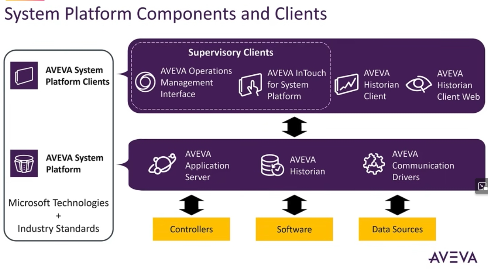
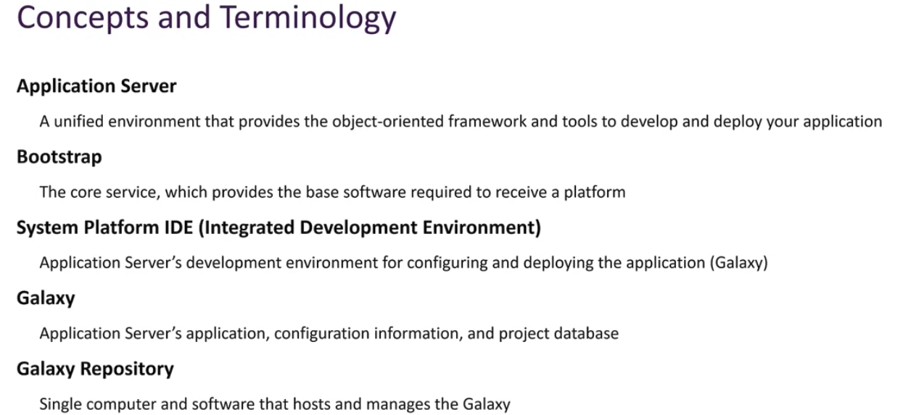
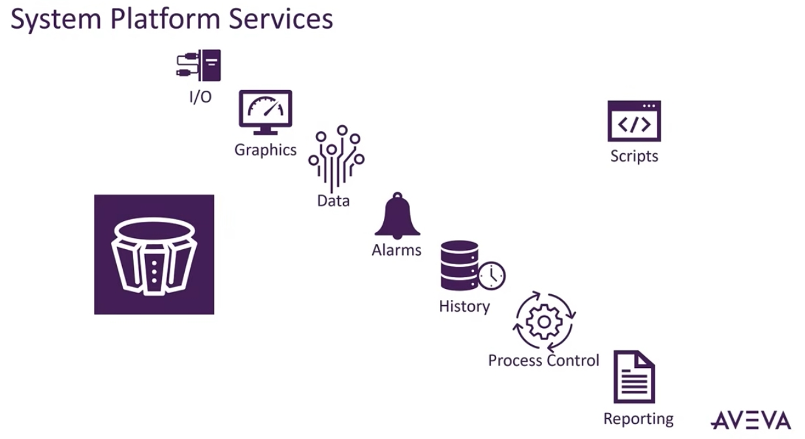

# AVEVA™ System Platform 入門教學

> 影片來源：[What is AVEVA™ System Platform?](https://www.youtube.com/watch?v=OVJmcTxKwgk)

## 課程簡介

本教學說明 **AVEVA™ System Platform**——一個整合廠區控制與資訊管理系統的工業軟體平台。內容涵蓋開始開發與部署工業自動化應用程式所需的基本概念與術語，並介紹核心功能，包括：

- 即時資料擷取（Real-time Data Acquisition）
- 視覺化（Visualization）
- 警報管理（Alarm Management）
- 歷史資料記錄（Historization）
- 製程控制（Process Control）
- 報表（Reporting）

System Platform 提供了一個**多使用者、物件導向**平台所需的基礎技術與服務，也提供開發、執行、監控與視覺化應用程式所需的框架與工具。

---

## 一、System Platform 組成與客戶端架構

System Platform 的整體架構可分為三層：**資料來源層 → 平台核心層 → 監控客戶端層**。

### 1. 底層：資料來源（Data Sources）
最下層是實際的工業環境，包括：
- **Controllers**（控制器，如 PLC）
- **Software**（軟體系統）
- **Data Sources**（其他資料來源）

### 2. 中層：System Platform 核心
System Platform 本身建構於 **Microsoft 技術 + 產業標準** 之上，核心元件包括：

| 元件 | 說明 |
|---|---|
| **AVEVA Application Server** | 提供物件導向架構，用於開發與部署應用程式 |
| **AVEVA Historian** | 負責歷史資料的儲存與管理 |
| **AVEVA Communication Drivers** | 負責與控制器、設備進行資料通訊 |

### 3. 上層：監督式客戶端（Supervisory Clients）
使用者透過以下客戶端與系統互動：

- **AVEVA Operations Management Interface**：操作管理介面
- **AVEVA InTouch for System Platform**：人機介面（HMI）視覺化工具
- **AVEVA Historian Client**：歷史資料查詢用戶端
- **AVEVA Historian Client Web**：網頁版歷史資料查詢工具

資料在這三層之間雙向流動：控制器/資料來源 → 平台核心（收集、儲存）→ 監督式客戶端（視覺化、操作）。

---

## 二、核心概念與術語

在開始開發 System Platform 應用程式前，需先了解以下幾個關鍵術語：

| 術語 | 定義 |
|---|---|
| **Application Server（應用伺服器）** | 提供物件導向框架與工具的統一開發／部署環境 |
| **Bootstrap（啟動程式）** | 提供接收平台所需之基礎軟體的核心服務 |
| **System Platform IDE** | Application Server 的整合開發環境，用於設定與部署應用程式（Galaxy） |
| **Galaxy** | Application Server 的應用程式、設定資訊與專案資料庫 |
| **Galaxy Repository（Galaxy 儲存庫）** | 主機並管理 Galaxy 的單一電腦與軟體 |

**重點記憶：**
> Bootstrap 先啟動基礎服務 → 透過 IDE 開發 Galaxy（應用程式內容）→ Galaxy 儲存在 Galaxy Repository 中集中管理。

---

## 三、System Platform 服務功能

System Platform 圍繞著 **Galaxy（中央資料庫）** 提供一連串完整的服務鏈，涵蓋從資料輸入到報表輸出的完整流程：

服務流程可理解為以下順序：

1. **I/O**：與現場設備進行資料輸入輸出
2. **Graphics（圖形）**：建立可視化畫面
3. **Data（資料）**：資料的處理與流通
4. **Alarms（警報）**：異常狀況偵測與通知
5. **History（歷史記錄）**：資料的長期保存
6. **Process Control（製程控制）**：自動化控制邏輯
7. **Scripts（腳本）**：自訂邏輯與擴充功能
8. **Reporting（報表）**：產出分析與報告

這些服務全部圍繞在 **Galaxy** 這個核心資料庫周圍運作，體現了 System Platform「單一資料來源、多重應用」的設計理念。

---

## 課程總結

- AVEVA System Platform 是一個**物件導向、多使用者**的工業自動化整合平台。
- 架構分為三層：**資料來源 → 平台核心（Application Server / Historian / Communication Drivers）→ 監督式客戶端**。
- 核心開發概念圍繞 **Bootstrap → IDE → Galaxy → Galaxy Repository** 展開。
- 平台提供從 I/O 到報表的**完整服務鏈**，支援即時監控、警報、歷史記錄與製程控制。

