# AVEVA ProveIt! 2026 展示教程：System Platform + MCP + Claude AI 打造 IIoT 数据链路

> 视频来源：[AVEVA ProveIt! Conference 2026 - IIoT Platform: System Platform Demo](https://www.youtube.com/watch?v=hLNudct1GcA&list=PLJq4rR8tWINyOrvwxbIjRvgTtoyuuEfSz)
> 相关开源工具：[AVEVA/Galaxy-Builder (GitHub)](https://github.com/AVEVA/Galaxy-Builder)
> 主讲人：Ahmed Khalil（System Platform 技术产品经理）、Jacob Hawks（HMI SCADA 战略产品经理）

本教程整理自 AVEVA ProveIt! 2026 展位演示，还原了整套 **收集（Collect）→ 连接（Connect）→ 分析（Analyze）→ 可视化（Visualize）→ 存储（Store）** 的数字化转型流程，并重点讲解如何通过 **MCP Gateway** 把 AVEVA Historian 的数据接入 **Claude AI Agent**，实现自然语言驱动的工业数据分析。

---

## 一、整体架构总览

在动手之前，先看一眼整体的数据流转架构：模拟器把数据写入本地 Broker，System Platform 接收后再转发到 ProveIt 统一命名空间（UNS）Broker；System Platform 同时对接 AVEVA Historian，Historian 一侧搭建了 **MCP Gateway**，把丰富的数据检索 API 暴露给 AI Agent 和 Historian Web Client，两端都通过 Claude 完成推理与对话。

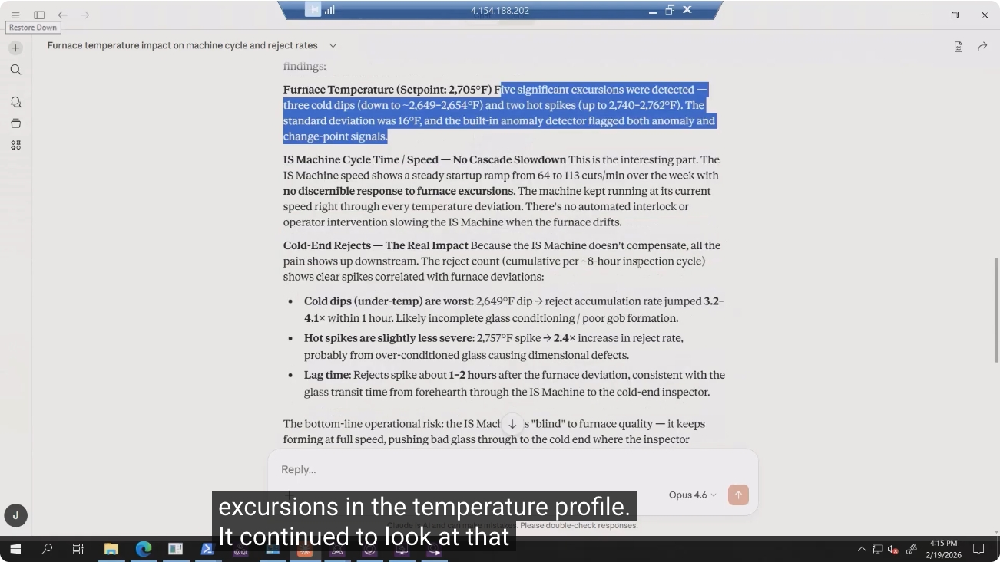

架构要点：

- **Node B（边缘端 / OMI）**：System Platform 负责收集 Dallas 与 AVEVA 两个站点的数据，OMI 提供可视化界面和内嵌 AI Chat。
- **Node C（Historian 端）**：AVEVA Historian 承担数据存储，其上的 **AI Service** 包含 AI Agent 与 MCP Gateway，二者均调用 Claude 完成分析。
- 两端都可以直接与 Claude 对话，实现"边缘可视化 + 云端历史数据分析"的双通道 AI 能力。

---

## 二、第一步：搭建模拟站点，连接 MQTT Broker

### 1. 在 MQTT Broker 中新建站点

由于原有 Dallas 站点数据是平的（不利于做 AI 分析演示），团队在 MQTT Explorer 中新增了一个名为 **AVEVA** 的模拟站点，用来注入带异常的模拟数据。

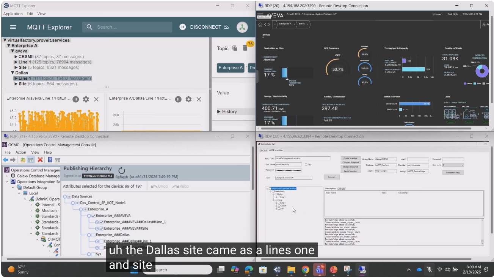

### 2. 用开源工具自动生成模板

使用 GitHub 上的开源工具（Galaxy Builder）连接 MQTT Broker，自动读取数据结构并生成标准模板，方便后续复制扩展到其他站点。

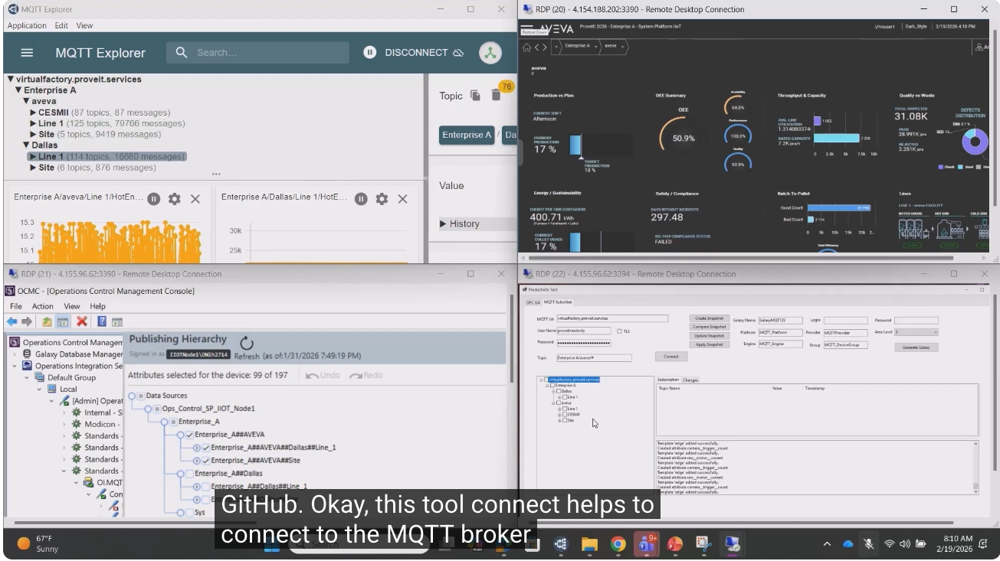

### 3. 一键发布模型回 Broker

在 Operations Control Management Console（OCMC）中，只需勾选好属性，点击几下即可把整个数据模型发布回 Broker，供 System Platform 订阅使用。

---

## 三、第二步：导入图形并可视化产线

System Platform / OMI 支持直接导入 **SVG 矢量图**作为图形组件，几天内即可完成整套产线画面的搭建。演示中构建了完整的玻璃生产线：**Batch House（配料）→ Hot End（热端）→ Cold End（冷端）**。

### 1. 产线总览（Line 1）

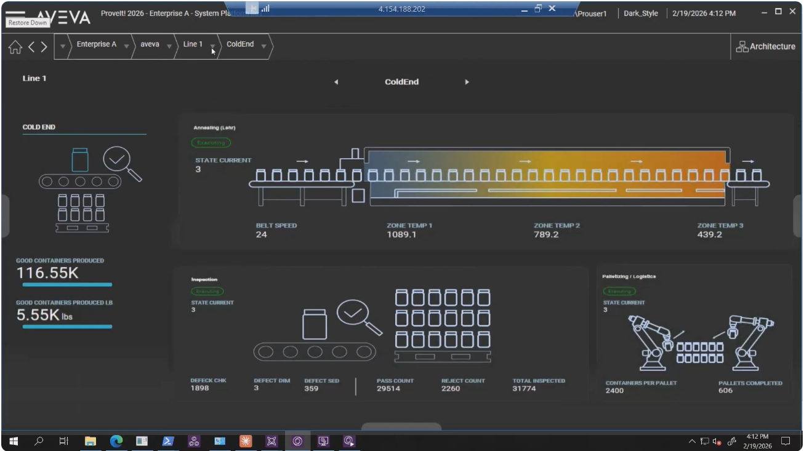

### 2. Batch House 配料车间

展示原料仓（Silo）液位、混料机（Mixer）与加料机（Charger）的实时状态。

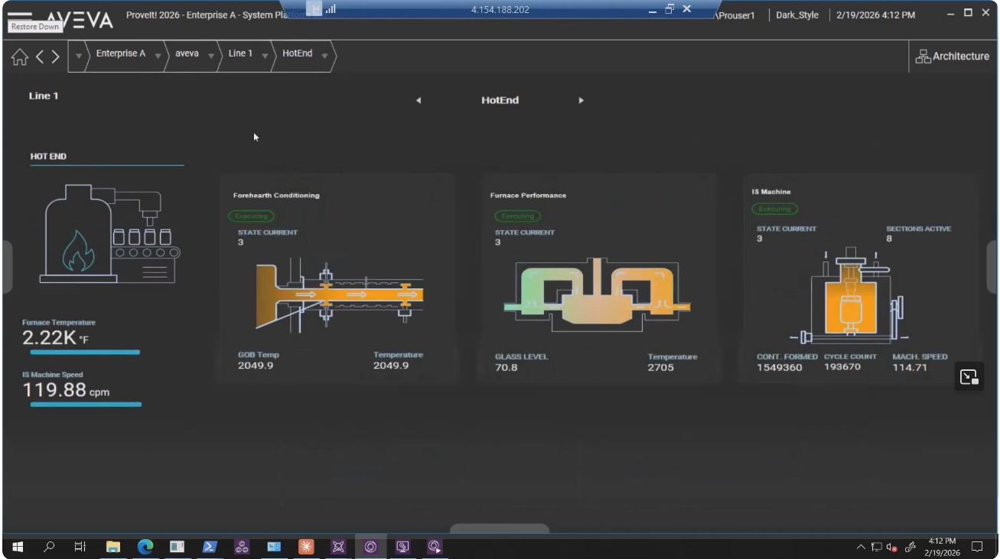

### 3. Hot End 热端（熔炉 / 前炕 / 成型机）

包含前炕温度调节、熔炉性能（炉温、玻璃液位）、IS 成型机（周期数、机速）三个子模块，这里的**熔炉温度**正是后续 AI 分析的核心变量。

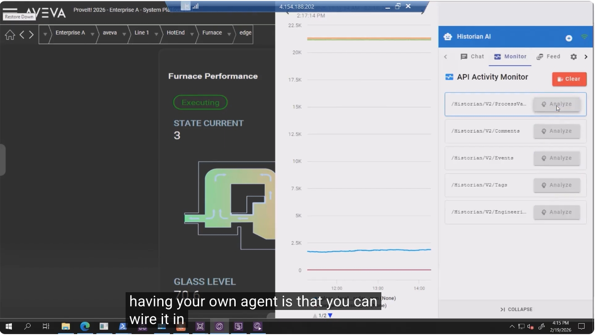

### 4. Cold End 冷端（退火 / 检测 / 码垛）

包含退火窑（Lehr）三段区温、检测工位的缺陷分类计数，以及码垛机器人状态。这里的 **Reject Count（不良数）** 是与炉温异常做关联分析的目标指标。

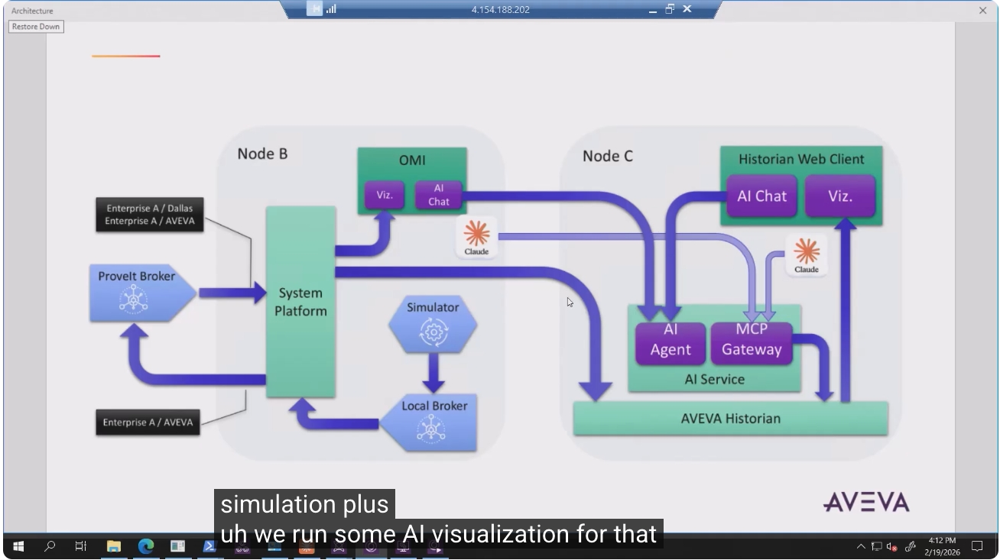

### 5. 站点级 KPI 仪表盘（aveva 站点）

在站点层级可以看到 OEE、吞吐与产能、质量与浪费、批次到托盘、安全合规等汇总指标，数据来自下钻的所有子系统。

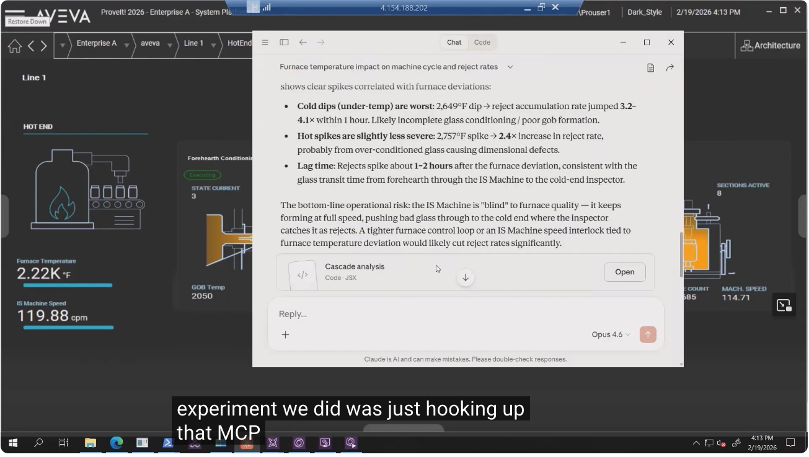

> 💡 提示：同样的仪表盘模板也可以套用到其他工厂（如 Dallas / Glass Manufacturer 场景），只是数据源不同。

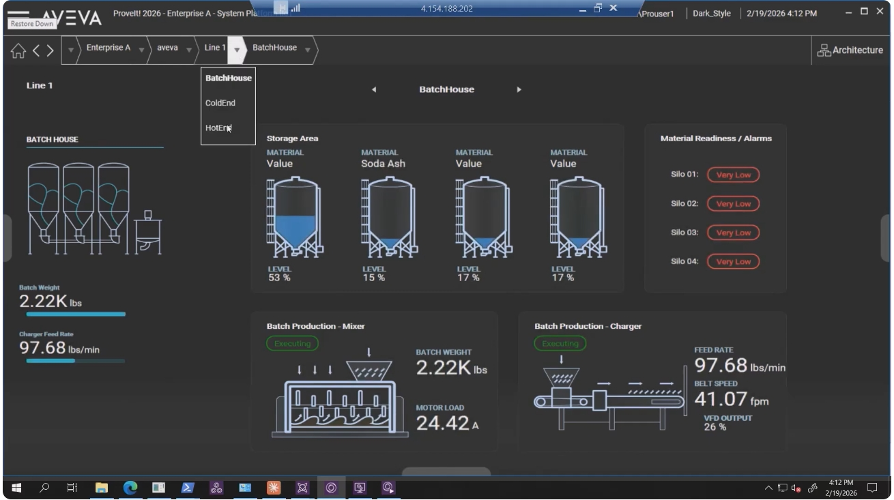

---

## 四、第三步：用 MCP Gateway 把 Historian 接入 Claude AI Agent

这是本次演示的核心亮点：**不写一行 Tag 名，不配置任何数据库连接，让 AI 自己去 Historian 里找数据、做分析。**

### 1. 直接向 Claude AI Agent 提问

在 Historian AI 的 Chat 界面中，直接用自然语言提问：

> "能否找出熔炉温度偏差（furnace temperature deviation）与冷端不良率（cold end reject rate）之间的关联性？"

Claude Agent 会自动通过 MCP Server 查找可用工具、识别相关 Tag，并调用 Historian 的数据检索 API。

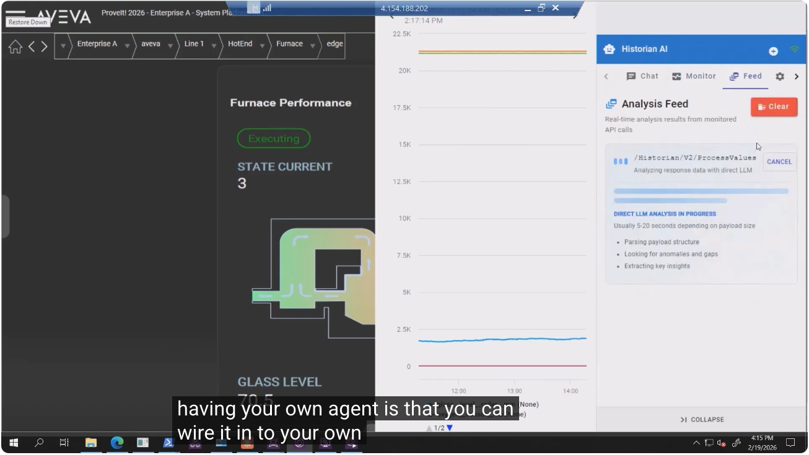

### 2. 观察 AI 的工具调用过程（API Activity Monitor）

MCP Gateway 把 Historian 已有的 `/Historian/V2/ProcessValues`、`/Historian/V2/Tags`、`/Historian/V2/Events`、`/Historian/V2/Comments`、`/Historian/V2/Engineering...` 等 API 都注册为可调用工具，Claude 会根据问题自主选择工具、发起 "Analyze" 请求。

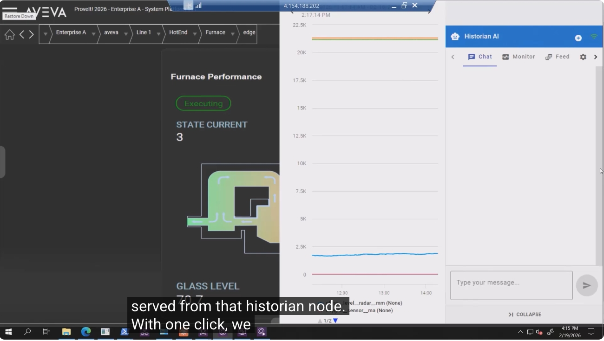

分析过程中会显示"直接 LLM 分析进行中"的实时反馈流（Analysis Feed），包括解析数据结构、查找异常与断点、提取关键洞察等步骤，通常耗时 5–20 秒。

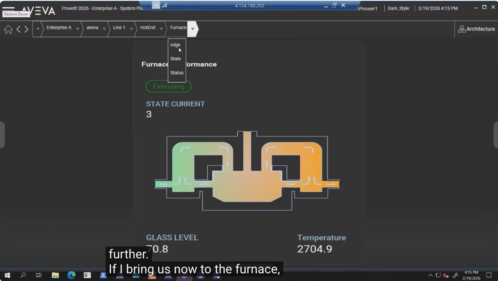

### 3. 查看分析结论

Claude Agent 会持续自我分析、自我提示（self-prompt），直到锁定炉温的异常波动区间，并向下游追溯，最终确认与冷端不良率的关联。完整结论示例如下：

- **熔炉温度**（设定值 2705°F）：检测到 5 次显著异常——3 次低温骤降（约 2649–2654°F）、2 次高温尖峰（2740–2762°F），标准差 16°F，系统内置异常检测器同时触发了 anomaly 与 change-point 信号。
- **IS 成型机周期 / 速度**：机速从 64 稳步爬升到 113 次/分钟，**对炉温异常没有任何响应**——没有联锁降速，也没有人工干预。
- **冷端不良率**：由于成型机不联动降速，问题全部体现在下游不良率上：
  - 低温骤降影响最大：炉温降到 2649°F 时，1 小时内不良率上升 **3.2–4.1 倍**（可能是玻璃调理不充分/成型不良）。
  - 高温尖峰影响略轻：炉温升到 2757°F 时，不良率上升 **2.4 倍**（过度调理导致的尺寸缺陷）。
  - **滞后时间**：炉温异常发生后约 **1–2 小时**，不良率才出现峰值，与玻璃从前炕经成型机流转到冷端检测工位的物理时间吻合。

结论落地建议：成型机对炉温质量"视而不见"，仍以全速生产不合格玻璃直到冷端检测才被拦截；建议收紧炉温控制回路，或增加"炉温异常 → 成型机降速"的联锁逻辑，以显著降低不良率。

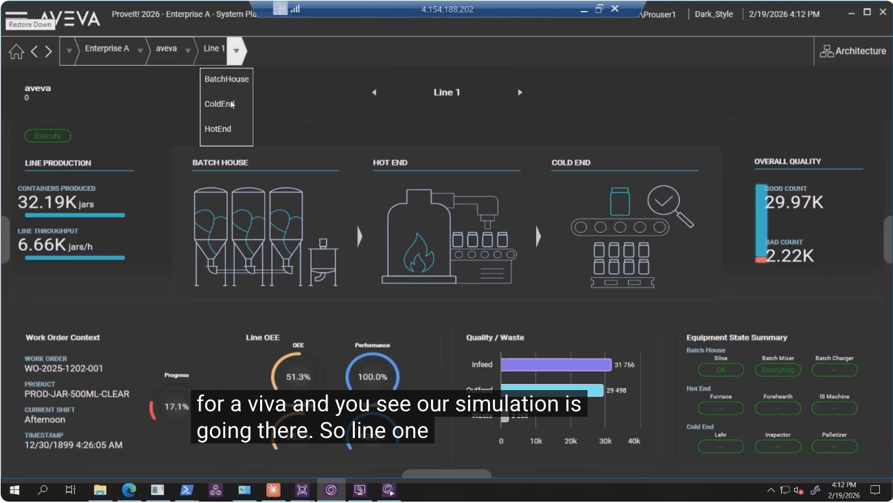

> 💡 值得注意的是，AI 甚至能顺手生成一段可交互的分析代码组件（Cascade analysis · JSX），点击 "Open" 即可查看，这展示了 Claude 在对话中动态生成可视化工具的能力。

---

## 五、第四步：OMI 边缘端一键分析（Process Value API）

除了聊天式分析，演示还展示了**免打字**的一键分析体验：在 OMI 的 Furnace（熔炉）画面上，通过后台 Context 共享，直接点击 "Analyze" 按钮即可触发 `/Historian/V2/ProcessValues` 分析。

### 1. 定位到 Furnace → edge 画面

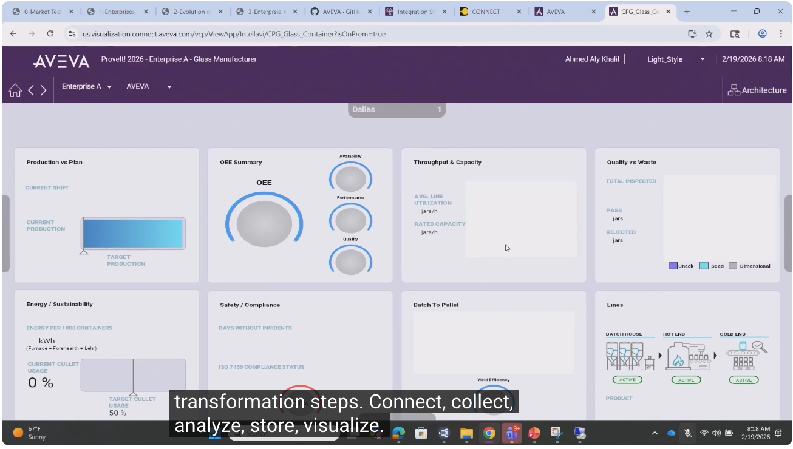

### 2. 嵌入 Historian 可视化图表（iframe 联动）

OMI 界面通过 iframe 内嵌了来自 Historian 节点的实时趋势图，与 Furnace Performance 卡片共享同一份 Context（炉温、玻璃液位等 4 个 Tag）。

### 3. 一键触发 AI 分析

无需手动输入任何提示词，鼠标点击 "Analyze" 按钮后，Claude 会用预设（pre-canned）提示词自动对当前画面上的 4 个 Tag 做通用分析，结果实时流式展示在右侧的 "Analysis Feed" 面板中。

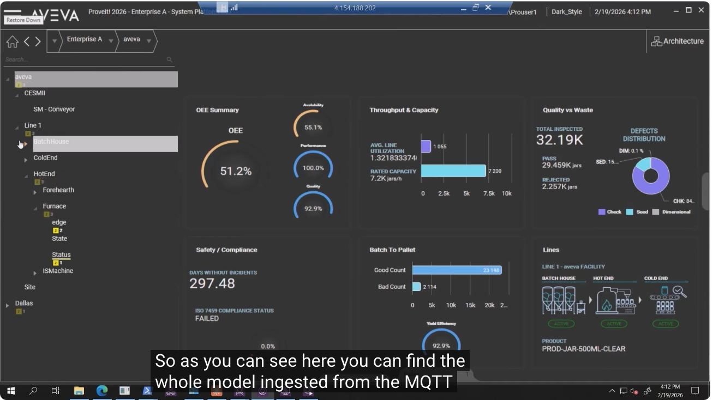

---

## 六、第五步：从本地部署迁移到云端（AVEVA Connect）

最后一步是把同一套应用从**本地部署（On-Premise）**无缝迁移到云平台 **AVEVA Connect**，实现"本地和云端一致的使用体验"。

- 迁移只需**数小时**级别的时间，即可在云端发布并运行与本地完全一致的应用。
- 云端同样支持完整的 连接→收集→分析→存储→可视化 全流程。

---

## 七、流程小结

| 阶段 | 关键动作 | 使用的工具/组件 |
|---|---|---|
| 收集 Collect | 新建模拟站点、生成模板、发布模型到 Broker | MQTT Explorer、开源 Galaxy Builder、OCMC |
| 连接 Connect | System Platform 订阅 UNS 数据，转发至 ProveIt Broker | System Platform、Local/ProveIt Broker |
| 可视化 Visualize | 导入 SVG 图形，搭建产线画面与 KPI 仪表盘 | OMI、System Platform 画面编辑器 |
| 存储 Store | 历史数据持久化 | AVEVA Historian |
| 分析 Analyze | 自然语言提问、自动查找 Tag、关联分析、一键 Analyze | MCP Gateway + Claude AI Agent |
| 上云 Cloud | 应用整体迁移，数小时内云端上线 | AVEVA Connect |

**核心价值**：Historian 原本就有的丰富数据 API，通过 MCP Gateway 包装后即可直接被 Claude 这样的 AI Agent 调用——不需要预先告知 Tag 名称或数据库连接方式，AI 自己完成"理解问题 → 查找工具 → 定位数据 → 分析 → 得出结论"的全过程，大幅降低了工业数据分析的使用门槛。

---

*本教程内容整理自视频字幕与截图，用于学习交流，相关产品与商标版权归 AVEVA 所有。*
