# AVEVA™ System Platform — Script Function: Embed Content 教學

> 影片來源：[AVEVA™ System Platform - Script Function: Embed Content](https://www.youtube.com/watch?v=FKFarYHU8kk&list=PLJq4rR8tWINyOrvwxbIjRvgTtoyuuEfSz&index=2)

本篇教學說明如何在 AVEVA™ OMI 應用程式中，使用 **Embed Content**（內嵌內容）與 **Remove Embedded Content**（移除內嵌內容）兩個腳本函式，於執行時期（Runtime）動態地將一個工業圖形（Industrial Graphic）內嵌到另一個父圖形（Parent Graphic）中，並示範如何設定位置、尺寸與自訂屬性（Custom Properties）。

---

## 一、功能概觀

**Embed Content 函式**可以在 Runtime 時，將指定的工業圖形動態嵌入到另一個圖形內，且內嵌的圖形會顯示在最頂層（Top of the z-order）。

使用時需要宣告一個預定義結構 `GraphicInfo`，其中：
- **必填參數**：`Identity`（標識符）與 `GraphicName`（圖形名稱）
- **選填參數**：位置（X、Y）、尺寸（Width、Height）、自訂屬性（CustomProperties）

若內嵌圖形本身含有自訂屬性，可透過 `CustomPropertyValuePair` 陣列進行配置。

**Remove Embedded Content 函式**則只需傳入對應的 `Identity`，即可將該內嵌圖形從畫面上移除。

與 `Show Graphic` 函式的差異在於：`Embed Content` 內嵌的圖形會直接整合於宿主圖形（Hosting Graphic）中，而不會像 `Show Graphic` 一樣跳出獨立的新視窗。

---

## 二、基本語法

### 1. Embed Content（基本用法）

```vb
Dim graphicInfo as aaGraphic.GraphicInfo;
graphicInfo.Identity = "<Identity>";
graphicInfo.GraphicName = "<SymbolName>";
EmbedContent(graphicInfo);
```

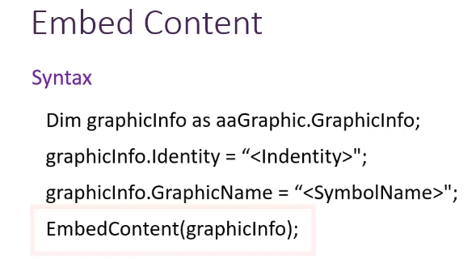

### 2. Embed Content（含自訂屬性）

若圖形具有自訂屬性，可以透過 `CustomPropertyValuePair` 陣列一併帶入：

```vb
Dim graphicInfo as aaGraphic.GraphicInfo;
Dim cpValues [2] as aaGraphic.CustomPropertyValuePair;
cpValues[1] = new aaGraphic.CustomPropertyValuePair("CP1", 20, true);
cpValues[2] = new aaGraphic.CustomPropertyValuePair("CP2", "<Level.TagName>", true);
graphicInfo.Identity = "123";
graphicInfo.GraphicName = "Level_Symbol1";
graphicInfo.CustomProperties = cpValues;
EmbedContent(graphicInfo);
```

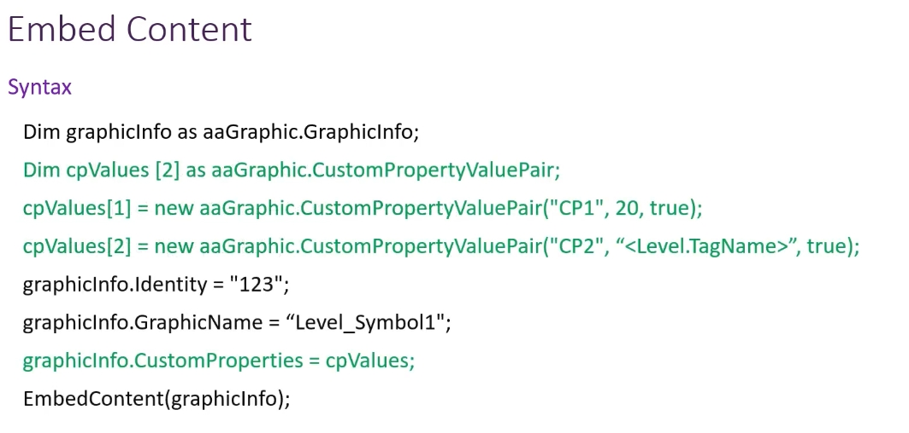

### 3. aaGraphic.GraphicInfo 支援的屬性

| 屬性名稱 | 是否必填 | 資料型態 | 預設值 |
|---|---|---|---|
| Identity | 是 | String | 無 |
| GraphicName | 是 | String | 無 |
| OwningObject | 否 | String | 空 |
| X | 否 | Integer | 0 |
| Y | 否 | Integer | 0 |
| Width | 否 | Integer | 0 |
| Height | 否 | Integer | 0 |
| CustomProperties | 否 | CustomPropertyValuePair[] 陣列 | 空 |

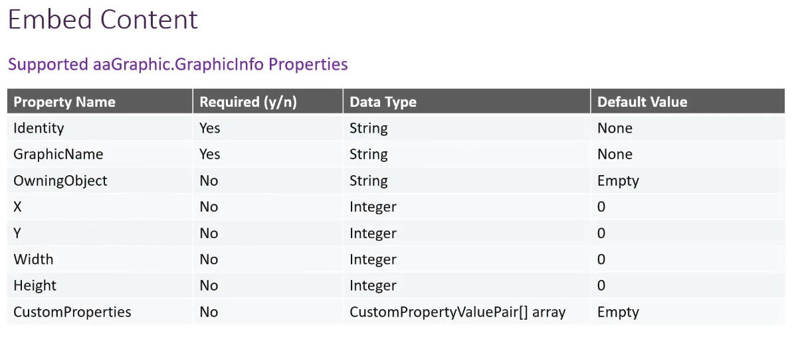

### 4. Remove Embedded Content 語法

```vb
RemoveEmbededContent("<identity>");
```


---

## 三、範例一：基本內嵌與移除操作

### 步驟 1：準備畫面元件

建立一個名為 `EmbedContent_Example_V1` 的圖形，內含：
- 一個矩形元件（顯示為「Embedded Content Area」，作為內嵌內容顯示區域 `DisplayArea`）
- 兩顆按鈕：`Embed Content` 與 `Remove Embedded Content`

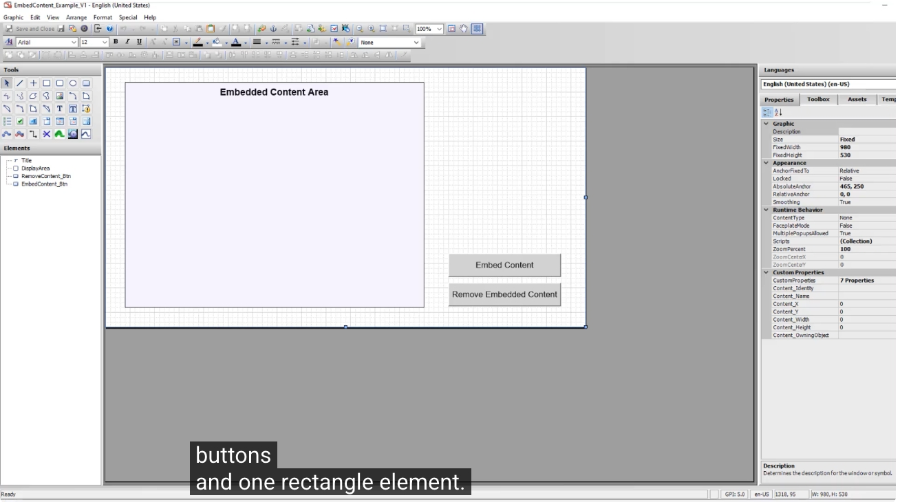

### 步驟 2：設定 Embed Content 按鈕的動作腳本

點選 `EmbedContent_Btn`，開啟 **Edit Animations** 視窗，於 Interaction 分類中新增 **Action Scripts**。

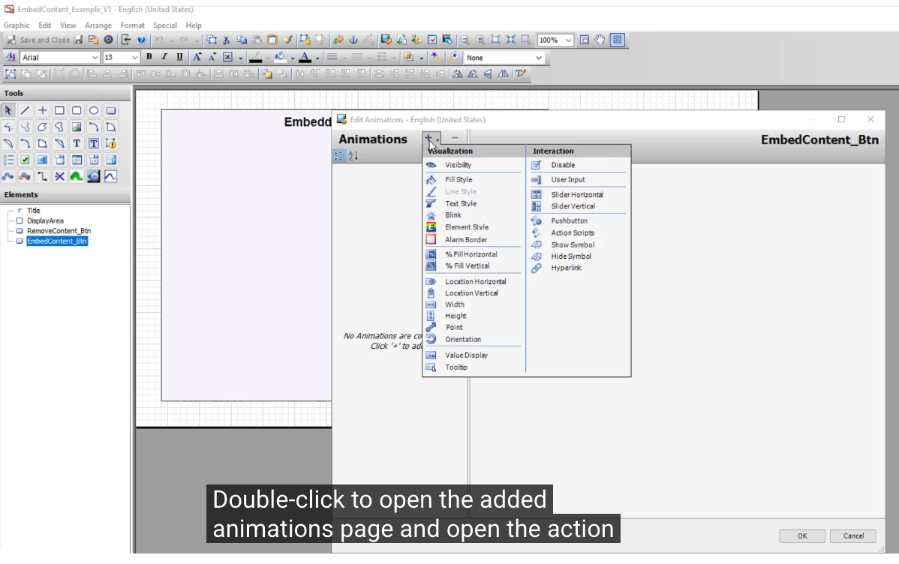

觸發類型（Trigger）設定為 **On Left/Key/Touch Up**。

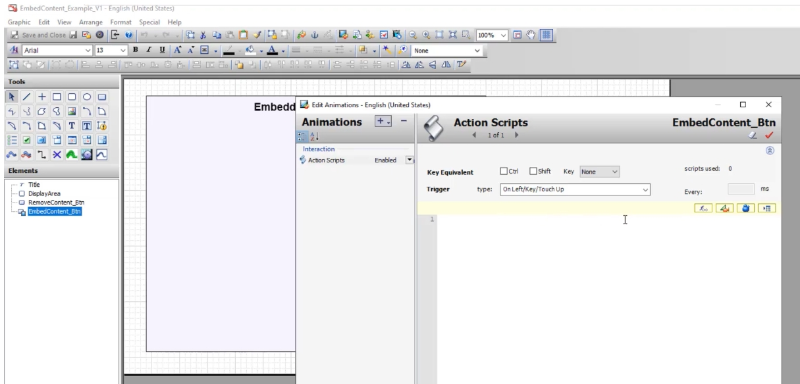

點擊腳本編輯區右上角圖示，開啟 **Script Function Browser**（腳本函式瀏覽器）。

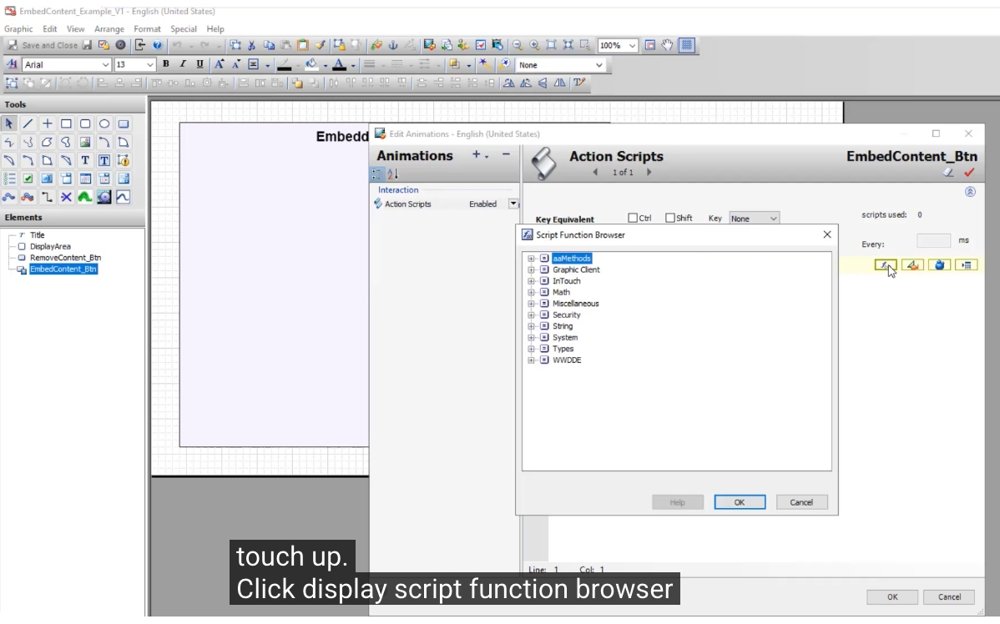

展開 **Graphic Client** 清單，可以看到 `EmbedContent`、`RemoveEmbeddedContent` 等函式。

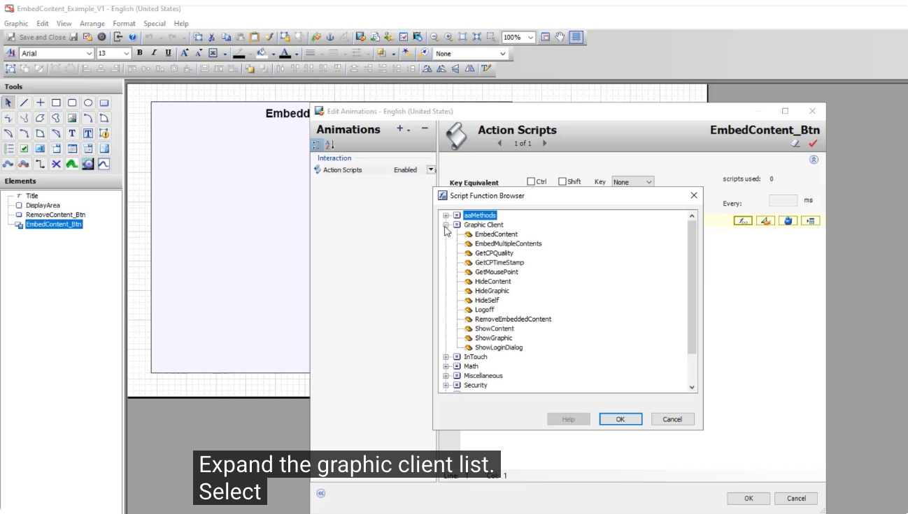

選取 `EmbedContent` 函式後，系統會自動帶入基本語法範本，設定完成後按下 **OK**。

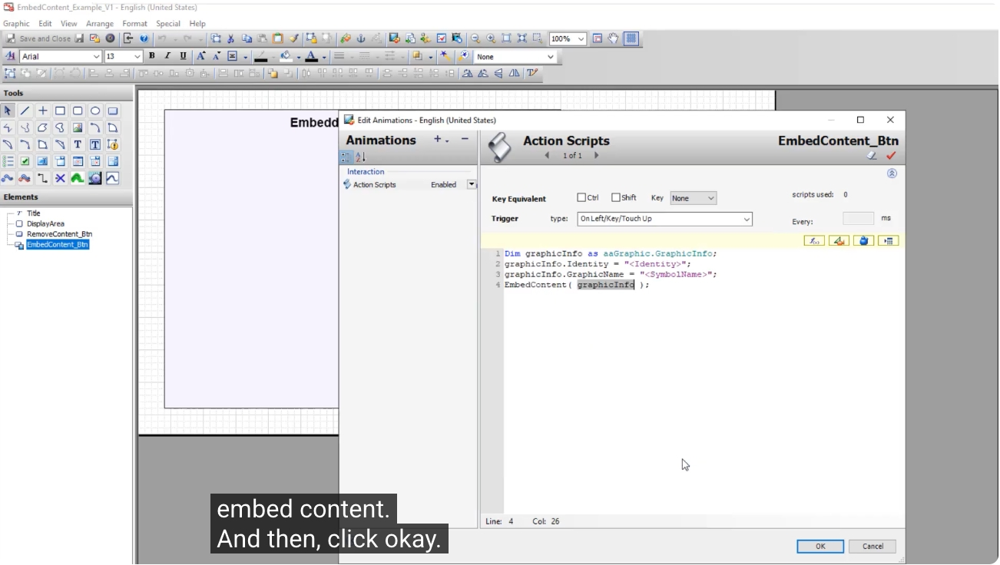

### 步驟 3：選擇要內嵌的圖形

透過 **Galaxy Browser** 瀏覽圖形庫，本範例選擇內嵌 **AVEVA Logo**。

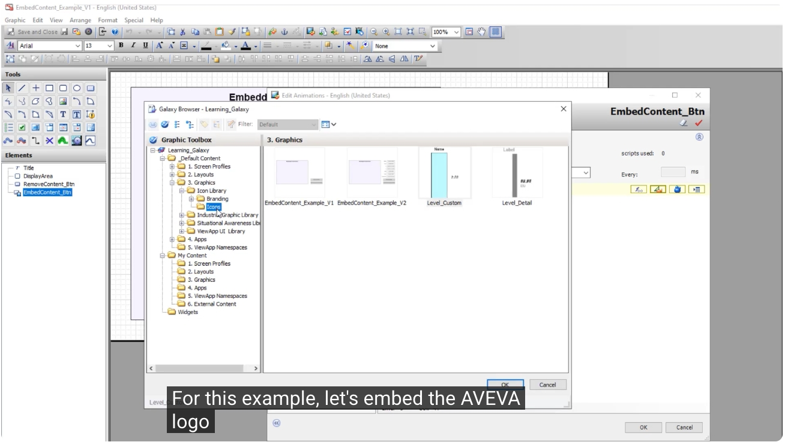

完成後的腳本內容如下，並將座標設定為與 `DisplayArea` 的 X、Y 對齊（尺寸維持預設）：

```vb
Dim graphicInfo as aaGraphic.GraphicInfo;
graphicInfo.Identity = "logo";
graphicInfo.GraphicName = "AVEVA_Logo";

graphicInfo.X = DisplayArea.X;
graphicInfo.Y = DisplayArea.Y;

EmbedContent( graphicInfo );
```

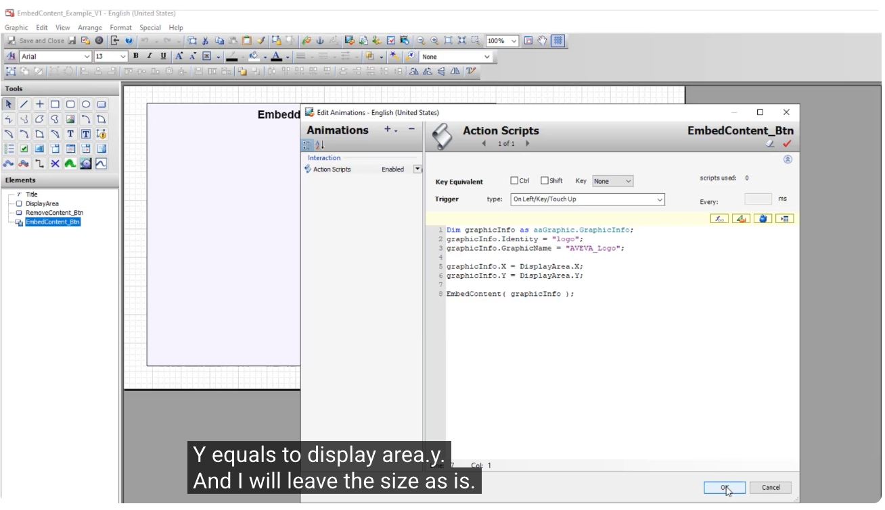

### 步驟 4：設定 Remove Embedded Content 按鈕

點選 `RemoveContent_Btn`，同樣新增一個 **Action Scripts** 動畫。

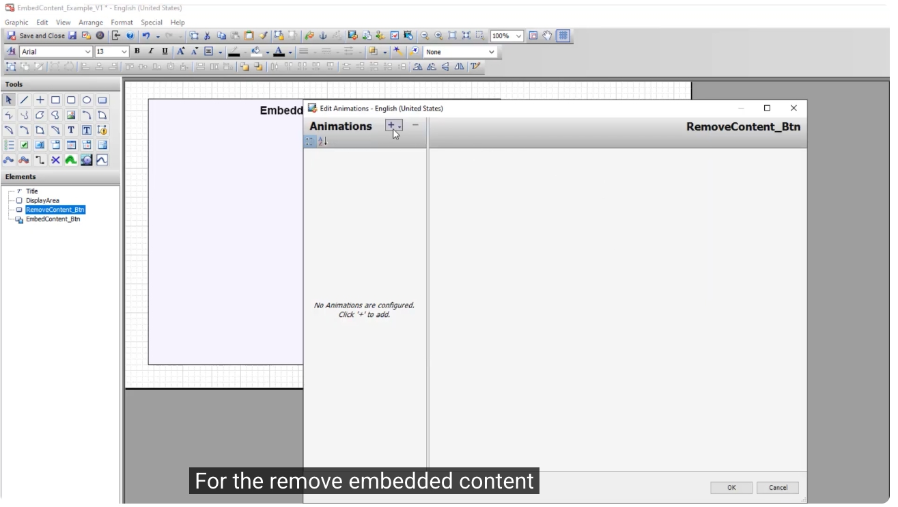

開啟 Script Function Browser，選取 **RemoveEmbeddedContent** 函式，並指定要移除的 `identity`（此範例為 `"logo"`）。

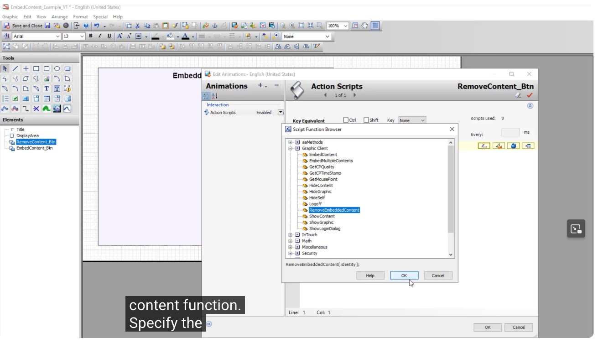

### 步驟 5：執行測試

- 點擊 **Embed Content** 按鈕：AVEVA 標誌會顯示在顯示區域矩形的左上角。

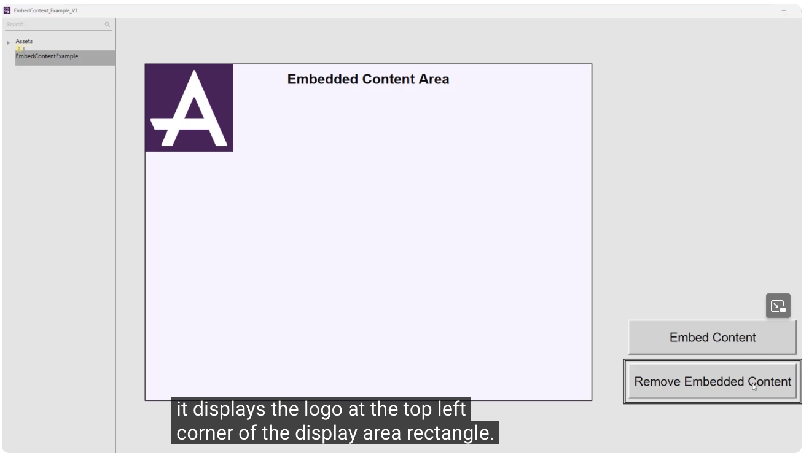

- 點擊 **Remove Embedded Content** 按鈕：標誌隨即從顯示區域中消失。

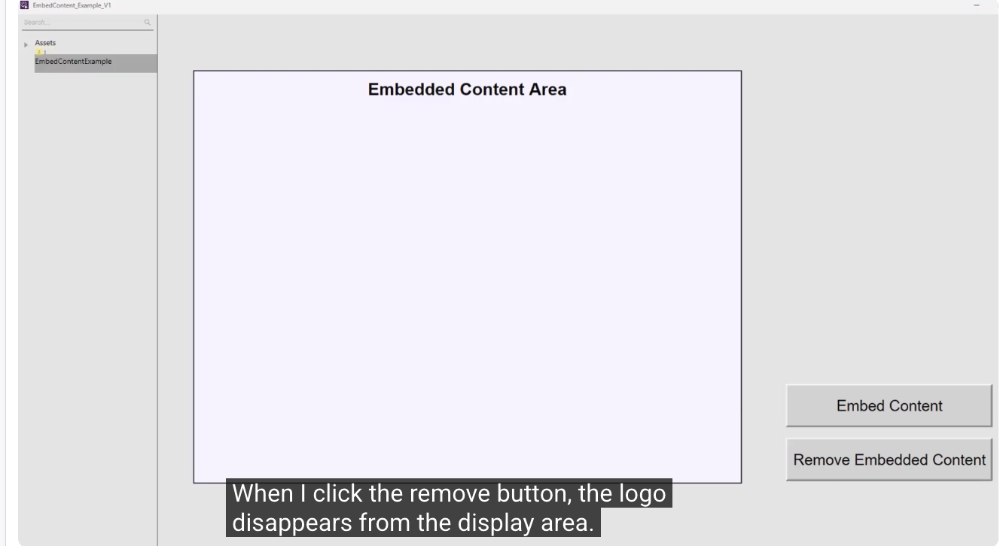

---

## 四、範例二：多圖形與動態資料連結（含自訂屬性）

本範例示範如何內嵌一個包含自訂屬性的圖形，並讓其屬性即時連結至實際的裝置資料標籤。

### 步驟 1：認識自訂屬性圖形 `Level_Custom`

此圖形具有兩個自訂屬性：
- **CP1**：用於顯示裝置名稱（字串型態）
- **CP2**：用於顯示數值（浮點數型態，Float）

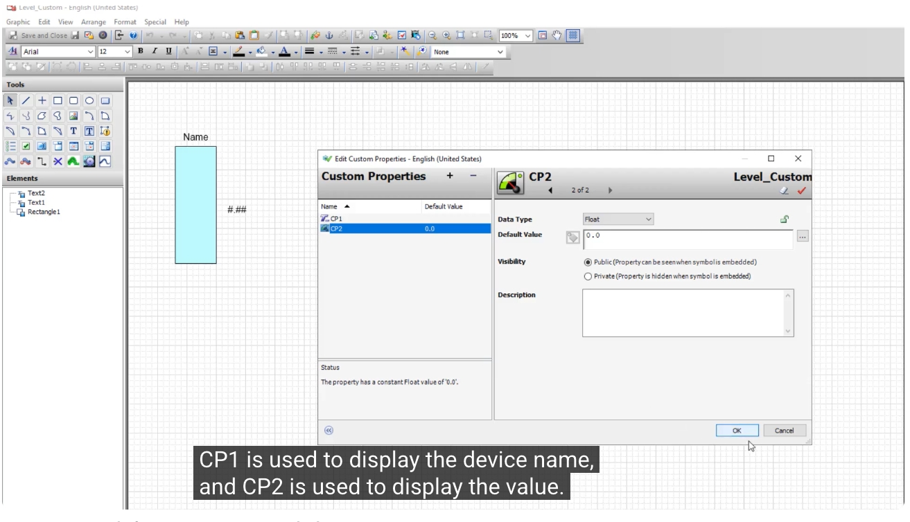

### 步驟 2：撰寫內嵌腳本並綁定自訂屬性

在同一個 `EmbedContent_Btn` 腳本中，可以繼續加入第二段 `EmbedContent` 呼叫，將自訂屬性以字串值的方式與實際的 Tag 屬性做參考連結：

```vb
Dim cpValues [2] as aaGraphic.CustomPropertyValuePair;
cpValues[1] = new aaGraphic.CustomPropertyValuePair("CP1", "Level Transmitter", true);
cpValues[2] = new aaGraphic.CustomPropertyValuePair("CP2", "Level_Transmitter.PV", true);

graphicInfo.Identity = "level";
graphicInfo.GraphicName = "Level_Custom";

graphicInfo.CustomProperties = cpValues;

graphicInfo.X = 250;
graphicInfo.Y = 200;

EmbedContent( graphicInfo );
```

其中 `CustomPropertyValuePair` 的第三個參數 `true` 代表該值為**參考（Reference）**，也就是說 CP2 會即時連結到 `Level_Transmitter.PV` 這個標籤（Tag）的數值，並在 Runtime 中動態更新顯示。

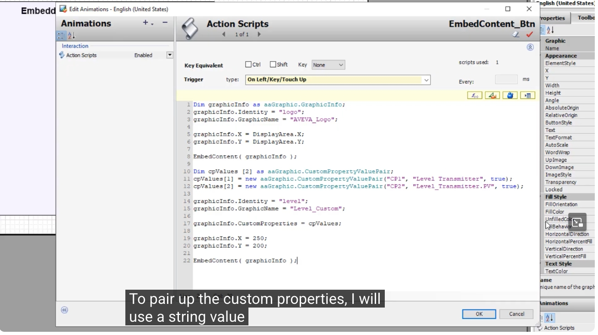

### 步驟 3：進階範例（V2）— 以介面參數化內嵌設定

在更進階的範例 `EmbedContent_Example_V2` 中，可以將 `Identity`、`Name`、`X`、`Y`、`Width`、`Height`、`OwningObject` 等參數，改由畫面上的輸入欄位（TextBox）動態帶入，使使用者可以在 Runtime 期間自由切換要內嵌的圖形、位置與大小，而不需要修改腳本內容。此範例僅作示範說明之用。

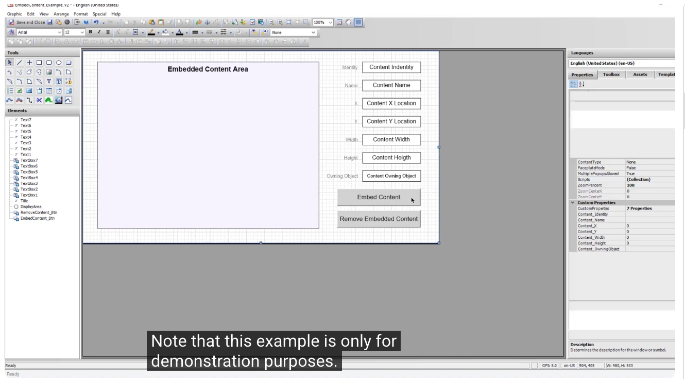

---

## 五、Embed Content 與 Show Graphic 的差異

| 比較項目 | Embed Content | Show Graphic |
|---|---|---|
| 顯示方式 | 直接整合於宿主圖形（Hosting Graphic）中 | 以獨立的新視窗彈出顯示 |
| 適用情境 | 需要將圖形嵌入既有畫面版面配置中 | 需要獨立彈窗顯示內容 |
| 支援自訂屬性配置 | 支援（CustomPropertyValuePair） | 依函式而定 |

---

## 六、重點整理

1. `EmbedContent` 需要透過 `aaGraphic.GraphicInfo` 結構設定 `Identity` 與 `GraphicName`（必填），並可選填位置、尺寸與自訂屬性。
2. `RemoveEmbeddedContent` 只需傳入對應的 `Identity` 字串即可移除已內嵌的圖形。
3. 自訂屬性可透過 `CustomPropertyValuePair("屬性名稱", 值, 是否為參考)` 進行設定；當第三個參數為 `true` 時，代表該值會即時參考連結至實際的標籤（Tag）資料。
4. 相較於 `ShowGraphic`，`EmbedContent` 的圖形是直接整合進宿主圖形中，而非另開新視窗。
5. 可以將內嵌參數（Identity、GraphicName、X、Y、Width、Height 等）綁定至畫面輸入元件或自訂屬性，實現 Runtime 動態切換內嵌圖形的彈性設計。
