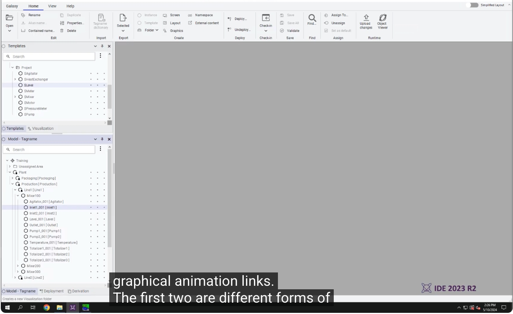
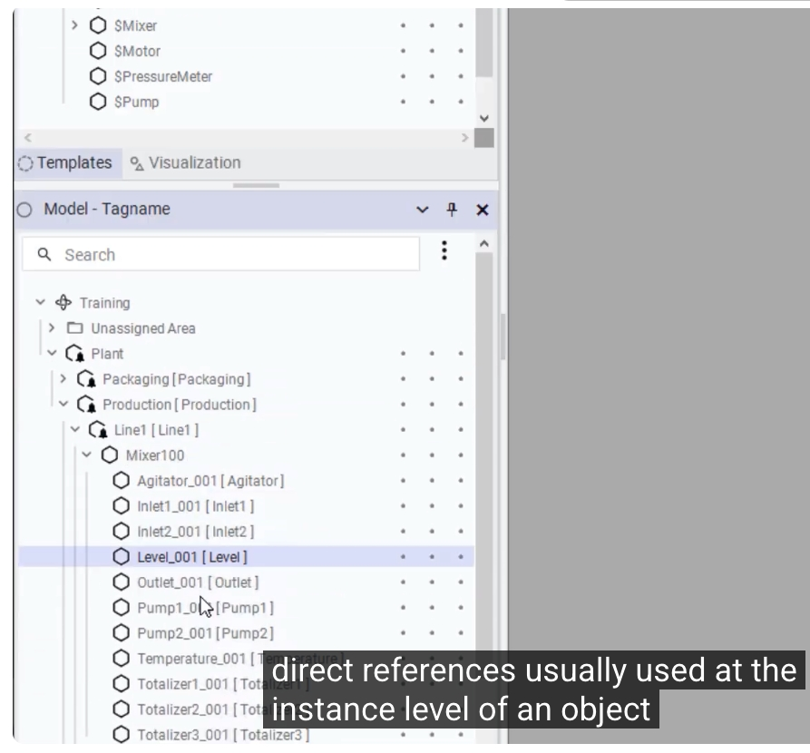
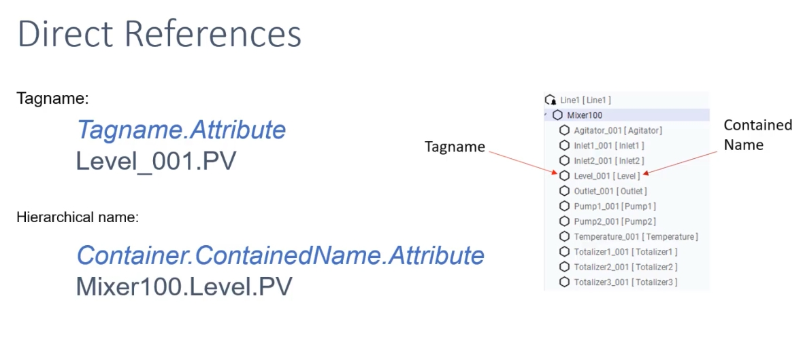
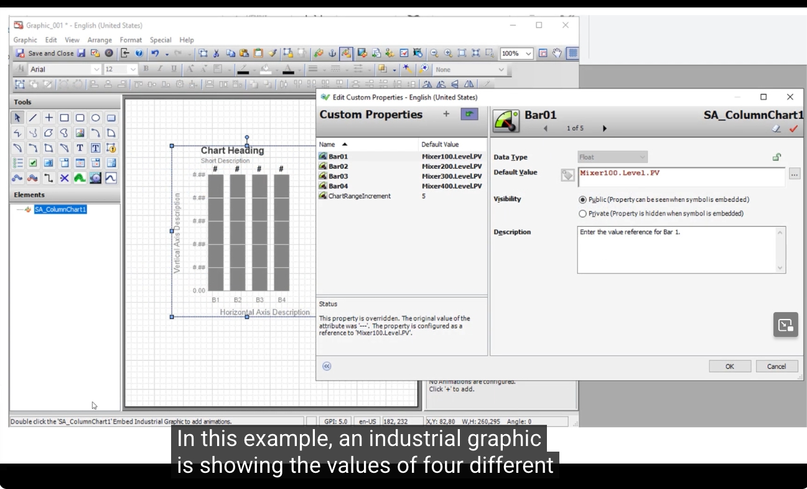
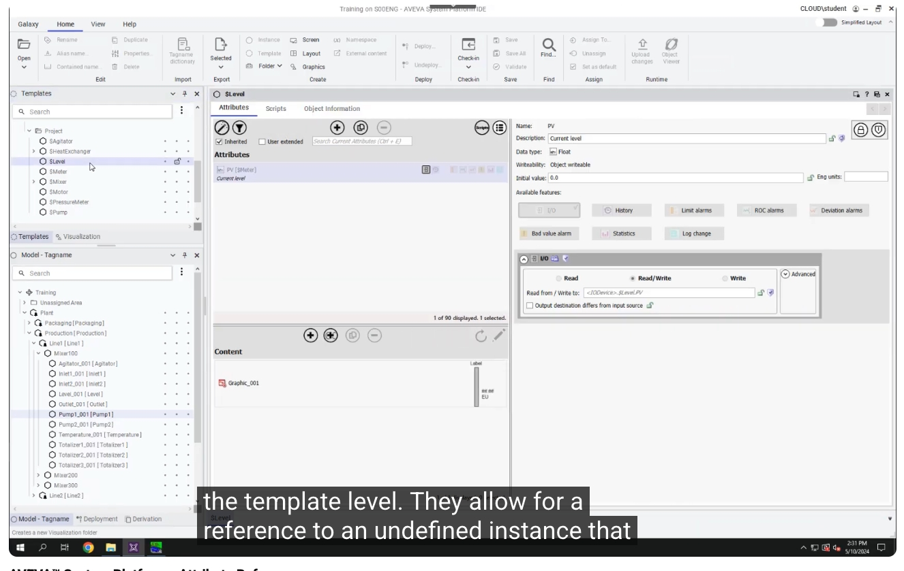
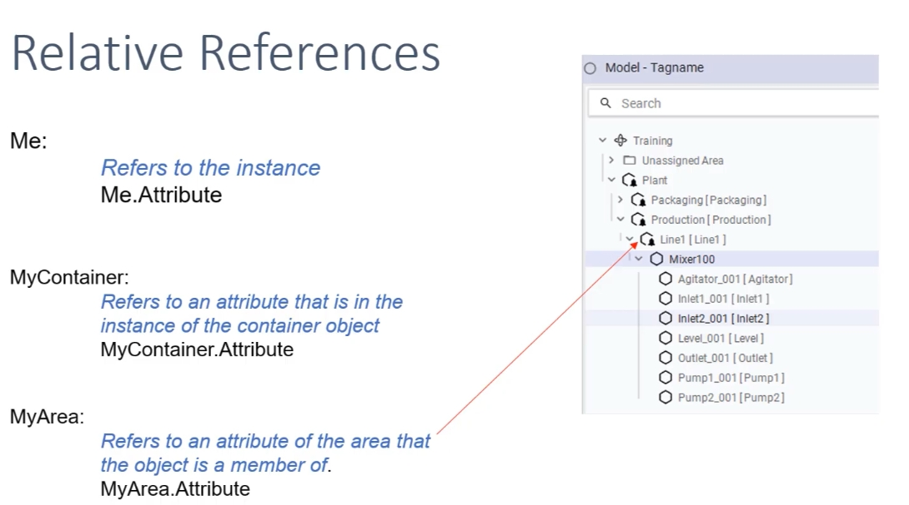
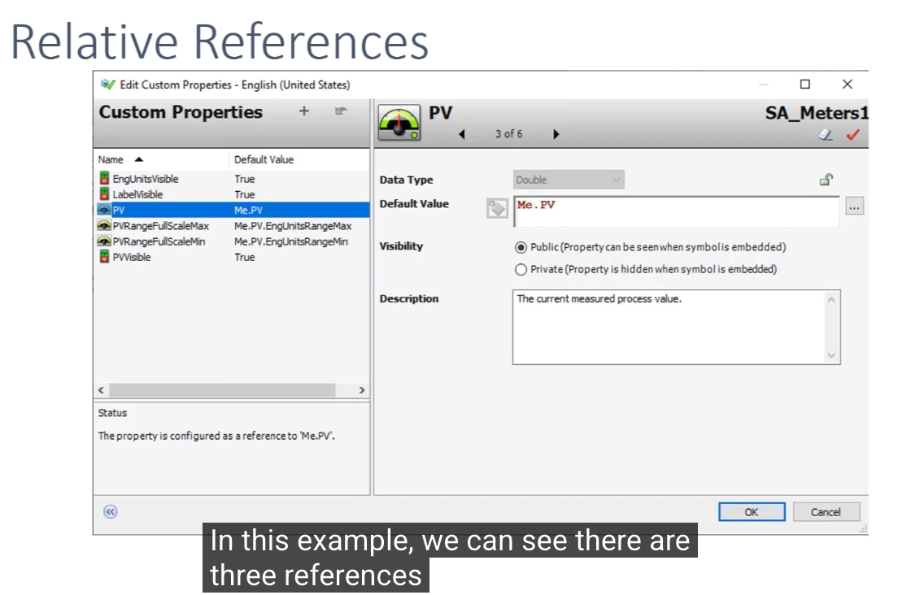
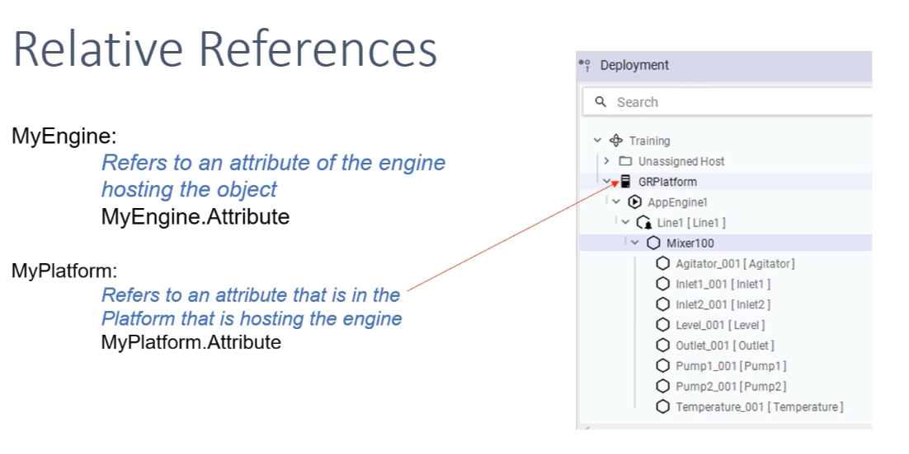

# AVEVA™ System Platform - 屬性引用（Attribute References）教程

> 影片來源：AVEVA Operations Control 頻道
> 原始連結：https://www.youtube.com/watch?v=FggRsVRxeTk&list=PLJq4rR8tWINyOrvwxbIjRvgTtoyuuEfSz&index=3

在 AVEVA™ Application Server 中，若要在腳本（Scripts）或工業圖形（Industrial Graphics）的動畫連結中引用一個標籤（Tag）的屬性，共有三種方式：

1. **直接引用 - 標籤名稱（Tagname）**
2. **直接引用 - 階層名稱（Hierarchical Name）**
3. **相對引用（Relative References）**

其中前兩種都屬於「直接引用」，通常用在**物件實體（Instance）層級**；第三種「相對引用」則多用在**樣板（Template）層級**，允許在尚未指定具體實體時就建立引用，並於執行階段（Runtime）自動解析成對應的實體。

下面依照影片講解順序，逐一說明。

---

## 一、概述：兩種直接引用方式

在 Application Server IDE 的 Model - Tagname 樹狀結構中，可以看到 `Mixer100` 底下包含了 `Level_001`、`Inlet1_001`、`Pump1_001` 等實體物件。

前兩種引用方式（標籤名稱、階層名稱）都是**直接引用**，通常用於物件的實體層級，也就是圖形動畫連結中最常見的寫法。



---

## 二、直接引用（Direct References）

### 1. 標籤名稱（Tagname）引用

每一個物件的實體（Instance）都必須擁有獨一無二的名稱，因此可以直接用這個名稱來引用其屬性。

**語法：**

```
Tagname.Attribute
```

**範例：**

```
Level_001.PV
```

如下圖所示，`Level_001` 就是這個物件在 Model 樹中的標籤名稱（Tagname）。



### 2. 階層名稱（Hierarchical Name）引用

當一個物件被包含在另一個物件之中時（例如 `Level_001` 隸屬於 `Mixer_100`），系統會產生一個「包含名稱（Contained Name）」。此時可以用容器名稱＋包含名稱的方式來引用屬性。

**語法：**

```
Container.ContainedName.Attribute
```

**範例：**

```
Mixer100.Level.PV
```

下圖同時標示出「標籤名稱（Tagname）」與「包含名稱（Contained Name）」兩者的差異：



> 💡 **應用情境**：在工業圖形中，如果要同時顯示多個相同類型設備（例如多個 Mixer）的數值，就可以分別用標籤名稱或階層名稱做直接引用，逐一指定要顯示哪一台設備的數據。

### 3. 實際應用範例：Column Chart 柱狀圖

下圖展示了一個實際案例：一張工業圖形（`SA_ColumnChart1`）利用**階層名稱**的方式，同時顯示四台不同 Mixer（Mixer100～Mixer400）的液位（Level）數值。

在 `Bar01` 的自訂屬性（Custom Property）中，預設值（Default Value）被設定為：

```
Mixer100.Level.PV
```

其餘 `Bar02`、`Bar03`、`Bar04` 則依序對應 `Mixer200`、`Mixer300`、`Mixer400`。



---

## 三、從直接引用過渡到相對引用

直接引用（標籤名稱、階層名稱）都必須指定一個**明確存在的實體**，因此只適合用在實體層級的圖形或腳本中。

但如果是在**樣板（Template）層級**設計圖形或撰寫腳本，這時候還沒有一個具體的實體可以參照——這正是「相對引用（Relative References）」派上用場的地方。相對引用允許在樣板中先建立引用邏輯，等到樣板被部署到具體實體上時，系統會在執行階段自動解析成對應的實際物件。



---

## 四、相對引用（Relative References）

相對引用共有五個常用關鍵字：`Me`、`MyContainer`、`MyArea`、`MyEngine`、`MyPlatform`。

### 1. Me / MyContainer / MyArea

| 關鍵字 | 說明 | 語法 |
|---|---|---|
| **Me** | 指向物件實體**本身** | `Me.Attribute` |
| **MyContainer** | 指向**包含該物件的容器物件**實體之屬性 | `MyContainer.Attribute` |
| **MyArea** | 指向該物件所屬**區域（Area）**的屬性 | `MyArea.Attribute` |

以下圖為例，`Mixer100` 內的 `Inlet2_001` 物件若使用 `MyContainer`，就會指向其容器 `Mixer100`；若使用 `MyArea`，則會指向更上層的區域 `Line1`。



### 2. 實際範例：PV 屬性設定為 Me.PV

下圖是一個電錶（Meter）樣板 `SA_Meters1` 的自訂屬性設定畫面。可以看到 `PV` 這個自訂屬性的**預設值**被設定為：

```
Me.PV
```

狀態列（Status）也顯示：「This property is configured as a reference to 'Me.PV'.」，代表這個屬性在樣板層級就已經設定好要參照「實體自身的 PV 屬性」，等到樣板被實例化後，會自動對應到該實體真正的 PV 數值。

在這張圖中，除了 `PV` 之外，還有 `PVRangeFullScaleMax`（對應 `Me.PV.EngUnitsRangeMax`）與 `PVRangeFullScaleMin`（對應 `Me.PV.EngUnitsRangeMin`），都是同樣的相對引用邏輯應用。



### 3. MyEngine / MyPlatform

除了物件與區域層級的引用之外，相對引用也可以往「部署架構」的方向延伸：

| 關鍵字 | 說明 | 語法 |
|---|---|---|
| **MyEngine** | 指向**託管（Host）該物件的 Engine** 的屬性 | `MyEngine.Attribute` |
| **MyPlatform** | 指向**託管該 Engine 的 Platform** 的屬性 | `MyPlatform.Attribute` |

在 Deployment 視圖中可以看到，`Mixer100` 是部署在 `AppEngine1` 這個引擎（Engine）之下，而 `AppEngine1` 又是部署在 `GRPlatform` 這個平台（Platform）之上。因此：

- `MyEngine.Attribute` 會指向 `AppEngine1` 的屬性
- `MyPlatform.Attribute` 會指向 `GRPlatform` 的屬性



---

## 五、總結

| 引用方式 | 語法 | 使用時機 |
|---|---|---|
| 標籤名稱（Tagname） | `Tagname.Attribute` | 實體層級，直接指定唯一名稱的物件 |
| 階層名稱（Hierarchical Name） | `Container.ContainedName.Attribute` | 實體層級，透過容器＋包含名稱指定物件 |
| Me | `Me.Attribute` | 樣板層級，指向物件自身 |
| MyContainer | `MyContainer.Attribute` | 樣板層級，指向上層容器物件 |
| MyArea | `MyArea.Attribute` | 樣板層級，指向所屬區域 |
| MyEngine | `MyEngine.Attribute` | 樣板層級，指向託管的 Engine |
| MyPlatform | `MyPlatform.Attribute` | 樣板層級，指向託管 Engine 的 Platform |

簡單來說：**直接引用**適合已經知道明確物件的情境（例如畫面上要顯示某台特定設備的數值）；**相對引用**則適合設計**可重複使用的樣板**，讓同一份圖形或腳本邏輯能夠套用到任何一個實體上，並在部署時自動對應到正確的物件、容器、區域、引擎與平台。
