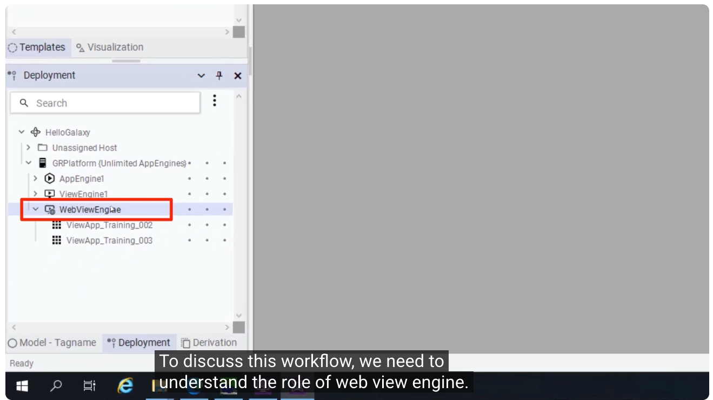
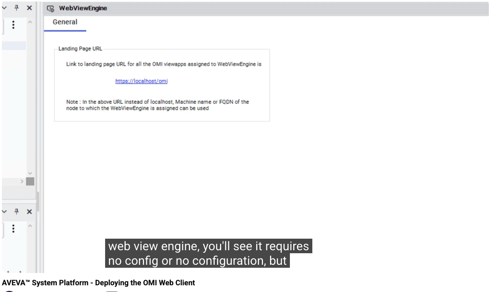
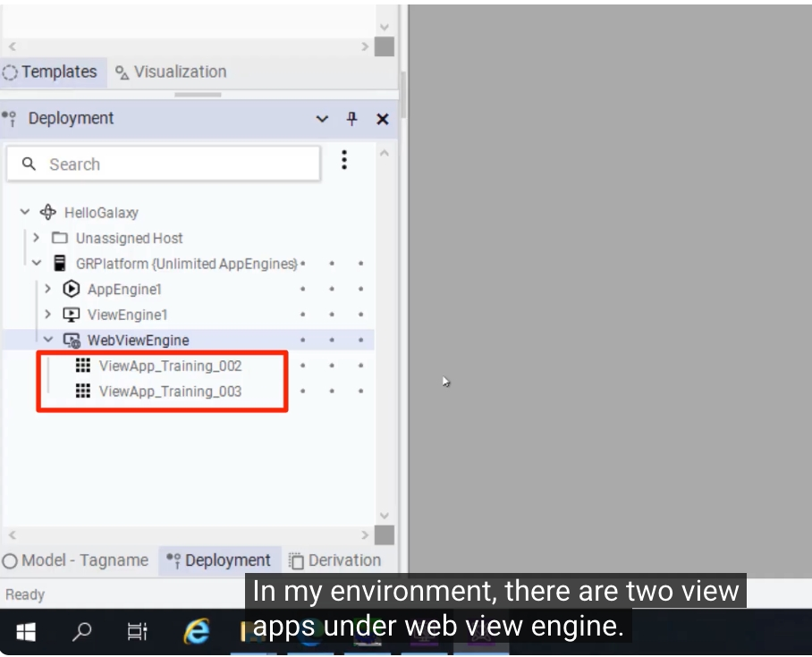
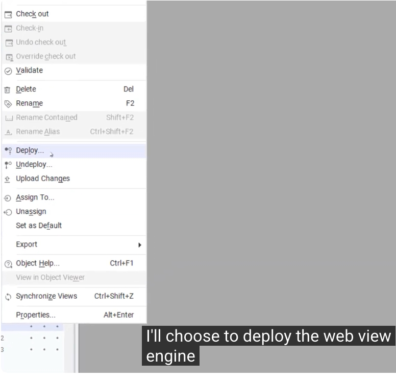
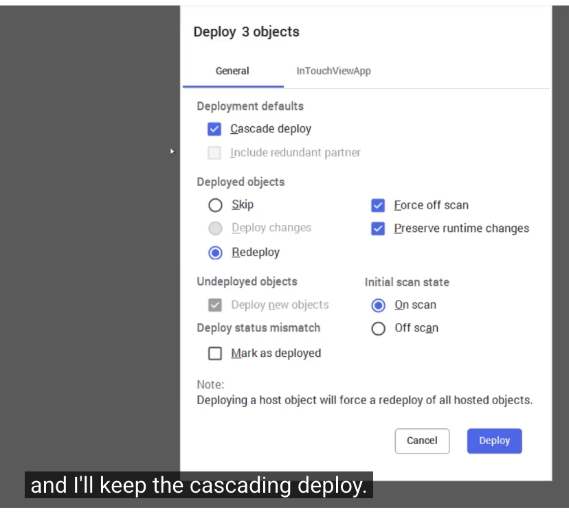
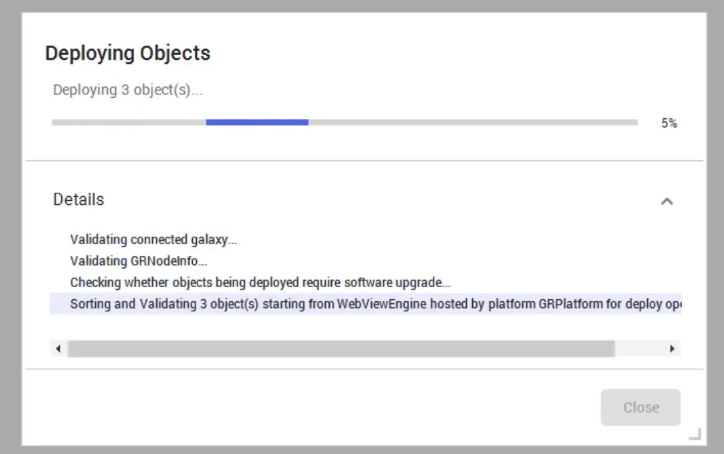

# AVEVA™ System Platform - 部署 OMI Web Client 教程

> 影片來源：AVEVA Operations Control 頻道
> 原始連結：https://www.youtube.com/watch?v=bFHncdxlj50&list=PLJq4rR8tWINyOrvwxbIjRvgTtoyuuEfSz&index=4

本篇教程說明如何將應用程式部署到 **OMI Web Client**——一個以瀏覽器為基礎的檢視應用（View Application），使用者可以像操作一般 View App 一樣，直接透過瀏覽器存取與互動。內容涵蓋部署所需的核心物件、關鍵概念，以及實際部署 `WebViewEngine` 與 `ViewApp` 的完整示範。

---

## 一、核心元件：WebViewEngine

要讓 OMI Web Client 運作，最關鍵的元件是 **WebViewEngine**。它扮演著類似 `AppEngine` 的角色，是承載 OMI Web Client 執行所需的「平台」。

`WebViewEngine` 的主要職責是：

- **部署並啟動服務**，使各種連線得以建立。
- **託管（Host）OMI View App**，這些 View App 會透過 OMI Web Client 被使用者存取。
- **讓使用瀏覽器的 OMI 用戶端能訂閱並接收來自 Galaxy 的數值**。

在 Deployment 樹狀結構中，可以看到 `WebViewEngine` 與 `AppEngine1`、`ViewEngine1` 同樣位於 `GRPlatform` 之下，而它底下則掛載著實際的 View App（如 `ViewApp_Training_002`、`ViewApp_Training_003`）。



---

## 二、WebViewEngine 的組態設定：Landing Page URL

雙擊 `WebViewEngine` 物件後，會發現它**不需要額外的組態設定**，但畫面上會顯示一組固定格式的網址（URL），這就是所有掛載於此 `WebViewEngine` 底下的 OMI View App 的**登陸頁面（Landing Page）連結**：

```
https://localhost/omi
```

> 💡 **注意**：
> - 網址中的 `localhost` 可以替換成實際部署 `WebViewEngine` 所在主機的名稱。
> - 若 OMI Web Client 使用端所在的網域與 `WebViewEngine` 部署所在的網域不同，則應改用該 `WebViewEngine` 部署平台的**完整網域名稱（FQDN, Fully Qualified Domain Name）**，而非直接使用 `localhost`。



---

## 三、確認要部署的 View App

在此範例環境中，`WebViewEngine` 底下掛載了兩個 View App：

- `ViewApp_Training_002`
- `ViewApp_Training_003`

這兩個 View App 就是接下來要一併部署到 OMI Web Client 的應用程式。



---

## 四、開始部署：選擇 WebViewEngine

在 Deployment 檢視中對 `WebViewEngine` 按右鍵，選擇 **Deploy...**，即可開始部署流程。由於部署 `WebViewEngine` 這個「主機物件（Host Object）」時，系統會一併處理其底下所掛載的 View App，因此不需要再逐一手動部署每個 View App。



---

## 五、部署設定：保留 Cascade Deploy

進入部署對話框後，會看到系統準備部署 **3 個物件**（`WebViewEngine` 本身以及底下的兩個 View App）。

在此步驟中，**保持預設勾選 Cascade Deploy（串聯部署）** 即可，這代表部署 `WebViewEngine` 時，會自動一併部署其所有掛載的下層物件。設定完成後點選 **Deploy** 按鈕。



---

## 六、部署完成

點擊 Deploy 之後，系統會顯示部署進度視窗，逐步驗證 Galaxy 連線、檢查物件是否需要軟體升級，並依序排序、驗證要部署的物件。



當進度完成後，`WebViewEngine` 與其底下的兩個 View App 便部署完成，使用者即可透過瀏覽器開啟 `https://<主機位址>/omi` 存取 OMI Web Client，並像使用一般 View App 一樣進行操作。

---

## 七、總結

| 步驟 | 說明 |
|---|---|
| 1. 認識 WebViewEngine | 部署、啟動服務並託管 OMI View App 的核心元件 |
| 2. 檢查 Landing Page URL | 確認登陸頁面網址格式，跨網域時改用 FQDN |
| 3. 確認要部署的 View App | 檢視 WebViewEngine 底下掛載的 View App |
| 4. 執行 Deploy | 對 WebViewEngine 按右鍵選擇 Deploy |
| 5. 保留 Cascade Deploy | 確保底下所有 View App 一併被部署 |
| 6. 完成部署 | 系統驗證並完成物件部署，可透過瀏覽器存取 |

透過以上流程，即可將應用程式順利部署至 OMI Web Client，讓終端使用者以瀏覽器方式，無需安裝額外用戶端軟體，即可存取並操作 AVEVA System Platform 的圖形介面。
