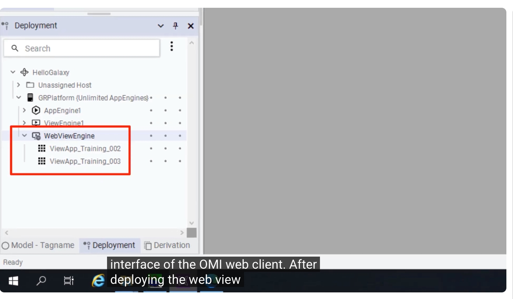
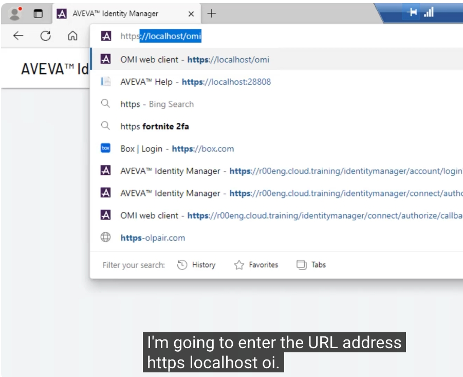
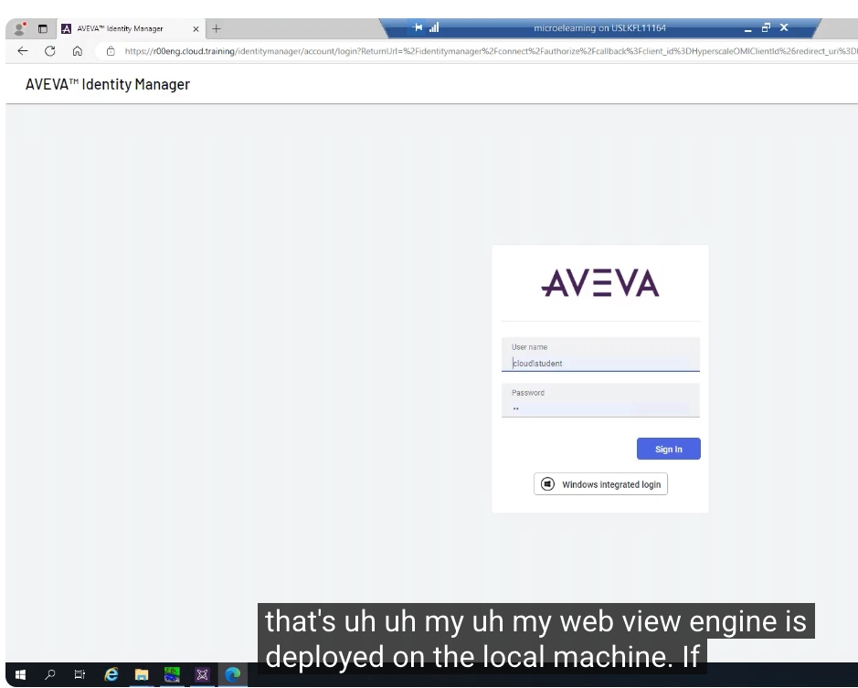
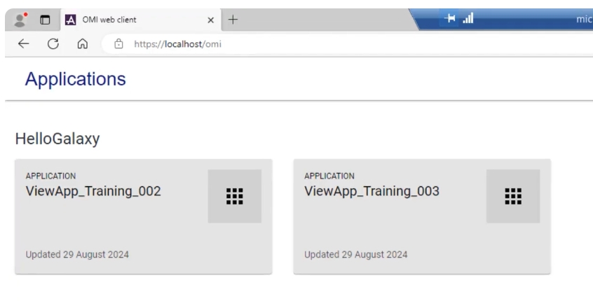
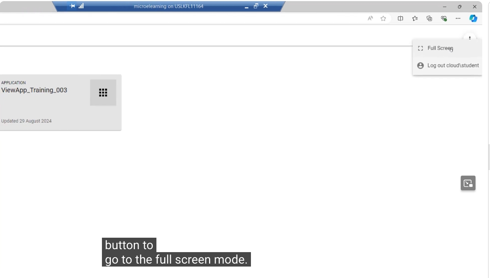
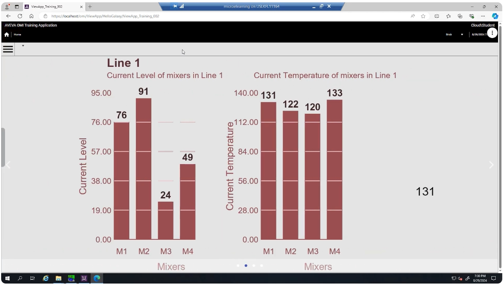
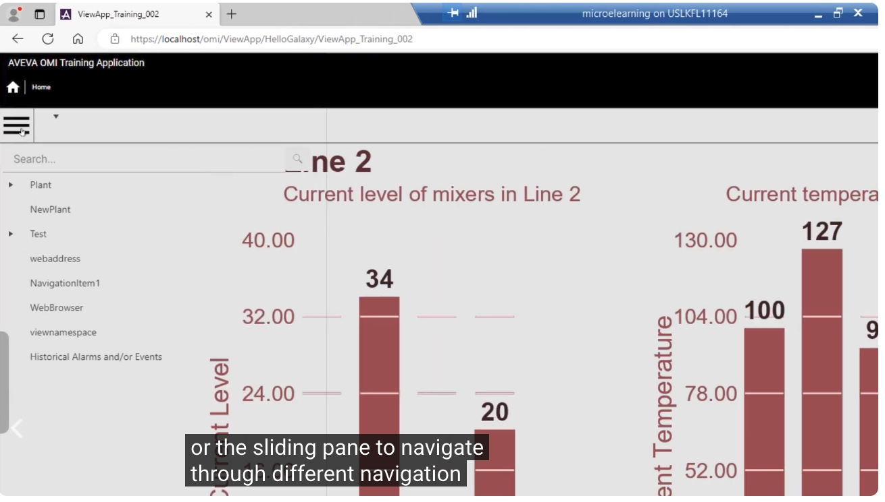
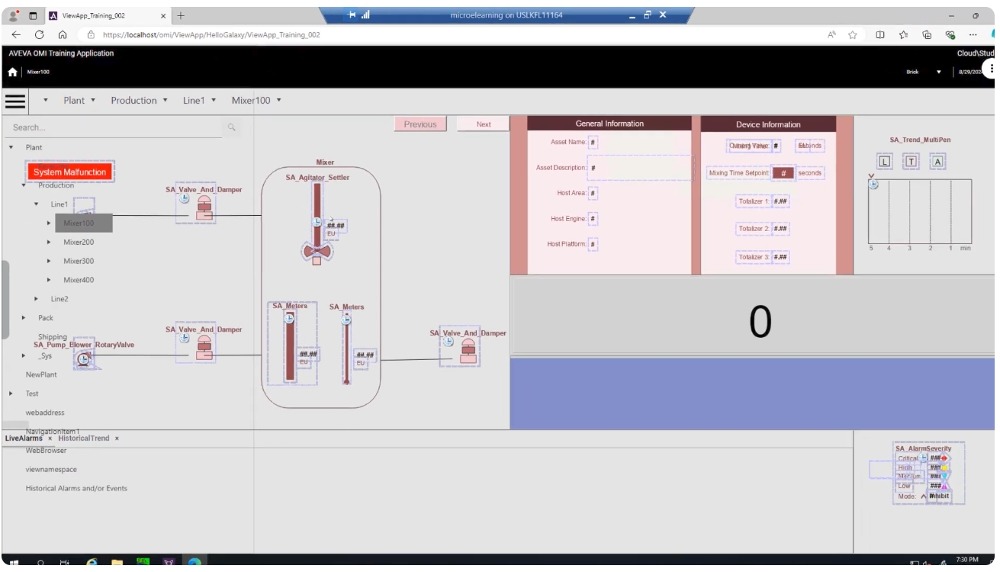
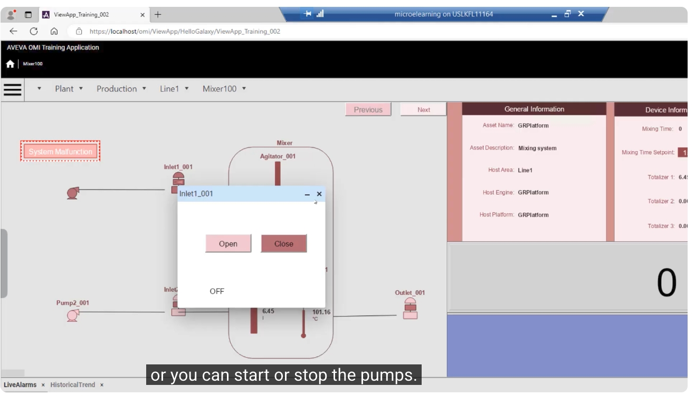

# AVEVA™ System Platform — OMI Web Client 介面教學

> 影片來源：[AVEVA™ System Platform - OMI web client Interface](https://www.youtube.com/watch?v=5N55v3rGvLE&list=PLJq4rR8tWINyOrvwxbIjRvgTtoyuuEfSz&index=5)

## 簡介

本教學說明 **OMI Web Client** 介面的使用方式。OMI Web Client 是一個以瀏覽器為基礎的檢視應用程式，使用者可以透過瀏覽器存取並操作，體驗如同使用一般的檢視應用程式（View App）一樣。內容涵蓋 OMI Web Client 介面的基本概念與功能，並提供實際操作示範。

---

## 1. 部署 Web View Engine 與 View App

在開始使用 OMI Web Client 之前，必須先在 **Deployment（部署）** 面板中部署好 **Web View Engine**，以及要透過網頁存取的 View App（本範例為 `ViewApp_Training_002` 與 `ViewApp_Training_003`）。



如上圖所示，在 `GRPlatform` 平台下，`WebViewEngine` 節點底下已經部署了兩個 View App，這是使用 Web Client 存取畫面的前提條件。

---

## 2. 開啟瀏覽器並輸入網址

部署完成後，開啟網頁瀏覽器（本範例使用 Microsoft Edge，也可使用其他瀏覽器，但建議使用最新版本），並輸入網址：

```
https://localhost/omi
```

若 Web View Engine 是部署在遠端節點上，則應輸入該遠端節點的名稱，而不是 `localhost`。



---

## 3. 登入驗證

按下 Enter 後，系統會要求輸入登入憑證。此範例使用 Galaxy 中設定的 **OS Security（作業系統安全性）** 進行驗證，並以 `cloud\student` 帳號登入。



---

## 4. 應用程式列表

登入成功後，介面會顯示所有已部署的 Web View App。本範例中會看到兩個應用程式：`ViewApp_Training_002` 與 `ViewApp_Training_003`。



---

## 5. 全螢幕模式與登出

在畫面右上角有一個「省略號（...）」按鈕，點選後可以：

- 進入 **全螢幕模式（Full Screen）**
- **登出（Log out）** 目前的使用者（`cloud\student`），並可切換登入其他帳號

若要離開全螢幕模式，只需按下鍵盤上的 **Esc** 鍵即可。



---

## 6. 選擇應用程式並瀏覽輪播頁面

點選第一個應用程式後，使用者介面看起來就像一般的桌面應用程式，畫面右上角一樣保留了省略號按鈕（可全螢幕、登出），若該應用程式有多個畫面，也可以在此切換不同畫面。

進入後會看到主要的 **輪播頁面（Carousel Page）**，例如下圖顯示 Line 1 中各混合槽（Mixer）目前的液位與溫度：



---

## 7. 使用選單與滑動面板進行導覽

使用者可以點選左上角的 **漢堡選單（Hamburger Menu）**，或透過 **滑動面板（Sliding Pane）**，切換至不同的導覽項目，例如切換到 Line 2 查看該產線的混合槽狀態：



---

## 8. 操作製程物件（開關閥、啟停幫浦）

在具備適當權限的情況下，使用者可以在流程圖畫面中直接操作設備，例如：

- **開啟或關閉閥門（Valve）**
- **啟動或停止幫浦（Pump）**

下圖顯示選擇 `Mixer100` 後的流程示意圖，包含資產一般資訊（General Information）與裝置資訊（Device Information）等即時數據面板：



點選畫面上的閥門圖示（如 `Inlet1_001`），會彈出操作視窗，提供 **Open（開啟）** 與 **Close（關閉）** 按鈕，供使用者依權限進行操作：



---

## 9. 返回主頁與切換應用程式

點選瀏覽器上的「上一頁」按鈕，即可返回 OMI Web Client 的主頁面，接著可依需求選擇不同的檢視應用程式（View App）繼續操作。

---

## 小結

透過 OMI Web Client，使用者只需一個瀏覽器，即可：

1. 以帳號密碼登入並存取多個已部署的 View App
2. 使用漢堡選單或滑動面板在不同畫面間導覽
3. 檢視即時的製程數據（液位、溫度、資產資訊等）
4. 在具備權限時直接操作閥門、幫浦等設備
5. 透過省略號按鈕切換全螢幕模式或登出帳號

以上即為 AVEVA™ System Platform OMI Web Client 介面的完整操作教學。
