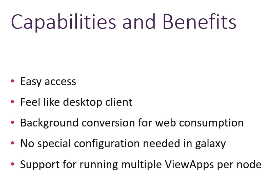
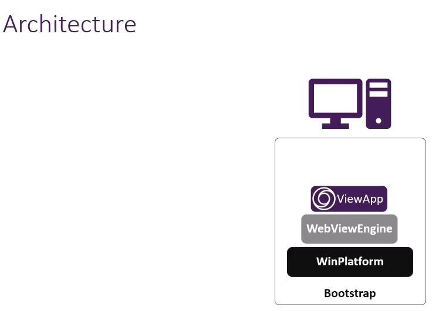
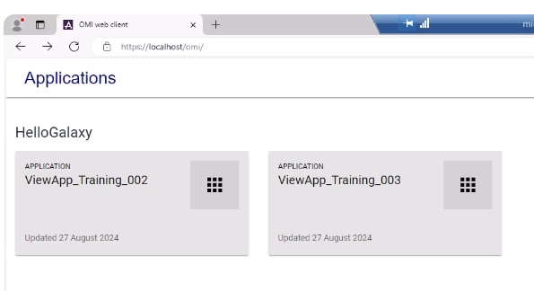
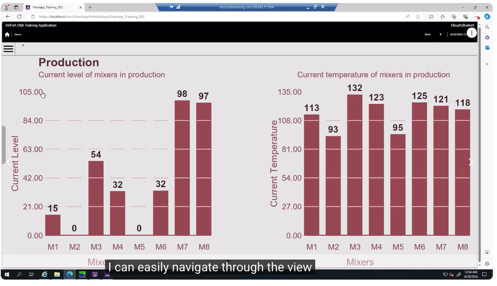

# AVEVA™ System Platform — OMI Web Client 總覽（Overview）

> 影片來源：[AVEVA™ System Platform – OMI Web Client Overview](https://www.youtube.com/watch?v=IRbtu9mIli4&list=PLJq4rR8tWINyOrvwxbIjRvgTtoyuuEfSz&index=6)

## 簡介

本教學說明 **OMI Web Client** 的概念，這是一個以瀏覽器為基礎的檢視應用程式（View App），使用者可以像使用一般檢視應用程式一樣，透過瀏覽器存取並操作它。內容涵蓋開發與部署 OMI Web Client 的主要功能與優點，並提供實際操作示範。

---

## 1. 什麼是 OMI Web Client

OMI Web Client 本質上支援一個以網頁為基礎的檢視應用程式，使用者可以像使用一般檢視應用程式一樣存取並操作它。

使用方式非常簡單：使用者只需要開啟網頁瀏覽器（建議使用最新版本的 Google Chrome 或 Microsoft Edge），並輸入 OMI Web Client 的網址即可存取。

---

## 2. 功能與優點（Capabilities and Benefits）

在深入介紹操作方式之前，先來看看 Web Client 具備哪些能力與優點：

- **容易存取（Easy access）**：不需要額外安裝用戶端軟體，只要有瀏覽器即可使用。
- **操作體驗與桌面用戶端相似（Feel like desktop client）**：使用者不需要額外的訓練即可上手。
- **背景自動轉換為網頁可用格式（Background conversion for web consumption）**：畫面會自動轉換成適合網頁瀏覽器呈現的元件。
- **Galaxy 系統不需要特殊設定（No special configuration needed in Galaxy）**：僅需改用 Web View Engine 取代一般的 View Engine，其餘設定與一般檢視應用程式相同。
- **支援單一節點執行多個 ViewApp（Support for running multiple ViewApps per node）**。

同時，系統也具備安全機制，確保只有經過授權的使用者才能存取。

---

## 3. 架構說明（Architecture）

當一個檢視應用程式（View App）部署於 **Web View Engine** 上時，會被轉換為網頁元件，供使用者透過瀏覽器存取。

要執行 OMI Web Client，需要完成以下架構部署：

1. 安裝 **Bootstrap**
2. 部署 **WinPlatform**
3. 在 WinPlatform 上，改用 **Web View Engine**（取代一般用於支援標準檢視應用程式的 View Engine），以支援 OMI Web Client
4. 在 Web View Engine 之上，可以部署並執行一個或多個 **ViewApp** 實例

在遠端節點上，使用者只需開啟網頁瀏覽器，連線至部署 Web View Engine 的節點，即可取得圖形與資料資訊。

---

## 4. 應用程式清單畫面

這就是 OMI Web Client 的實際畫面。使用者登入後，會看到一份清單，列出所有可用的 OMI 檢視應用程式（View App），使用者可以從中選擇想要檢視、甚至進行操作控制的應用程式。

---

## 5. 瀏覽與操作示範

進入應用程式後，就如同使用一般檢視應用程式一樣：

- OMI Web Client 會顯示圖形（Graphics）、警報視覺化（Alarm Visualizations）、趨勢視覺化（Trend Visualizations）等內容。
- 使用者可以輕鬆地在畫面間導覽（Navigate）。
- 若具備適當權限，也可以進行實際操作，例如 **開啟或關閉閥門（Open / Close Valves）**。

下圖顯示在「Production」畫面中瀏覽各混合槽（Mixer）目前液位與溫度數據的情形：

---

## 小結

OMI Web Client 讓使用者只需透過一般網頁瀏覽器，即可：

1. 存取所有已部署的 OMI 檢視應用程式，操作體驗與桌面用戶端相似
2. 不需要額外訓練即可上手，同時具備存取權限控管
3. Galaxy 系統端幾乎不需要額外設定，僅需改用 Web View Engine
4. 檢視圖形、警報與趨勢等即時製程資訊
5. 在具備權限的情況下，直接於瀏覽器中操作閥門等現場設備

以上即為 AVEVA™ System Platform OMI Web Client 總覽教學。
