# AVEVA Historian to CONNECT Agent 教學

> 影片來源：[AVEVA Historian to CONNECT Agent](https://www.youtube.com/watch?v=TItqvmCSwu8&list=PLJq4rR8tWINyOrvwxbIjRvgTtoyuuEfSz&index=7)

## 簡介

本示範說明全新的 **AVEVA Historian Agent** 如何簡化將既有的地端（on-premise）AVEVA Historian 中的製程資料（Process）、警報（Alarm）與事件歷史（Event History）串流至雲端的 **AVEVA CONNECT** 平台，且**無需升級**現有系統。無論是管理舊有部署或探索混合式工業資料策略，此代理程式都能讓您的雲端轉移過程更加順暢。本教學將完整走過 Historian Agent 的核心功能，以及如何在幾個簡單步驟內完成資料回補（Data Backfill）。

---

## 1. 啟動 AVEVA Historian Agent Configurator

首次開啟 **AVEVA™ Historian Agent Configurator** 時，會看到「Get started」頁面，說明此工具可將 AVEVA Historian 的資料發布到雲端，供分析與流程分析（Process Analytics）使用。此時尚未登入，因此僅顯示 **Backfill**、**Settings**、**Logs**、**Info**、**Help** 等選項，並提示「Sign in to configure（需登入才能設定）」。

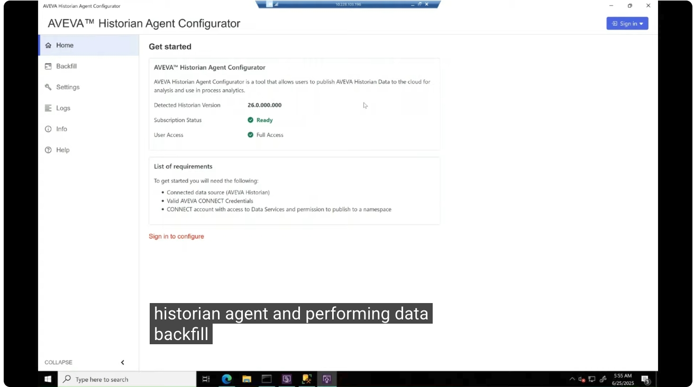

---

## 2. 登入 CONNECT Data Services

輸入 AVEVA 提供的 **CONNECT Data Services** 登入憑證，並選擇您的命名空間（Namespace）所在的帳號。登入成功後，可以看到偵測到的 Historian 版本（Detected Historian Version）、訂閱狀態（Subscription Status）為 **Ready**，且使用者權限（User Access）為 **Full Access**，此時 **Configure** 按鈕已可使用。

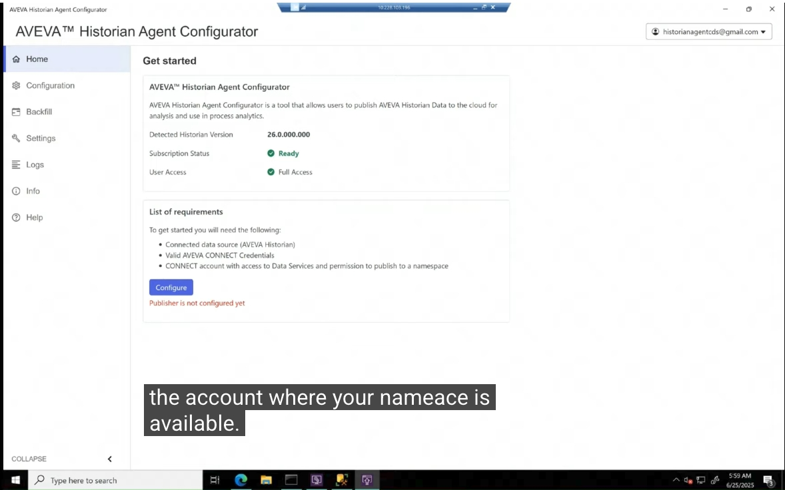

---

## 3. 檢視 Configuration 與 Backfill 頁面狀態

登入成功後，除了 Configure 按鈕，**Configuration** 與 **Backfill** 頁面也一併啟用。要特別注意的是：**Backfill 頁面只有在發布狀態（Publishing Status）為 Active 時才能使用**。此時因為尚未完成設定，Backfill 頁面顯示 **Replication Status: Unconfigured**，並提示「Publishing needs to be active to use backfill」。

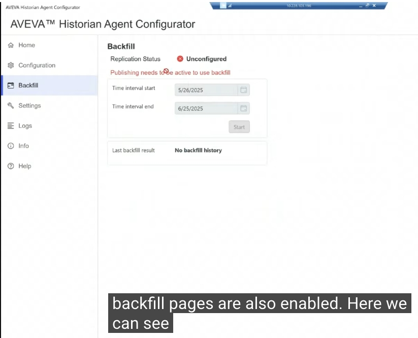

---

## 4. 設定命名空間（Namespace）

點選 **Configure** 按鈕，進入設定流程的第一步：選擇要將所有標籤（Tags）複寫（Replicate）到的目標命名空間。由於 CONNECT Data Services 可部署在多個地區，建議選擇地理位置最接近多數使用者的區域（除非有業務或法規上的其他考量）。

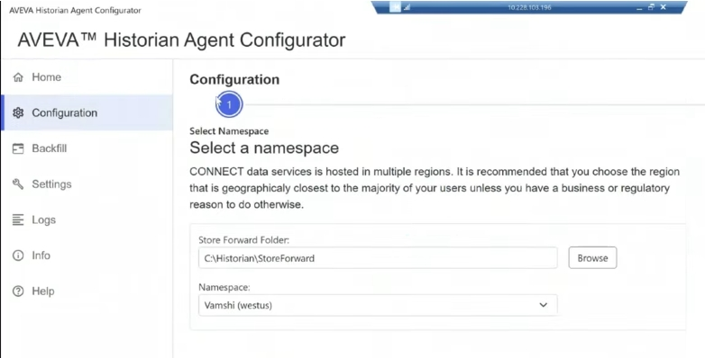

---

## 5. 標籤命名前綴／後綴設定

進入「Pick Tags」頁面後，可以選擇性地為標籤加上**前綴（Prefix）**或**後綴（Suffix）**，以便在 CDS 端區分不同來源的標籤（尤其是不同 Historian 中有相同標籤名稱時，可確保名稱唯一性）。本範例輸入前綴 `DemoTags`。

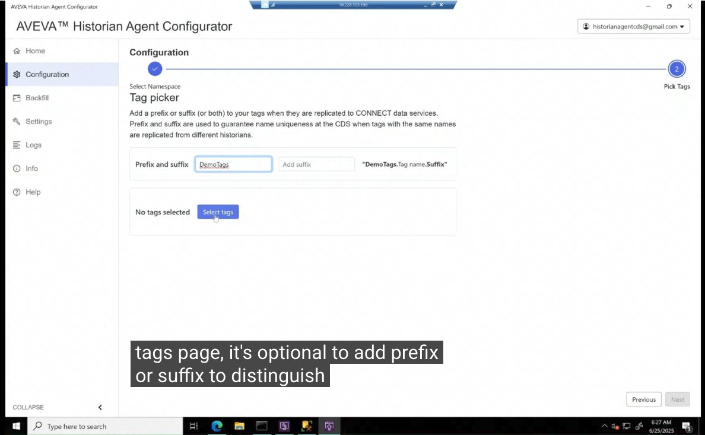

---

## 6. 選擇要發布的標籤

點選 **Select tags** 後，會列出所有可用標籤（本範例共 210 個），使用者可以選擇全部標籤，或透過篩選器（Filter）挑選所需的標籤。

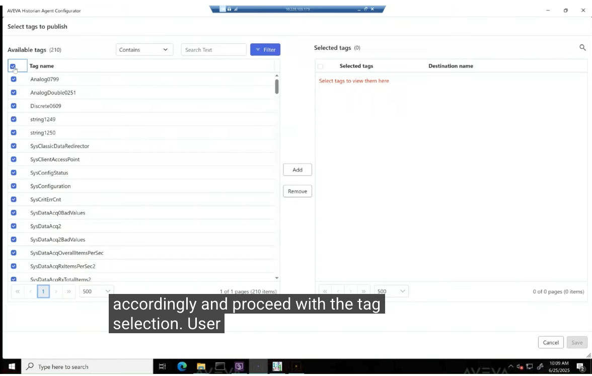

一旦所需的標籤已加入「Selected tags」清單（本範例選取了 4 個標籤：`Analog0799`、`AnalogDouble0251`、`Discrete0609`、`string1249`），即可點選 **Save and Next** 按鈕繼續。

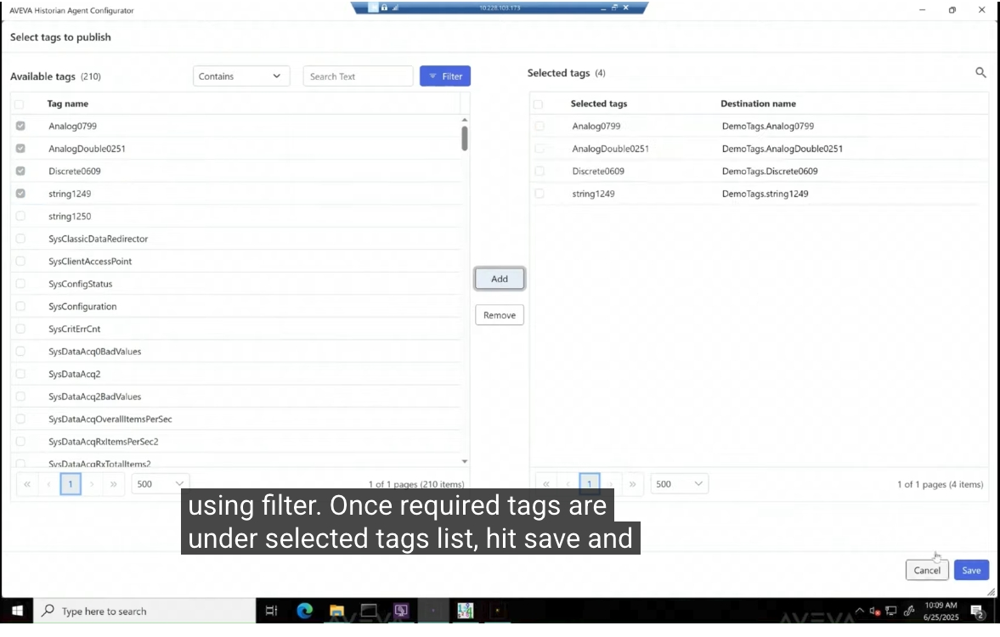

---

## 7. 開始發布（Start Publishing）

回到首頁後，可以看到 **Replication service configuration（複寫服務設定）** 區塊，此時狀態顯示為 **Checking...**，且 **Start Publishing** 按鈕已可使用。點選該按鈕即可將標籤複寫至 CONNECT Data Services。

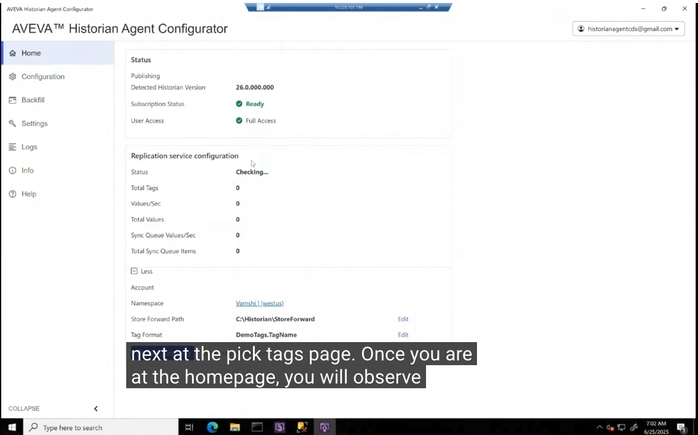

當所有必要的服務都已啟動並執行後，狀態訊息會轉變為 **「Publishing is in progress.」**，並可以看到目前正在執行的所有服務，包括 Supervisor、System Platform Adapter、Replication Configuration 及 Replication 等，狀態皆為 **Running**。

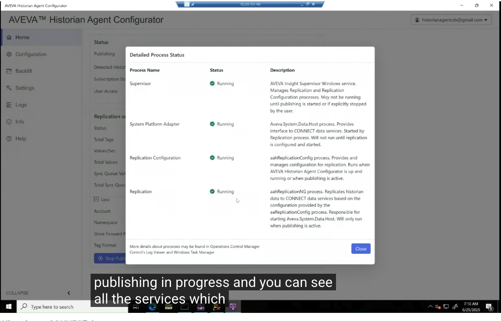

---

## 8. 在 CONNECT Data Services 驗證資料

此時可以到 CONNECT Data Services 驗證標籤是否已存在、資料是否正在被複寫。在 **Sequential Data Store** 中搜尋 `DemoTags*`，可以看到剛才設定的 4 個標籤（`DemoTags.string1249`、`DemoTags.Discrete0609`、`DemoTags.AnalogDouble0251`、`DemoTags.Analog0799`）皆已成功建立。

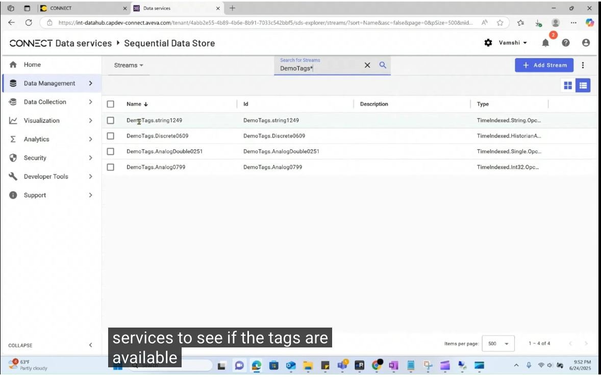

接著在 **Trend（趨勢圖）** 頁面檢視資料，可以確認資料確實正在順利複寫至 CONNECT Data Services。

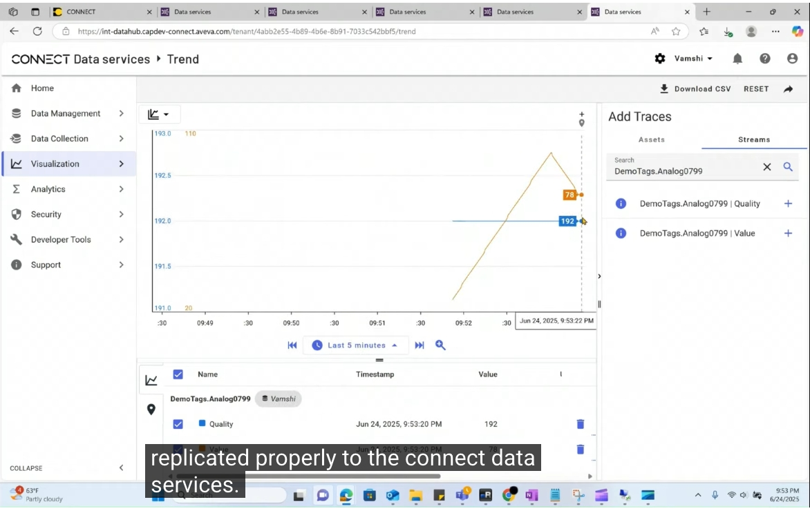

---

## 9. Backfill（資料回補）頁面

由於發布狀態已為 Active，此時 **Backfill** 頁面已可使用，使用者可以輸入起始與結束時間區間，針對已選取的標籤進行資料回補。本範例先進行一個基本測試，選擇 2 至 3 天的區間進行回補（`5/26/2025` 至 `6/25/2025`）。

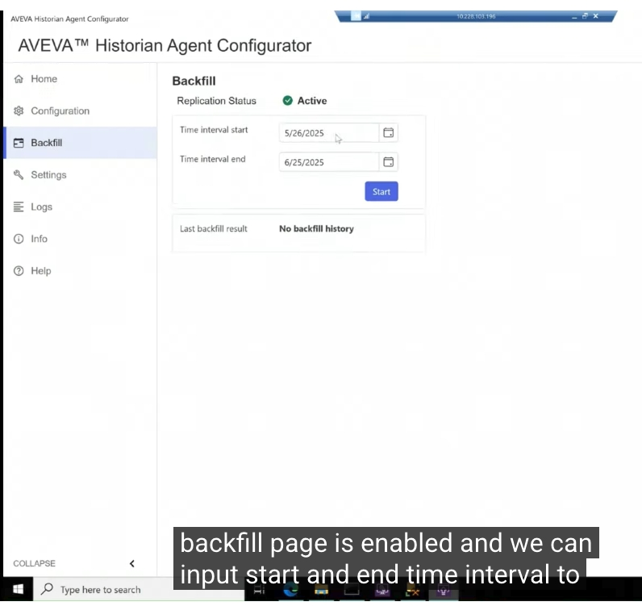

在開始回補之前，先回頭檢視過去的日期，確認在 CDS 上，所有已複寫標籤在這些日期皆尚未有資料。

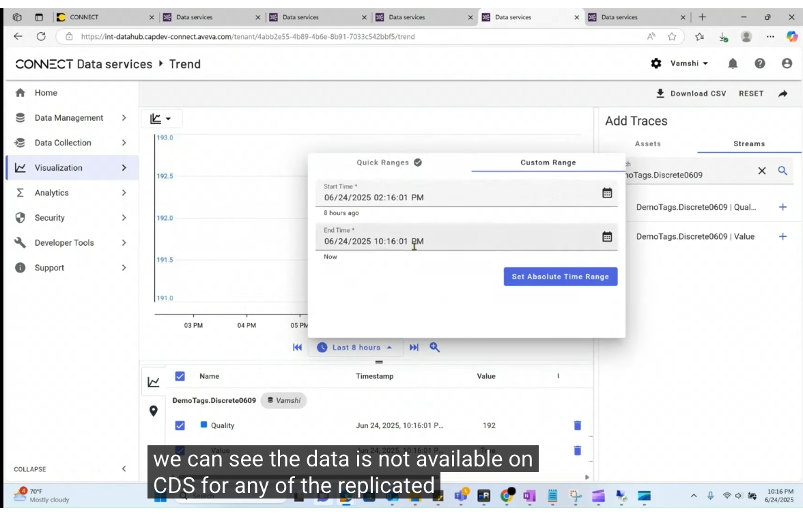

點選 **Start** 按鈕啟動回補工作後，切換回首頁即可看到**同步數值（Sync Values）每秒更新**，以及**待處理的同步佇列項目總數（Total Sync Queue Items）**。當同步佇列項目歸零時，即代表複寫工作已成功完成。

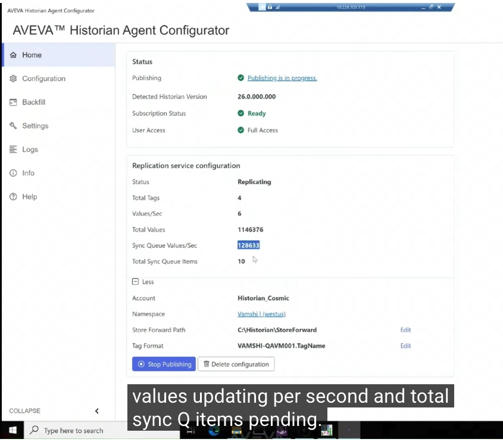

回補完成後，再次至 CDS 確認選定日期範圍內的資料是否已存在；並額外檢查回補範圍以外的日期，確認該處確實沒有其他資料，其餘標籤的驗證結果也相同，確認回補成功。

---

## 10. 取消回補工作（Cancel Backfill）

最後展示如何取消正在進行的回補工作：選擇一段時間區間並啟動後，點選 **Cancel** 按鈕即可取消。取消後，畫面會顯示錯誤訊息「**Backfill canceled**」，且回補結果（Last backfill result）顯示為 **Canceled**。

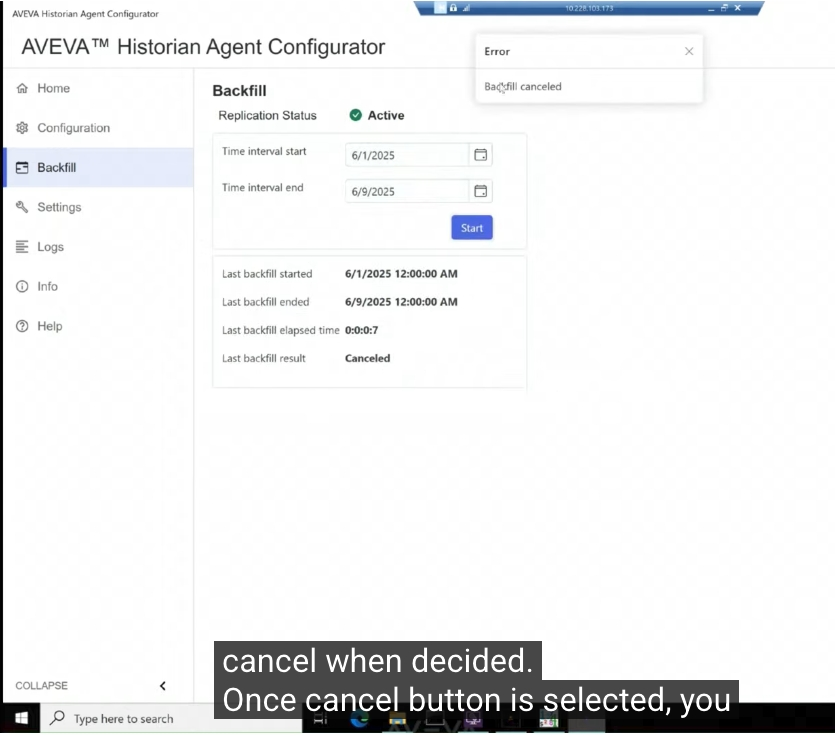

回到 CDS 確認回補進度：依日期範圍篩選後，可以看到僅有 2 天份的資料被回補，這是因為回補工作在完成約 20% 進度（處理了 2 個歷史區塊，History Block）時就被取消，其餘標籤的結果也相同。

---

## 11. 查看回補歷史紀錄檔

結束示範前，最後檢視位於本機的 **backfill-history.txt** 檔案，其中記錄了所有執行過的回補工作。此檔案位於 Historian 的 CDS Publisher 目錄下。

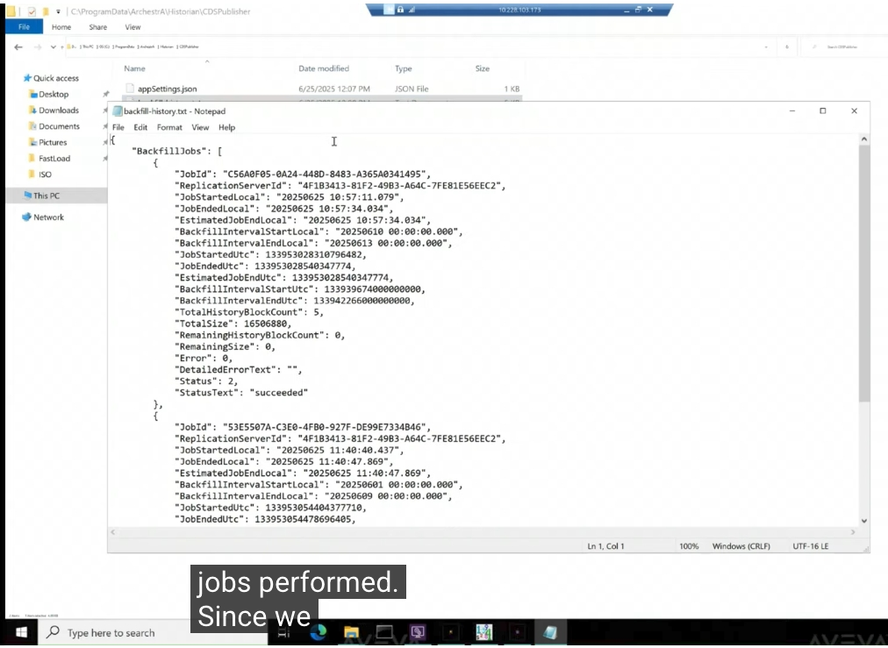

由於本次示範共執行了兩次回補工作，開啟檔案後可以看到：第一筆工作（Job ID）狀態顯示為 **「succeeded」**，第二筆工作則因中途取消而顯示為 **「canceled」**，並可看到詳細的開始/結束時間、回補區間、歷史區塊數量等完整記錄。

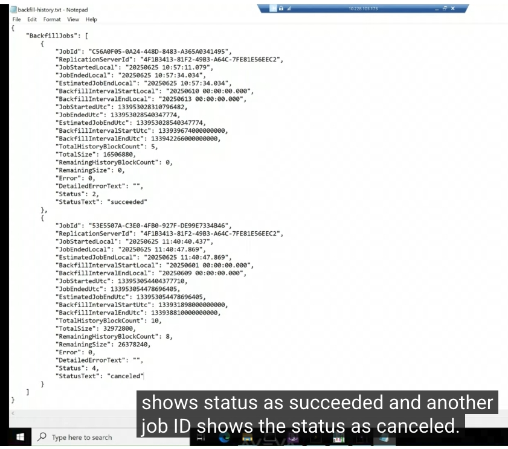

---

## 小結

透過 AVEVA Historian Agent，使用者可以在幾個簡單步驟內：

1. 使用 CONNECT 帳號登入並選擇命名空間
2. 選取要複寫的標籤，並視需要加上前綴／後綴以確保名稱唯一
3. 一鍵啟動發布（Start Publishing），將既有 Historian 資料即時串流至 CONNECT Data Services
4. 於 CDS 端即時驗證標籤與資料是否正確複寫
5. 使用 Backfill 功能，針對指定時間區間回補歷史資料，並可隨時取消進行中的工作
6. 透過本機的 `backfill-history.txt` 記錄檔，追蹤所有回補工作的執行結果

以上即為 AVEVA Historian to CONNECT Agent 的完整操作教學。
