# How It Works：AVEVA System Platform 元件深度解析

> 影片來源：[How It Works: AVEVA System Platform Components Deep Dive](https://www.youtube.com/watch?v=VbKD7PqkfL4&list=PLJq4rR8tWINyOrvwxbIjRvgTtoyuuEfSz&index=8)

## 簡介

本影片完整介紹構成 **AVEVA™ System Platform** 的各項元件與用戶端（Clients），包括 Application Server、Operations Management Interface（OMI）、Historian、Historian Client 等。內容也說明每個元件與用戶端在開發與執行專案時所扮演的角色，涵蓋物件分散部署（Object Distribution）能力，以及資料的收集、儲存、擷取與視覺化呈現。

---

## 1. System Platform 概觀

所有 AVEVA System Platform 軟體產品皆建構於業界標準與 Microsoft 技術之上，例如 Windows、.NET、SQL Server、IIS 等。System Platform 的元件與用戶端提供了開發、執行、監控與視覺化應用程式所需的完整框架與工具，並可整合存取來自軟體應用程式與第三方資料來源、控制器的所有外部資料。

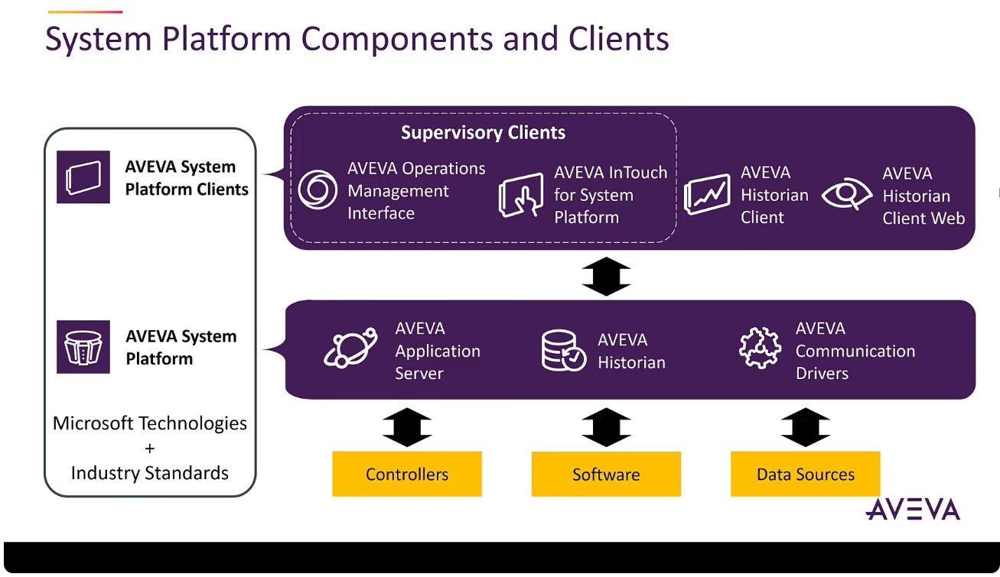

System Platform 主要由以下產品組成：**AVEVA Application Server**、**AVEVA Historian**、**AVEVA Communication Drivers**，以及對應的各種用戶端（Clients）。

---

## 2. AVEVA Application Server：System Platform 的核心

**AVEVA Application Server** 是 System Platform 的核心，提供建立、管理與部署應用程式所需的服務與工具。

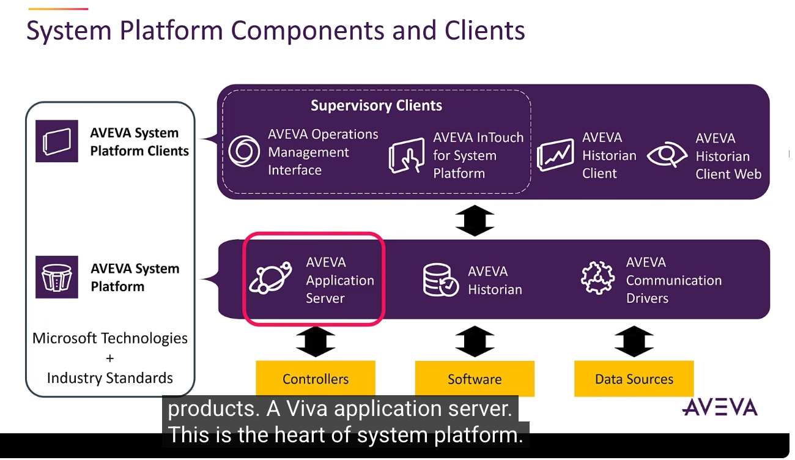

以 Application Server 建立的應用程式稱為 **Galaxy（銀河系）**。使用者可以基於物件導向框架（Object-Oriented Framework），從內建的範本（如 Default Galaxy、Blank Galaxy、InTouch Base、Reactor Demo 等）建立新的 Galaxy。

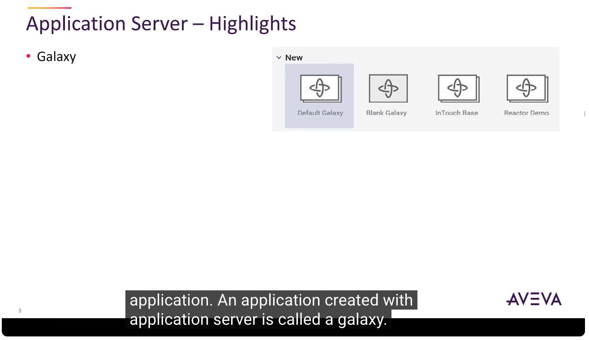

Application Server 讓使用者能將專案組裝成由多個個別物件所構成的架構，這些物件代表廠區與應用程式的不同部分——從工廠的某個區域或分區，到現場的每一項設備（例如閥門、儲槽、幫浦等）。專案中幾乎所有的元件，都可以在 Galaxy 中被建模為物件。

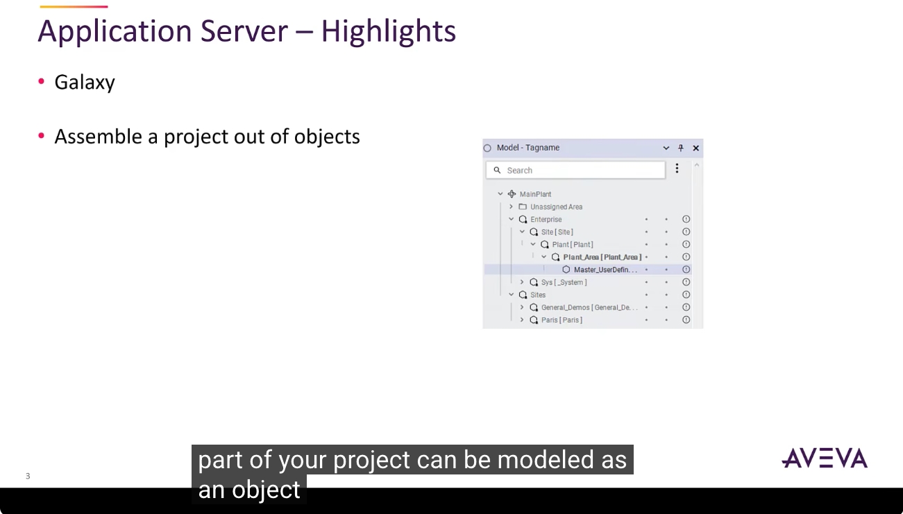

透過點選式介面（Point-and-Click Interface），使用者可以輕鬆建立、設定並管理物件；同時也能透過與 .NET Framework 的整合、特別是強大的腳本引擎（Scripting Engine），進一步擴充與強化應用程式的功能。

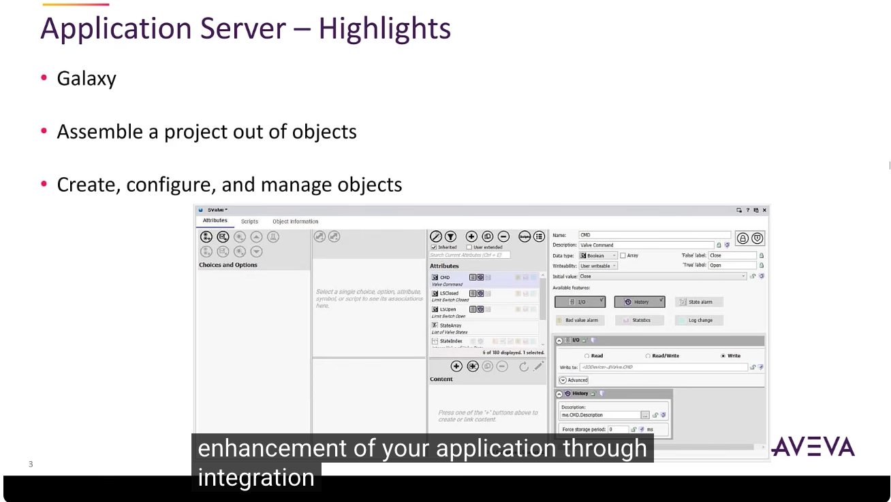

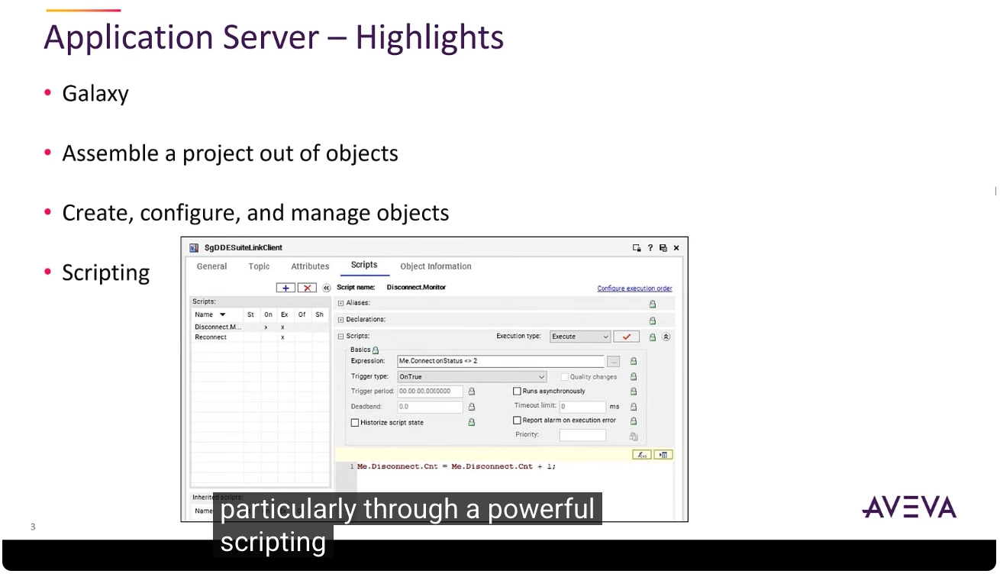

---

## 3. Application Server 的分散式部署能力

以 Application Server 建立的應用程式天生就具備**分散式部署（Distribution）**能力。從單一電腦擴展至多節點的網路化環境，只需要將要納入專案的電腦建模，並將應用程式的負載分散到這些電腦上即可。這項功能同時也讓使用者能輕鬆建立與部署**備援（Redundant）**架構。

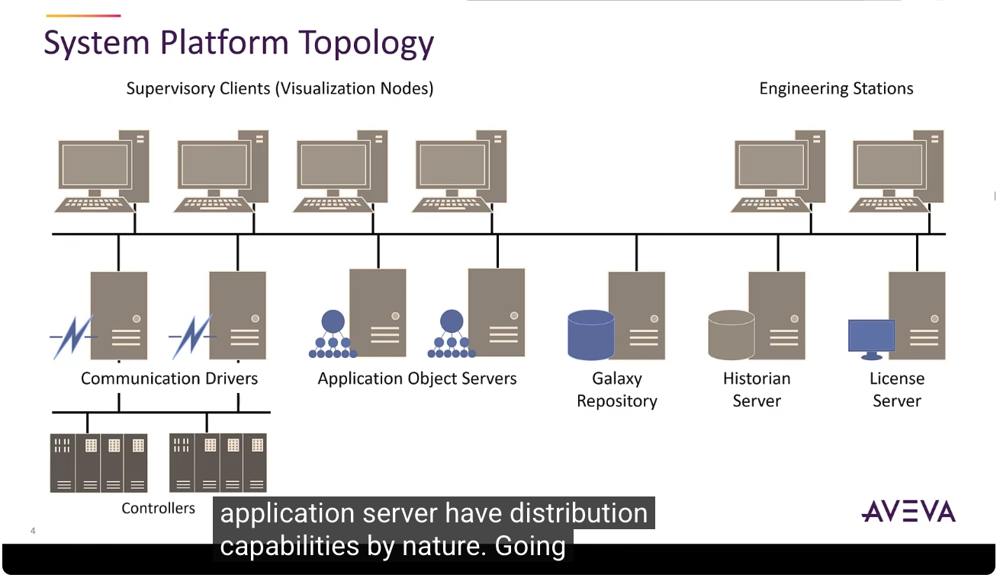

---

## 4. Application Server 的主要特性與優點

Application Server 的主要特性與優點包括：

- 透過腳本引擎搭配 .NET 能力提供**可擴充性（Extensibility）**
- 提供建模方式的**物件導向框架（Object-Oriented Framework）**，用於建立與管理應用程式
- 原生支援 **DDE、SuiteLink、OPC**，可存取 AVEVA 與第三方驅動程式（如 OI 伺服器與舊有 I/O 伺服器）
- 應用程式的**備援（Redundancy）**能力
- **安全性功能**，防止使用者在開發與執行環境中進行未經授權的操作
- **多使用者開發環境（Multi-user Development Environment）**
- 隨附即可使用的**圖形庫（Graphic Libraries）**，其中一套專為建立情境感知（Situational Awareness）HMI 而設計
- **自我文件化（Self-documenting）**的物件
- 提供**版本控管與診斷工具**，方便應用程式的故障排除

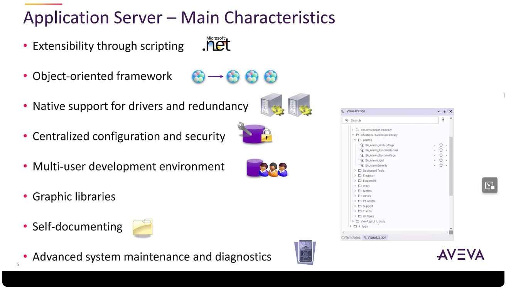

---

## 5. AVEVA Historian：製程資料歷史化

接著介紹 **AVEVA Historian**，它為 Application Server 提供製程資料歷史化（Process Data Historization），以及警報與事件記錄（Alarm and Event Logging）功能，並可透過 SQL Server 或 OData（Open Data Protocol）介面（或兩者兼具）對外開放資料。

Historian 銜接了即時、高流量的廠區監控環境，與開放且具彈性的商業資訊環境之間的落差，並與 Microsoft SQL Server 緊密結合。

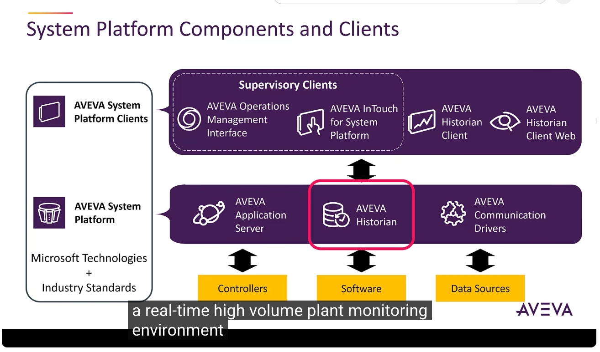

Historian 從高速 I/O 伺服器、DA 伺服器、OI 伺服器、Application Server 及其他裝置擷取廠區資料，同時也能從其他 AVEVA 軟體（如 Edge、Plant SCADA、InTouch HMI）擷取資料。它會將資料壓縮並儲存，並回應 SQL 資料查詢請求。此外，Historian 也包含事件、警報摘要、設定、安全性、備份與系統監控等資訊。

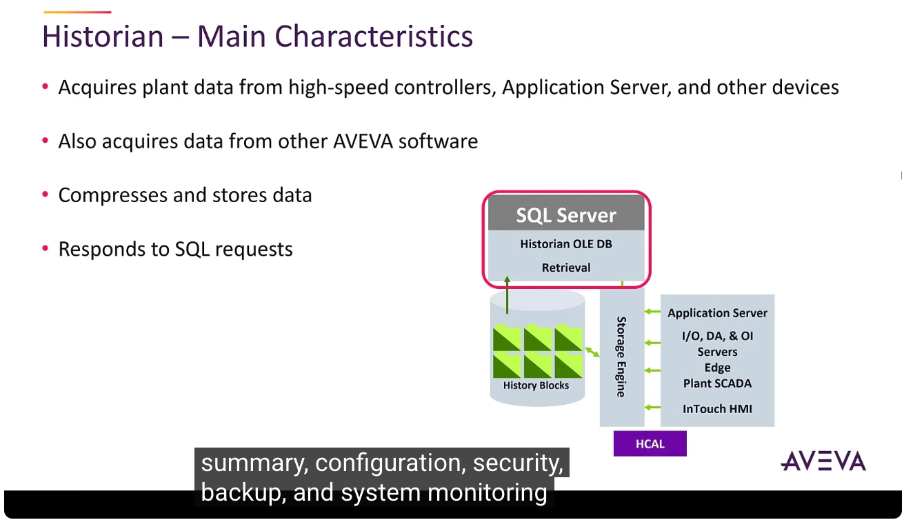

---

## 6. AVEVA Communication Drivers：通訊驅動程式

**AVEVA Communication Drivers** 用於與第三方控制器進行通訊，這些驅動程式來自 OI 伺服器以及（若有需要）舊有的 DA 與 I/O 伺服器。System Platform 同時也能與第三方驅動程式（如 OPC 伺服器）搭配運作。

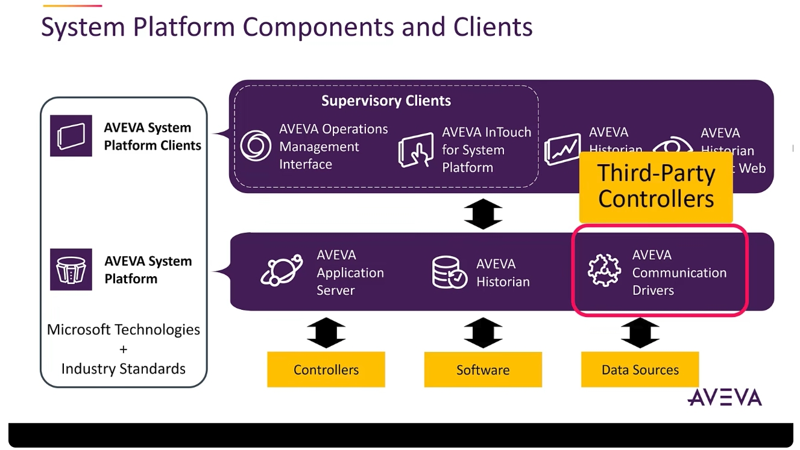

---

## 7. System Platform 用戶端：監控用戶端（Supervisory Clients）

System Platform 的用戶端整體上負責存取 System Platform 的資訊，主要包含兩種視覺化的監控用戶端（Supervisory Clients）：

- **Operations Management Interface（OMI）**：基於物件導向、快速設計的視覺化框架
- **AVEVA InTouch for System Platform**：基於 InTouch HMI 軟體

這兩個元件可以在同一個 System Platform 方案中共存，並共用相同的內容圖形（Content Graphics）。它們負責執行操作員介面，並提供對 Application Server 資料、警報與事件的即時存取能力。

此外，OMI 與 InTouch for System Platform 皆各自提供**網頁版用戶端（Web Client）**，作為軟體的一部分，讓使用者能立即透過瀏覽器存取監控用戶端，並支援多種常見瀏覽器。

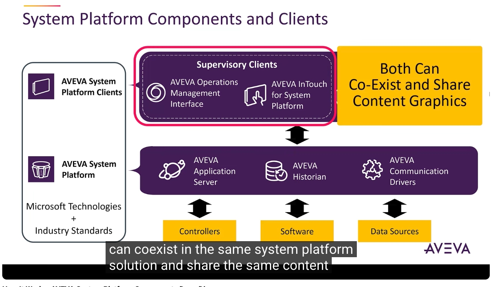

---

## 8. AVEVA Historian Client：歷史資料存取工具集

接下來是 **AVEVA Historian Client**，它是一套用於存取 Historian 中歷史資料的工具集合，包含：

- 功能豐富的**趨勢圖應用程式（Trend Application）**
- 可透過點選式介面建立 SQL 查詢的**查詢應用程式（Query Application）**
- 透過 Microsoft Excel 與 Word 附加元件產生的**報表功能**

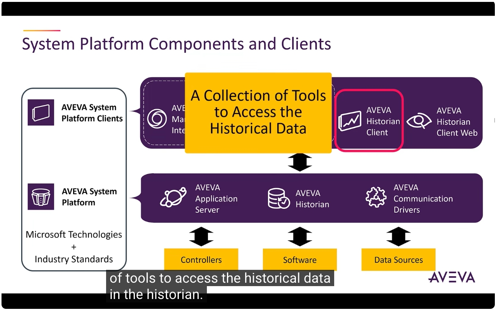

---

## 9. AVEVA Historian Client Web：網頁版歷史資料用戶端

最後是 **AVEVA Historian Client Web**，這是 Historian 的網頁版用戶端，也就是 **AVEVA Insight** 的地端（On-premises）版本，讓使用者能以多種格式即時存取生產資料。

它提供簡單易用的圖形化介面，用於分析資料、建立圖表，以及彙整相關資訊的儀表板（Dashboard）。與網頁版監控用戶端相同，Historian Client Web 也支援多種常見瀏覽器。

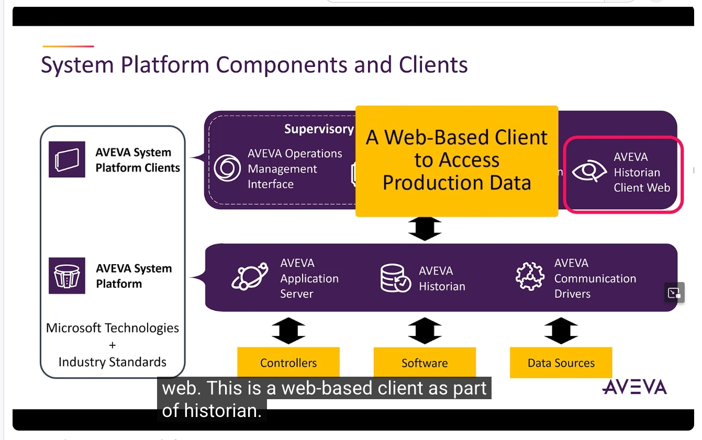

---

## 小結

AVEVA System Platform 由以下核心元件與用戶端所構成：

1. **AVEVA Application Server**：系統核心，採物件導向架構，支援分散式部署、備援、腳本擴充與多使用者協作開發
2. **AVEVA Historian**：負責製程資料、警報與事件的歷史化儲存，並透過 SQL Server / OData 對外開放
3. **AVEVA Communication Drivers**：串接第三方控制器與資料來源
4. **監控用戶端（OMI / InTouch for System Platform）**：提供即時操作員介面，並各自具備網頁版用戶端
5. **AVEVA Historian Client / Historian Client Web**：分別提供桌面端與網頁端的歷史資料查詢、趨勢分析與報表工具

以上即為 AVEVA System Platform 元件與用戶端的完整介紹教學。
