# 使用 Assets 將 Historian 資料發布至 CONNECT

> 影片來源：[Publish Historian data to CONNECT with Assets](https://www.youtube.com/watch?v=Xq4NuX5W7v4&list=PLJq4rR8tWINyOrvwxbIjRvgTtoyuuEfSz&index=9)

## 簡介

本教學說明如何將 System Platform 的 **Galaxy 模型（Galaxy Model）** 匯出至 **CONNECT Data Services**，並且不僅複寫標籤資料，還能同時將對應的**資產（Assets）** 模型一併發布上雲，讓使用者能在 CONNECT 上以階層式資產結構檢視與分析資料。

---

## 1. 新增複寫伺服器（Replication Server）

首先，我們要將 System Platform 的 Galaxy 模型匯出至 Data Services。在 **Operations Control Management Console (OCMC)** 中，於 Historian 底下的 **Replication Servers** 節點按右鍵，選擇 **New Replication Server...**。

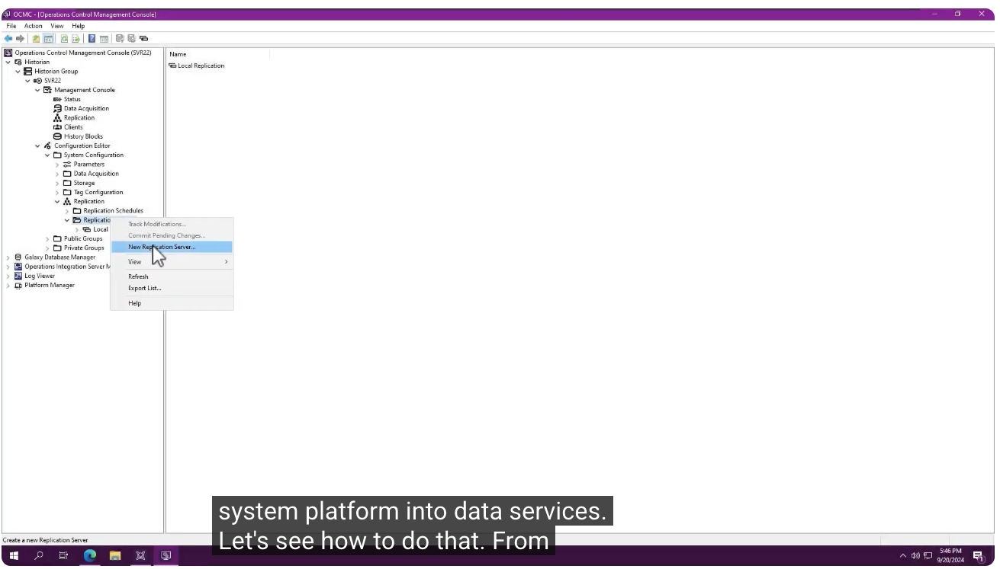

在彈出的「New Replication Server」對話框中，將 **Replication Environment** 選擇為 **CONNECT data services**，並輸入節點名稱（本範例輸入 `Buffalo`）。

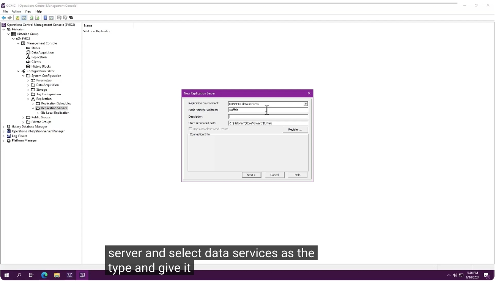

---

## 2. 登入 CONNECT 並註冊

點選 **Register** 按鈕後，系統會彈出 CONNECT 的登入視窗，輸入帳號密碼進行登入。

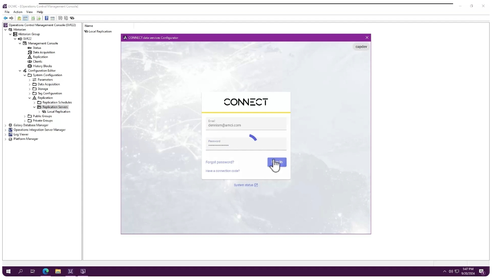

登入成功後，從可用的命名空間（Namespace）清單中選擇（本範例為 `PLP4EM (northeurope)`），再次點選 **Register**，即可建立 Historian 與 Data Services 之間的**信任連線（Trusted Connection）**。

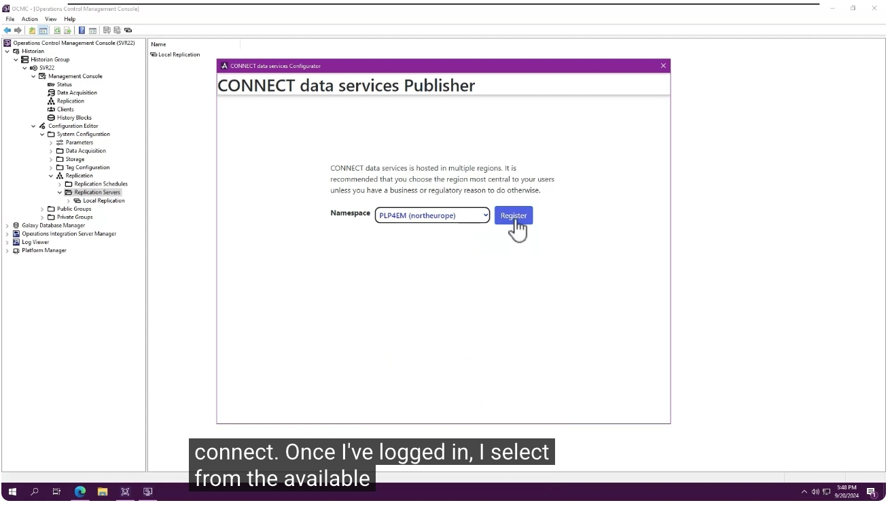

註冊完成後，畫面會顯示「Registration process completed successfully!」，並列出 Client ID 與 Namespace 等註冊資訊。

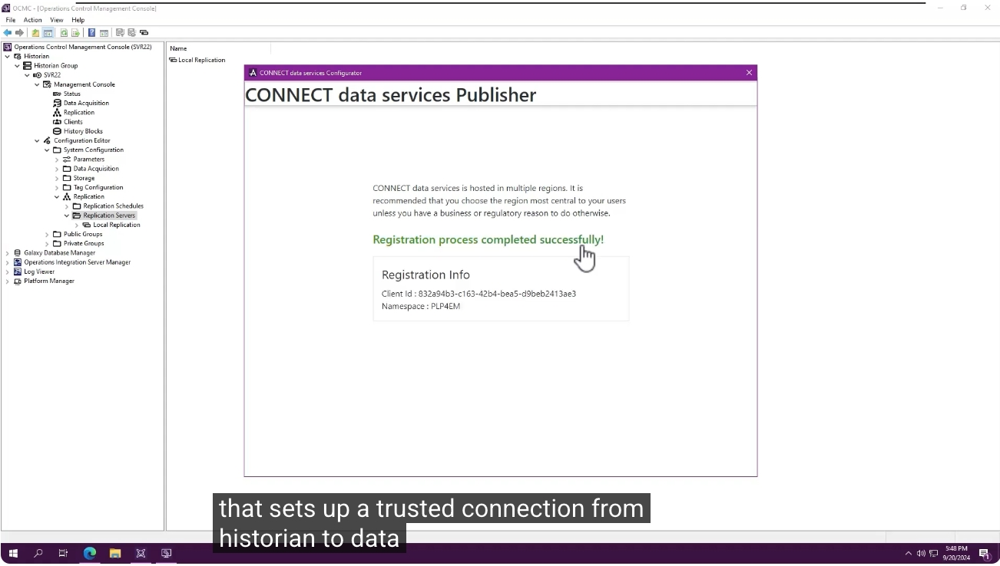

---

## 3. 設定調校選項（Tuning Options）

回到 New Replication Server 對話框，此時可以看到已經帶入命名空間與 Client ID 等連線資訊，點選 **Next** 繼續。

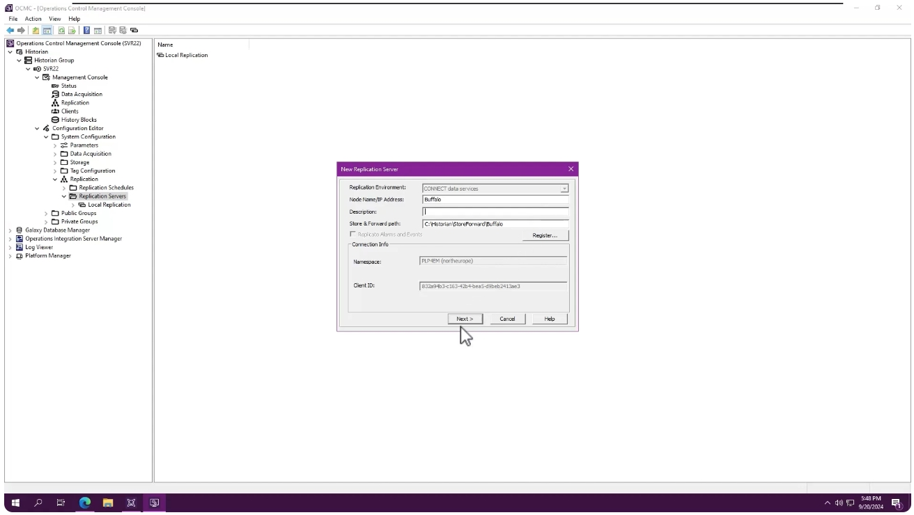

下一步會看到一些調校選項（Tuning Options），包括預設的命名方式（Naming Scheme）等，本範例保留系統預設值，直接點選 **Finish** 完成設定。

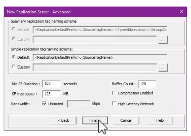

---

## 4. 新增標籤（Add Tags）

複寫伺服器設定完成後，即可開始新增標籤。在該伺服器節點下按右鍵，選擇 **Add Multiple Tags...**。

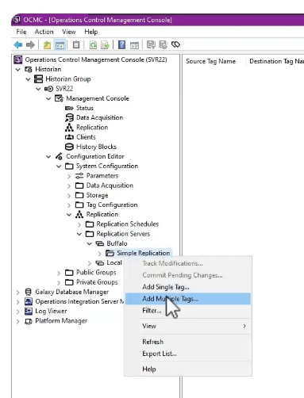

在彈出的「Add Multiple Tags - Step 1」對話框中，輸入萬用字元（Wildcard）條件（例如 `B_00`）進行搜尋，找出符合的標籤（Found Tags），並將它們加入右側的目標標籤（Target Tags）清單中，可依需要重複此步驟多次。

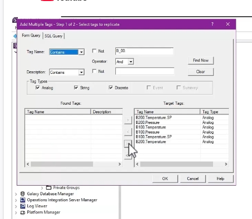

---

## 5. 預覽並套用複寫設定

所有標籤都加入後，會進入「Step 2 - Create replicated tags」，此時可以預覽目的地串流名稱（Destination Tag Name），若有需要可手動編輯，接著點選 **Apply**。

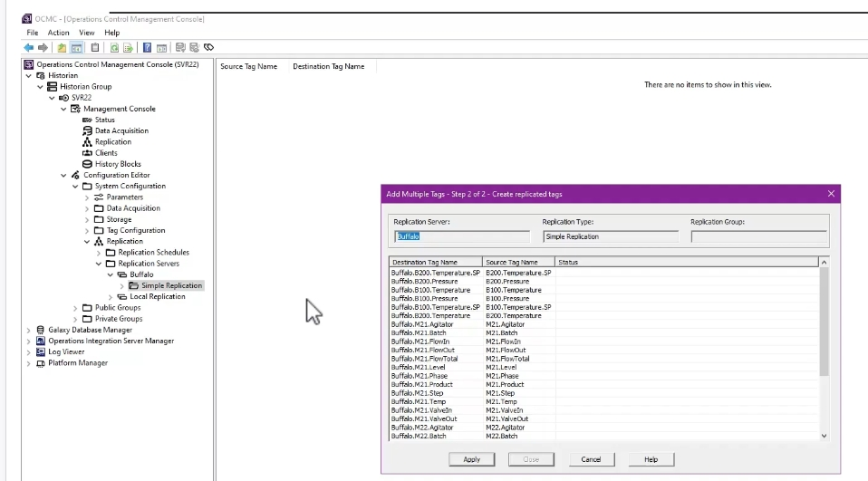

套用完成後，回到主畫面即可看到完整的來源標籤名稱（Source Tag Name）與目的地標籤名稱（Destination Tag Name）對照清單。

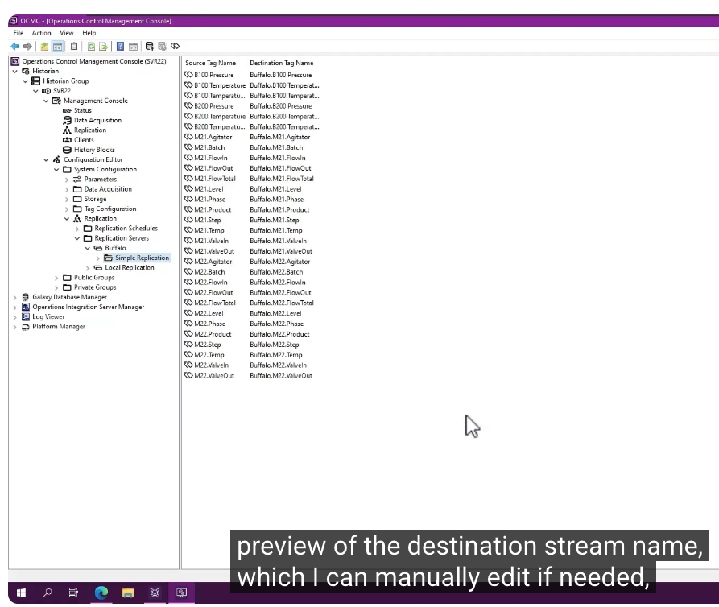

最後，在該節點上按右鍵選擇 **Commit Pending Changes...**，以提交（Commit）所有變更，完成整個設定流程。

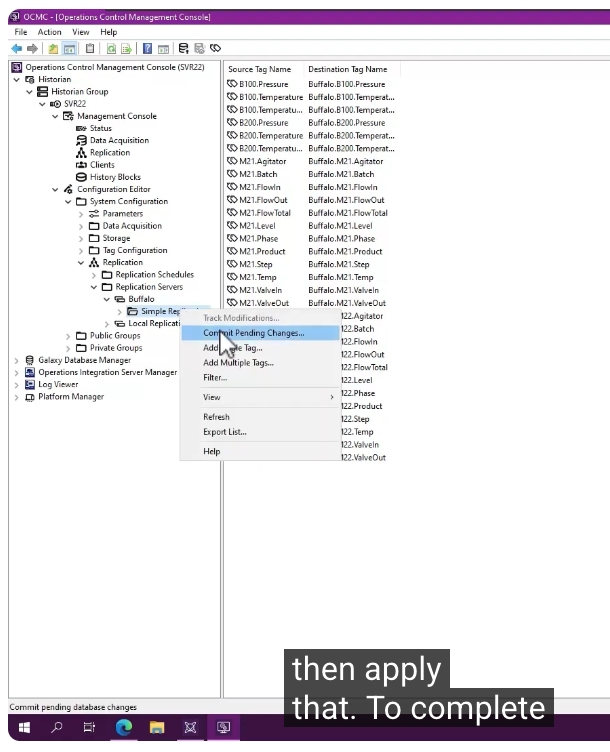

---

## 6. 於 Data Services 驗證串流

切換至 **CONNECT Data Services**，在 **Sequential Data Store** 中可以看到剛才設定的所有串流（Streams）皆已成功建立。到目前為止，這個流程與過去版本的操作方式相同。

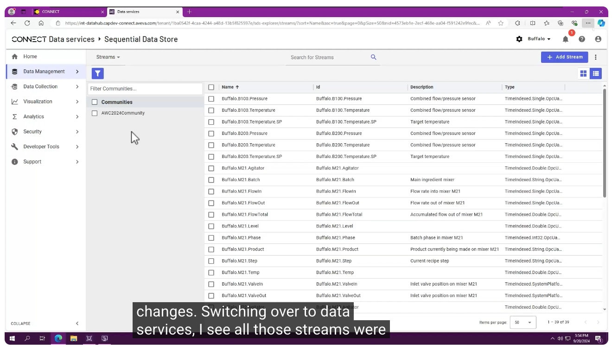

---

## 7. 檢視符合 Galaxy 模型的資產清單

不過現在還可以看到一份**扁平化的資產清單（Flat List of Assets）**，這些資產對應 Galaxy 模型，並帶有完整的屬性設定。在 **Asset Explorer** 中選擇某個資產（例如 `B100`），即可於右側檢視其中繼資料（Metadata），包含 `_ParentId`、`DataSource`、`Version` 等資訊。

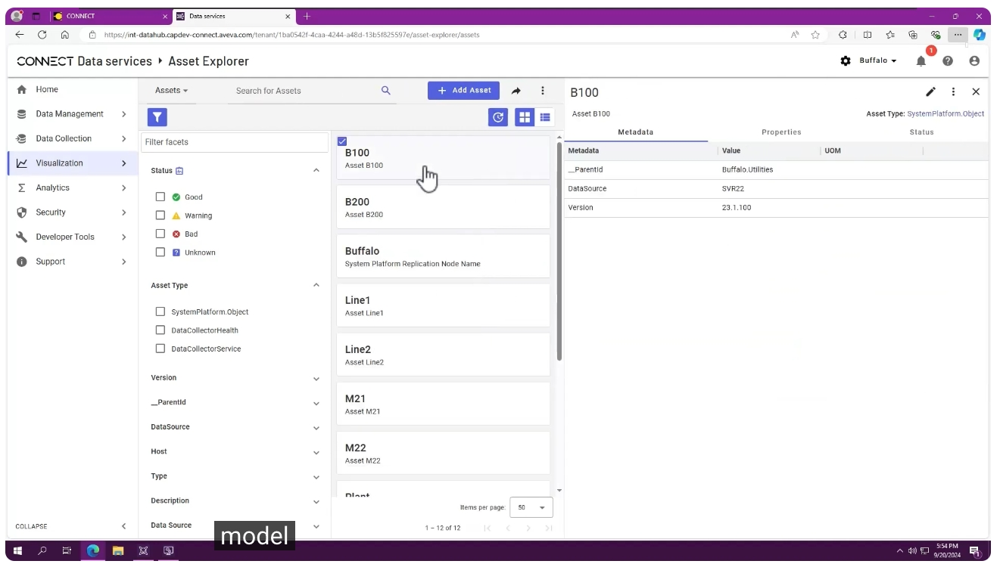

選取資產後，也可以直接檢視其相關屬性的即時數值與趨勢圖（Trend）。選擇較短的時間區間，會讓趨勢變化更加明顯。此外，也可以在 Historian 上執行工具程式，將較舊的歷史資料回補（Backfill）至 Data Services。

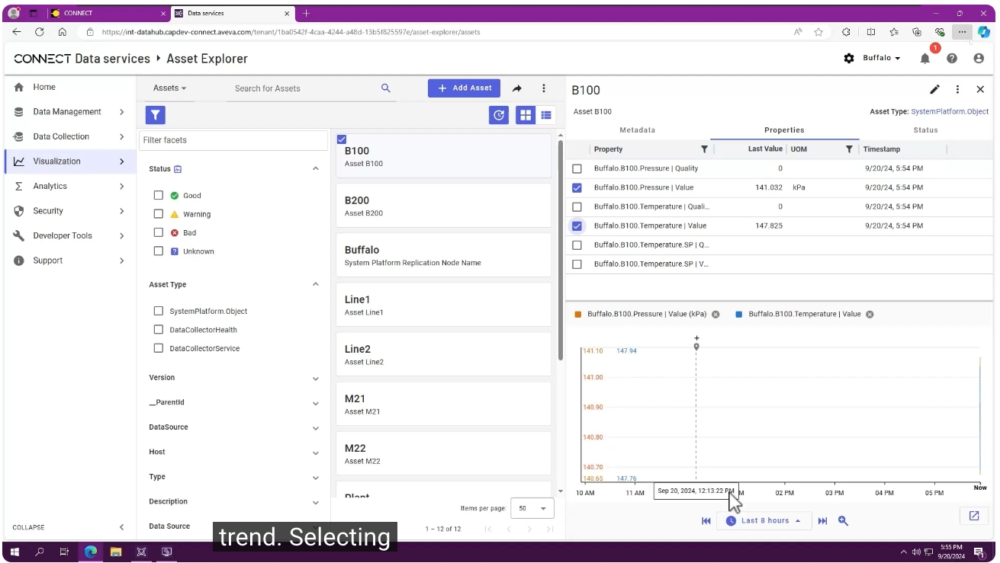

---

## 8. 於 Visualization 檢視階層式資產結構

切換至 **Visualization**（視覺化）頁面，可以看到這些資產以**階層式（Hierarchical）**方式呈現，例如 `Buffalo` > `Plant` > `Utilities` / `Wet` > `Line1` / `Line2` 等結構，完整反映了 Galaxy 模型中的組織架構。

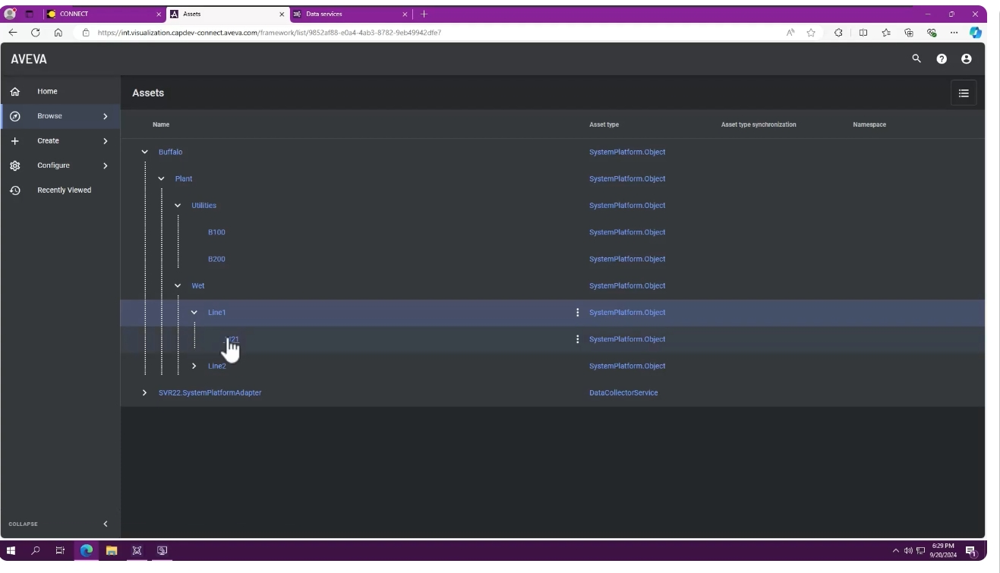

---

## 9. 檢視自動產生的資產頁面

選擇其中一個資產（例如 `M21`），即可看到系統**自動產生的資產頁面**，內容包含 Info（基本資訊）、Attributes（屬性）、Status Board（狀態看板，顯示各屬性目前數值與趨勢走勢）以及 Associated Content（相關內容）等區塊。

這個預設檢視畫面可以依照實際需求輕鬆自訂，但即使是預設畫面，也已經相當實用——整個流程就是這麼簡單。

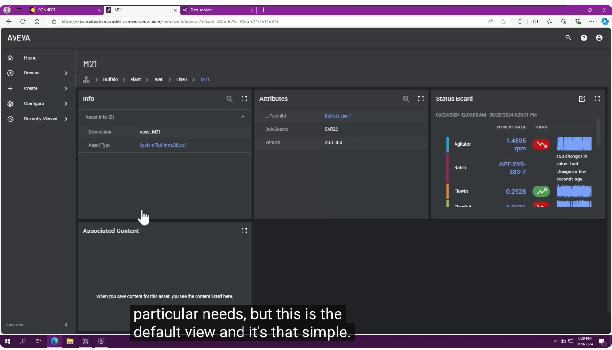

---

## 小結

透過本教學展示的流程，使用者可以：

1. 在 OCMC 中新增指向 CONNECT Data Services 的複寫伺服器，並完成登入與命名空間註冊
2. 保留預設調校選項，快速完成複寫伺服器的進階設定
3. 使用萬用字元批次搜尋並新增標籤，預覽並套用目的地串流名稱
4. 提交變更後，即可在 Data Services 的 Sequential Data Store 中確認串流已建立
5. 除了標籤串流外，同時取得對應 Galaxy 模型的**扁平化資產清單**，並可檢視屬性、趨勢與中繼資料
6. 在 Visualization 中以**階層式資產結構**瀏覽，並直接開啟自動產生、且可自訂的資產頁面

以上即為「使用 Assets 將 Historian 資料發布至 CONNECT」的完整操作教學。
