# 精通 AVEVA™ System Platform 的部署模型（Deployment Model）

> 影片來源：[Mastering the Deployment Model in AVEVA™ System Platform](https://www.youtube.com/watch?v=LQtvNRI3HZw&list=PLJq4rR8tWINyOrvwxbIjRvgTtoyuuEfSz&index=10)

## 簡介

本影片深入探討 AVEVA™ System Platform 中**部署模型（Deployment Model）**的結構，說明 **WinPlatform**、**App Engine** 與 **Area** 物件在部署檢視（Deployment View）中所扮演的角色，並展示自動化物件（Automation Objects）部署後與其執行電腦之間的對應關係。內容涵蓋 WinPlatform 物件、App Engine、View Engine 與 Web View Engine，以及在部署 Galaxy 過程中這些元件的設定與功能，並概略介紹容納關係（Containment Relationships），以及應用程式、裝置整合物件（Device Integration Objects）與 Area 在 Galaxy 中的執行方式。

---

## 1. 部署模型概觀

**部署檢視（Deployment View）** 顯示自動化物件在部署後，與其所執行電腦之間的對應關係。Galaxy 中的每一台電腦，都是以一個 **WinPlatform** 物件來代表；這些平台會承載（Host）Galaxy 中分散部署於不同電腦上的其他物件，這種安排方式即稱為**部署模型（Deployment Model）**。此檢視會顯示 Galaxy 中所有的自動化物件實例（Instance），但不包含範本（Template）。

在此模型中，**WinPlatform 物件為最上層物件**，負責承載各種引擎（Engine）。

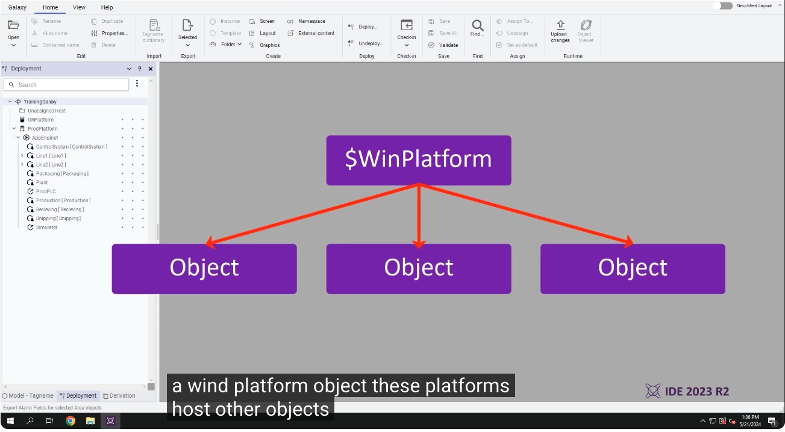

---

## 2. WinPlatform 承載的引擎與物件類型

每一種引擎會承載不同類型的物件：

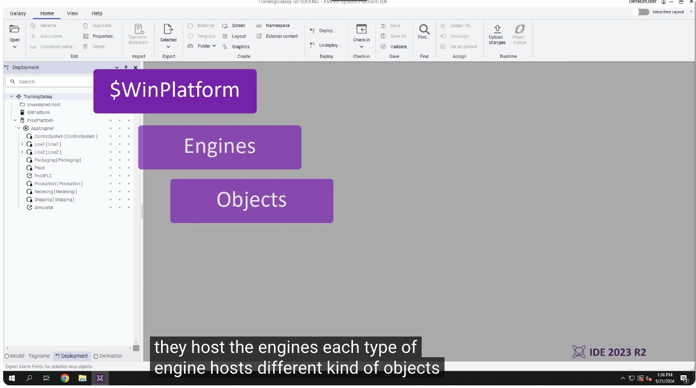

- **App Engine**：承載 Device Integration 物件，以及已指派應用程式物件的 Area
- **View Engine**：承載視覺化應用程式，例如供 OMI 應用程式使用的 View App，以及供 InTouch 應用程式物件使用的 InTouch View App
- **Web View Engine**：承載可透過網頁瀏覽器存取的 OMI 應用程式 View App 物件

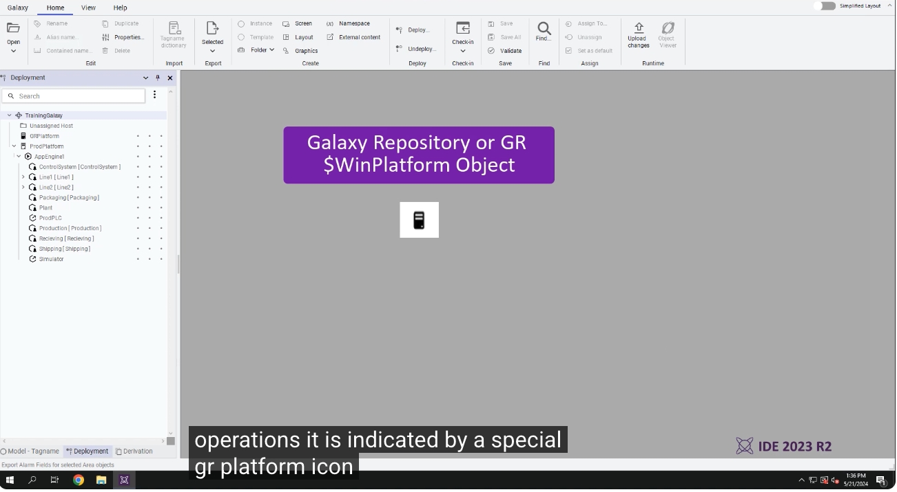

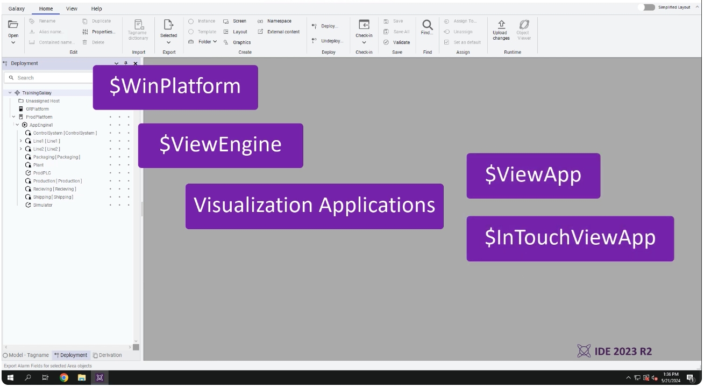

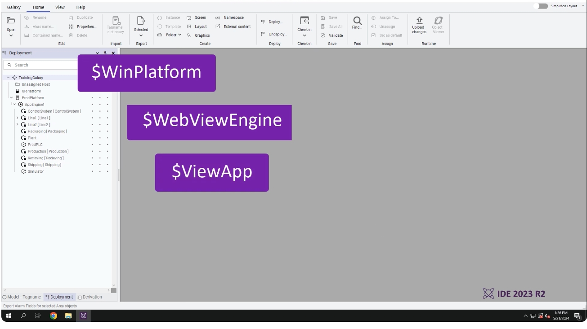

---

## 3. WinPlatform 的角色與功能

**WinPlatform** 是部署到目標電腦上的第一個物件，作為整個部署模型的基礎。它具備以下功能：

- 在 Galaxy 中代表一台電腦
- 監控電腦統計資訊（Computer Statistics）
- 啟動與停止所承載的引擎（Engines）
- 管理跨節點（Off-node）通訊

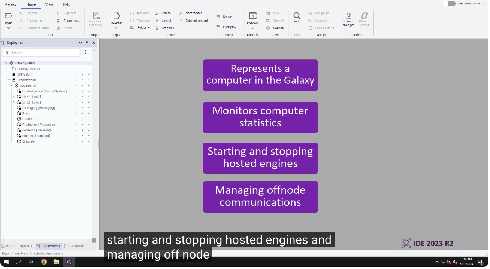

---

## 4. Galaxy Repository（GR）專用的 WinPlatform

進行 **Galaxy Repository（GR）** 相關操作時，需要一個特殊的 WinPlatform 物件實例，此實例會以特殊的 **GR Platform 圖示**標示，且必須先完成部署，才能進行其他任何與部署相關的操作。

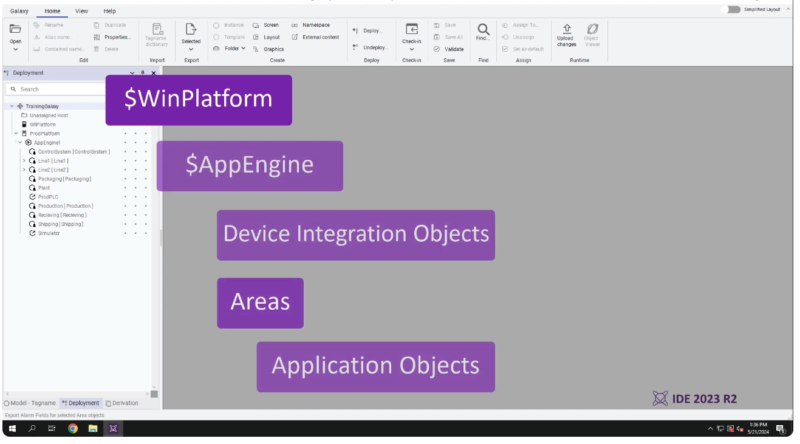

每一個 WinPlatform 實例都需要設定其網路位址（Network Address）；而 Galaxy Repository 平台則會自動以主機 GR 所在電腦的名稱進行設定。電腦的數量決定了部署模型的基礎架構，其餘物件則依照承載關係（Hosting Relationships）分散部署。

此外，部署檢視也會顯示應用程式物件之間的**容納關係（Containment Relationships）**，被容納的物件會在名稱後方以方括號顯示（例如 `Line1 [Line1]`）。

---

## 5. App Engine：主要的執行引擎

**App Engine** 與 WinPlatform 物件並列，是 Galaxy 中主要的執行時期應用程式引擎（Runtime Application Engine）。它負責執行應用程式（Applications）、裝置整合物件（Device Integration Objects）以及 Area。

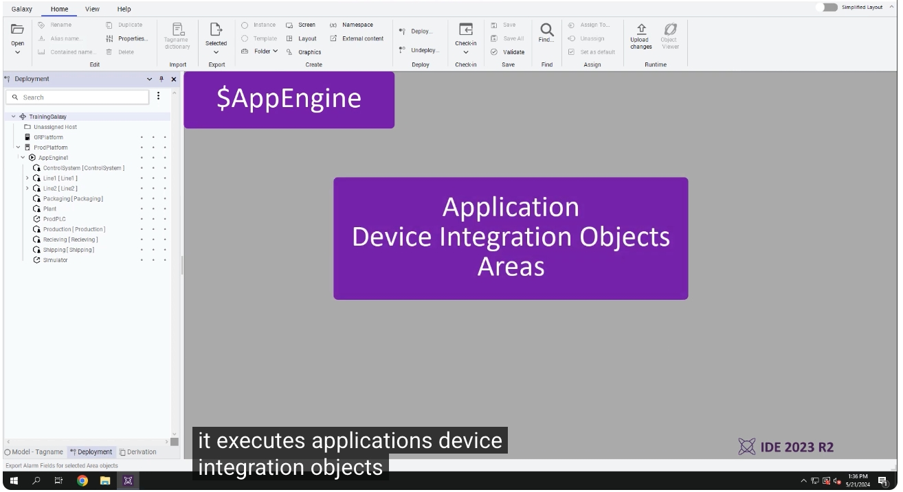

App Engine 的主要功能包括：

- **即時排程驅動執行（Real-time Schedule Driven Execution）**
- 與 **Historian 伺服器**進行通訊
- **備援（Redundancy）**組態設定

App Engine 會以掃描（Scan）為基礎的排程方式，執行所有承載的物件，每次掃描依序逐一執行每個物件一次。而 **Area** 物件則會被指派給這些引擎執行。

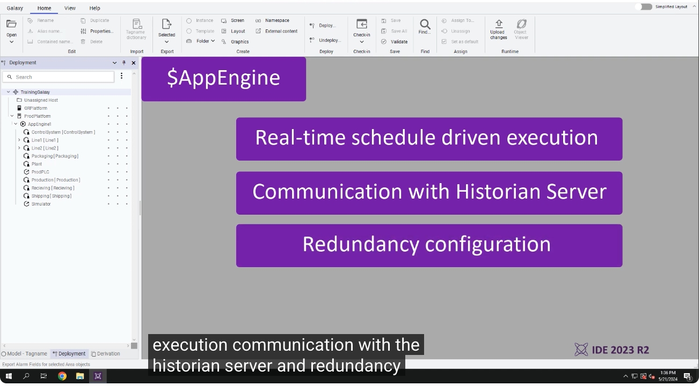

---

## 6. 實際案例：檢視我們的 Galaxy

現在讓我們實際檢視範例中的 Galaxy。這裡有一個 WinPlatform 物件，設定為 **Galaxy Repository（GRPlatform）**；接著還有第二個 WinPlatform 物件，稱為 **ProdPlatform**，設定為承載廠區各個 Area、引擎（Engines）、裝置整合物件與設備（Equipment）。

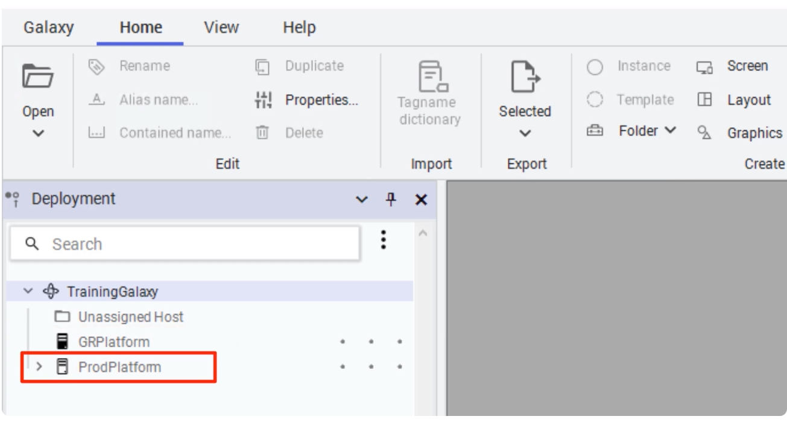

展開 ProdPlatform 底下的 AppEngine1，可以看到其中承載了各個廠區 Area（如 `Line1`、`Line2`、`Packaging` 等），並可再展開至更細緻的設備層級，例如 `Mixer100` 底下的 `Agitator_001`、`Inlet1_001`、`Pump1_001`、`Pump2_001` 等實際設備物件（Equipment）。

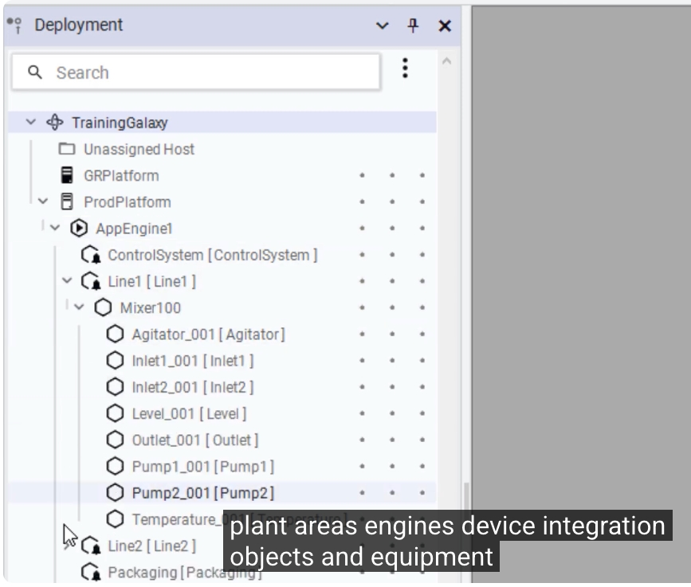

---

## 小結

透過本教學，我們了解到 AVEVA System Platform 部署模型的核心概念：

1. **部署檢視（Deployment View）** 呈現自動化物件與其所執行電腦之間的對應關係，Galaxy 中每台電腦皆對應一個 **WinPlatform** 物件
2. WinPlatform 承載不同種類的**引擎（Engine）**：App Engine、View Engine、Web View Engine，各自承載不同類型的物件
3. WinPlatform 是部署至目標電腦的第一個物件，具備代表電腦、監控狀態、啟停引擎、跨節點通訊等功能
4. **Galaxy Repository 專屬的 WinPlatform** 需以特殊 GR 圖示標示，且必須優先部署
5. **App Engine** 是主要的執行時期引擎，以排程掃描方式執行應用程式、裝置整合物件與 Area，並具備 Historian 通訊與備援能力
6. 實際 Galaxy 範例展示了 GRPlatform 與 ProdPlatform 兩個 WinPlatform，以及其下承載的 Area、引擎與設備物件的完整層級結構

以上即為「精通 AVEVA System Platform 部署模型」的完整教學內容。
