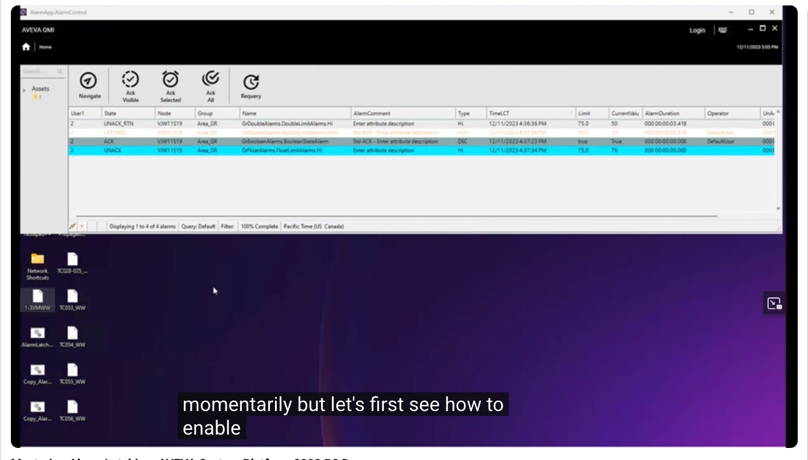
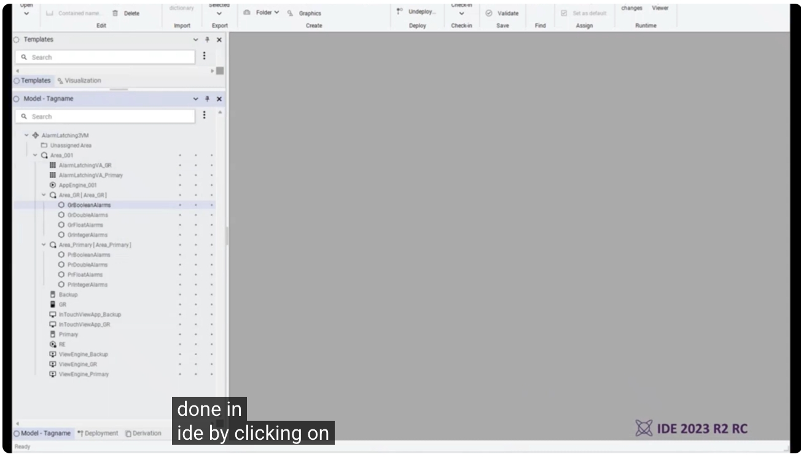
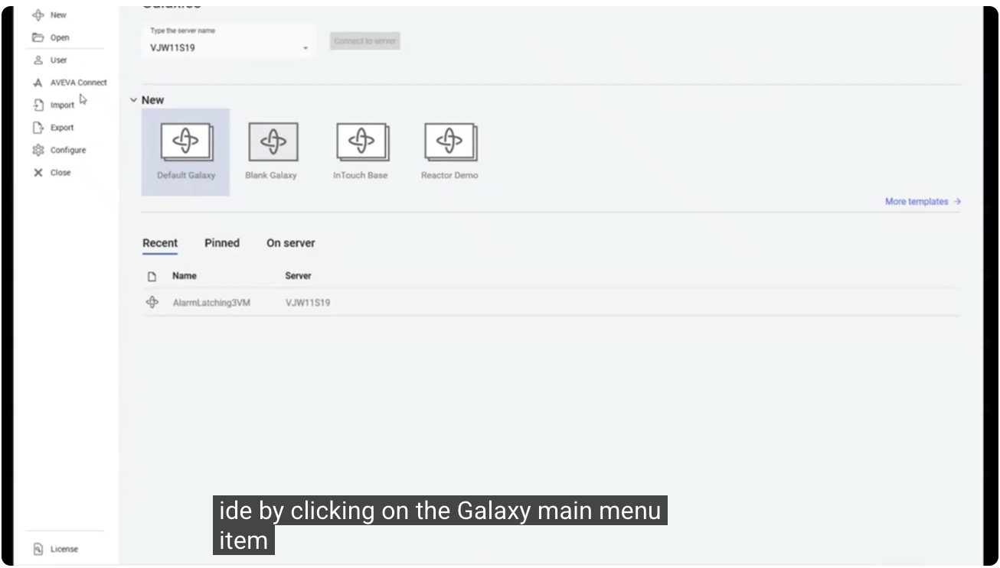
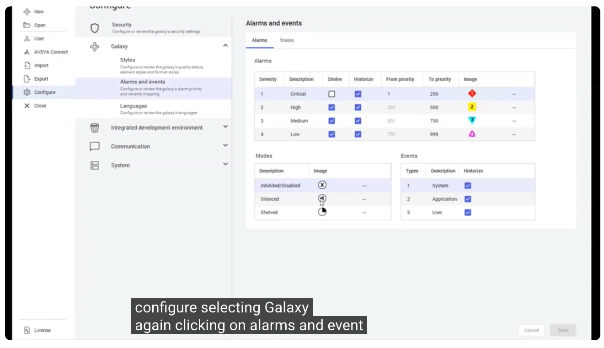
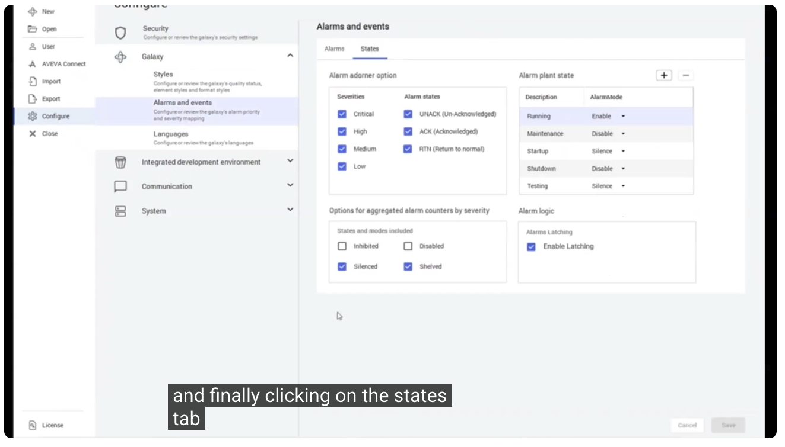
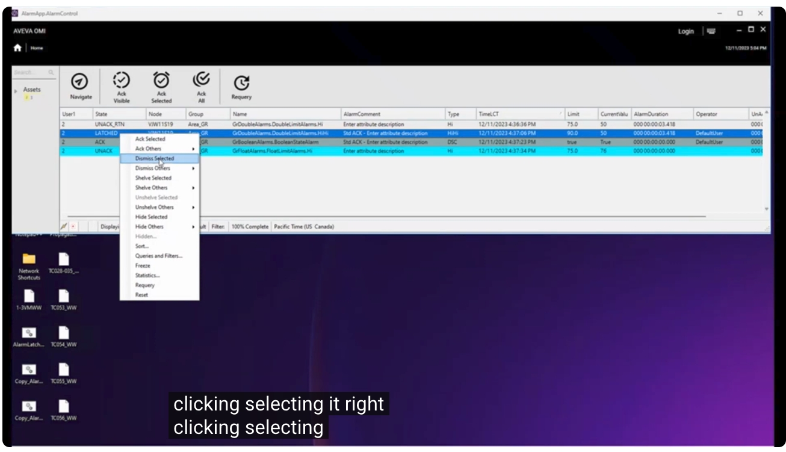
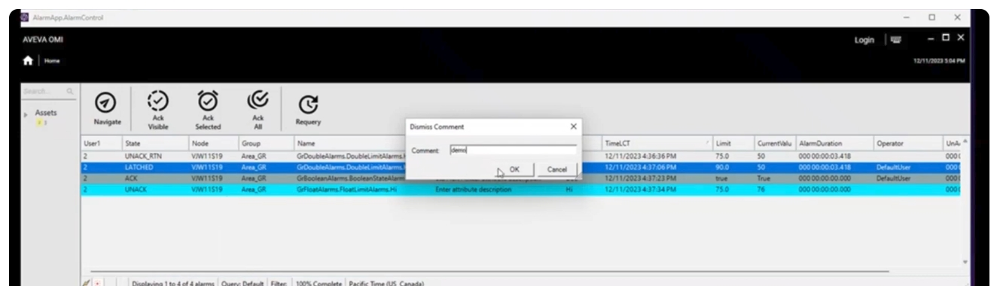
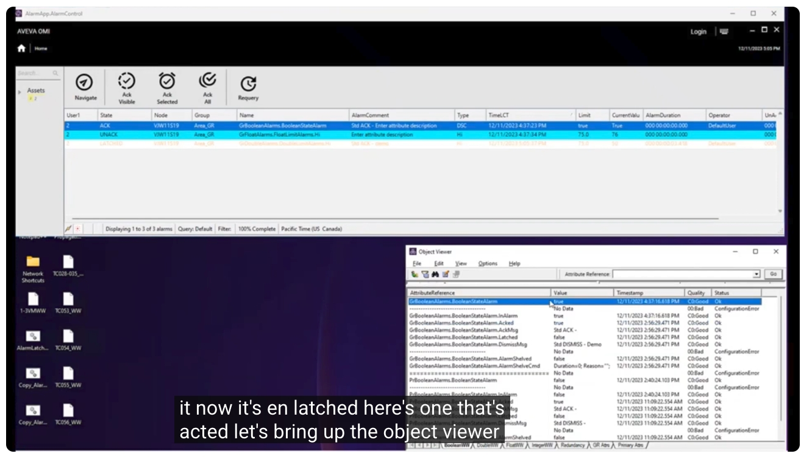
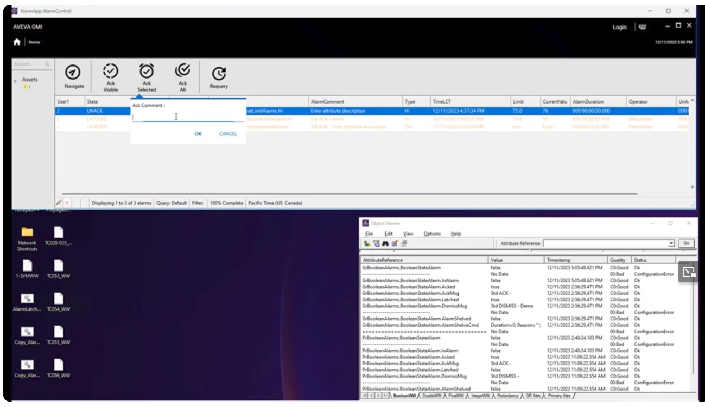

# 精通警報鎖存（Alarm Latching）：AVEVA System Platform 2023 R2 示範

> 影片來源：[Mastering Alarm Latching: AVEVA System Platform 2023 R2 Demo](https://www.youtube.com/watch?v=lE6D4qHUMRA&list=PLJq4rR8tWINyOrvwxbIjRvgTtoyuuEfSz&index=12)
>
> 延伸閱讀：[AVEVA System Platform what's new in 2023 R2](https://www.youtube.com/results?search_query=AVEVA+System+Platform+what%27s+new+in+2023+R2)

## 簡介

本示範介紹 System Platform 2023 R2 中，因應客戶需求新增的功能——**警報鎖存（Alarm Latching）**。這是一種將警報保留在**警報清單（EAC，Alarm Control）**中，直到使用者明確透過「解除（Dismiss）」動作將其移除為止的機制。執行解除動作後，警報會轉換為 **Acked Returned（已確認並已恢復正常）**狀態，並從 EAC 中移除。

---

## 1. 認識新的鎖存狀態（Latched State）

下圖顯示的 EAC 同時包含既有的警報狀態，以及新的**鎖存（Latched）**狀態：

我們稍後會回來詳細說明這個畫面，但首先來看看如何**啟用警報鎖存功能**。

---

## 2. 開啟 IDE 並進入 Galaxy 設定

啟用警報鎖存的方式，是在 **IDE** 中操作。首先進入 IDE，可以看到目前的 Galaxy 物件模型（Model - Tagname）樹狀結構，包含 `AlarmLatching3VM` 這個 Galaxy 中的各項物件。

接著點選 **Galaxy** 主選單項目，即可看到目前可用的 Galaxy 範本，以及最近使用過的 Galaxy 清單（本範例中的 `AlarmLatching3VM`）。

---

## 3. 設定警報與事件（Alarms and Events）

接著選擇 **Configure（設定）**，再次選擇 **Galaxy**，然後點選 **Alarms and Events（警報與事件）**。在 **Alarms** 頁籤中，可以檢視或修改警報的嚴重程度（Severity）、擱置（Shelve）、歷史化（Historize）以及優先權範圍（From Priority / To Priority）等設定。

最後，切換至 **States（狀態）** 頁籤。在此頁籤中，會發現一個全新的**背景設定項目（Backstage Configuration Item）**，用來啟用或停用警報鎖存功能——也就是位於「Alarm Logic」區塊下的 **Enable Latching** 核取方塊。

在本範例中，此功能原本就已啟用；但當使用者勾選 **Enable Latching** 並儲存後，**整個 Galaxy**（包含已存在的警報）都會啟用警報鎖存功能。

> 💡 若要讓警報進入鎖存（Latched）狀態，使用者必須先**確認（Acknowledge）該警報**，或**讓警報恢復正常（Return to Normal）**。兩者先後順序並不重要——只要警報依序經歷這兩種狀態轉換，且警報鎖存功能已啟用，該警報最終就會轉換為鎖存狀態。

---

## 4. 以最簡單的方式解除（Dismiss）警報

接下來示範最簡單的解除警報方式。在 EAC 中，先以左鍵點選欲操作的警報，再按右鍵，於選單中選擇 **Dismiss Selected（解除已選取項目）**。

選擇後會彈出 **Dismiss Comment（解除註解）** 對話框，輸入註解內容（本範例輸入 `demo`），再點選 **OK**。

完成後，該警報即會轉換回 **Acked Returned** 狀態，並從 EAC 中被移除。

---

## 5. 透過不同路徑將警報轉換為鎖存狀態

接下來示範如何讓各種狀態的警報，都能經由不同路徑轉換至解除（Dismiss）。請記住有兩種方式可以到達鎖存狀態：

1. **先確認（Ack），再恢復正常（Return to Normal）**
2. **先恢復正常，再確認**

以下逐一示範這兩種轉換方式：

- 有一筆警報已經回到「Unacked Returned」狀態，此時執行 **Ack** 操作，使其轉換為鎖存狀態。
- 另一筆警報已經是「Acked」狀態，此時透過 **Object Viewer（物件檢視器）** 手動將其屬性值改為恢復正常（Return to Normal），同樣使其進入鎖存狀態。

- 最後一筆警報則是既未確認，也尚未恢復正常。此時可以選擇先執行 **Ack Selected（確認已選取項目）**，操作時會彈出 **Ack Comment（確認註解）** 對話框，輸入註解內容後確認，接著再讓該警報恢復正常，同樣會轉換為鎖存狀態。

---

## 6. 使用「Dismiss All」一次解除多筆警報

最後展示另一種解除警報的方式：將滑鼠移至 EAC 上方按右鍵，會看到 **Dismiss Others（解除其他項目）** 選項，且此選項提供多種子選項可供選擇——這與 **Ack Others**、**Shelve Others**、**Unshelve Others**、**Hide Others** 等操作所提供的選項類型相同。

在這些子選項中，選擇最簡單的 **Dismiss All（全部解除）**，輸入示範用的註解後確認。此時，畫面上所有三筆警報都會一併轉換為 **Acked Returned to Normal（已確認且恢復正常）** 狀態，並全部從 EAC 中移除。

---

## 小結

**警報鎖存（Alarm Latching）** 功能會在警報經歷**擱置（Shelving）**與**容錯移轉（Failover）**期間，持續保留其數值（Value）、狀態（Status）與品質（Quality）資訊，確保警報記錄的完整性。整理本次示範的重點如下：

1. 警報鎖存功能可在 IDE 的 **Galaxy → Configure → Galaxy → Alarms and Events → States** 頁籤中，透過勾選 **Enable Latching** 啟用，且作用範圍為整個 Galaxy（含既有警報）
2. 警報須先經歷「確認（Ack）」與「恢復正常（Return to Normal）」兩種狀態（順序不拘），才會轉換為**鎖存（Latched）**狀態
3. 使用者可透過 **Dismiss Selected** 或 **Dismiss All** 等操作，將鎖存中的警報明確解除，使其轉為 **Acked Returned** 狀態並自 EAC 中移除
4. 鎖存機制能在擱置與容錯移轉的過程中，完整保留警報的數值、狀態與品質資訊

以上即為 AVEVA System Platform 2023 R2「警報鎖存」功能的完整操作示範教學。
