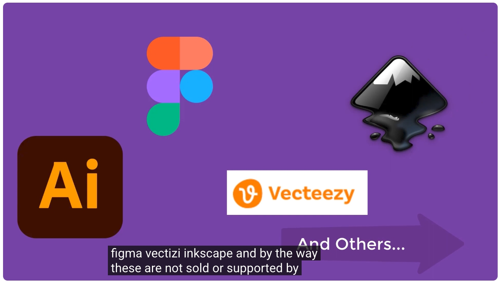
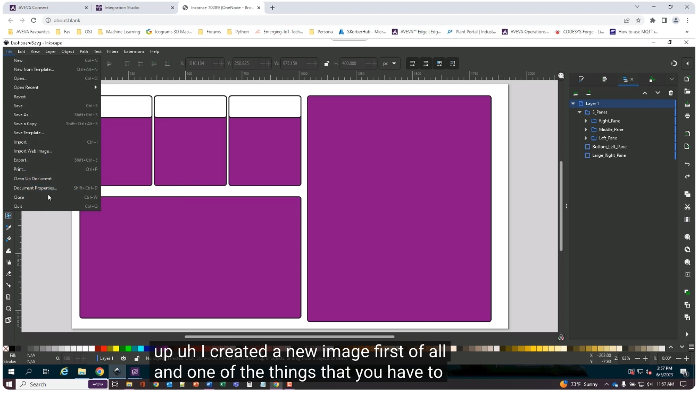
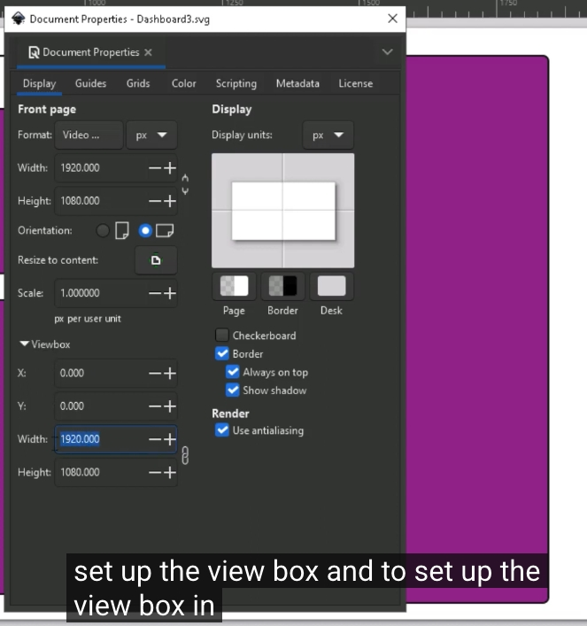
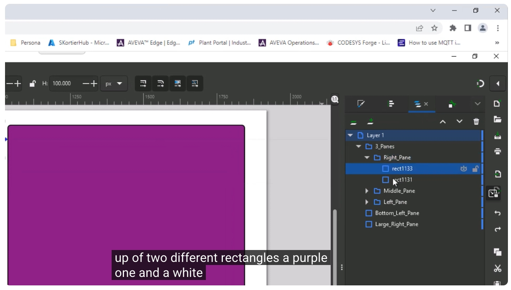
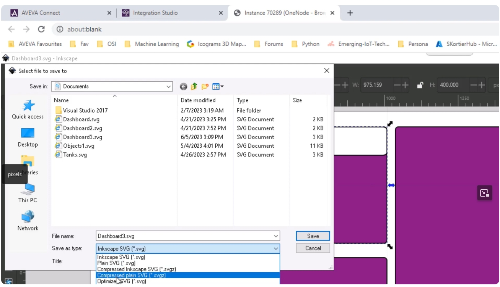
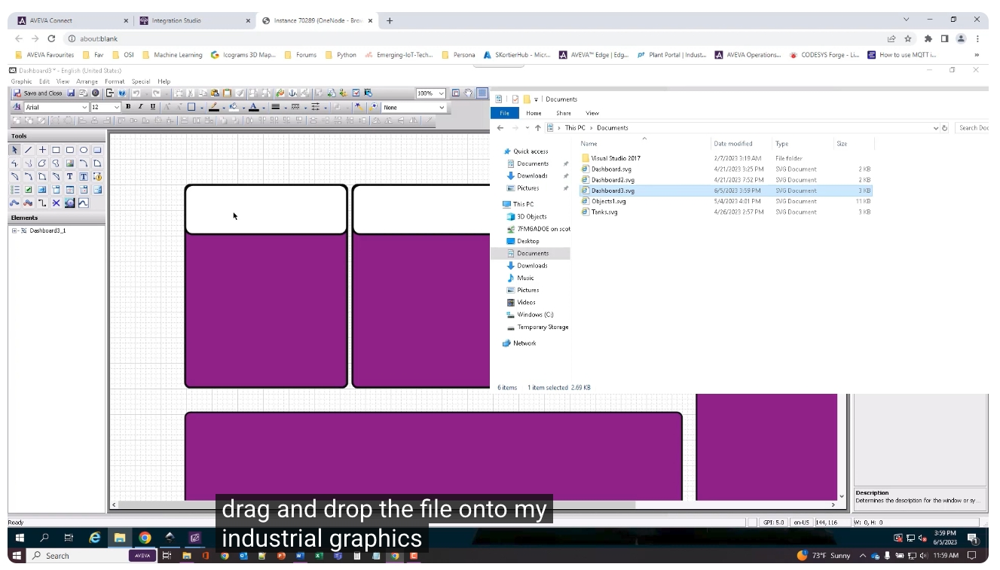
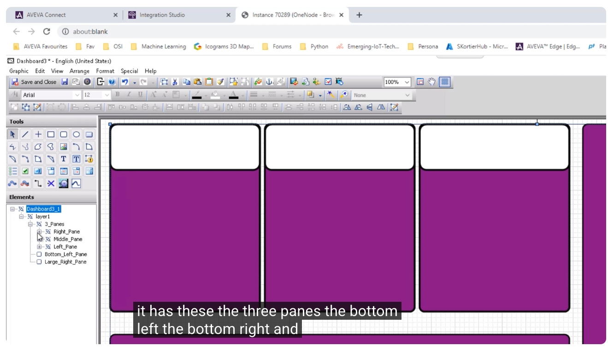
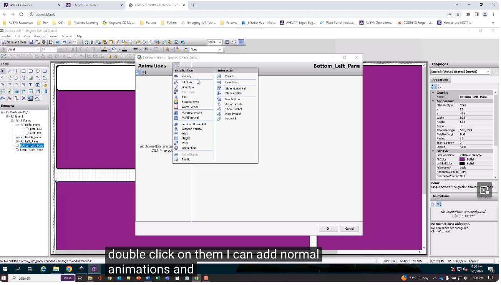

# SVG 匯入並轉換為 AVEVA Industrial Graphics 教學

> 影片來源：[SVG image Import and conversion into AVEVA Industrial Graphics](https://www.youtube.com/watch?v=jTx2tV_BRUI&list=PLJq4rR8tWINyOrvwxbIjRvgTtoyuuEfSz&index=15)
> 講者：Scott Cortier（AVEVA）

本教學說明如何使用第三方向量繪圖軟體（如 Adobe Illustrator、Figma、Vecteezy、Inkscape 等）繪製 SVG（Scalable Vector Graphics，可縮放向量圖形），再將其匯入 AVEVA InTouch HMI 2023 Patch 1（以及即將推出的 AVEVA Edge 2023）的 Industrial Graphics 編輯器中，轉換為原生的 Industrial Graphics 物件並進行動畫設定。

---

## 一、為什麼要使用 SVG？

AVEVA 新推出的 SVG 匯入工具，可將 SVG 向量圖形直接轉換為原生的 Industrial Graphics 物件，帶來以下優點：

- **向量 vs 點陣**：SVG 是以數學方式定義圖形（向量），而非個別像素（點陣），因此可以任意縮放而不會失真、不會出現鋸齒或模糊。
- **善用第三方設計工具**：許多系統整合商（System Integrator）與客戶會委託專業的第三方設計團隊來製作使用者介面元素（例如儀表板版面），設計師可以在 Illustrator、Figma、Vecteezy、Inkscape 等工具中，精確定義形狀、尺寸與 RGB 色彩值，而不需要熟悉 InTouch HMI 或 AVEVA Edge 這類工業軟體。

需注意：Illustrator、Figma、Vecteezy、Inkscape 等皆為第三方工具，**並非由 AVEVA 銷售或提供支援**。本教學以 Inkscape 為示範工具。

---

## 二、在 Inkscape 中建立圖檔

### 1. 新增文件並設定 ViewBox（畫布邊界）

在 Inkscape 建立新圖檔時，有一個重點需要特別留意：**必須設定 ViewBox（以及對應的寬高）**，這可能是 SVG 規格本身的特性，也可能是 Inkscape 特有的行為。

操作重點：

1. 開啟「文件屬性」（File → Document Properties，快速鍵 `Shift+Ctrl+D`）。
2. 將顯示單位（Display units）改為 **px（像素）**。
3. 將 ViewBox 的寬（Width）、高（Height）設定為與畫布相同，例如本範例使用 **1920 x 1080**。

> ⚠️ 講者提到：第一次嘗試時直接使用預設頁面 1920x1080，但匯入後 ViewBox 卻被設成較小的數值，導致圖形被縮放（因為 SVG 一切都是以數學運算為基礎，比例並不完全正確）。改成先將顯示單位設為像素、再設定 ViewBox 對齊 1920x1080 後，匯入結果就正常了。

### 2. 規劃圖層（Layer）、群組（Group）與命名

範例中建立了一個包含「右側大面板」「左下面板」的儀表板版面，並以「圖層面板（Layer Pane）」管理內容：

- 建立三個小面板，每個面板都是由 **兩個圓角矩形** 組成：一個紫色矩形、一個白色矩形。
- 分別命名為 **Right Pane（右面板）**、**Middle Pane（中面板）**、**Left Pane（左面板）**。
- 將這些物件各自 **群組（Group）**，方便匯入 Industrial Graphics 後仍保留清楚的階層結構。

### 3. 存檔時務必選擇「Plain SVG」

Inkscape 預設會以「Inkscape SVG」格式儲存檔案，這種格式會額外寫入一些 Inkscape 專屬的資訊。講者建議：

- 儲存時請選擇 **「Plain SVG」**（純 SVG）格式，而非預設的 Inkscape SVG。
- 目前尚不確定是否還支援其他格式（如 Optimized SVG），但已驗證 **Plain SVG 可正常匯入**。
- 若檔案已存在，系統會提示是否覆蓋，選擇「取代」即可。

---

## 三、將 SVG 匯入 AVEVA Industrial Graphics

### 1. 兩種匯入方式

在 Industrial Graphics 編輯器中，可以透過以下兩種方式匯入 SVG：

1. 使用編輯器內建的「匯入 SVG」功能。
2. **更快速的方法**：直接開啟檔案總管，將 SVG 檔案 **拖曳（Drag & Drop）** 到 Industrial Graphics 編輯器畫布上，即可一次完成匯入與轉換。

### 2. 確認匯入結果與階層結構

匯入完成後，畫布上會顯示與 Inkscape 中一致的版面（例如：左下面板、右下面板、右側大面板），且左側「元素（Elements）」樹狀結構會保留原本在 Inkscape 中設定的 **圖層、群組與名稱**（如 3_Panes → Right Pane / Middle Pane / Left Pane）。

### 3. 為物件加上動畫

匯入後的圖形已經是 **原生 Industrial Graphics 物件**，因此可以直接雙擊物件，加入一般的動畫（Animation）與視覺化設定，例如：

- 視覺化（Visualization）：Visibility、Fill Style、Line Style、Text Style、Blink、Element Border、% Fill Horizontal/Vertical、Location、Width/Height、Point、Orientation、Value Display、Tooltip 等。
- 互動（Interaction）：Disable、User Input、Slider Horizontal/Vertical、Pushbutton、Action Scripts、Show/Hide Symbol、Hyperlink 等。

---

## 四、注意事項與限制

- 目前僅為 **第一版功能**，已支援的圖形物件包含：矩形、部分形狀、圓形、橢圓形等。
- **並未支援 SVG 完整規格**，例如：**Clipping（裁切）與 Masking（遮罩）目前尚不支援**。
- 若只使用簡單的設計元素（如矩形、圓形組成的版面），目前的匯入功能已足以應付。
- AVEVA 表示後續版本會持續強化 SVG 匯入的支援範圍，敬請持續關注更新。

---

## 五、延伸資源

- 下載 InTouch HMI：<https://www.aveva.com/en/products/intouch-hmi/>
- 更多短版教學影片（Learning Bytes）：<https://learningacademy.aveva.com/pages/intouch-hmi-learning-bytes>
