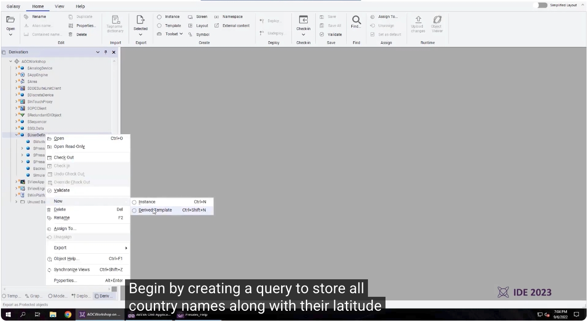
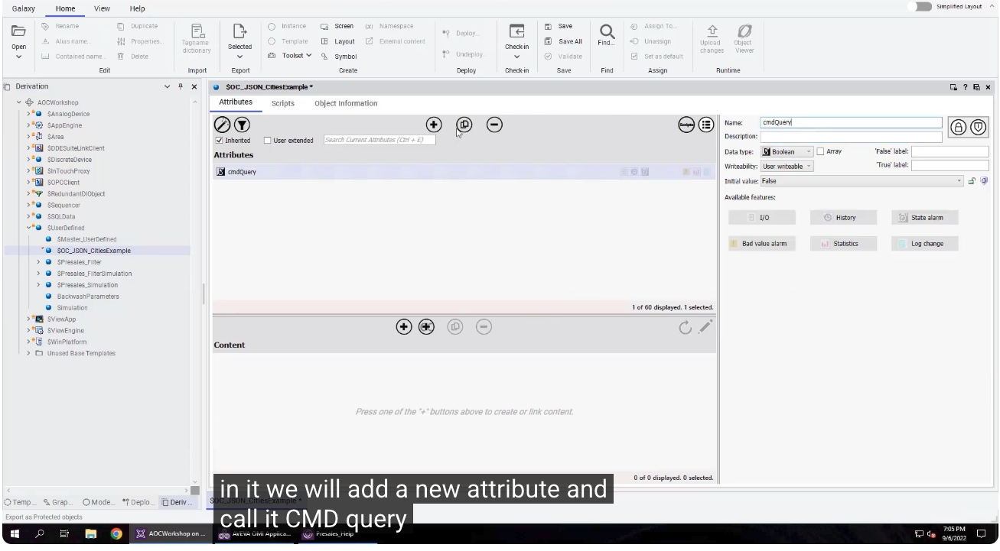
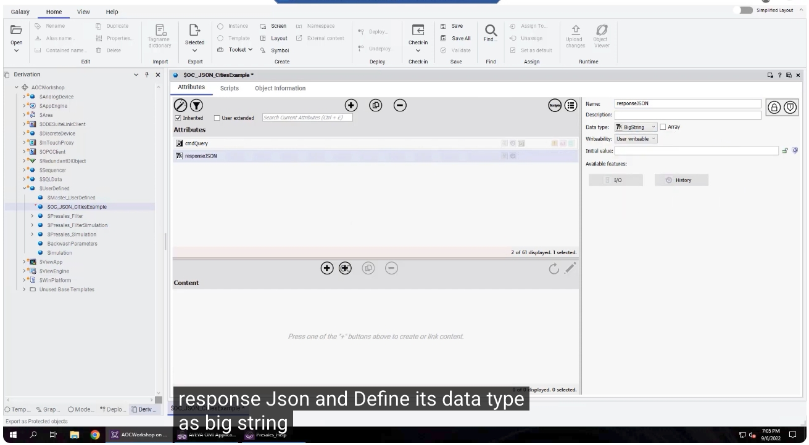
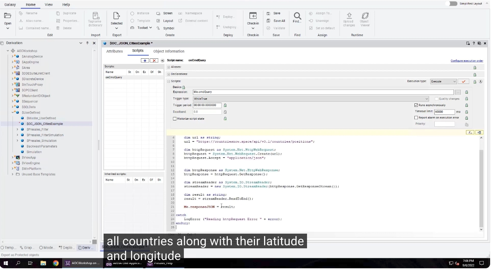
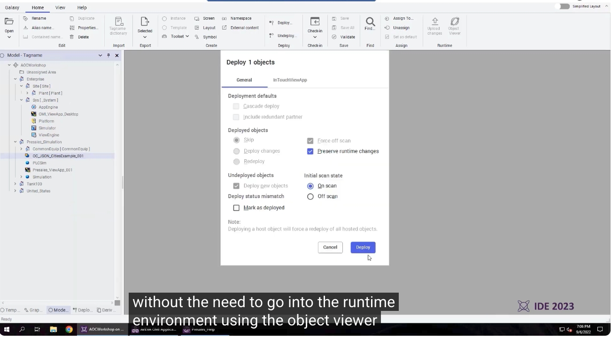
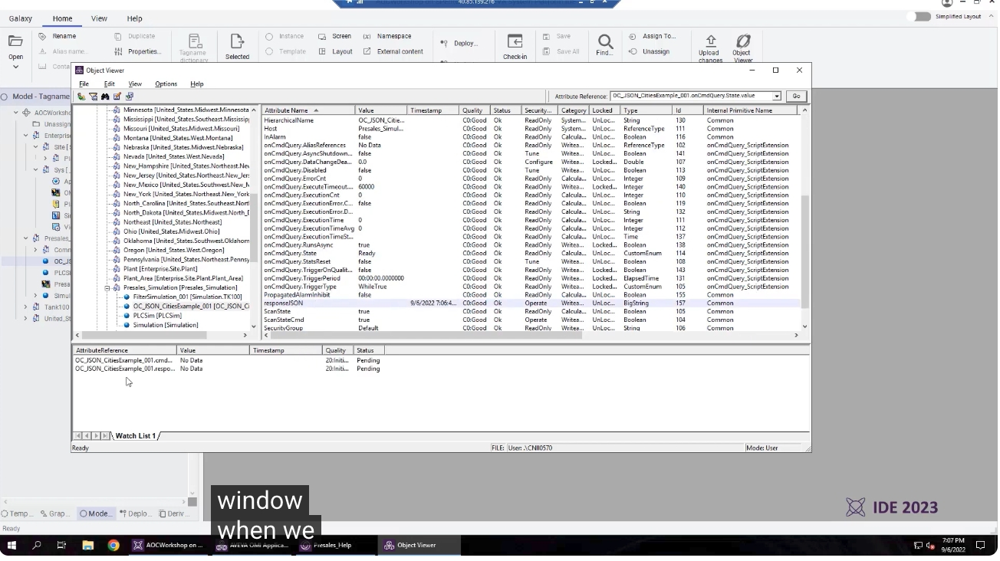
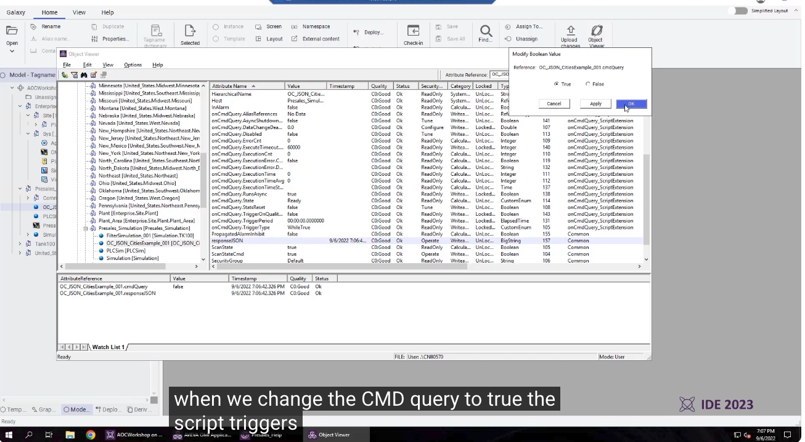

# AVEVA System Platform Big String（大字串）功能教學

> 影片來源：[AVEVA Shorts - Big String Data Feature in AVEVA System Platform](https://www.youtube.com/watch?v=TCFDO34ZQkg&list=PLJq4rR8tWINyOrvwxbIjRvgTtoyuuEfSz&index=16)

本教學將帶您快速了解 **AVEVA System Platform 2023** 新推出的 **Big String（大字串）** 資料型態功能，並透過一個實際範例，示範如何建立、部署與測試此功能，藉此儲存與傳輸大型 JSON 字串資料。

---

## 一、功能介紹

AVEVA System Platform 2023 新增了 **Big String** 資料型態，支援 **幾乎無限長度的字串大小**，讓使用者能夠儲存與傳輸過去傳統 String 資料型態無法負荷的大規模字串內容。

### 使用限制

在使用 Big String 之前，需先了解以下限制：

- **不支援用於警報訊息（Alarm Messages）**。
- 若物件具有 **I/O 擴充（Input Output Extensions）**，則 **不支援快取緩衝（Buffering）**。
- **歷史紀錄化（Historization）最高僅支援至 1,000 個字元**，超過部分將會被截斷（Truncated）。

---

## 二、範例演示：抓取各國經緯度 JSON 資料

本範例將建立一個 Query，透過網路請求取得所有國家名稱及其經緯度資訊，並將完整的 JSON 回應內容儲存在 Big String 屬性中。

### 1. 建立衍生範本（Derived Template）

在 `$UserDefined` 節點上按右鍵，選擇 **New → Derived Template**，建立一個新的衍生範本，用來存放查詢用的屬性與腳本。

### 2. 新增 cmdQuery 屬性

在範本的 **Attributes** 頁籤中新增一個屬性，命名為 **`cmdQuery`**，資料型態設定為 **Boolean**，用來作為觸發查詢的開關。

### 3. 新增 responseJSON 屬性，並設定為 Big String

再新增一個屬性，命名為 **`responseJSON`**，並將其 **資料型態（Data type）設定為 `BigString`**，用來儲存回傳的完整 JSON 字串內容。

### 4. 撰寫查詢腳本

在 **Scripts** 頁籤新增一個名為 `onCmdQuery` 的腳本，設定重點如下：

- **Expression**：`Me.cmdQuery`
- **Trigger type**：`WhileTrue`
- **Trigger period**：`00:00:00.0000000`
- 勾選 **Runs asynchronously（非同步執行）**

腳本內容會透過 HTTP 請求向外部 API（`https://countriesnow.space/api/v0.1/countries/positions`）取得所有國家及其經緯度資料，並將回應結果讀取為字串後，指派給 `Me.responseJSON`。

### 5. 部署至執行期環境（Runtime）

依照範本建立實例（Instance）並指定至導覽樹中的適當位置後，即可直接透過 **Deploy** 對話框將物件部署至執行期環境，不需要額外進入 Object Viewer 手動操作。

部署設定重點：

- **Deployed objects**：選擇 `Deploy changes`
- 勾選 **Force off scan** 與 **Preserve runtime changes**
- **Initial scan state**：選擇 `On scan`

### 6. 使用 Object Viewer 進行測試

開啟 **Object Viewer**，將 `cmdQuery` 與 `responseJSON` 兩個屬性加入 **Watch Window（觀察視窗）**，以便即時監看數值變化。

### 7. 觸發查詢並檢視結果

將 **`cmdQuery`** 的值由 `False` 修改為 **`True`**，即可觸發腳本執行查詢。腳本觸發後，系統會回傳包含各國家名稱與經緯度資訊的完整 JSON 字串，並顯示在 `responseJSON` 屬性中。

> 💡 若改用傳統的 **String** 資料型態，將無法承載如此長度的訊息內容；唯有透過 **Big String**，才能完整儲存並顯示這類大規模字串資料。

---

## 三、總結

透過本次示範可以看到，**AVEVA System Platform 2023** 的 **Big String** 功能，大幅提升了系統在處理與傳輸長字串資料（例如大型 JSON 回應）時的彈性與能力，非常適合應用於需要與外部 API 或系統交換大量文字資料的情境。

---

## 延伸資源

- 了解更多 AVEVA System Platform：<https://www.aveva.com/en/products/system-platform/>
