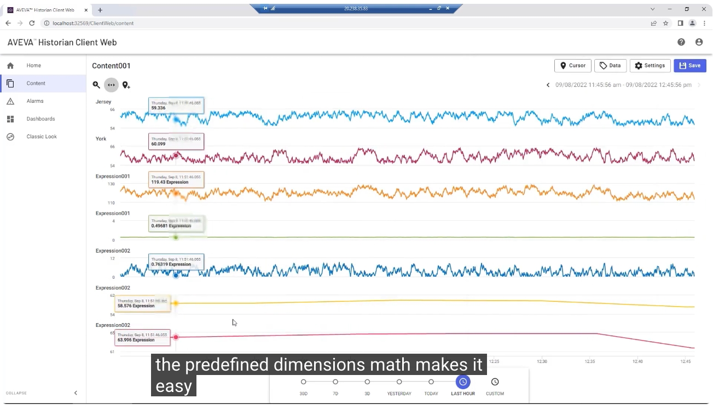
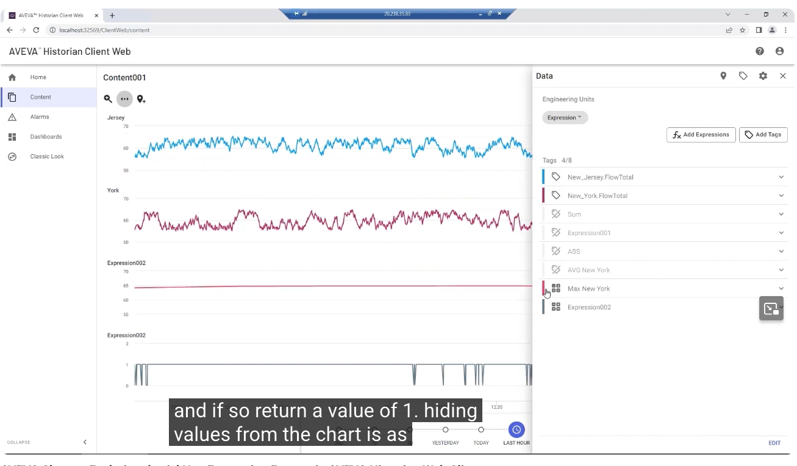
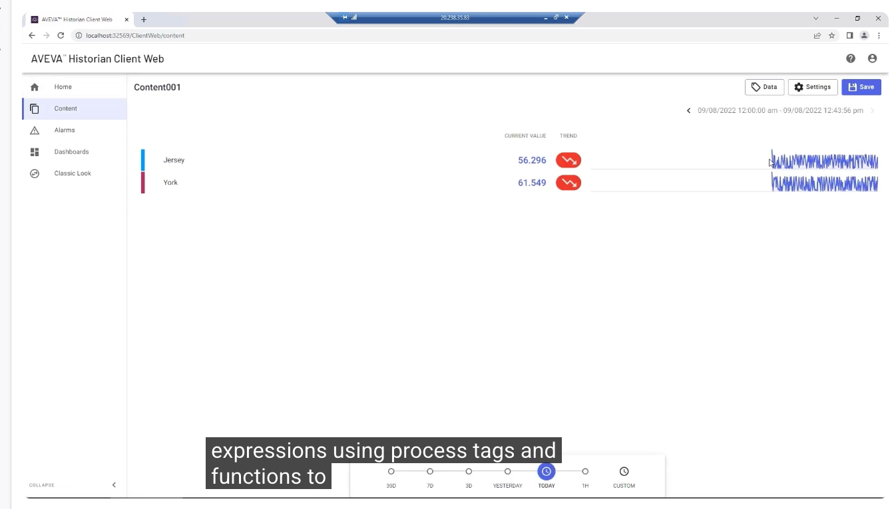
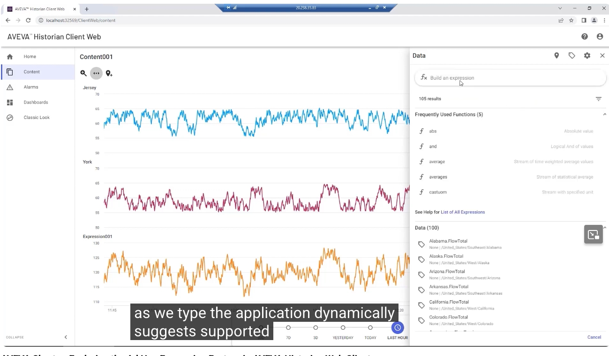
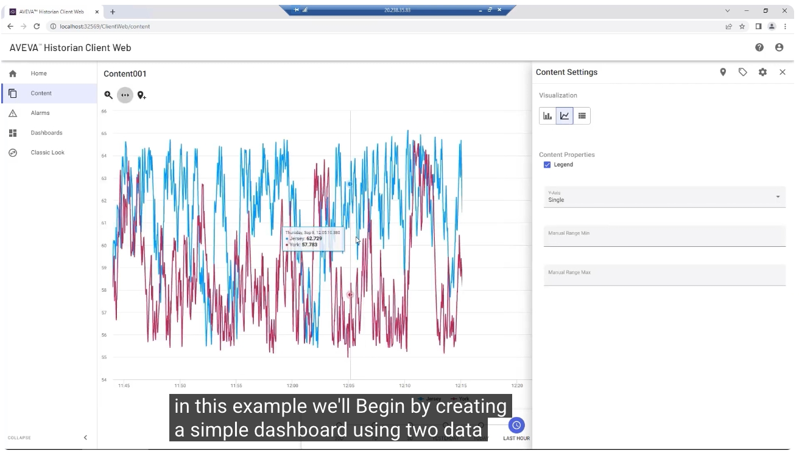
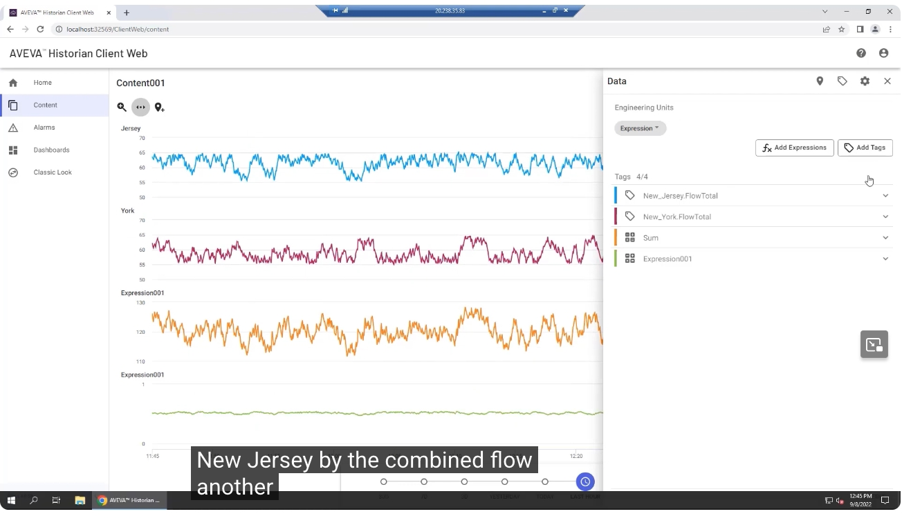
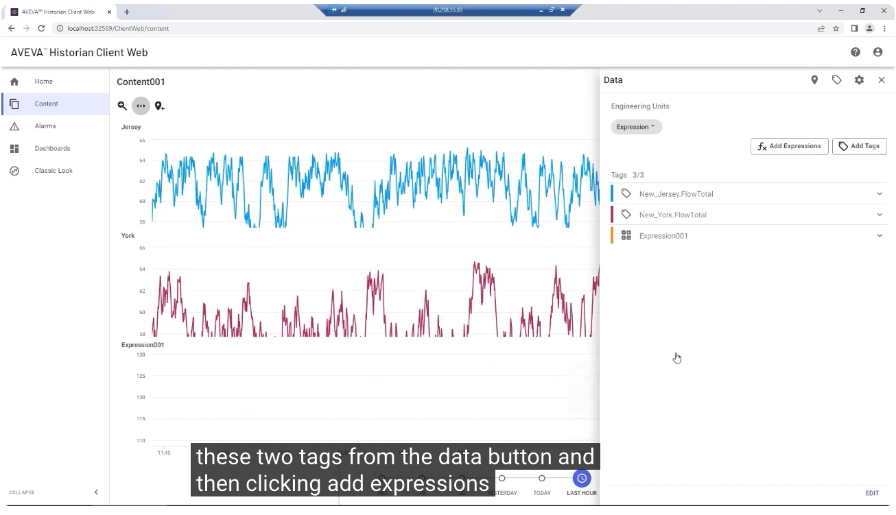
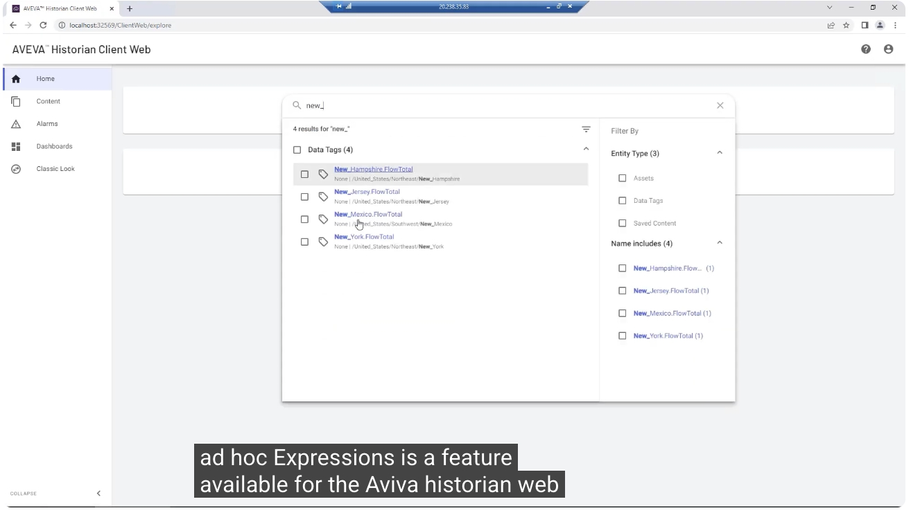
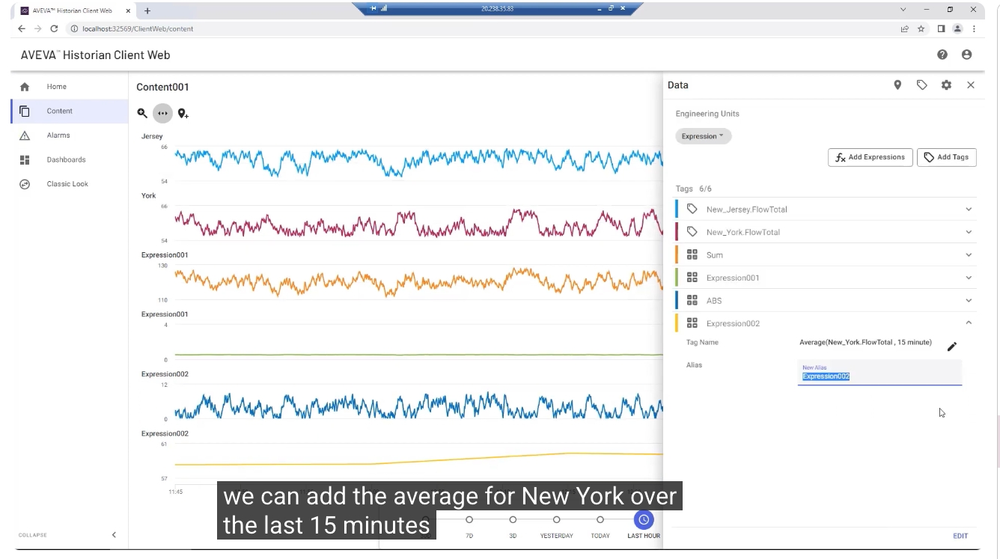

# AVEVA Historian Web Client — Ad Hoc Expression 功能教學

> 影片來源：[AVEVA Shorts - Exploring the Ad Hoc Expression Feature in AVEVA Historian Web Client](https://www.youtube.com/watch?v=3sfcuS6Vwck&list=PLJq4rR8tWINyOrvwxbIjRvgTtoyuuEfSz&index=17)

本教學將示範如何在 **AVEVA Historian Web Client** 中，使用 **Ad Hoc Expressions（即時自訂表達式）** 功能，透過瀏覽器直接建立自訂表達式，快速產生新的分析數值，並實作一個簡單的儀表板範例。

---

## 一、功能介紹

**Ad Hoc Expressions** 是 AVEVA Historian Web Client 提供的一項功能，讓使用者可以直接在瀏覽器中，運用 **製程標籤（Process Tags）** 與內建 **函數（Functions）**，建立自訂表達式並即時產生新的計算數值，不需要額外撰寫程式或使用其他工具。

在建立儀表板之前，可以先透過首頁的搜尋功能，找到所需的製程標籤，例如本範例會使用到的各州流量標籤（FlowTotal）。

---

## 二、建立簡單儀表板

### 1. 選取資料標籤並設定圖表

本範例會選用兩個資料標籤：

- **紐澤西總流量（New_Jersey.FlowTotal）**
- **紐約總流量（New_York.FlowTotal）**

設定查看範圍為 **過去一小時（Last Hour）**，並將圖表顯示為 **折線圖**。將滑鼠游標移到圖表上，即可即時查看對應時間點的數值（例如 Jersey: 62.729、York: 57.783）。

### 2. 開啟 Data 面板並新增表達式

點擊右上角的 **Data** 按鈕，即可看到目前已加入的資料標籤清單。接著點擊 **「Add Expressions」** 按鈕，即可開始建立自訂表達式。

---

## 三、建立各種算術與統計表達式

### 1. 表達式輸入介面：動態建議

在「Build an expression」輸入框中開始輸入時，系統會 **依關鍵字動態建議支援的函數與標籤**，例如常用函數 `abs`（絕對值）、`and`（邏輯且）、`average`（平均值）等，以及所有可用的資料標籤清單。

### 2. 建立總和與百分比表達式

首先建立兩個標籤的 **總和（Sum）** 表達式，並將其重新命名（例如命名為 `Sum`）。接著可以進一步建立 **紐澤西流量占總流量百分比** 的表達式，運用預先定義好的 **維度數學（Dimensional Math）** 計算機制，讓不同工程單位的標籤也能輕鬆混合用於同一個表達式中。

### 3. 平均值與最大值表達式

接下來可以新增更多統計型表達式，例如：

- 計算過去 15 分鐘內 **紐約流量的平均值（Average）**：`Average(New_York.FlowTotal, 15 minute)`
- 計算過去 15 分鐘內 **紐約流量的最大值（Max Value）**

新增的表達式同樣會出現在右側 Data 面板的標籤清單中（例如 `ABS`、`Expression002` 等），可依需要重新命名並編輯其參數。

### 4. 圖表互動與單位混用

透過懸停游標，可即時檢視每一條表達式曲線在對應時間點的數值。得益於預先定義的維度數學計算機制，即使原始標籤的工程單位不同，使用者仍可以輕鬆地將它們混合運用於同一個表達式當中，而不需要額外進行單位換算。

---

## 四、邏輯函數與持續時間分析

### 1. 使用 IF 邏輯函數

示範使用 **IF 邏輯函數**：當紐澤西流量大於 56 時，表達式傳回數值 **1**，否則傳回 **0**，藉此標示出超過門檻值的時間區段。

### 2. 隱藏特定資料以利比對

點擊 Data 面板中各標籤旁的 **色彩標籤**，即可快速 **隱藏或顯示** 特定曲線，方便使用者比對「高於門檻的標記結果」與「原始流量資料」之間的關係。

### 3. 計算持續時間（Duration）

最後，可以再進一步建立表達式，計算 **紐澤西流量超過 56 的持續時間（Duration）**，用以了解流量超標的累積時間長度。

---

## 五、總結

透過 **AVEVA Historian Web Client** 的 **Ad Hoc Expressions** 互動式編輯器，使用者僅需透過瀏覽器，即可靈活運用製程標籤與各種內建函數（總和、百分比、絕對值、平均值、最大值、邏輯判斷、持續時間等），隨選建立客製化的分析表達式，大幅提升數據分析的效率與彈性。

---

## 延伸資源

- 了解更多 AVEVA Historian：<https://www.aveva.com/en/products/historian/>
