# 打造一致性的 SCADA 標準：AVEVA System Platform 教學（上）

> 影片來源：[Developing SCADA standards and consistency with AVEVA System Platform](https://www.youtube.com/watch?v=fF3e6pJfThQ&list=PLJq4rR8tWINyOrvwxbIjRvgTtoyuuEfSz&index=18)

本篇為系列教學的 **上集**（共兩集，圖片依序取自完整 29 張截圖中的前 16 張），將介紹 AVEVA System Platform 如何透過 **物件導向方法（範本 Templates 與實例 Instances）**，將標準化與工程效率內建於系統核心，減少重複工作、降低長期維護成本，並協助企業建立資產的數位雙生（Digital Twin）。

---

## 一、物件導向設計與標準化

AVEVA System Platform 應用程式的設計核心，是以 **物件導向方法** 為基礎，透過 **範本（Templates）** 與由範本衍生出的 **實例（Instances）**，將工程師的設計心血直接捕捉並保存在系統之中。這麼做可以大幅 **減少重複性的工作**，並讓應用程式在長期維運、以及在不同開發人員之間交接時更容易維護。

下圖為一個以 AVEVA System Platform 建置的「AVEVA Water District」應用範例，畫面左側可看到依區域、廠區、製程逐層展開的資產樹狀結構，右側則是結合地圖與即時營運指標（如每日最大需求量、回收水量、ILI 指標等）的儀表板，這些內容都是由背後的範本與實例所構成。

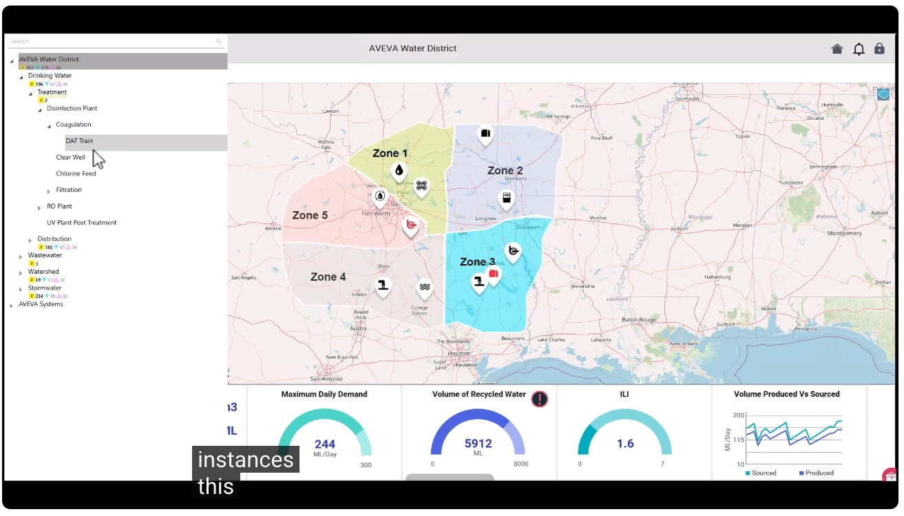

透過畫面左上角的下拉選單，可以在 Drinking Water（飲用水）、Wastewater（廢水）、Watershed（集水區）、Stormwater（雨水）等不同營運範疇之間快速切換，這些範疇背後同樣都是由標準化的物件所建構而成。

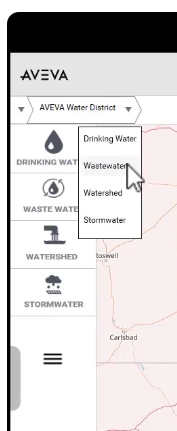

進一步點選麵包屑導覽列，可以逐層深入到 Wastewater → Treatment，檢視該製程的即時容量資訊，例如處理容量（Treatment Capacity）與配送容量（Distribution Capacity）等關鍵指標。

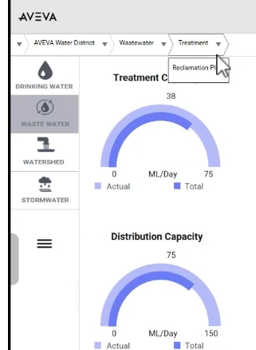

---

## 二、資產數位化與數位雙生

AVEVA System Platform 讓使用者可以透過 **建立物件之間的關係**，預先定義好情境資訊（Context），協助使用者更容易理解營運資料，進而將實體資產及其各項營運面向加以 **數位化**，這正是建構 **數位雙生（Digital Twin）** 概念的基礎。

以下方的「Reclamation Plant（回收廠）」流程圖為例，畫面完整呈現了從 Head Works（前處理）、Primary Sedimentation（初級沉澱）、Secondary（二級處理）到 Cogen（汽電共生）的完整流程，並在流程圖旁同步顯示相關的流量、濁度、氯濃度等即時數值，以及事件與成本統計圖表。這些物件之間的關聯性，讓使用者能在單一畫面上，同時掌握流程狀態與營運數據。

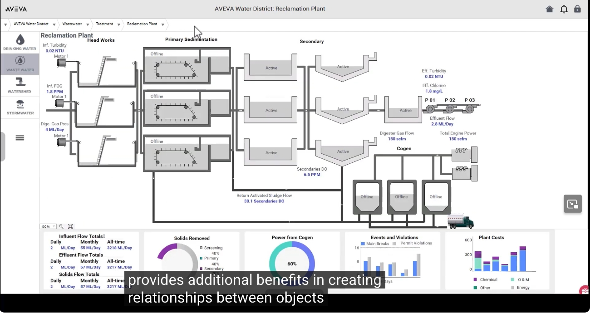

再往下鑽取到「Headworks（前處理站）」的畫面，可以看到三組馬達與輸送設備的即時狀態，以及對應的警報清單（HiHi Alarm、Overflow Alarm、Capacity Alarm）與統計資訊（如卡阻次數、液位差、廢棄容器填充率等）。這類 **預先定義好情境資訊的動態應用程式**，能有效協助操作人員快速掌握現場狀況。

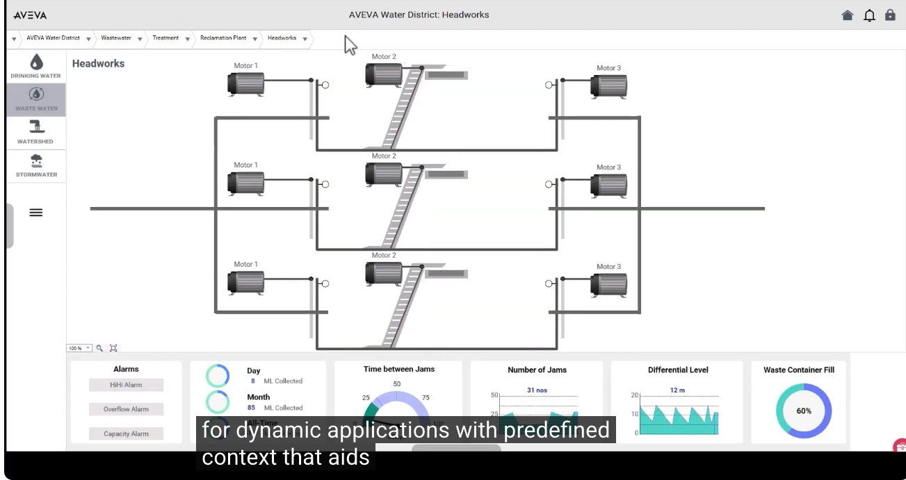

繼續深入到「Bar Screen 1（格柵 1）」的細節畫面，可以看到單一設備層級的上游液位、液位差、下游液位等數值，以及相同的警報與統計圖表配置。由於這些畫面都是基於相同的物件與關係架構所建立，因此無論在哪一個層級瀏覽，都能維持一致的操作邏輯與 **更佳的營運資訊呈現方式**。

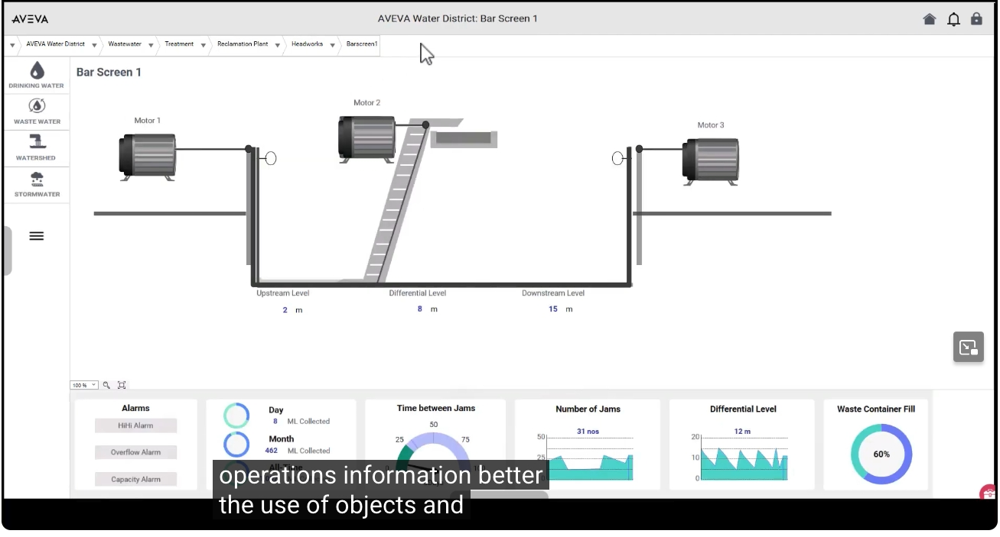

---

## 三、基礎範本庫與可複用工程

AVEVA System Platform 提供了一套 **基礎範本庫（Base Template Library）**，涵蓋常見的設備與應用物件（如馬達、幫浦、閥門、感測器等），使用者可以直接 **衍生（Derive）修改** 這些範本，也可以從其他專案或擴充套件 **匯入** 新的範本，藉此大幅加快工程建置速度。

例如下圖中的 `$AVEVAPowerIDO`（能源相關物件）範本，其屬性清單中已預先定義好如 `Irradiance`（日照量）、`Latitude`（緯度）、`Longitude`（經度）、`OperatingHours` 等多項標準屬性，這些都是雙生概念（twin Concepts）的基礎，讓工程師無需從零開始建立每一個屬性。

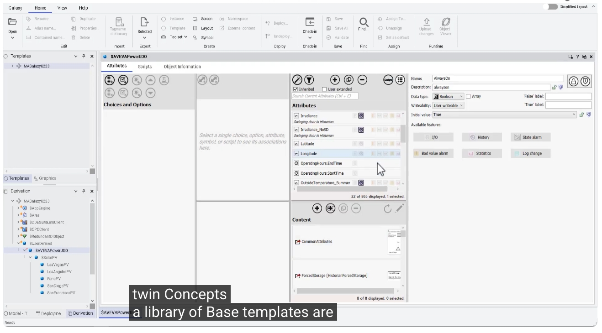

在 Templates（範本）視窗中，可以看到範本依「1. Assets」「Asset Library」「Equipment Assets」「Instrument Assets」「Valve Assets」等類別，整齊地分層組織，方便工程師依設備類型快速找到所需的基礎範本。

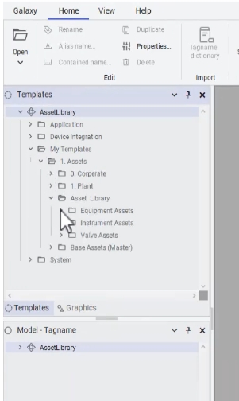

要建立一個新的物件時，只需在既有範本（例如 `$Equipment_Agitator`，攪拌機範本）上按右鍵，選擇 **New → Instance（建立實例）** 或 **New → Derived Template（建立衍生範本）**，即可快速產生新的物件，而不需要重新設計每一項屬性、圖形與腳本。

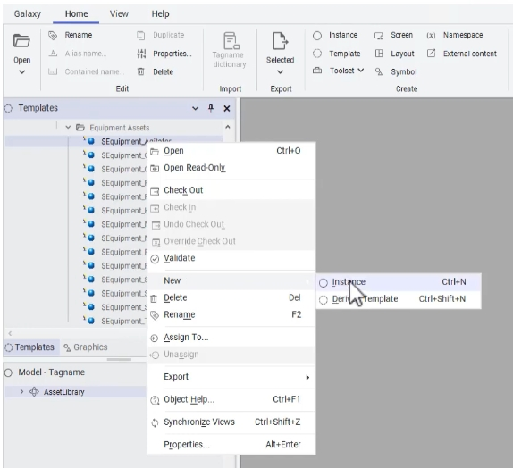

建立完成的實例（例如 `Equipment_Agitator_001`）會出現在導覽樹中，並自動繼承其範本（`$Equipment_Agitator`）的所有屬性內容，載入完成後即可直接使用，這正是 **可複用工程（Reusable Engineering）** 帶來的效益：大幅 **降低未來的工程投入**，並為流程如何運作提供了一套清楚的結構。

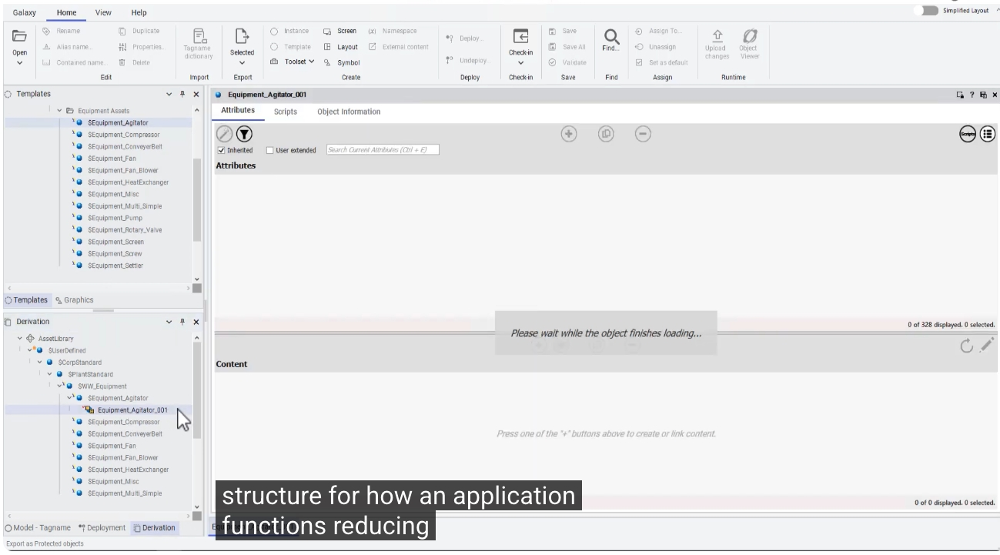

在實例的屬性設定畫面中，工程師可以依實際需求調整「Choices and Options（選項設定）」，例如馬達類型（Motor type）、回饋層級（Feedback level）、是否具備故障警報回饋、是否啟用歷史紀錄化（Historization）等，右側也會同步顯示對應的操作面板（Operator Faceplate）預覽畫面。這些預先配置好的視覺化內容，讓變更能快速套用並反映在畫面上。

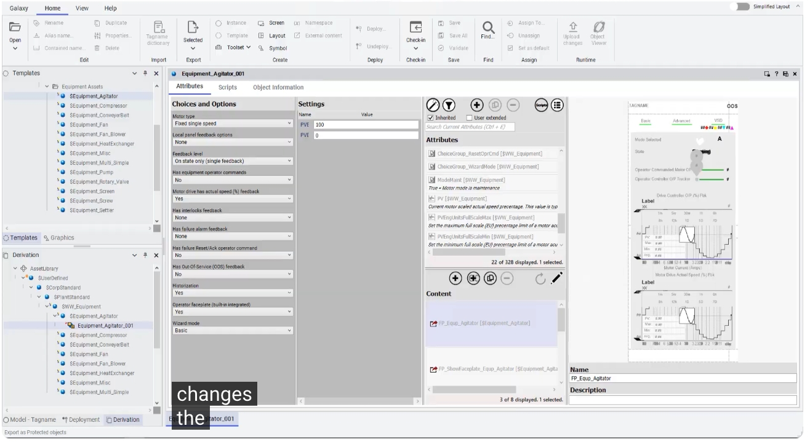

---

## 四、繼承與封裝特性（Inheritance & Encapsulation）

當一個物件是由某個範本 **衍生（Derived）** 而來時，它會自動 **繼承父物件（Parent Object）的所有元件**，包括屬性（Attributes）、圖形（Graphics）、安全性設定（Security）、腳本（Logic/Scripting）、警報與事件（Alarms & Events）、歷史資料（Historical Data）、版面（Layouts）與資料來源（Data Sources）等，一次到位地建立起完整的「資產物件（Asset Object）」，達成標準化與可複用性的雙重效益：

- 朝向數位資產表示法（Digital Asset Representation）邁進
- 定義資產的所有營運面向
- 建立可複用的工程內容，降低未來的工程投入
- 提供流程如何運作的結構
- 預先配置視覺化以加快部署速度
- 可快速推行變更（Rapid Roll-out of Changes）
- 降低整體擁有成本（Total Cost of Ownership）

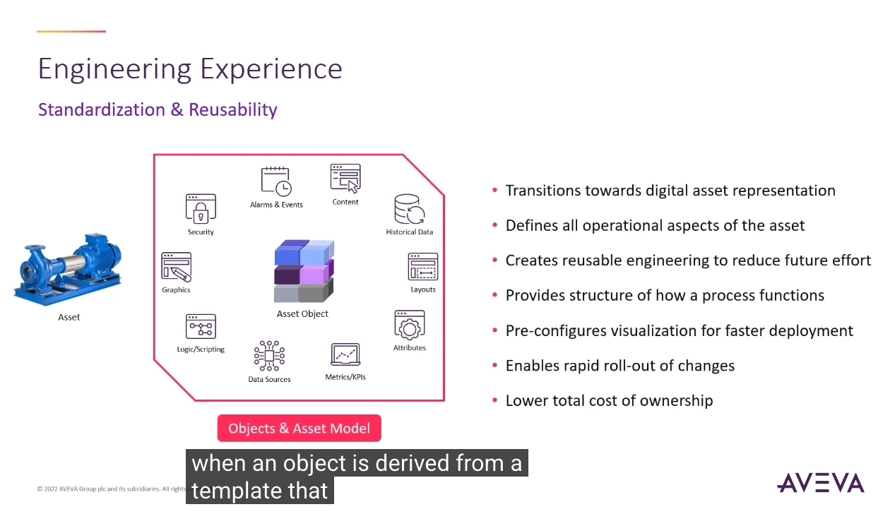

更重要的是，透過 **範本與傳播（Templates & Propagation）** 機制，同一個父物件可以衍生出多個不同規格的子物件（例如將離心式幫浦分別衍生為 5hp 與 20hp 兩種規格），而衍生出的每一個子物件，都會完整繼承父物件的所有元件，包括屬性、圖形與安全性設定，大幅 **降低重複性的工程投入**，同時也能支援複雜的工業架構，並保留原始的設計知識。

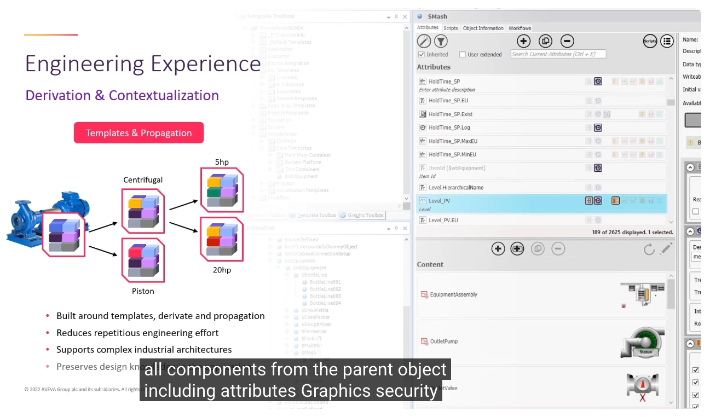

此外，藉由「資產模型情境化（Derivation & Contextualization）」的機制，系統可以將資產模型（Asset Model）自動對應到導覽模型（Navigation Model）與應用程式內容（Application Content），promoting 自動建立導覽與內容之間的關聯，並自動將情境套用到應用程式與 Historian 資料當中。這代表：**當父物件發生任何修改時，變更會自動傳播（Propagate）至所有衍生的子物件**，不需要逐一手動更新每一個子物件，大幅降低維護所需的重複性工作。

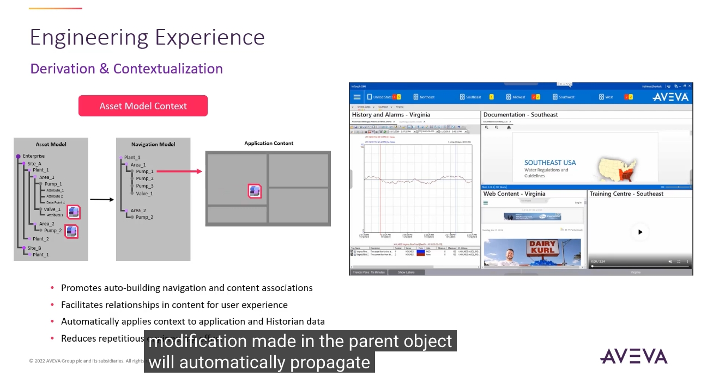

當然，物件的設計仍需要 **額外的思考與規劃**，例如下圖中的 `$2wayValve`（雙向閥）範本，衍生出了 `2wayValve_001`（對應 SanDiegoPV 案場）與 `2wayValve_002`（對應 SanFranciscoPV 案場）兩個實例，工程師在設計範本時，需要事先考量好哪些屬性應該保留為可繼承、可調整的通用設定，才能在後續大量複製、部署時，兼顧一致性與彈性。

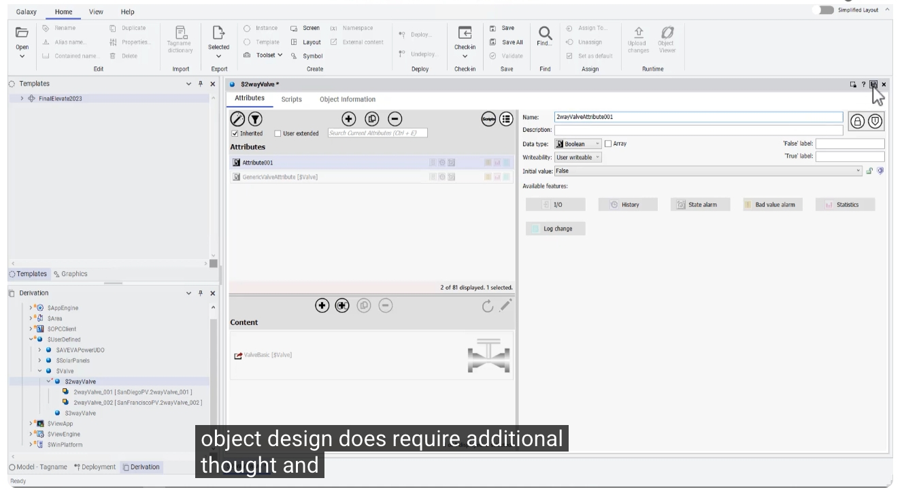

---

## 五、樣式庫（Style Libraries）與視覺一致性

除了物件本身之外，AVEVA System Platform 也提供可自訂的 **樣式庫（Style Libraries）**，統一整個應用程式中文字、形狀、背景顏色、狀態圖示、警報指示與趨勢圖等視覺元素的呈現方式。

在 **Configure → Galaxy → Styles** 頁面中，可以看到系統預設的 `Standard_Style (Default)` 樣式，其中依 **Quality & Status（品質與狀態）**、**HMI Element（人機介面元素）**、**Alarm Element（警報元素）**、**Trend Element（趨勢元素）**、**User defined（自訂）** 等分類，提供了一整套套用視覺與數值品質狀態的選項（例如 Communication Error、Configuration Error、Warning、Bad、Uncertain 等狀態圖示），確保整個應用程式在不同畫面、不同工程師建置的內容之間，都能維持一致的視覺語言。

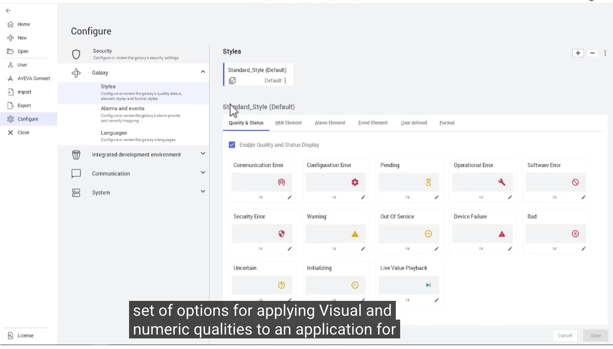

---

## 待續

本篇（上集）涵蓋了物件導向設計、資產數位化、基礎範本庫、繼承與封裝，以及樣式庫的視覺一致性等主題。**下集** 將接續介紹亮色／暗色模式與色盲無障礙設計、冗餘機制（Redundancy）與系統健康維護，以及 **AVEVA System Monitor** 系統監控工具的應用，敬請期待。

---

## 延伸資源

- 了解更多 AVEVA System Platform：<https://www.aveva.com/en/products/system-platform/>
