# 打造一致性的 SCADA 標準：AVEVA System Platform 教學（下）

> 影片來源：[Developing SCADA standards and consistency with AVEVA System Platform](https://www.youtube.com/watch?v=fF3e6pJfThQ&list=PLJq4rR8tWINyOrvwxbIjRvgTtoyuuEfSz&index=18)

本篇為系列教學的 **下集**（承接上集，圖片依序取自完整 29 張截圖中的最後 13 張），接續介紹樣式庫如何延伸應用到亮色／暗色模式與色盲無障礙設計、冗餘機制（Redundancy）與系統健康維護，以及 **AVEVA System Monitor** 系統監控工具的實際應用。

> 💡 若尚未閱讀上集，建議先參考《打造一致性的 SCADA 標準：AVEVA System Platform 教學（上）》，了解物件導向設計、範本與實例、繼承與封裝，以及樣式庫的基礎概念。

---

## 一、樣式庫的延伸應用：主題切換與無障礙設計

延續上集介紹的樣式庫概念，除了統一的元素樣式（Element Styles）之外，這些樣式規則也可以進一步 **開放給使用者自行選擇套用**。下圖展示了 InTouch 內建的完整元素樣式清單，涵蓋標題、標籤、控制模式、警報邊框動畫等各種視覺元件的標準呈現方式，確保製程資訊的顯示方式一致，避免因視覺風格不一致而造成混淆。

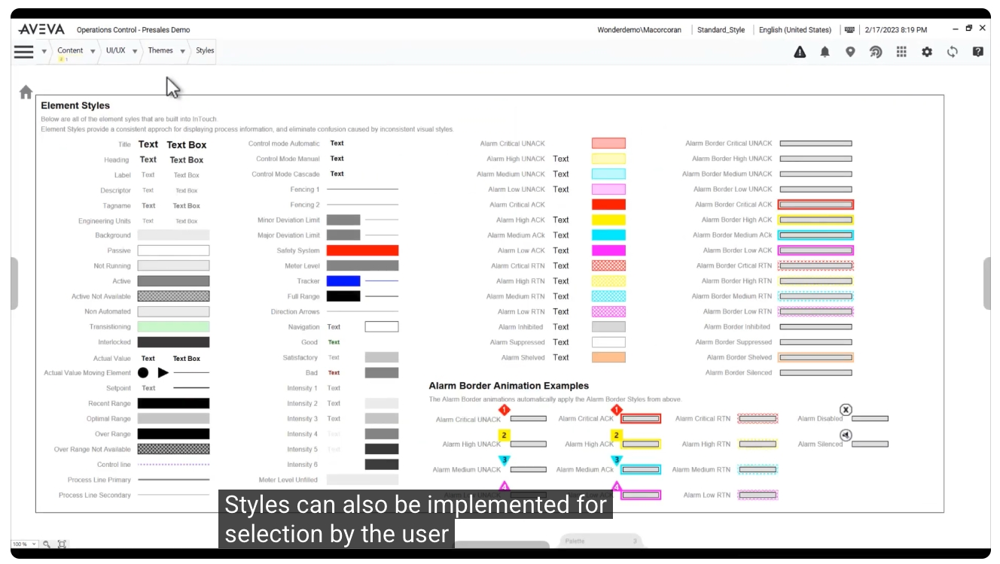

在此基礎之上，系統支援 **多種主題（Themes）** 的切換，讓同一套應用程式可以套用不同的視覺風格。下圖為套用「Sample White Theme（白色主題）」的績效儀表板，呈現生產數量、速度合規率、瓶頸分析、計畫性／非計畫性停機等關鍵績效指標（KPI）。

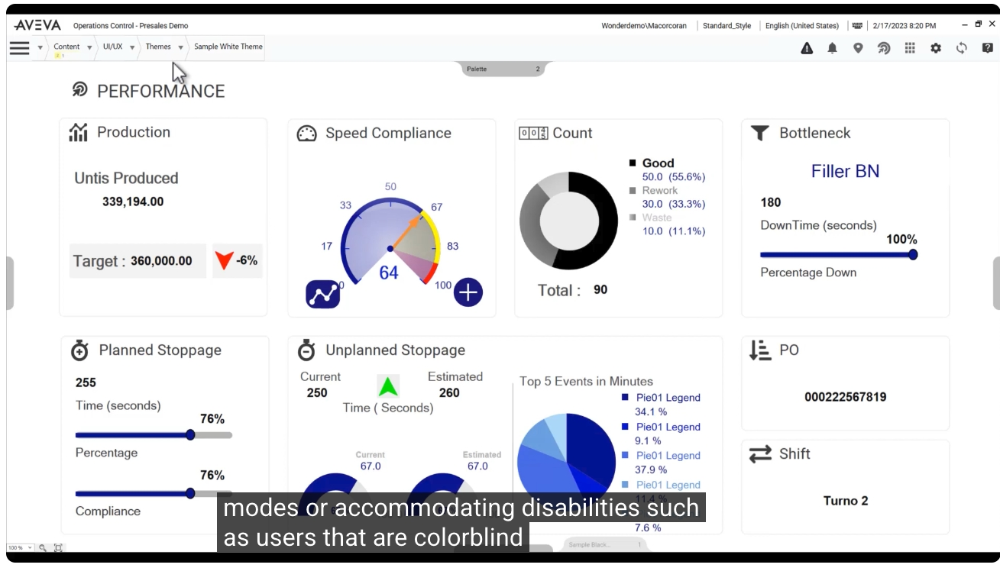

而透過切換至「Sample Black Theme（黑色主題）」，相同的內容即可呈現截然不同的深色視覺風格。這種 **亮色／暗色模式（Light/Dark Mode）** 的支援，不僅可以滿足不同使用情境（例如夜間操作室）的視覺需求，也能協助 **色盲（Colorblind）等具有視覺辨識障礙的使用者**，透過調整配色方案，更容易分辨警報等級與狀態資訊，達成無障礙設計的目標。

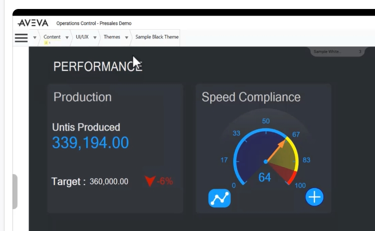

---

## 二、冗餘機制（Redundancy）與系統健康

要維持系統 **24/7 全年無休** 的穩定運作，AVEVA System Platform 提供完整的 **冗餘機制（Redundancy）**，以確保像 HMI SCADA 這類工程化軟體系統的健康狀態。下圖為典型的冗餘架構示意圖：由兩台 **自動化物件伺服器（Automation Object Server, AOS）** 透過 **冗餘訊息通道（Redundant Message Channel）** 互相連接，並分別扮演 Primary（主要）與 Backup（備援）角色，兩者皆連接至 **裝置整合伺服器（Device Integration Server）**，再向下連接至各個 PLC。

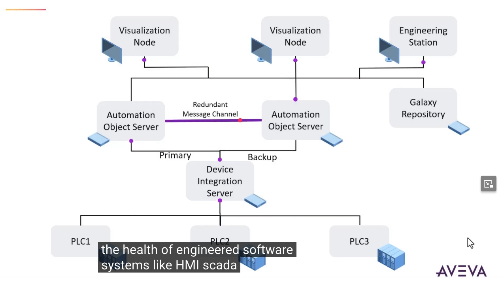

在 System Platform IDE 中，可以針對每一個 `AppEngine`（應用引擎）啟用並設定其 **Redundancy（冗餘）** 相關參數，例如：

- **Forced failover timeout（強制容錯移轉逾時時間）**
- **Standby engine heartbeat period（待命引擎心跳週期）**
- **Active engine heartbeat period（運作中引擎心跳週期）**
- **Maximum consecutive heartbeats missed（最大允許連續遺漏心跳次數）**
- **Maximum time to maintain good quality after failure（故障後維持良好品質的最長時間）**

這些設定共同構成了當硬體故障或發生錯誤時，系統能夠 **自動將功能切換（Shift）至另一台電腦系統** 的機制基礎。

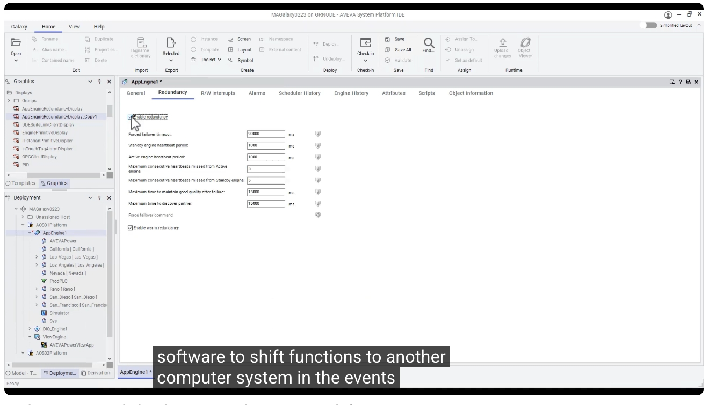

從部署（Deployment）樹狀結構中可以看到，`AppEngine1` 在 `AOS02Platform` 上還有一份對應的 **`AppEngine1 (Backup)`** 備援引擎。當主要引擎發生問題時，系統會自動切換至此備援引擎繼續運作，讓整體系統得以持續運行，**直到工程人員能夠著手排除問題為止**，不會因單點故障而中斷服務。

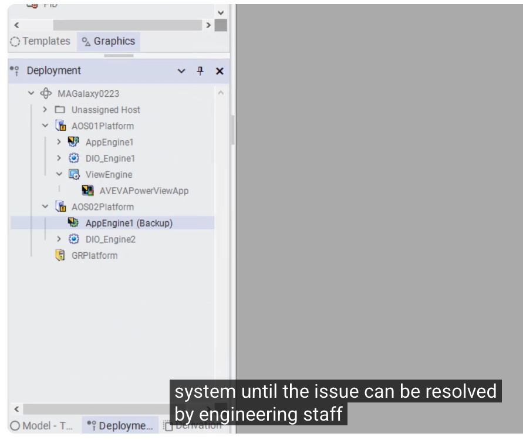

除了故障自動切換之外，AVEVA System Platform 的冗餘機制也 **支援用於系統升級**：透過畫面上的 `Force Failover`（強制容錯移轉）按鈕，工程人員可以主動將 `Primary`（目前為 Active 狀態）的角色切換至 `Backup`（原本為 Standby - Ready 狀態），藉此在 **不中斷系統運作的情況下**，於原本的主要節點上進行軟體升級或安全性更新，完成後再視需要切換回來，實現 **零停機維護**。

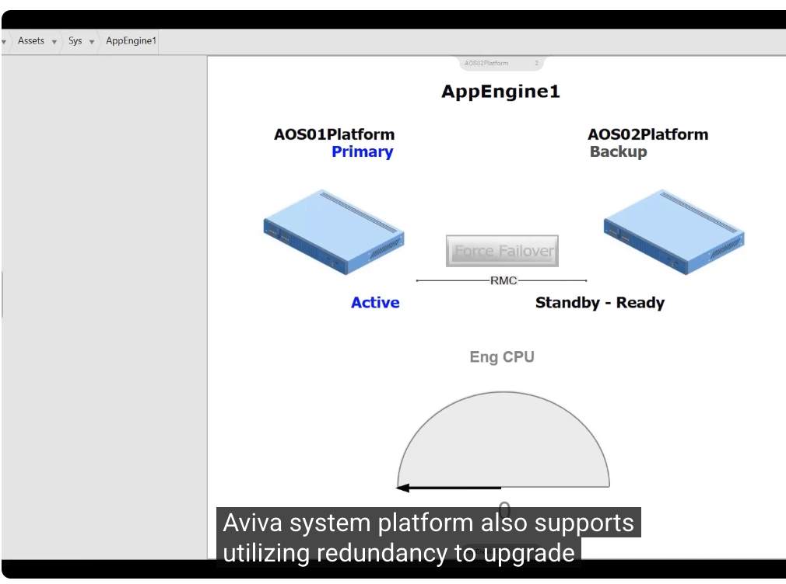

---

## 三、AVEVA System Monitor 系統監控工具

除了冗餘機制之外，AVEVA System Platform 還內建了 **AVEVA System Monitor** 這項系統監控公用程式，用以持續掌握系統整體的健康狀態。首頁的「Alert Summary（警報摘要）」畫面，會依 Wonderware Alerts、Wonderware Services、Windows Services、Computer Health（電腦健康度）等多種類別，彙整目前所有的作用中警報（Active Alerts）數量與詳細清單。

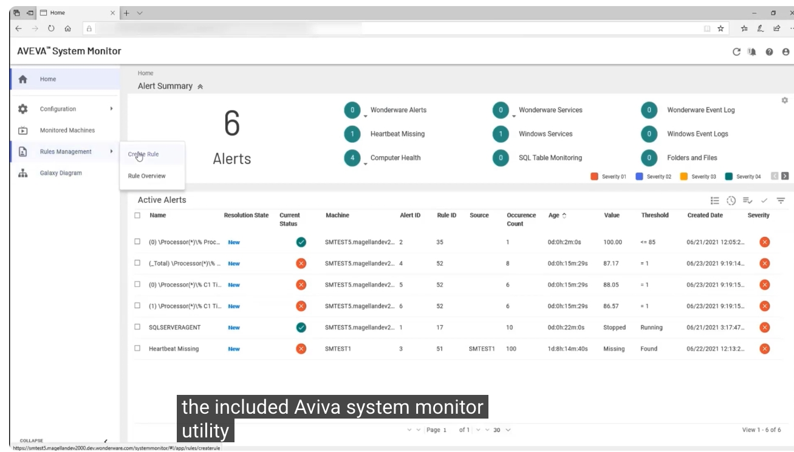

這是一套 **能主動通知工程人員錯誤與其他可設定事件** 的監控工具。使用者可以透過「Rule Creation Form（規則建立表單）」，依 **Category（類別）**（如 Computer Health）與 **Sub Category（子類別）**（如 Physical Disk、Network、Processor 等）自訂監控規則，指定資料來源（如 Perfmon Data Provider）。

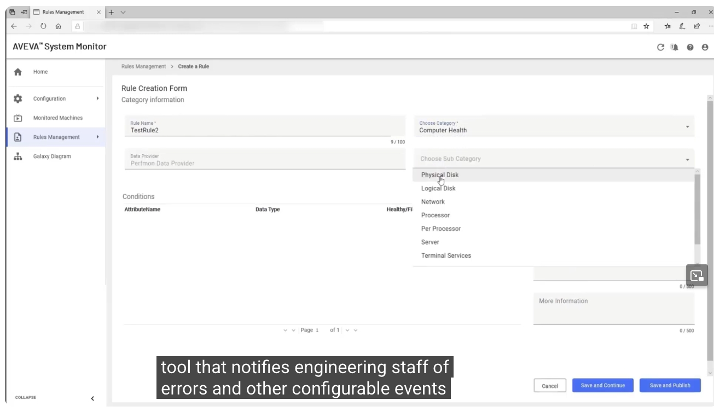

所有已建立的規則都會統一列示在「Rule Overview（規則總覽）」頁面中，包含規則名稱、類別、子類別與預設資料提供者等資訊，並可透過開關即時啟用或停用個別規則。這代表 **警報判定條件可以彈性自訂，並且直接影響整體系統健康狀態的判讀**。

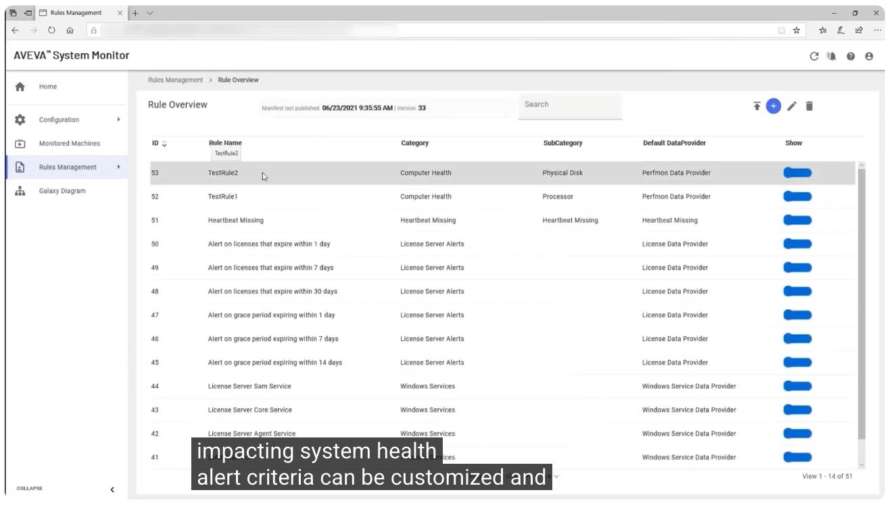

當系統偵測到符合規則的事件時（例如下圖顯示共有 7 筆作用中警報），System Monitor 便會依照事前設定 **通知適當的接收對象（Recipients）**，確保無論是內部或外部的相關工程人員，都能在第一時間被告知，以便迅速採取應對措施。

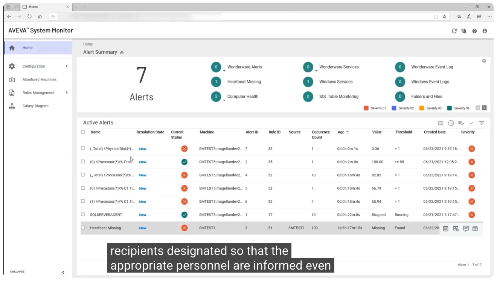

---

## 四、總結：一致的 SCADA 標準，成就長期穩定的營運

回到本系列一開始展示的「AVEVA Water District」應用範例：無論是「Lift Stations（抽水站）」總覽畫面所呈現的多站點警報、幫浦狀態、流量與濕井液位資訊，

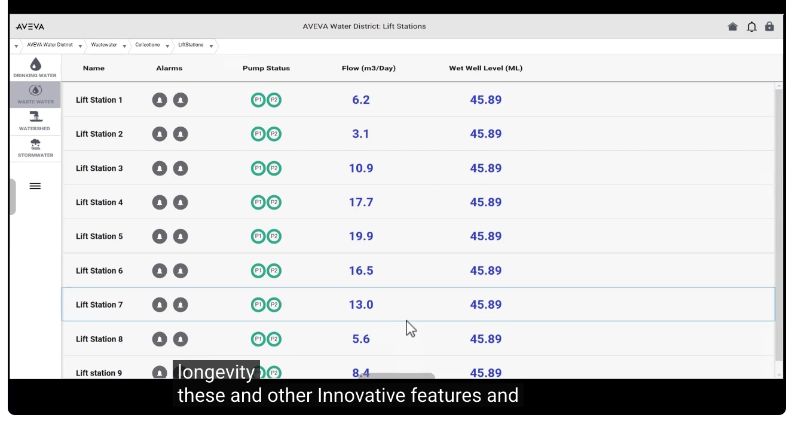

或是深入到「Lift Station 1」單一站點的詳細操作畫面（包含幫浦運轉時數、流量、壓力、功率、轉速等即時參數，以及流量容量、儲存容量、平均與尖峰流量、能源成本、事件與違規統計等營運指標）——這些畫面之所以能夠快速建置、並在不同站點之間保持高度一致，正是本系列上、下集所介紹的 **物件導向設計、範本與實例、繼承與封裝、樣式庫、冗餘機制與系統監控** 等各項標準化能力所帶來的成果。

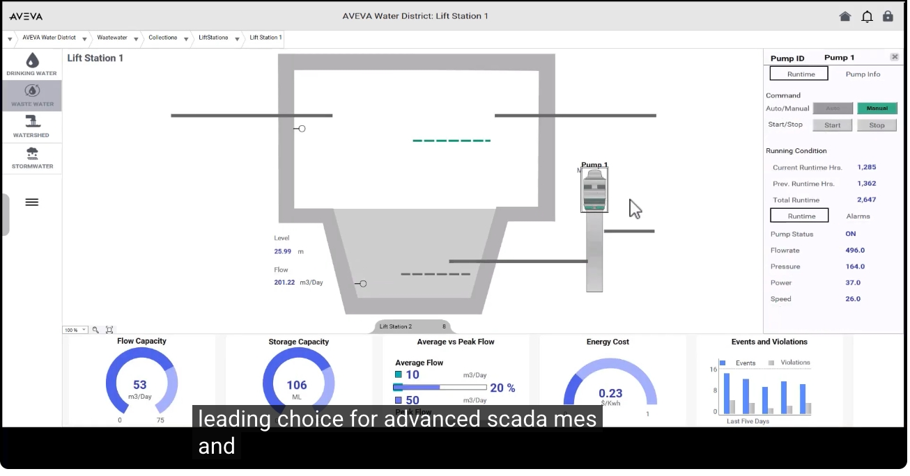

正是這些以及其他諸多創新功能，再加上系統的長期穩定性（Longevity），共同成就了 **AVEVA System Platform 作為進階 SCADA、MES 等應用領域首選解決方案** 的地位。透過標準化的物件導向架構，企業得以大幅降低重複性的工程投入、加快部署速度、確保視覺與操作體驗的一致性，並在系統發生異常時維持不間斷的營運，達到真正兼顧效率與穩定性的工業自動化目標。

---

## 延伸資源

- 了解更多 AVEVA System Platform：<https://www.aveva.com/en/products/system-platform/>
