# AVEVA System Platform 的擴充性教學（上）

> 影片來源：[Extensibility of AVEVA System Platform](https://www.youtube.com/watch?v=Xz1QqsxOoLU&list=PLJq4rR8tWINyOrvwxbIjRvgTtoyuuEfSz&index=19)

本篇為系列教學的 **上集**（共兩集，圖片依序取自完整 37 張截圖中的前 19 張），將介紹 AVEVA System Platform 如何透過 **擴充套件（Extensions）與整合（Integrations）**，在不需要撰寫自訂程式碼的前提下，擴充核心功能，協助工業客戶解決各種可能的應用情境與商業挑戰。

---

## 一、核心功能擴充：無需自訂程式碼

AVEVA System Platform 具備 **擴充核心能力的彈性**，透過各式各樣的擴充套件與整合方案，持續為使用者帶來新功能與新內容。下圖展示了一個典型的 Operations Control 儀表板，畫面上方的選單中可以看到 **Apps（應用程式）** 選項，這正是擴充功能的入口。

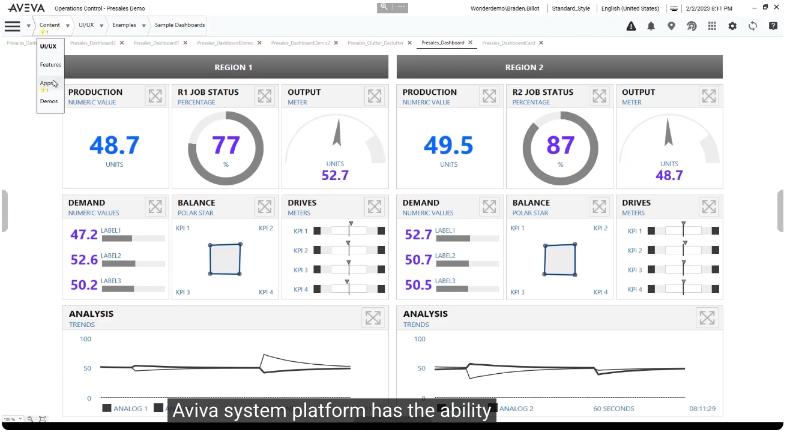

這套機制的核心概念，可以透過「AVEVA Flex」訂閱方案來理解：其設計強調 **靈活（Flexible）**、**成果導向（Outcome Focused）**、**可擴充（Scalable）**、**集中管理（Centralized）** 等特性，讓核心能力得以透過各種擴充套件與整合方式持續擴展。

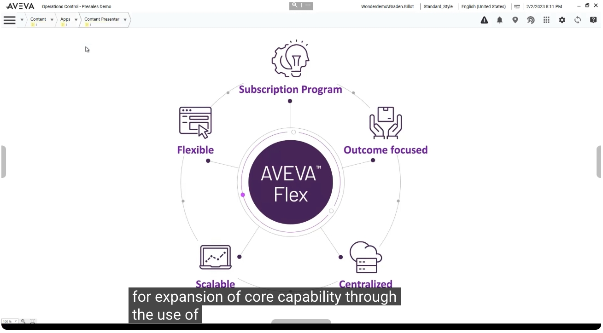

這些擴充功能所帶來的新內容，往往能以意想不到的形式呈現，例如下圖這種以資料表格方式呈現各國家即時數值的畫面，正是透過擴充套件與整合，將原本靜態的資訊轉化為動態、可互動的內容。

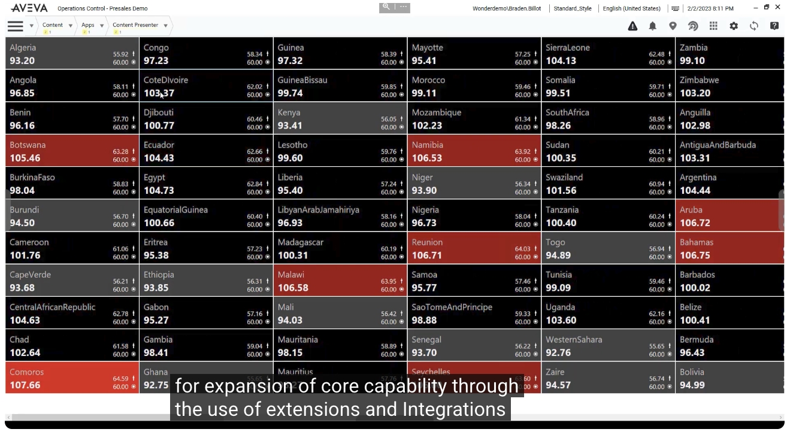

而這些新增的功能與內容，目的都是為了 **解決 System Platform 能夠協助工業客戶處理的各種可能應用情境與商業挑戰**，例如下圖這種可動態切換顯示樣式（Empty、Dynamic、Dynamic2）的 Graphic Repeater（圖形重複器）應用，能夠彈性呈現多組幫浦（Pump）的即時狀態列表。

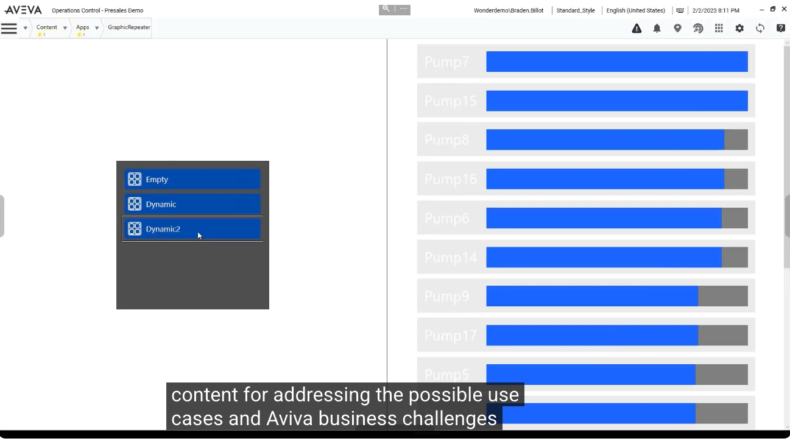

最重要的是，這一切都不需要企業自行 **管理自訂程式碼（Custom Coded Functionality）**——例如下圖中內嵌於應用程式內的 Web Browser Widget（網頁瀏覽器元件），可以直接在操作介面中嵌入外部網站內容，而這同樣是透過現成的擴充套件即可達成，無需額外開發。

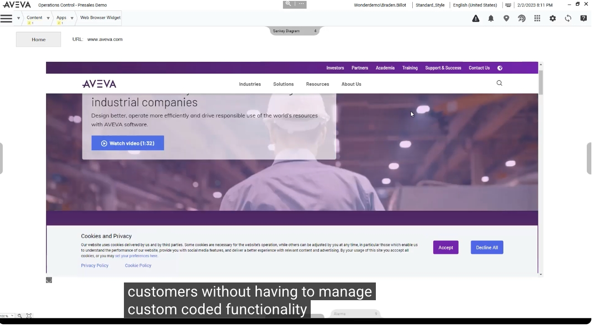

---

## 二、OMI Apps：可下載的操作管理介面擴充套件

AVEVA System Platform 提供多種可供下載安裝的 **OMI Apps（Operations Management Interface Apps，操作管理介面應用程式）**，讓使用者能夠直接在 AVEVA Operations Management Interface（OMI）應用程式中，顯示各種豐富的互動內容。

### 1. Map OMI App（地圖應用程式）

**Map OMI App** 可以在 OMI 應用程式中顯示 **互動式地圖**，例如下圖這個「Map Dynamic Assets」範例，透過地圖上的圖層（Layer Region、Layer State、Layer Country、Layer Default）與動態內容設定，即可在地圖上呈現各區域資產的分佈與相關資訊。

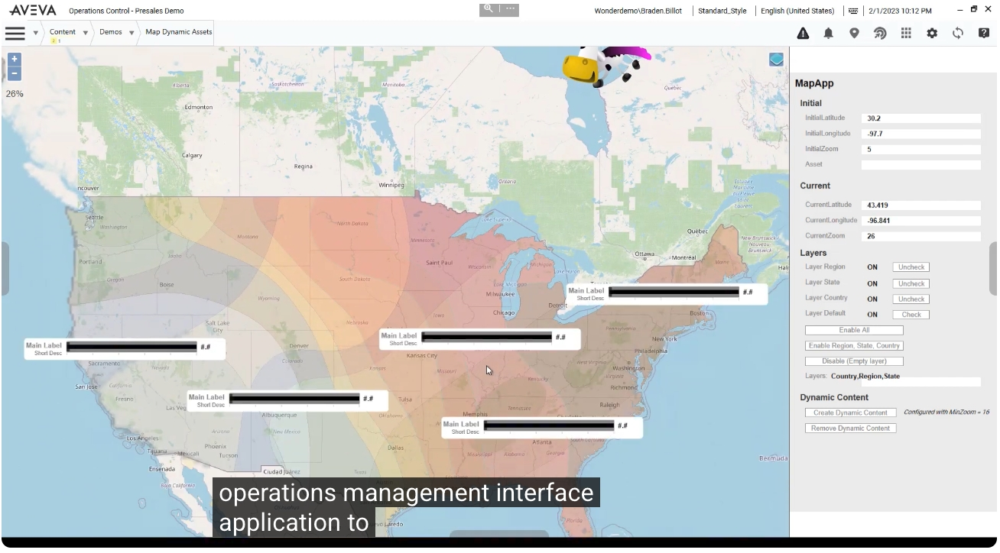

放大或移動地圖檢視範圍時，畫面上的標籤（Main Label）會隨之動態更新，顯示對應區域的名稱與相關數值，讓使用者能以地理視角快速掌握各地資產的營運狀態。

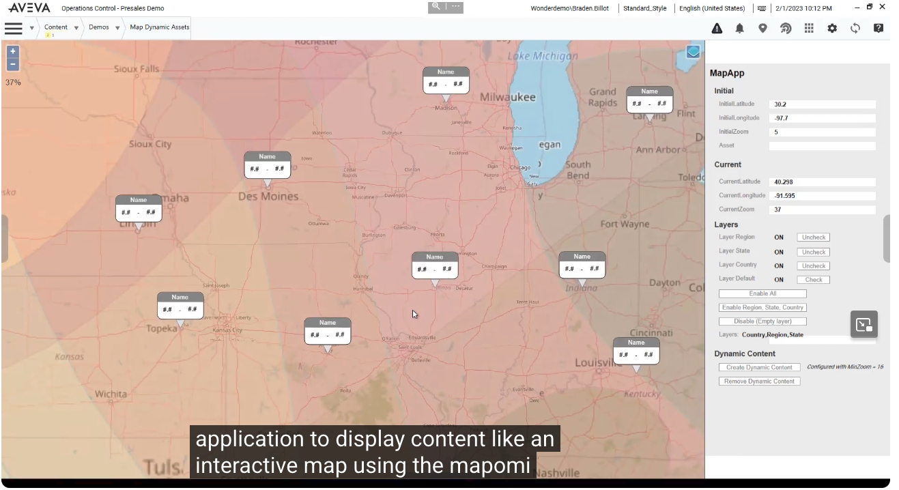

### 2. PLC Viewer OMI App（PLC 檢視器應用程式）

**PLC Viewer OMI App** 能夠在 OMI 應用程式中，直接呈現 **即時的 PLC 邏輯（Real-time PLC Logic）**。下圖顯示了一組 PlantPAX 控制器中的階梯圖邏輯（Ladder Logic），包含 RESET（重置）迴路的完整邏輯內容，讓工程人員可以直接在操作介面中檢視控制器內部的即時邏輯狀態，而不需要另外開啟專門的 PLC 程式設計軟體。

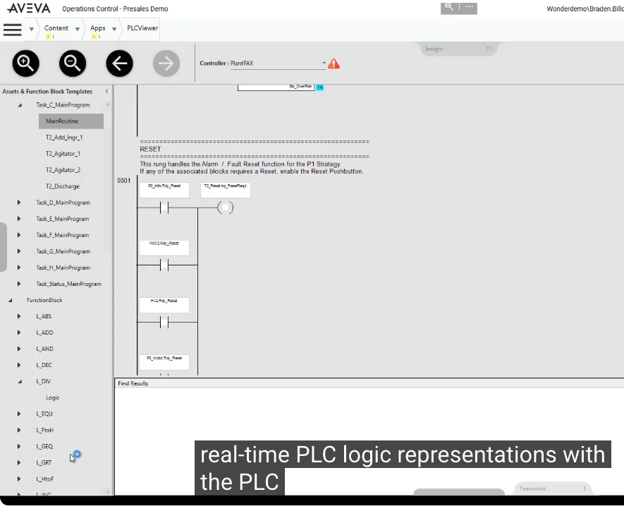

### 3. Sankey Diagram OMI App（桑基圖應用程式）

**Sankey Diagram OMI App** 則可用來 **視覺化流量資料（Flow Data）**，以桑基圖（Sankey Diagram）的形式呈現不同節點之間的物料或資料流向與比例關係。下圖範例「MYPRODUCTION」中，即以彩色流線清楚呈現不同生產線（如 Product2 到 Mixer1）之間的物料流動情形，讓使用者能一眼看出流程中各環節的相對佔比與流向。

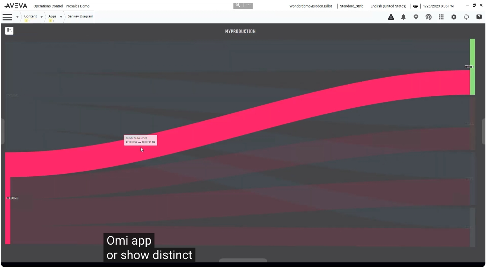

---

## 三、AVEVA Vision AI Assistant 整合：AI 影像辨識異常偵測

除了上述的視覺化 OMI Apps 之外，AVEVA System Platform 也能與 **AVEVA Vision AI Assistant**（無論是 AVEVA 自家產品或第三方產品）進行整合，透過人工智慧（AI）與機器學習（Machine Learning）演算法，協助企業提升異常偵測的能力。

### 1. 建立新技能（New Skill）

在 AVEVA Vision AI Assistant 中，可以選擇建立不同類型的 AI 技能（Skill Type），主要分為：

- **Discrete State Detection（離散狀態偵測）**：判斷影像屬於哪一種預先定義的狀態（例如 Good／Bad）。
- **Anomaly Detection（異常偵測）**：偵測影像中不同於正常狀態的異常情形。

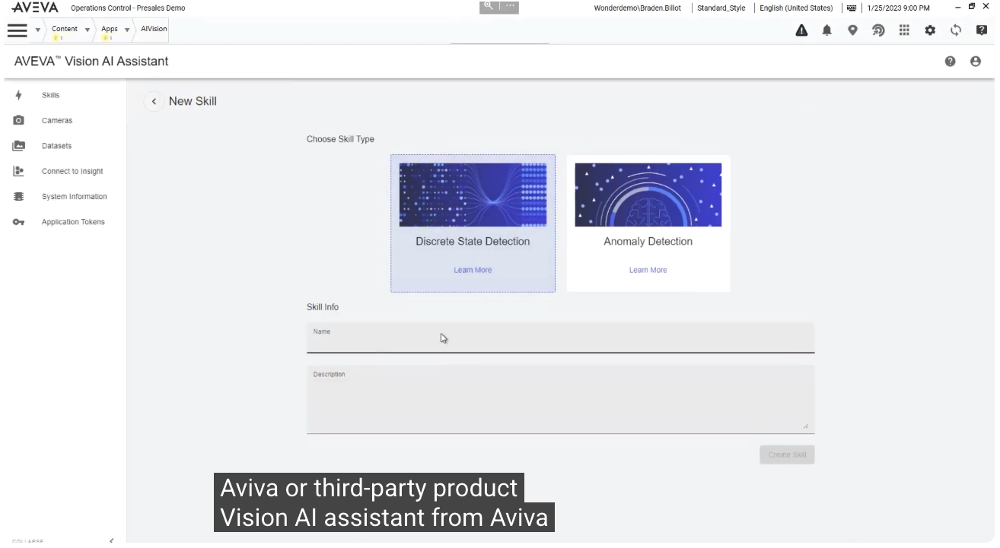

### 2. 訓練 AI 模型：匯入影像資料

以「Flare AI」這個離散狀態偵測技能為例，系統可以監控來自 **工業環境中各種攝影／成像裝置（Imaging Devices）** 的影像或視訊串流。使用者可以匯入影片或即時攝影機畫面作為訓練資料，並依需求設定擷取頻率（例如每分鐘一次、每 30 秒一次等）。

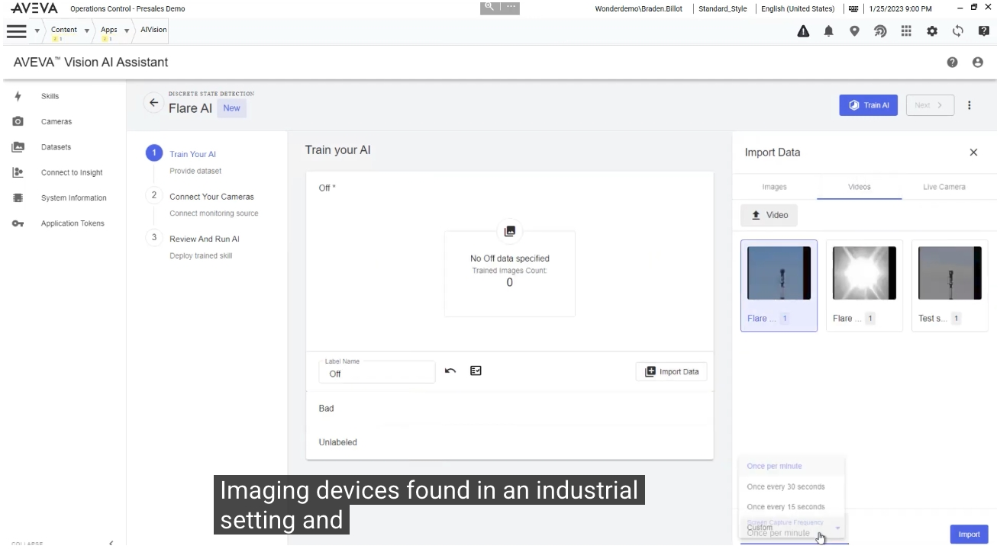

### 3. 連接監控攝影機

訓練完成後，下一步是 **連接欲監控的攝影機（Connect Your Camera）**，選擇要作為感測來源的網路攝影機，讓 AI 技能能夠即時監控該攝影機畫面中的異常狀況，並在偵測到異常時，透過內嵌於 OMI 應用程式中的通知機制，**讓相關人員知道現場可能有需要注意的情況**。

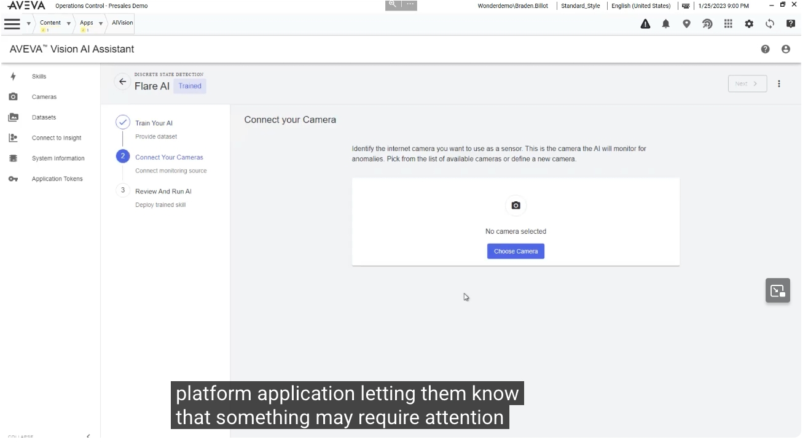

### 4. 檢視結果並部署技能

在「Review and Run AI（檢視並執行 AI）」頁面中，可以看到目前技能的準確率（Skill Accuracy）與混淆矩陣（Confusion Matrix，包含 True Good、False Bad、False Good、True Bad 等分類結果）。確認無誤後，即可點擊 **Deploy（部署）** 按鈕正式啟用該技能。部署後，系統發送的 **通知內容可以包含異常發生的確切位置與時間**，方便快速排查問題。

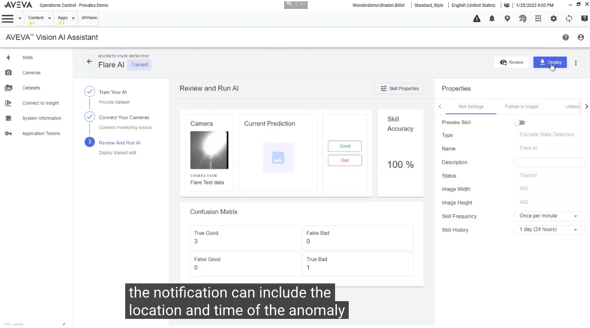

技能部署上線後，系統會持續依照即時影像進行分類判斷（Current Prediction），操作人員可以在「Deployed（已部署）」頁面中檢視所有被標記的影像結果，並視需要重新標註（Good／Bad），協助人員 **即時評估現場狀況，並採取適當的因應措施**。

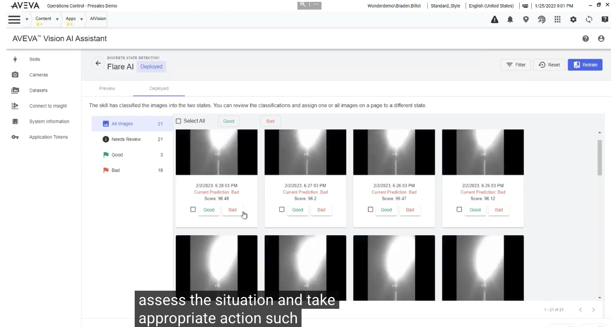

### 5. Anomaly Detection 異常偵測範例

除了離散狀態偵測之外，也可以建立另一種「Anomaly Detection（異常偵測）」類型的技能，同樣透過匯入大量影像資料進行訓練，展現 **人工智慧與機器學習如何用來持續改善** 異常偵測的準確度與效率。

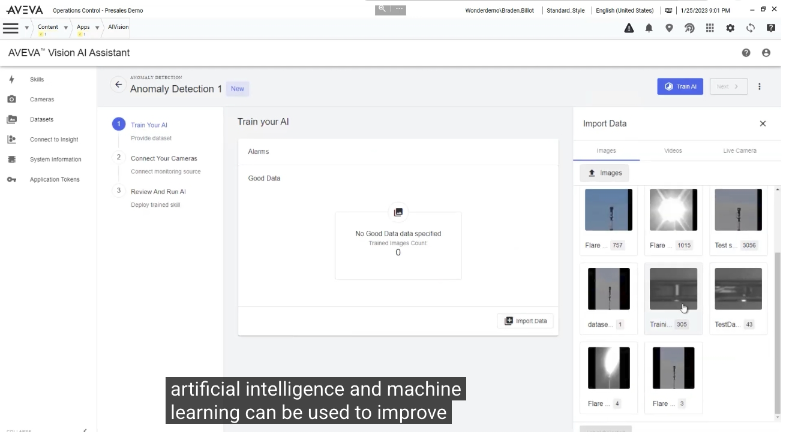

部署後的異常偵測技能，會將偵測到的異常影像自動標記為「Alarms（警報）」，操作人員同樣可以檢視、確認並視需要重新分類（Alarms／Good Data），再進行重新訓練（Retrain），持續強化模型的偵測能力，藉此提升整體 **異常偵測能力，並降低人工持續監看的需求**。

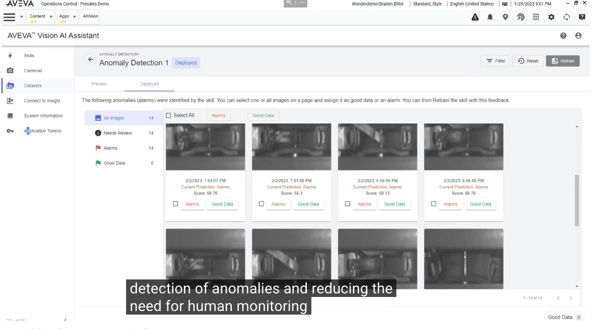

---

## 四、邁向 AVEVA Teamwork 協作平台

隨著 AI 技術大幅降低了人工持續監看的負擔，**操作人員便能將心力聚焦在更有價值的工作上**，這也自然銜接到下一項整合功能——**AVEVA Teamwork** 協作平台。透過在 AVEVA OMI 中嵌入 AVEVA Teamwork（Poka）的網頁內容，操作人員無需離開現有的操作介面，即可登入並存取協作平台的各項功能。

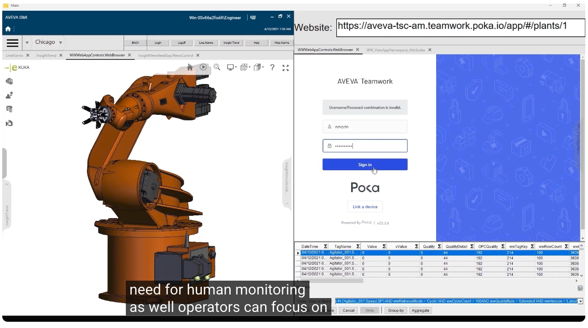

登入後，操作人員即可依照 **目前所在的工作站與工作內容情境**，直接取得該工作站相關的新聞消息（News Posts）、表單（Forms）、**工作說明書（Work Instructions）**、故障排除指南（Troubleshoots）與生產設定（Production Settings）等資訊，例如下圖以「Case Packer（打包機）」工作站為例，即可看到共 13 筆相關的工作說明書內容，讓 **使用者能在其目前工作地點的情境下，直接取得相關的新聞消息與資訊**。

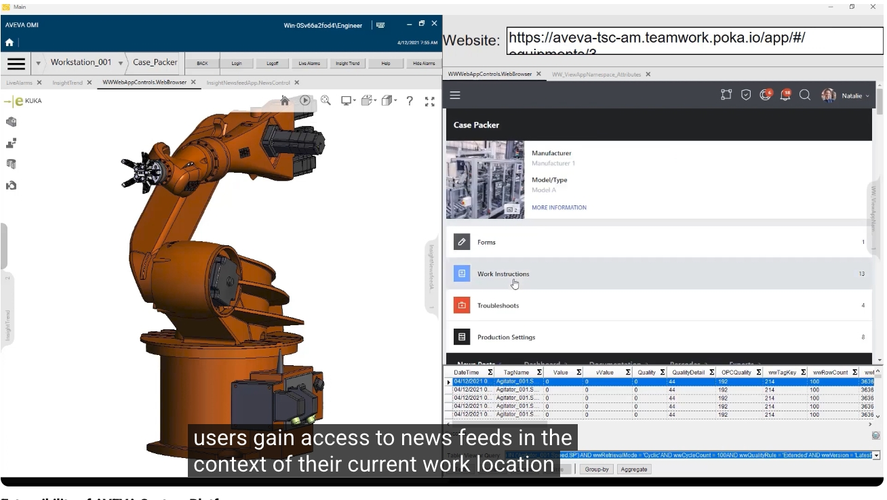

點選其中一筆工作說明書（例如「Lockout Procedure（LOTO，能量隔離上鎖程序）」）,即可直接在畫面中播放對應的教學影片，並確認觀看紀錄（Viewing confirmation）。這類內容通常是由企業內部（如 AVEVA 或客戶自身）依據現場實際需求，**辨識並標記為重要的更新內容**，確保第一線人員都能即時掌握最新的標準作業程序。

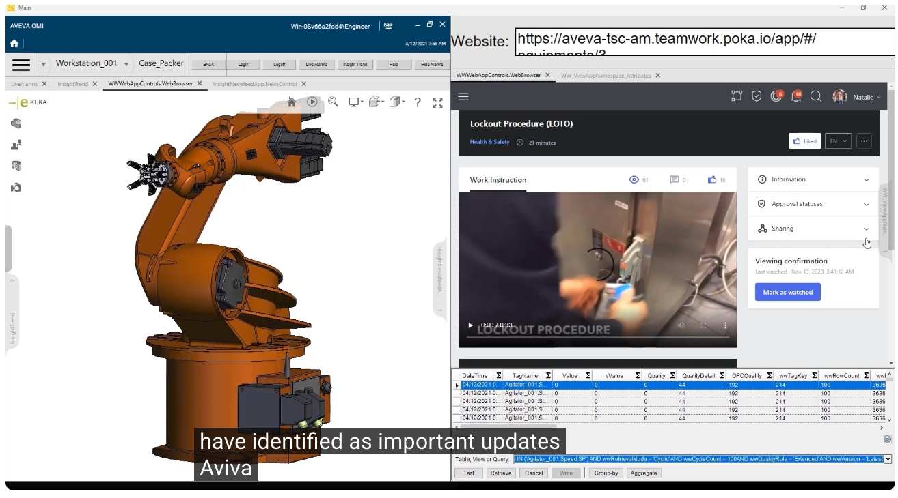

---

## 待續

本篇（上集）涵蓋了核心功能擴充概念、三種 OMI Apps（地圖、PLC 檢視器、桑基圖）、AVEVA Vision AI Assistant 的異常偵測整合，以及 AVEVA Teamwork 協作平台的初步應用。**下集** 將接續介紹 AVEVA Teamwork 的更多協作功能（如跨班別協作、與領域專家聯繫、記錄操作問題）、**AVEVA 製造執行系統（MES）** 的整合應用，以及供合作夥伴與客戶使用的 **自訂擴充套件開發工具組（Development Toolkit）**，敬請期待。

---

## 延伸資源

- 了解更多 AVEVA System Platform：<https://www.aveva.com/en/products/system-platform/>
