# AVEVA System Platform 的擴充性教學（下）

> 影片來源：[Extensibility of AVEVA System Platform](https://www.youtube.com/watch?v=Xz1QqsxOoLU&list=PLJq4rR8tWINyOrvwxbIjRvgTtoyuuEfSz&index=19)

本篇為系列教學的 **下集**（承接上集，圖片依序取自完整 37 張截圖中的最後 18 張），接續介紹 AVEVA Teamwork 協作平台的進階應用，並深入說明 **AVEVA 製造執行系統（Manufacturing Execution System, MES）** 的整合功能，最後介紹供合作夥伴與客戶使用的 **自訂擴充套件開發工具組（Development Toolkit）**。

> 💡 若尚未閱讀上集，建議先參考《AVEVA System Platform 的擴充性教學（上）》，了解核心功能擴充概念、三種 OMI Apps（地圖、PLC 檢視器、桑基圖），以及 AVEVA Vision AI Assistant 的異常偵測整合。

---

## 一、AVEVA Teamwork：記錄問題、連結專家、持續累積知識

延續上集介紹的 AVEVA Teamwork 協作平台，操作人員除了可以檢視工作說明書之外，也能直接在平台中 **記錄現場發生的操作問題**。下圖「Factory Feed（工廠動態消息）」畫面中，可以看到廠務經理（Plant Manager）針對「Zone 1」區域回報的維護紀錄，例如「幫浦運作異常（The pump is not performing well）」等現場問題，這類紀錄除了作為現場溝通管道之外，也可以 **搭配課堂培訓（Classroom-based Training）** 一併運用，強化知識傳承的效果。

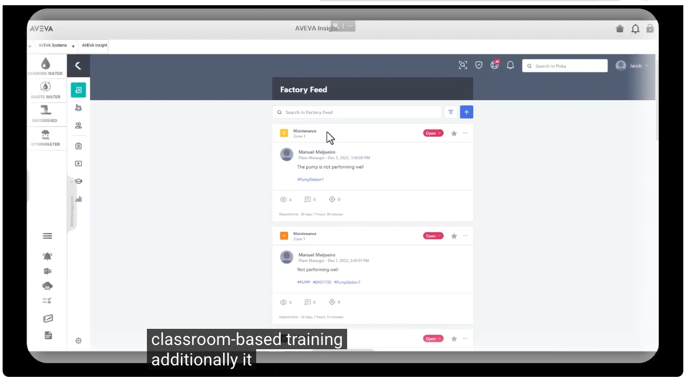

點選特定設備（例如「PumpStation1」抽水站），即可進一步檢視該設備的 **Experts（專家）** 名單，包含維護主管（Maintenance Supervisor）、技師（Mechanic）、持續改善協調員（CI Coordinator）等相關人員資訊。這樣的設計，確保當現場發生問題時，**正確的相關人員都能即時知悉，並提供必要的協助**，落實跨班別、跨部門的協作機制。

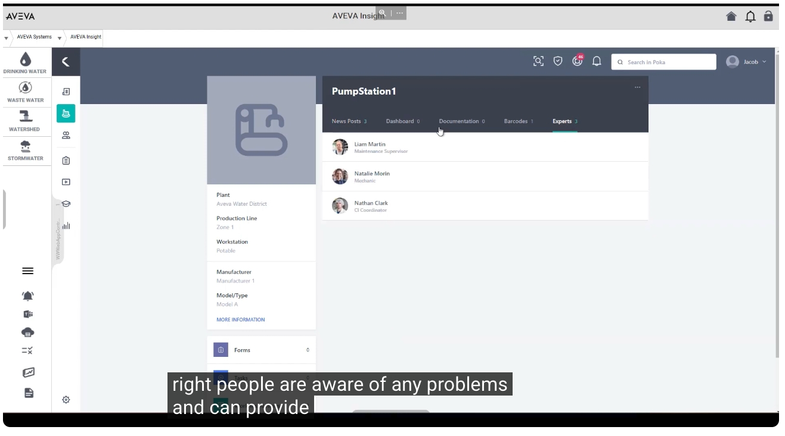

除了問題回報與專家聯繫之外，AVEVA Teamwork 平台中的「Training Content（訓練內容）」清單，會持續累積包含工作說明書（Work Instructions）與故障排除指南（Troubleshoots）在內的各類文件，並記錄其分類、擁有者、作者、建立日期、語言版本、審核狀態等資訊。這代表 **Teamwork 平台會持續成長，不斷擷取最佳實務做法**，成為企業知識庫的重要基礎。

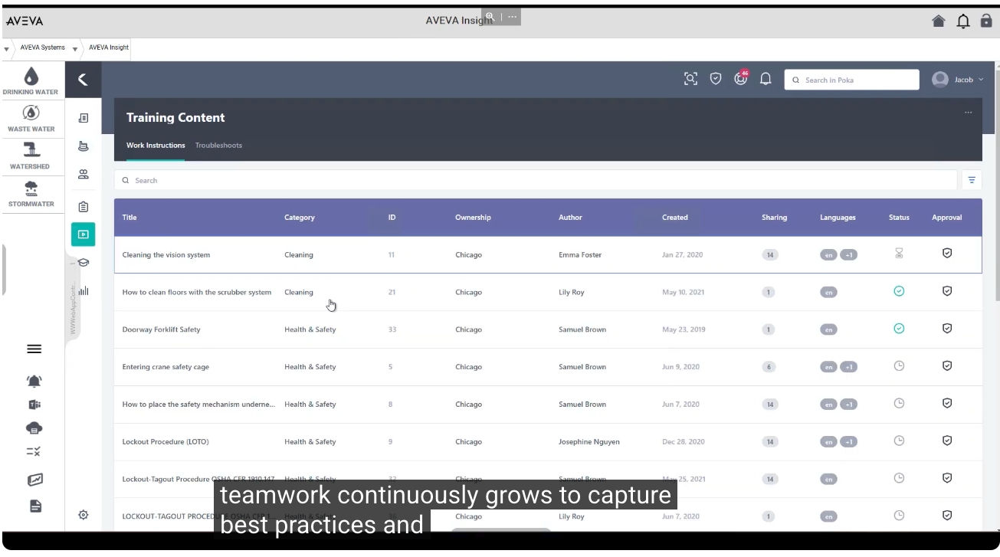

以「LOCKOUT-TAGOUT PROCEDURE OSHA CFR 1910.147」這份能量隔離上鎖標準作業程序文件為例，內容詳細記錄了設備隔離點位置、鎖定與標籤方式、各項檢查步驟，並可透過「Viewing confirmation（觀看確認）」機制追蹤人員的閱讀紀錄。這類標準化文件的目的，正是為了 **協助人員技能發展與流程改善**，進而提升整體作業安全與效率。

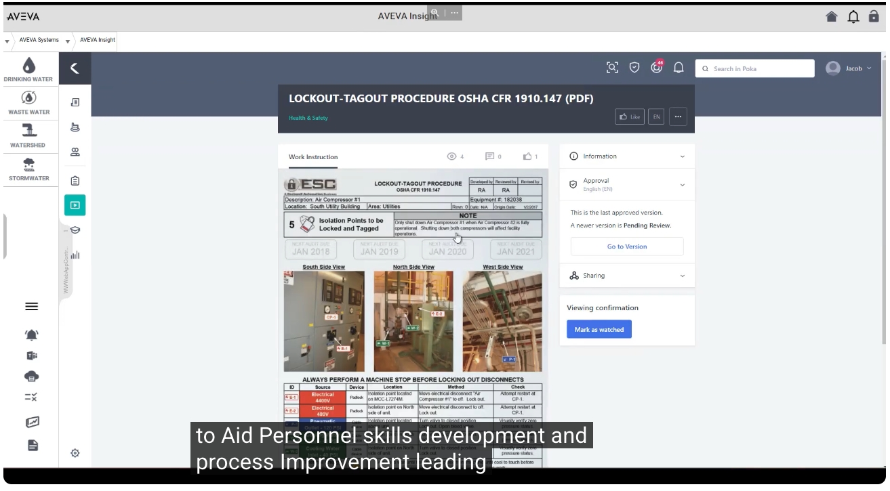

---

## 二、AVEVA 製造執行系統（MES）整合

介紹完 AVEVA Teamwork 之後，接著進入最後一項重點整合功能——**AVEVA 製造執行系統（Manufacturing Execution System, MES）**。下圖為「Model Driven MES」的主控台畫面，以立體工廠示意圖同步呈現各反應槽（Reactor）與生產線（Line）的即時產能百分比，這正是能夠有效提升 **整體績效與生產力** 的最後一項功能範例。

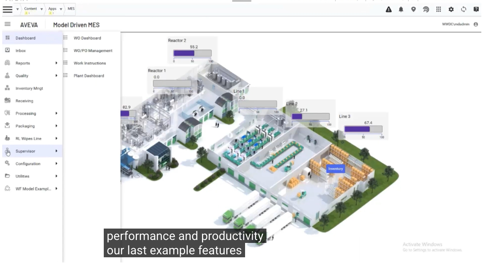

在「Work Order Dashboard（工單儀表板）」中，可以依狀態（NEW、READY、RUNNING、SUSPENDED）檢視所有生產工單的即時狀態卡片，每張卡片皆包含品項編號、需求數量、單位與發布日期等資訊，完整呈現 **AVEVA 製造執行系統** 的核心工單管理功能。

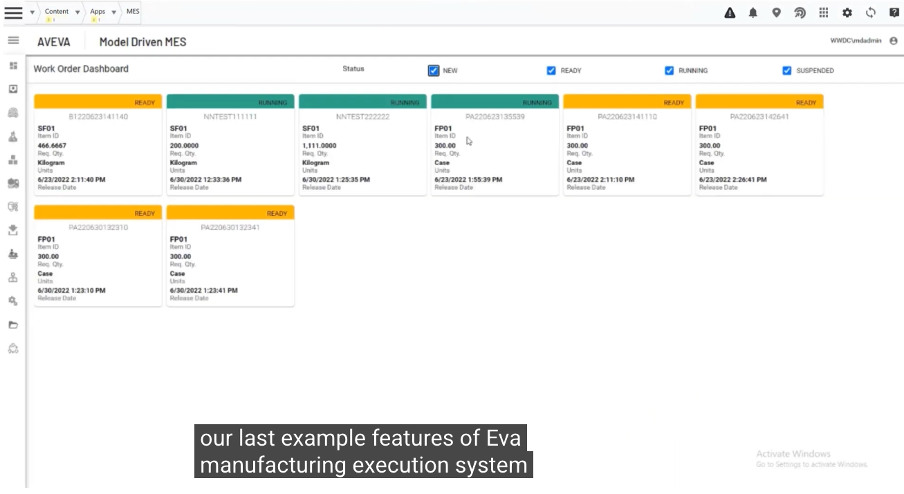

透過側邊選單，可以進一步存取 **WO/PO Management（工單／採購單管理）**、**Work Instructions（工作說明書）**、**Plant Dashboard（廠區儀表板）** 等功能模組，展現出 MES 系統與 AVEVA System Platform 之間 **自然且強大的整合能力**。

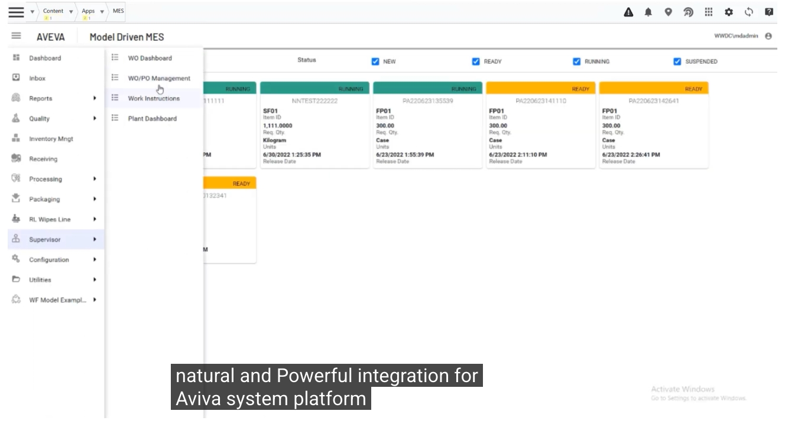

點選特定工單（例如 `NNTEST222222`），可以檢視其 **BOM（物料清單, Bill of Materials）** 內容與詳細的工單資訊（如起始數量、需求數量、優先順序、發布與到期日期等），這正是 AVEVA System Platform 用來 **確保生產績效** 的具體展現。

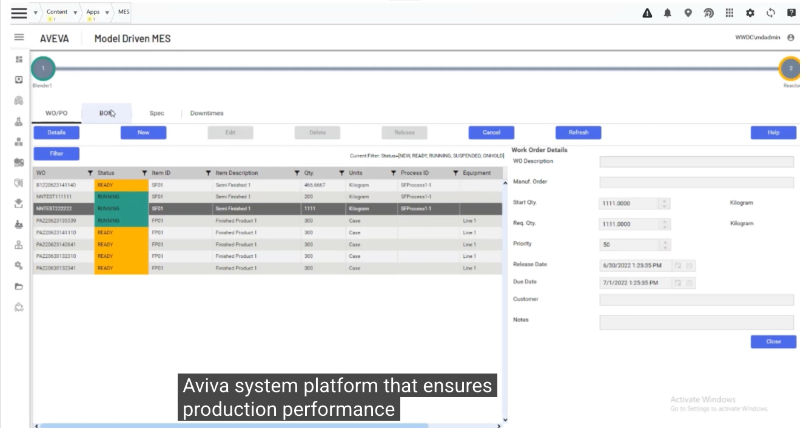

### 1. 品質管理與 SPC 統計製程管制圖

在「MES Quality（MES 品質模組）」中，系統提供多種 **SPC（Statistical Process Control，統計製程管制）圖表** 範例，包括單一檢視、雙檢視與四象限檢視，涵蓋 MA（移動平均）圖、p-Chart（不良率百分比圖）等統計工具，協助企業即時掌握製程穩定性。這正是 **AVEVA MES 提供多樣化功能，確保產品品質與消費者安全（Consumer Safety）** 的重要體現。

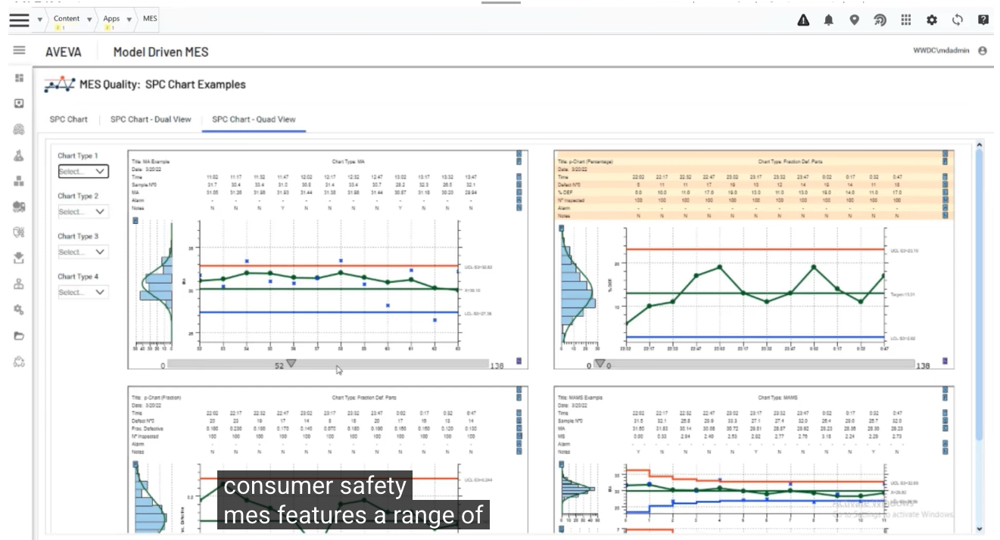

### 2. 庫存與批號追溯（Genealogy）

「Genealogy（批號族譜／追溯）」功能則以桑基圖形式，清楚呈現物料從貼標（Labeller）、包裝（Packer）到棧板堆疊（Palletizer）等各生產階段的批號流向與對應關係，並可查詢特定批號的生產數量、目前狀態與等級（如 GOODSTATE、GOODGRADE）等詳細資訊。這類功能正是為了支援 **日常作業流程與資料蒐集工作** 而設計。

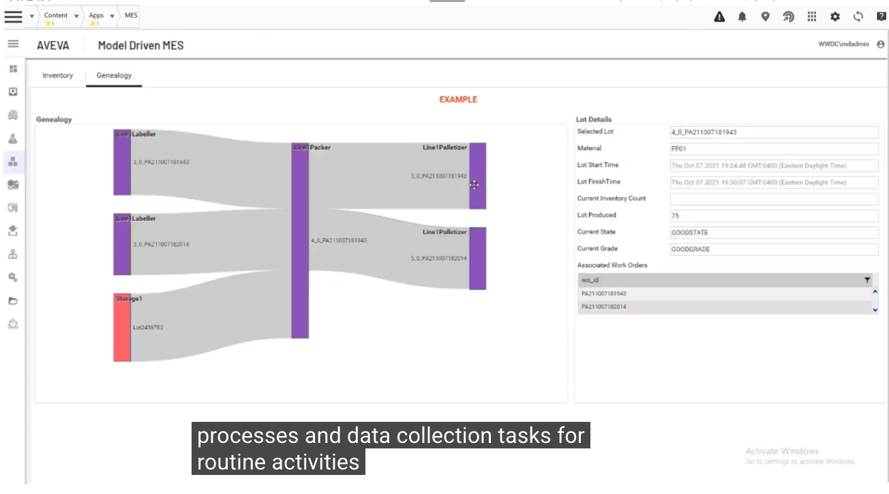

### 3. 透過 Power BI 整合強化資料視覺化

MES 系統也內建了與 **Power BI** 整合的生產報表（Production Report），彙整每小時產量、總拒收率、生產與目標對比等關鍵指標，並可依實體（Entity）檢視各生產線的產量分佈，大幅 **提升企業對生產狀況的能見度**。

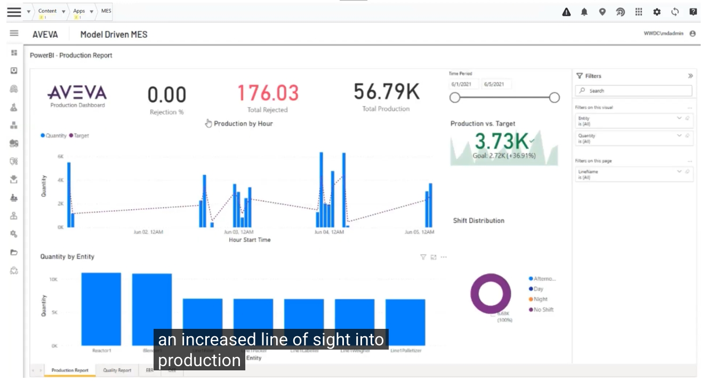

同樣地，「Quality Report（品質報表）」也整合了各項品質檢驗數據（如視覺缺陷檢查、pH 值檢查、溫度檢查、金屬檢測等），協助管理階層掌握 **製程中每個環節的產量與品質狀況**。

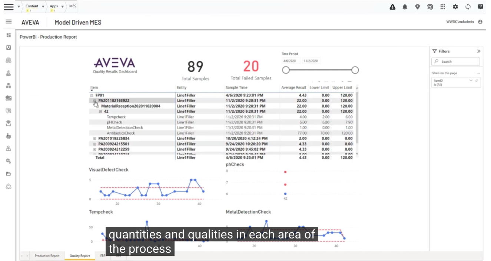

### 4. 現場作業執行與稼動率追蹤

在實際生產現場，操作人員可透過「Line1Filler（產線 1 充填機）」的作業畫面，檢視目前工單佇列（Queue）狀態、開始生產（Start）、暫停（Suspend）、完成（Complete）等操作，這類即時的現場管控機制，**對於確保製程順暢運作尤其重要**。

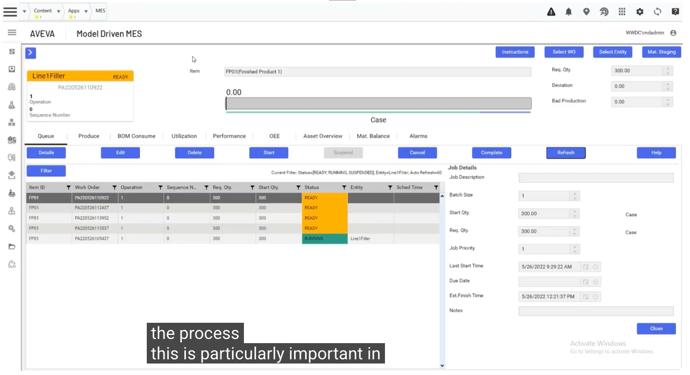

而在「Utilization（稼動率）」頁籤中，可以詳細記錄設備在不同時間區段內的運作狀態（如 DOWNTIME、RUNNING、MAINTENANCE、STOPPED）及對應原因（如電氣故障、堆疊機故障、清潔作業等），協助企業從稼動率角度掌握現場狀況，藉此 **確保消費者安全，並確保產品符合所需的品質標準**。

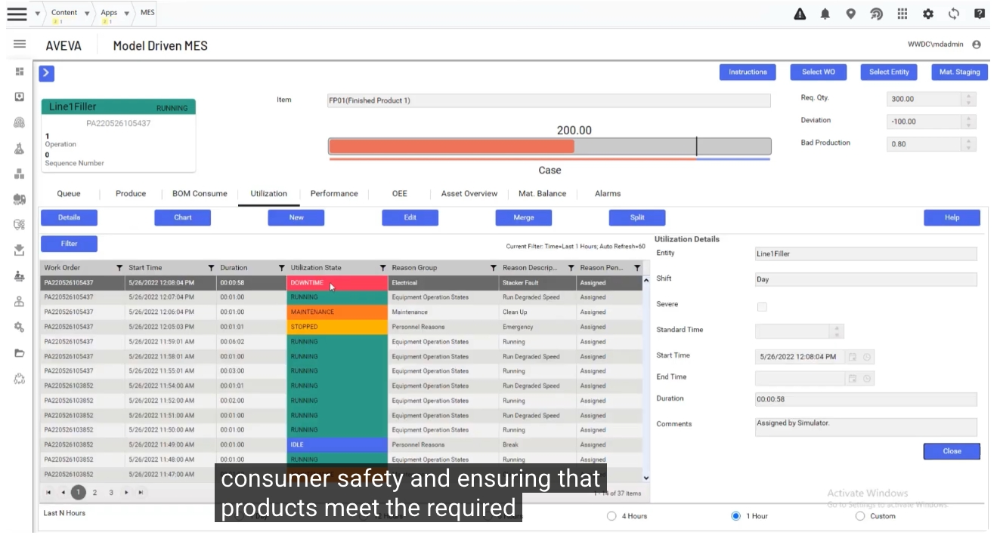

進一步切換至「Asset Overview（資產總覽）」時間軸檢視，可以用色塊方式直覺呈現一段時間內設備各種運作狀態的分佈情形（例如維護、停機、正常運轉等），點選特定色塊即可查看詳細的維護紀錄（如 Clean Up 清潔作業的起訖時間）。這也自然帶出下一個主題：**AVEVA 同樣提供多種整合方案（Integrations）**，可與 System Platform 及 MES 系統搭配使用。

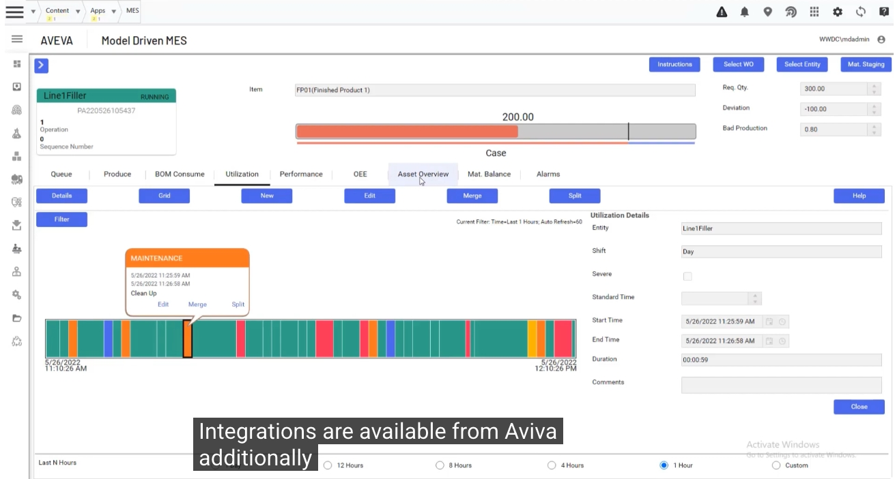

---

## 三、自訂擴充套件開發工具組（Development Toolkit）

除了前述由 AVEVA 官方提供的各項 OMI Apps 與整合方案之外，**客戶與合作夥伴也可以運用一套開發工具組（Development Toolkit），自行建置專屬的自訂擴充套件（Custom Extensions）**。下圖為整合 Power BI 的「Executive Summary - Sales Report（高階主管銷售報表摘要）」範例，呈現依年度、月份篩選的銷售金額趨勢與各類別銷售佔比分析。

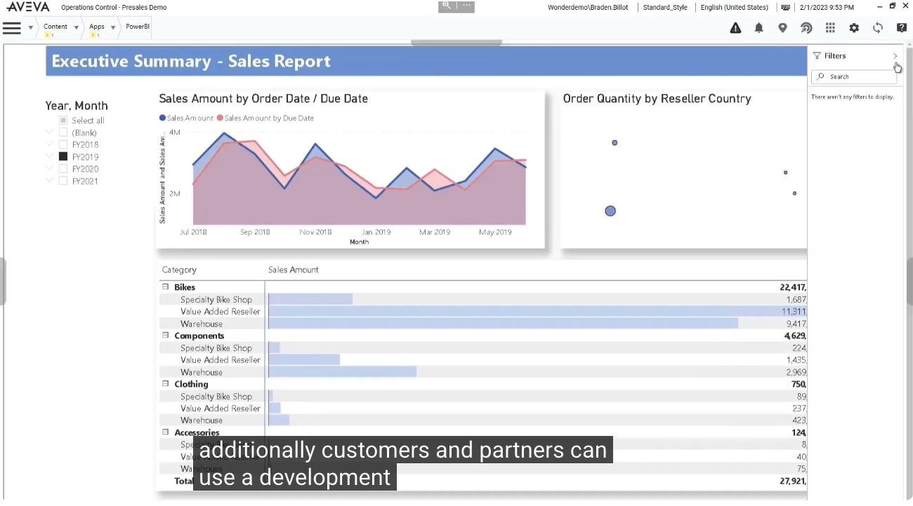

另一個範例「District Monthly Sales（分區月銷售報表）」，則以長條圖、瀑布圖與泡泡圖等多種視覺化方式，呈現不同分區經理（District Manager）所轄門市的銷售表現與變異分析。這類 **自訂擴充套件可以被匯入（Imported），並在不同應用程式之間共享（Shared）使用**，大幅提升企業內部資源的重複運用效益。

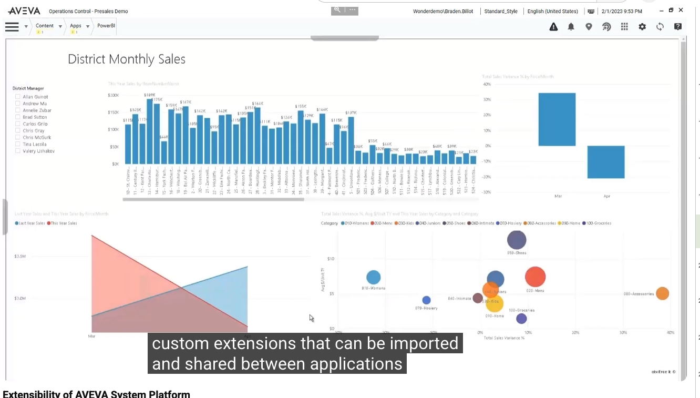

無論是官方提供的 OMI Apps、AI 影像辨識整合、Teamwork 協作平台、MES 製造執行系統，或是客戶與合作夥伴自行開發的客製化內容，最終都能夠 **被整合組裝進同一套 AVEVA System Platform 應用程式** 之中，形成一個高度彈性、持續演進的工業自動化解決方案。

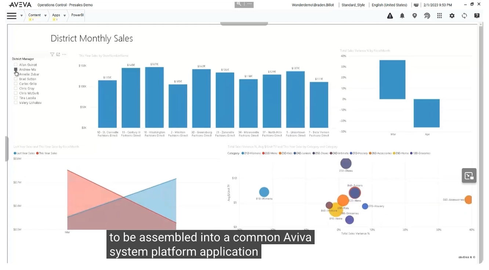

---

## 四、總結

透過本系列上、下兩集的介紹可以看到，**AVEVA System Platform 的擴充性** 涵蓋了相當廣泛的面向：從即拿即用的 OMI Apps（地圖、PLC 檢視器、桑基圖），到結合人工智慧的 Vision AI Assistant 異常偵測；從強化跨班別協作與知識傳承的 AVEVA Teamwork，到提供完整生產與品質管理能力的 AVEVA MES；乃至於開放給客戶與合作夥伴自行擴充的開發工具組——這一切都讓企業能夠在 **無需自行管理大量客製化程式碼** 的前提下，持續為 System Platform 應用程式增添符合自身業務需求的新功能，兼顧標準化、彈性與長期可維護性。

---

## 延伸資源

- 了解更多 AVEVA System Platform：<https://www.aveva.com/en/products/system-platform/>
