# AVEVA Operations Management Interface（OMI）簡介教程

> 影片來源：[Introduction to AVEVA Operations Management Interface](https://www.youtube.com/watch?v=4wzjEYDHkvU&list=PLJq4rR8tWINyOrvwxbIjRvgTtoyuuEfSz&index=21)

---

## 一、前言：HMI／SCADA 走向 OT 與 IT 融合

現代的 HMI 與 SCADA 系統，正逐漸演變為同時涵蓋「操作技術（OT）」與「資訊技術（IT）」的融合平台。這類系統需要呈現多樣化的內容，協助使用者能夠迅速回應生產績效與製程事件。AVEVA Operations Management Interface（簡稱 OMI）正是為此而生，建立起一套現代化的視覺化與控制方式，用來管理工業製程操作。

OMI 是 AVEVA System Platform 的視覺化引擎與核心元件之一。

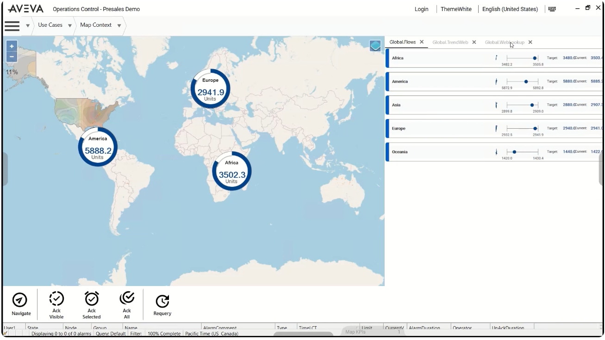

---

## 二、以 System Platform 的資料與物件架構為基礎

OMI 視覺化引擎會運用 AVEVA System Platform 既有的資料與物件架構（Data and Object Architecture），在各種裝置類型上提供豐富一致的圖形化體驗。

在 System Platform IDE 中，使用者可以建立模型化的資產階層（Model - Tagname），將企業、廠區、系統等結構以樹狀方式呈現。

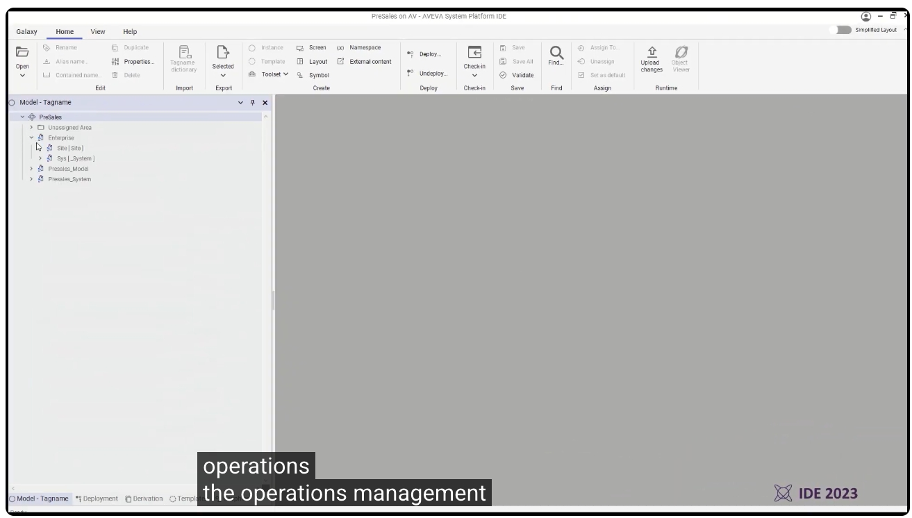

當資產階層展開後，例如各國家或地區節點，都可以對應到實際的資料來源，這正是 OMI 能夠「利用系統平台的資料與物件架構來提供豐富體驗」的基礎。

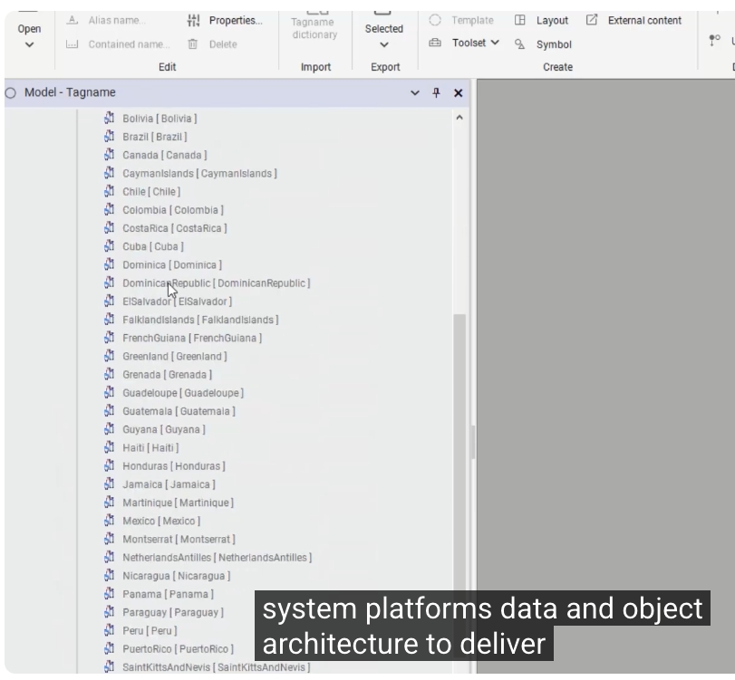

---

## 三、以預先定義的模型動態組裝應用程式

透過這樣的物件架構，應用程式的內容可以依照「預先定義好的模型」動態組裝，這個模型會模擬實際設備的結構與分組方式。如此一來，不僅能大幅減少長期的工程建置量，也能透過「以情境為導向的關聯（Context-driven Relationships）」，改善整體的操作管理成效。

例如在物件的 Attributes 頁籤中，使用者可以定義如警報訊息（AlarmMsg）等屬性，並將其與圖形內容（如 EffTurbSym、meter 等符號）建立關聯。

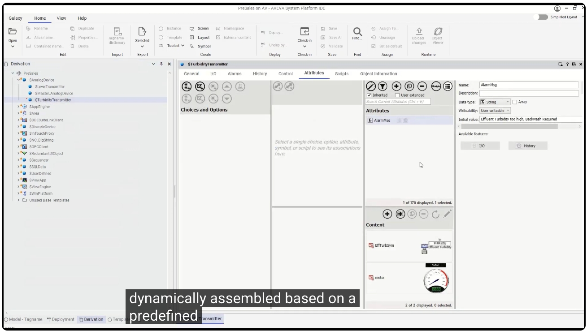

使用者也可以直接以既有的物件（如 $TurbidityTransmitter）建立新的實例（Instance）或衍生樣板（Derived Template），達到「重複利用、減少工程時間」的效果。

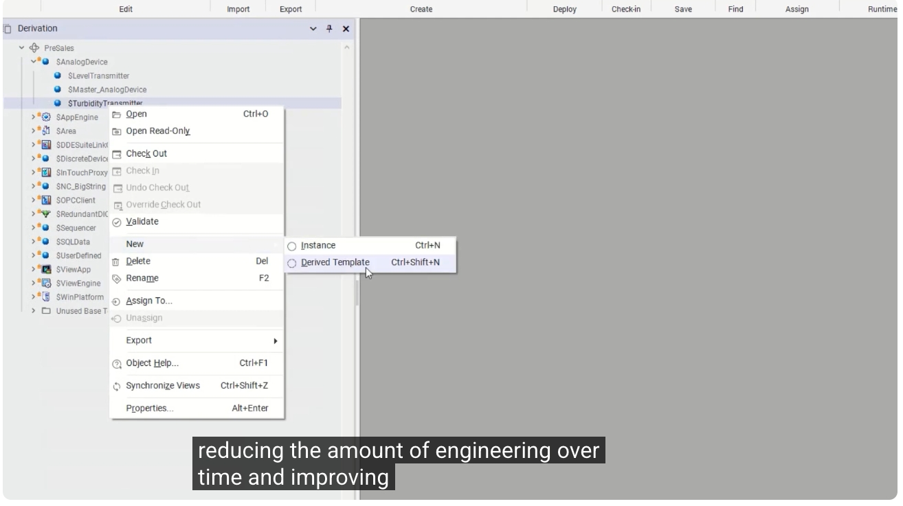

---

## 四、向量圖形與豐富的圖形庫

OMI 具備向量圖形（Vector-based Graphics）的特性，能自動配合任何裝置螢幕的尺寸進行調整。使用者可以從完整的工業專用圖形庫中，選用各種圖表、按鈕與動畫元件，來建立應用程式；當然也可以匯入或自行製作圖形，以呈現任何製程或操作上的需求。

在 Graphic Toolbox 中，即可看到如類比儀表（Analog Meters）等豐富的內建圖形元件庫，方便快速拖放使用。

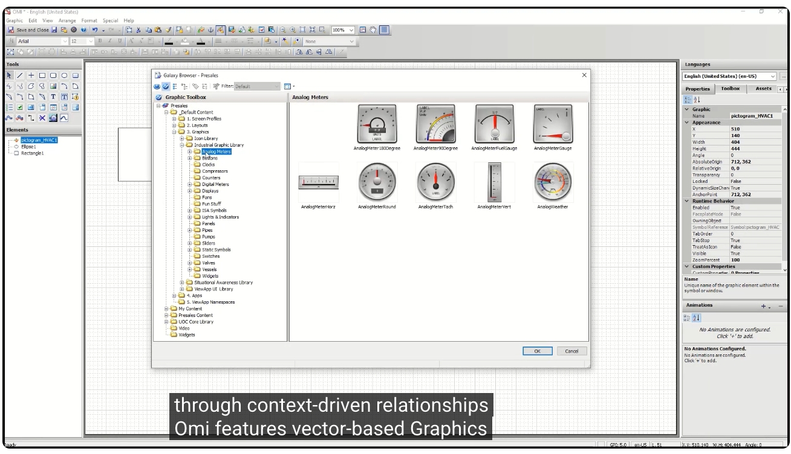

---

## 五、完整支援觸控手勢操作

OMI 完整支援常見的觸控手勢，例如點觸（Touch）、滑動（Swipe）與縮放（Zoom），並且能依照縮放層級來決定隱藏或顯示特定內容。此外，系統也支援拖放（Drag and Drop）、滑動並點擊（Slide and Tap）、觸控並拖曳（Touch and Drag）、點擊並旋轉（Tap and Rotate）等多種手勢，以及單指、雙指、三指以上的不同操作方式。

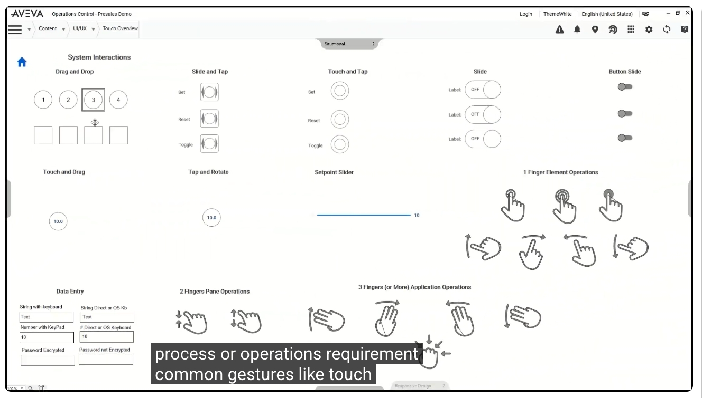

---

## 六、以情境察覺（Situational Awareness）與高效能 HMI 提升可讀性

OMI 提供並鼓勵採用創新的設計手法，例如「情境察覺（Situational Awareness）」或「高效能 HMI（High-Performing HMI）」標準，藉此改善使用者對資料的解讀方式，並協助他們採取最適當的行動。這樣的設計理念，能讓應用程式「代替使用者完成繁重的判讀工作」，將複雜的資訊拆解為容易理解的畫面呈現方式。

在「Situational Awareness Examples」畫面中，可以比較「較差（Poor）」與「較佳（Better／Best）」的視覺化呈現方式，例如以量表結合區間標示，取代單純的數字顯示，讓操作人員一眼就能判斷數值是否接近設定點、是否超出操作範圍、是否接近警報上限，以及是否需要人為介入。

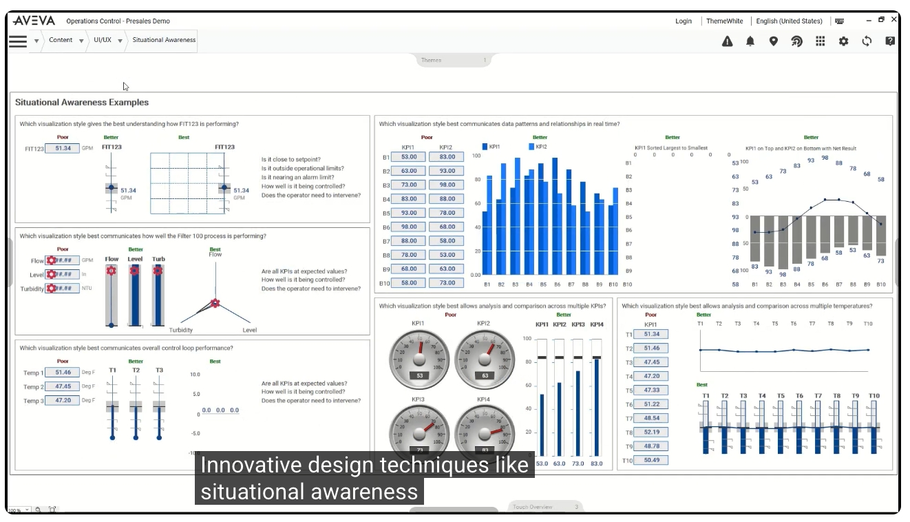

除了單一 KPI 的呈現方式之外，這類設計原則也適用於多個關鍵績效指標（KPI）的整合比較，例如透過長條圖、折線圖、雷達圖等多種圖表組合，呈現生產過程中的比較、組成、時間趨勢等不同構面的資訊，協助使用者更快掌握全貌並做出判斷。

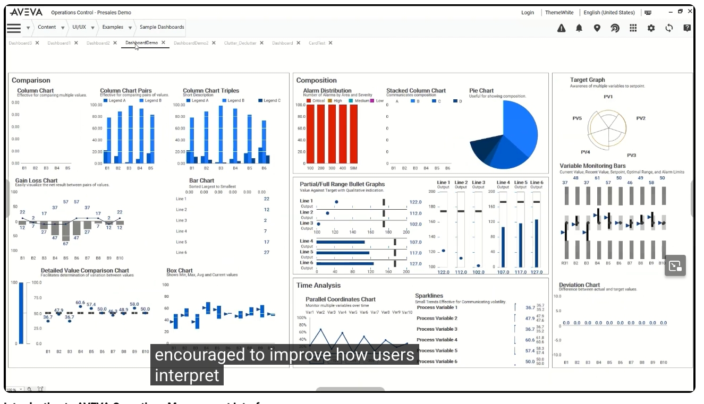

---

## 七、以響應式版面配置（Responsive Layout）為核心的設計

OMI 的設計核心，圍繞在「響應式版面配置（Responsive Layout）」的運用上，這樣的版面可以依照不同的使用情境與裝置類型（例如平板、手機、多螢幕工作站，甚至是大型影像牆）進行客製化調整。

在版面編輯工具中，每個窗格（Pane）都可以個別設定其內容類型、尺寸比例、背景樣式與互動模式等屬性。

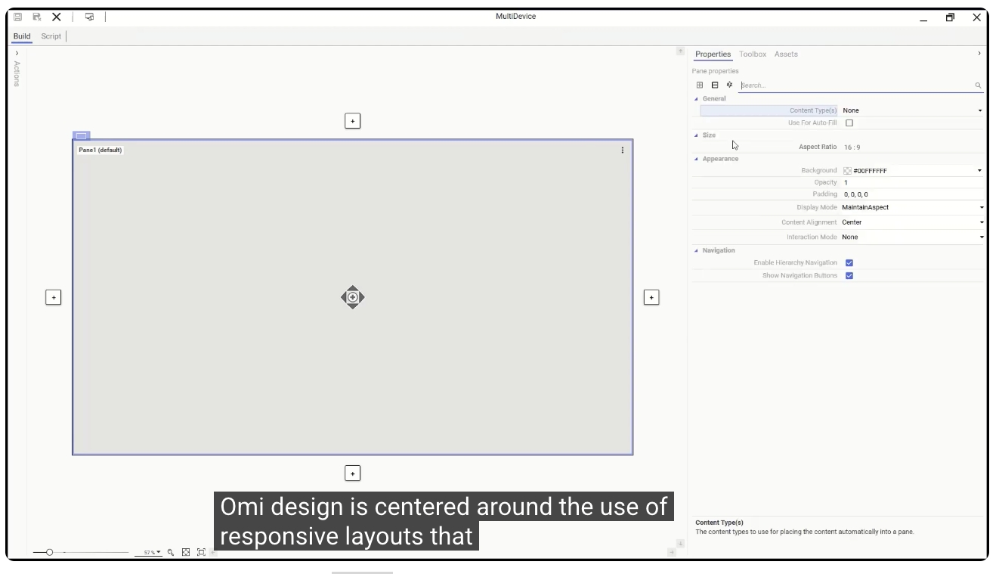

版面配置同時也定義了各個窗格之間的行為與互動方式，這帶來了極大的彈性，讓 OMI 應用程式能夠依照不同的螢幕解析度（例如手機的直向畫面），自動調整欄位配置的方式，呈現出符合裝置特性的操作介面。

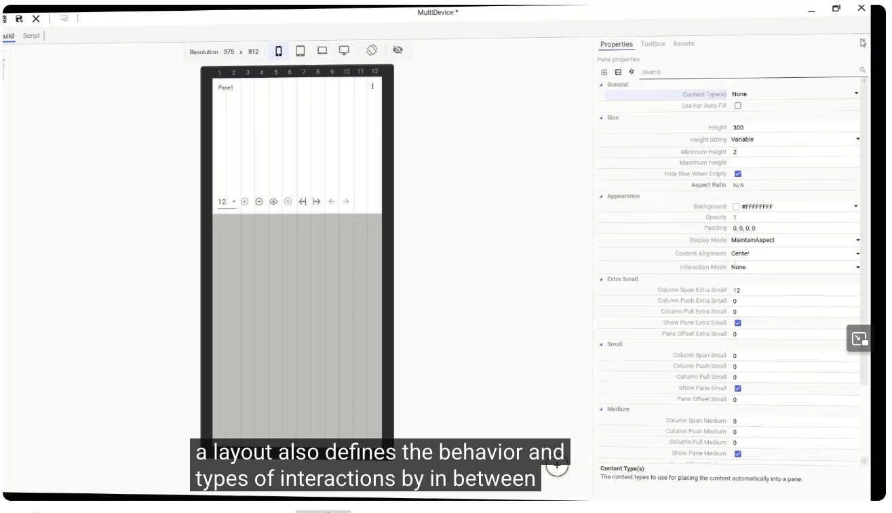

這樣的彈性設計，讓使用者在安排 OMI 應用程式時，能夠依照製程、設備與區域等不同的情境需求，靈活地呈現專屬的內容組合，例如生產量、速度合規性、計數統計、瓶頸分析、停機時間與工單資訊等各類儀表板卡片。

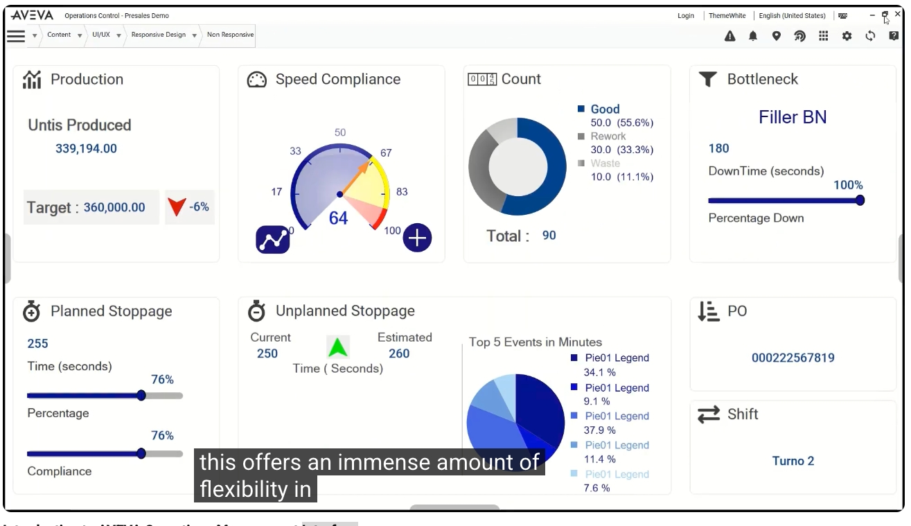

使用者在跨裝置存取，以及在應用程式中導覽切換時，都能享受到這種自適應設計所帶來的一致體驗。

---

## 八、以資產模型驅動導覽與內容切換

OMI 會運用 AVEVA System Platform 中的資產模型（Asset Model），動態產生導覽結構與相對應的內容關聯。

例如在下圖中，多種圖表（長條圖、圓餅圖、雷達圖等）便是依據資產模型的結構動態產生，呈現出不同資產（如各條產線、各項製程變數）之間的比較與趨勢分析。

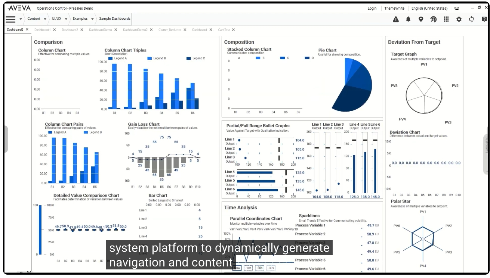

當使用者在資產階層中切換所在位置時，畫面窗格中的內容也能自動隨之交換，不需要另外重新設計畫面，這樣的機制進一步降低了整體應用程式的工程建置需求。

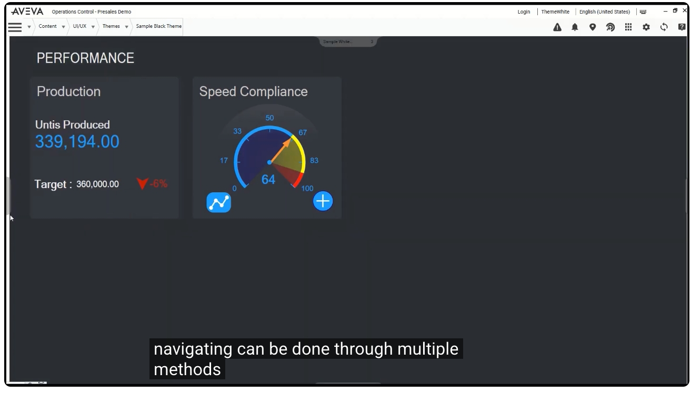

---

## 九、多元的導覽方式與資料來源動態切換

使用者可以透過多種方式在 OMI 應用程式中進行導覽，包括：導覽樹（Navigation Tree）、下拉式選單、麵包屑導覽列（Breadcrumb），或是直接點擊圖形元件在不同區域之間切換。

當畫面需要呈現許多相似資產的關鍵績效指標（KPI）與屬性時，這種導覽方式格外重要——因為同一套版面配置，只要更換所連結的資料來源，就能重複用來讀取任何新選定資產的資料，而不需要為每個資產重新設計一份畫面。

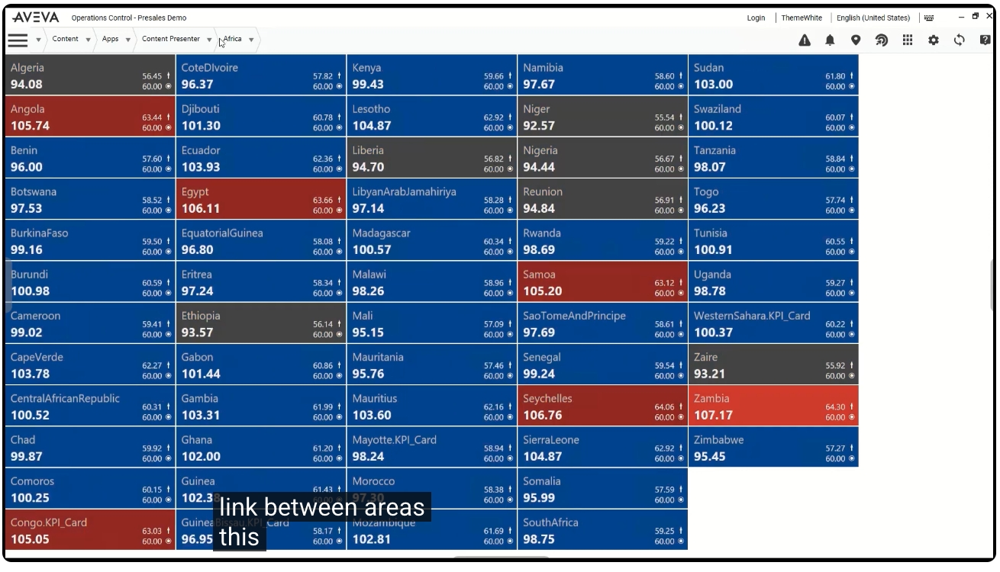

---

## 十、以情境為基礎的額外洞察與警報指標

除了導覽與資產階層之外，額外的洞察資訊（例如警報指標）也能與目前的導覽情境及資產階層緊密結合。當使用者切換到某個新選定的資產時，畫面便會自動呈現該資產相關的額外資訊與警報狀態。

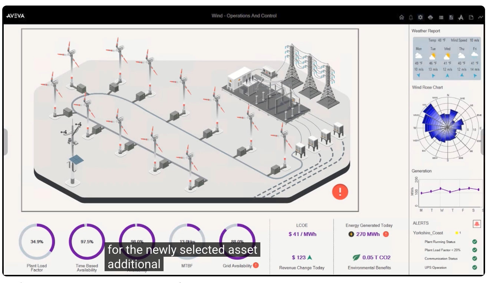

透過 AVEVA OMI，使用者可以檢視並操作彙總後的警報（Aggregated Alarms），系統會依照區域或資產類型，統計出警報的數量與嚴重程度，提供整體情況的摘要。

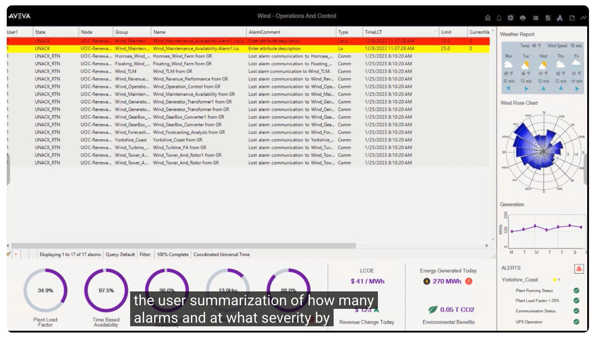

這對於現場操作人員而言，是相當關鍵的資源，能協助他們快速掌握哪些地方存在最需要優先處理的重大問題。系統會以直覺化的方式，依照使用者目前關注的區域，來呈現警報的相關性。

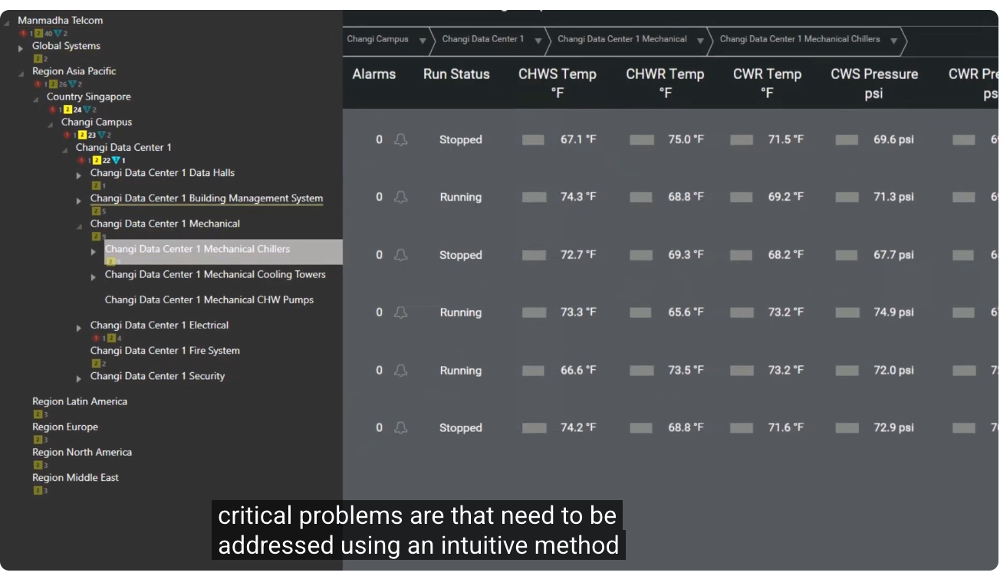

換句話說，警報的呈現方式會根據使用者當下所聚焦的區域範圍而調整，讓最相關、最迫切的資訊自然地浮現在眼前。

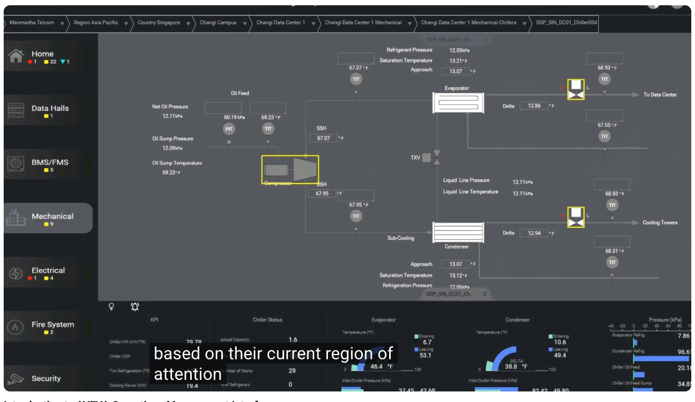

---

## 十一、綜合應用案例：電力系統（UPS）監控

以資料中心的電力系統（Electrical）為例，透過左側的資產階層導覽（Home、Data Halls、BMS/FMS、Mechanical、Electrical、Fire System、Security 等），使用者可以進一步鑽入至「Changi Data Center 1 Electrical UPS」節點，檢視多台不斷電系統（UPS）的即時狀態列表，包括服務區域、目前狀態、警報圖示、剩餘可支撐時間、電壓、電流與電池溫度等資訊，一目了然地掌握整體電力設備的健康狀況。

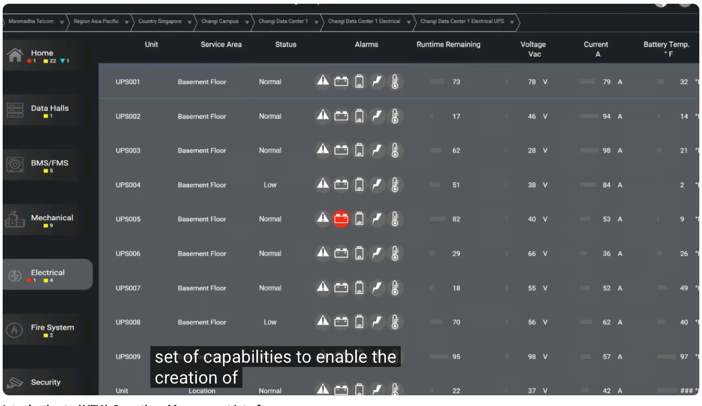

點選某一台 UPS（例如 UPS005）後，畫面會切換為該設備的單線圖（One-line Diagram），以圖形化方式呈現市電（Mains）、靜態旁路（Static Bypass）、整流器（Rectifier）、變流器（Inverter）、靜態開關（Static Switch）與電池（Battery）之間的連接關係，並同時顯示溫度、類比參數（如實功率、頻率、功率因數）與各類 UPS／電池警報狀態。這正體現了前面章節所提到的「以資產模型驅動導覽、切換窗格內容」的設計理念：同一套版面配置，只要更換所連結的資料來源，即可呈現不同 UPS 設備的即時資訊。

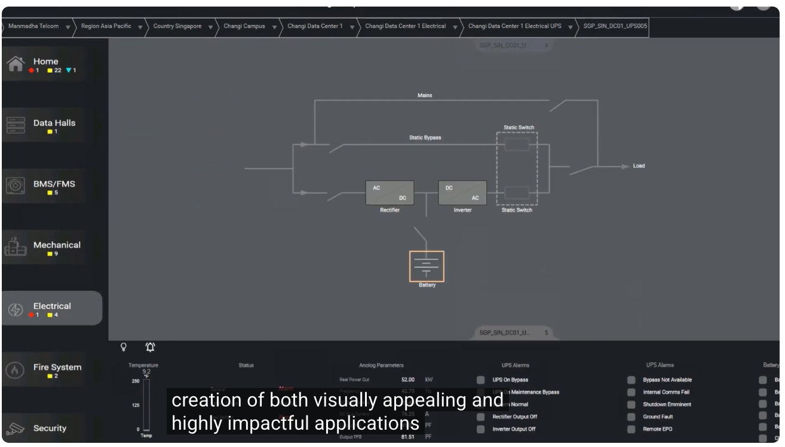

---

## 十二、總結

綜合以上內容，AVEVA System Platform 與 Operations Management Interface（OMI）共同提供了一套涵蓋範圍相當廣泛的能力，協助使用者建立既「具視覺吸引力」又「高度具影響力」的工業操作應用程式。整理本教程的重點如下：

1. **以資料與物件架構為基礎**：OMI 直接運用 System Platform 既有的資料與物件模型，減少重複建置的工程負擔。
2. **動態組裝與情境關聯**：應用程式內容可依據預先定義的資產模型自動組裝，並透過情境導向的關聯性，降低長期維護成本。
3. **豐富的圖形與手勢支援**：內建向量圖形庫，並完整支援觸控、滑動、縮放等多種手勢操作，適應各類裝置。
4. **情境察覺與高效能 HMI 設計**：協助使用者更快速、更準確地解讀製程資料，並採取正確行動。
5. **響應式版面配置**：讓同一套應用程式能彈性因應不同裝置（手機、平板、多螢幕工作站、影像牆等）呈現最適合的畫面配置。
6. **資產模型驅動的導覽與內容切換**：同一套畫面版型可套用在多個相似資產上，只需切換資料來源，即可大幅減少重複設計的工作量。
7. **情境化的警報彙總與洞察**：透過依區域、資產類型彙總的警報摘要，協助操作人員快速鎖定最需要優先處理的關鍵問題。
8. **實務應用案例**：如電力系統 UPS 監控畫面，正是上述設計理念在實際場域中的具體展現。

透過這些功能的整合，AVEVA OMI 讓企業能夠以更少的工程投入，打造出兼具美觀與實用價值的工業操作管理應用程式。
