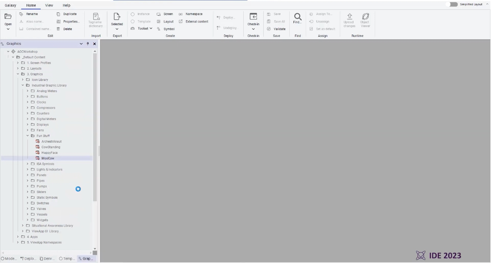
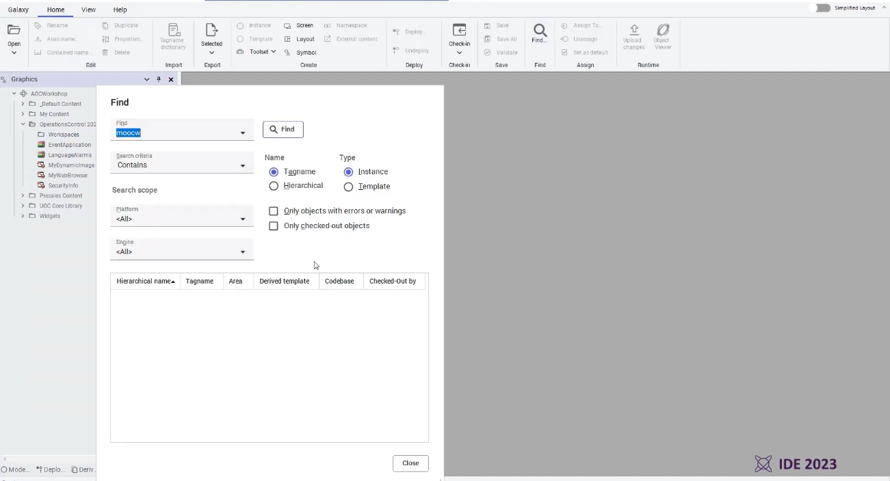
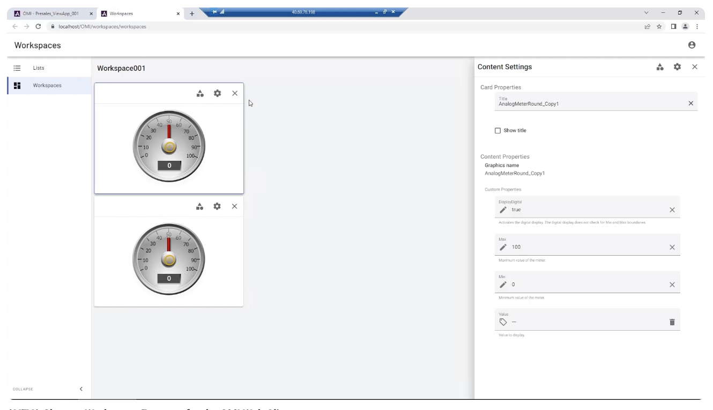
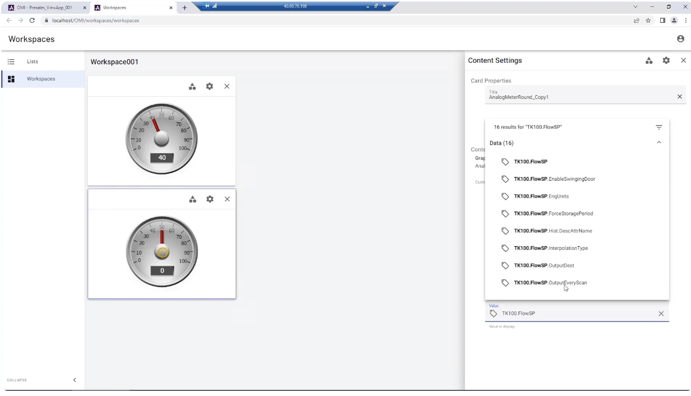
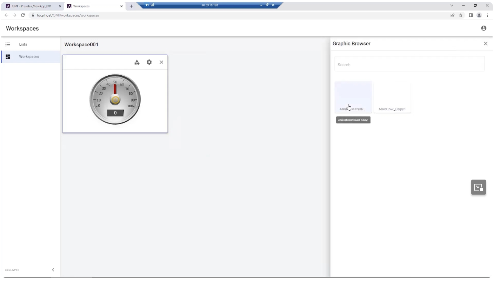
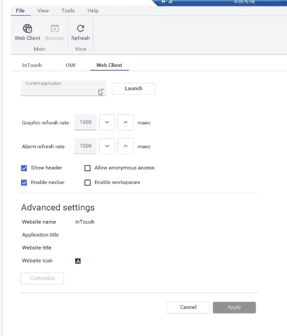
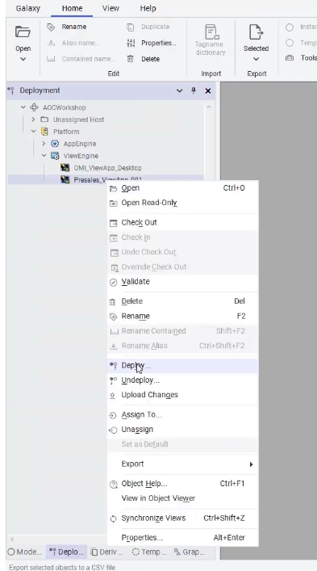
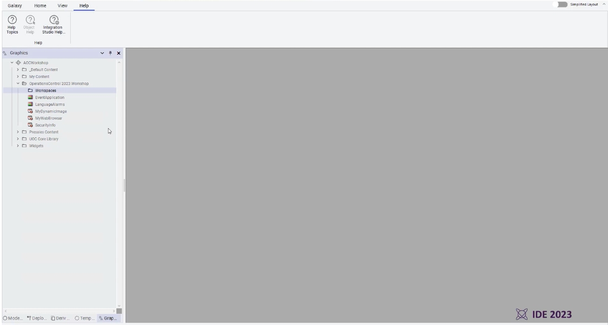
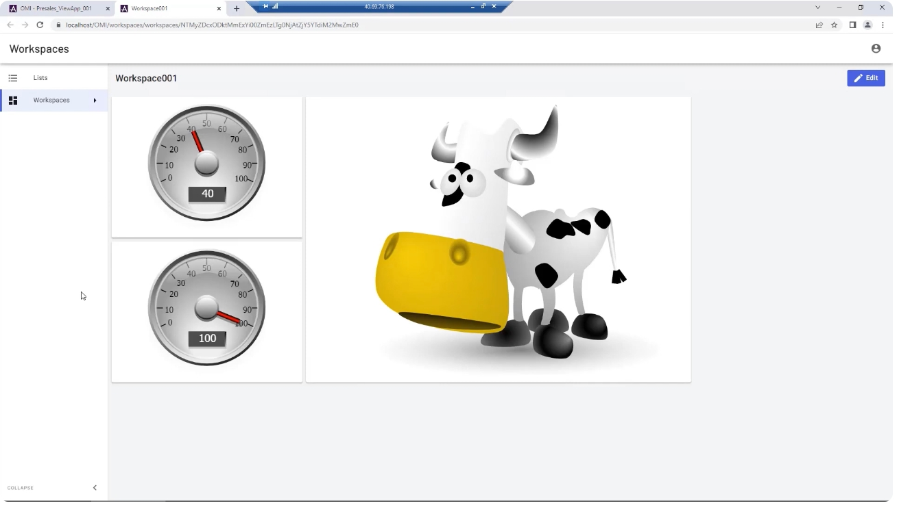

# AVEVA OMI Web Client — 個人化工作區（Workspaces）功能教學

> 來源影片：AVEVA Shorts - Workspace Features for the OMI Web Client
> https://www.youtube.com/watch?v=4EwGdI4a-0w&list=PLJq4rR8tWINyOrvwxbIjRvgTtoyuuEfSz&index=22

---

## 完整英文字幕（校正版）

以下為原始自動辨識字幕，已修正明顯的辨識錯誤（如 Aviva→AVEVA、am I→OMI 等），內容為單一段落的口述講解：

> Introduced with the AVEVA System Platform Enterprise 2023, the Workspaces feature of the AVEVA Operations Management Interface (OMI) Web Client enables users to develop ad hoc displays in a browser. These personal workspaces provide simplified, customizable information with little upfront configuration, and are best utilized by users who do not require control or full application access.
>
> Getting started, we begin by creating a new folder within the Graphic Toolbox to contain the graphics we select for use within a workspace. We then search for the graphic symbols that we want, adding those that we want available in the workspace's creation pane. Now we redeploy the application to reflect the changes made — the Workspaces feature must be enabled in the launch settings for the OMI client in the Application Manager; a simple checkbox in the Application Selection is applied next.
>
> We then launch our client to test it. In the OMI Web Client, we select the Workspaces button from the toolbar, select New, and we're provided a blank workspace. The graphics we chose earlier are available from the Graphic Browser on the right, and can be used to assemble our dashboard by dragging and dropping them into the workspace. In this example we have added the Analog Meter, which we can resize and arrange as desired.
>
> The Configure button brings up the Content Settings, which reveals the customizable properties available for the Analog Meter. The data tag to use can be searched and chosen for the Value property, with immediate effect. We can continue adding other graphics to our dashboard as desired. Once done, we can name and save our new workspace. This enables us to quickly access existing workspaces, as well as share them with other users.
>
> The personal Workspaces feature offers a new way for consuming real-time information, leveraging responsive web visualization.

---

## 中文教學：OMI Web Client 個人化工作區（Workspaces）

### 功能簡介

AVEVA System Platform Enterprise 2023 版本開始，OMI（Operations Management Interface）Web Client 新增了「個人化工作區（Workspaces）」功能。此功能讓使用者能夠在瀏覽器中，用很少的前置設定，自行組合出客製化的即時資訊畫面（Ad hoc Dashboard）。

適用對象：**不需要操作控制權限、也不需要完整應用程式存取權限**的一般使用者，只需要瀏覽即時資料。

---

### 步驟一：在 Graphic Toolbox 中建立新資料夾，準備要開放的圖形

在 IDE（Integration Studio）的 Graphics 樹狀結構中，先建立一個新資料夾，把之後要開放給 Workspaces 使用的圖形符號（Symbol）放進去，例如範例中的 `Fun Stuff` 資料夾，內含 `MooCow`、`CowStanding`、`HappyFace`、`ArchestrAnaut` 等圖形。

---

### 步驟二：搜尋並加入要在工作區中使用的圖形符號

使用工具列的 **Find** 功能，依名稱或階層搜尋需要的圖形物件（Tagname / Hierarchical），將篩選出的圖形加入前一步建立的資料夾中，作為工作區可選用的圖形來源。

---

### 步驟三：在 Application Manager 啟用 Workspaces 功能

回到 **Deployment** 樹狀結構，找到對應的 ViewEngine（例如 `Presales_ViewApp_001`），確認 OMI 應用程式節點下已包含前面建立的 Workspaces 內容資料夾。

接著開啟該應用程式的 **Launch Settings（啟動設定）**，切換到 **Web Client** 頁籤，勾選 **Enable workspaces** 核取方塊，即可啟用個人化工作區功能。

---

### 步驟四：重新部署（Deploy）應用程式

修改完成後，需要對 ViewApp 執行 **Deploy**，讓剛才的圖形內容與啟用設定生效。在物件上按右鍵即可選擇 Deploy。

---

### 步驟五：啟動 Web Client，建立新的工作區

部署完成後啟動 OMI Web Client，在左側導覽列點選 **Workspaces**，再點選 **New**，即可建立一個空白工作區（範例中為 `Workspace001`）。

畫面右側會出現 **Graphic Browser（圖形瀏覽器）**，列出先前開放的圖形（如 `AnalogMeterRound`、`MooCow_Copy1`），只要用滑鼠拖曳（drag and drop）即可將圖形加入工作區畫面中，並可自由調整大小與位置。

---

### 步驟六：設定圖形的內容屬性（Content Settings）

加入圖形後，點選卡片上的齒輪圖示（Configure），會開啟右側的 **Content Settings** 面板，顯示該圖形（例如 Analog Meter）可自訂的屬性，包括：

- **DisplayDigital**：是否顯示數字讀值
- **Max / Min**：儀表刻度上下限
- **Value**：要繫結（Bind）的資料標籤（Tag）

在 **Value** 欄位輸入關鍵字（例如 `TK100.FlowSP`）即可搜尋並選擇要顯示的資料標籤，選定後畫面會立即以該標籤的即時值更新顯示。

---

### 步驟七：重複加入圖形、命名並儲存工作區

依相同方式可持續加入多個圖形（儀表、圖片、按鈕等），排列成自己需要的儀表板版面。完成後為工作區命名並儲存，之後即可快速開啟，或分享給其他使用者。

---

### 小結

Workspaces 功能提供了一種全新的即時資訊瀏覽方式：使用者不需要 IDE 開發權限，只要在 Web Client 中用拖放的方式，就能組出屬於自己的、可回應式（Responsive）呈現的即時資料看板，並可儲存、重複使用與分享。
