# AVEVA System Platform Auto-Build 教學（中英對照）
# AVEVA System Platform Auto-Build Tutorial (Chinese / English)

> 影片來源 / Source video：[Using Auto-Build in AVEVA System Platform Application Server on an Allen-Bradley PLC](https://www.youtube.com/watch?v=6YZc-udDpAw)
> 講者 / Presenter：Elkansa Kousa（AVEVA Select California）
> 版本 / Version：AVEVA System Platform 2020 R2

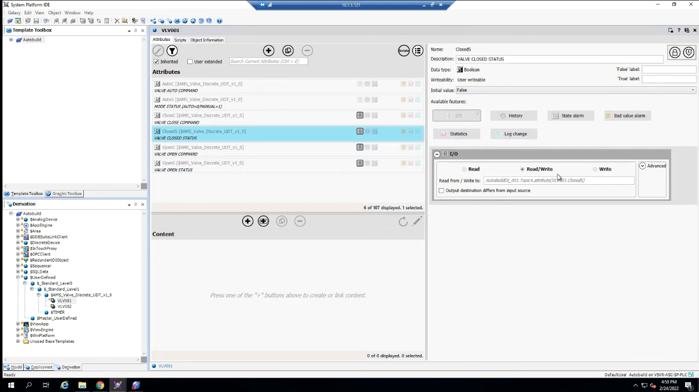

---

## 簡介 / Introduction

**中文**
Auto-Build 是 AVEVA System Platform Application Server 提供的一項功能，能夠讀取 PLC 程式的結構，自動在 System Platform 中建立對應的樣板（Template）與實例（Instance）。透過這個機制，工程師不需要手動逐一建立標籤與物件，就能大幅縮短組態時間、降低人為錯誤，同時讓 System Platform 與現場控制系統之間的整合更加緊密。

目前 Auto-Build 僅支援兩種通訊伺服器：

- **ABCIP**：用於 Allen-Bradley（羅克韋爾）PLC
- **SI Direct**：用於 Siemens PLC

使用 Auto-Build 的另一個好處是彈性：並不需要匯入 PLC 程式中的所有物件與屬性，可以依實際需求挑選要匯入的項目，將不需要的內容排除在 SCADA 專案之外。

**English**
Auto-Build is a feature of the AVEVA System Platform Application Server that reads the structure of a PLC program and automatically generates the corresponding templates and instances in System Platform. This removes the need to build tags and objects manually one by one, which significantly shortens configuration time, reduces the chance of human error, and improves integration between System Platform and the plant floor.

At present, Auto-Build supports only two communication servers:

- **ABCIP** – for Allen-Bradley (Rockwell) PLCs
- **SI Direct** – for Siemens PLCs

Another advantage of Auto-Build is flexibility: you don't have to import every object and attribute found in the PLC program. Items that aren't needed can simply be excluded from the SCADA project.

---

## 步驟一：建立測試用（Scratch）Galaxy
## Step 1: Create a Scratch Galaxy

**中文**
在正式匯入之前，建議的最佳做法是先建立一個全新的、非正式的測試用 Galaxy，而不是直接在正式（Production）Galaxy 上執行 Auto-Build。

原因在於：在實際執行 Auto-Build 之前，很難預先知道 PLC 程式結構會被轉換成什麼樣的樣板與物件外觀。因此，先在一個乾淨的測試 Galaxy 中建立樣板、實例並完成所有必要的調整，確認結果符合需求後，再將這些物件匯出並匯入到正式的 Galaxy 中，會是比較安全的做法。

**English**
Before running Auto-Build against a production system, best practice is to create a brand-new, disposable scratch Galaxy rather than working directly in your production Galaxy.

The reason is simple: until you actually run Auto-Build, it's hard to predict exactly what the resulting templates and objects will look like based on your PLC program. It's therefore safer to build the templates, instances, and any required adjustments in a clean scratch Galaxy first. Once you're satisfied with the outcome, you can export those objects and import them into your production Galaxy.

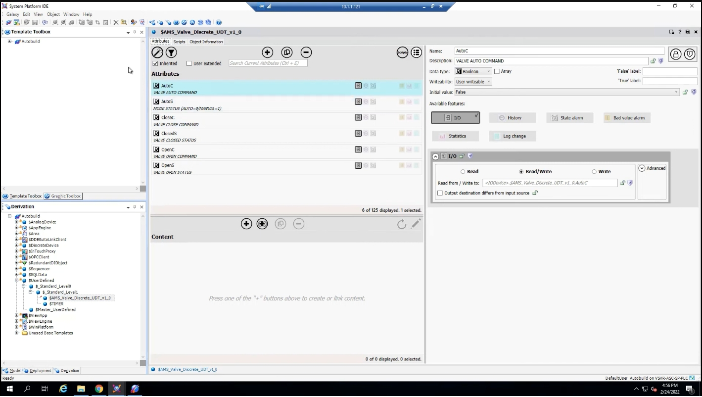

---

## 步驟二：從 PLC 程式匯出標籤檔（L5X）
## Step 2: Export the Tag File (L5X) from the PLC Program

**中文**
接著切換到安裝有 PLC 程式設計軟體（Logix Designer）的機器，開啟目前運行於 Allen-Bradley PLC 上的程式。範例程式中包含了自訂的資料型別（UDT），例如 Motor UDT 與 Valve UDT。

要啟動離線模式（Offline Mode）的 Auto-Build，必須先將此 PLC 專案匯出成 **.L5X** 檔案，並存放在容易存取的位置（例如桌面）。

**English**
Next, switch to the machine running the PLC programming software (Logix Designer) and open the program currently running on the Allen-Bradley PLC. The sample program includes custom user-defined types (UDTs), such as a Motor UDT and a Valve UDT.

To use Auto-Build in Offline Mode, this PLC project must first be exported as an **.L5X** file and saved somewhere easy to access, such as the desktop.

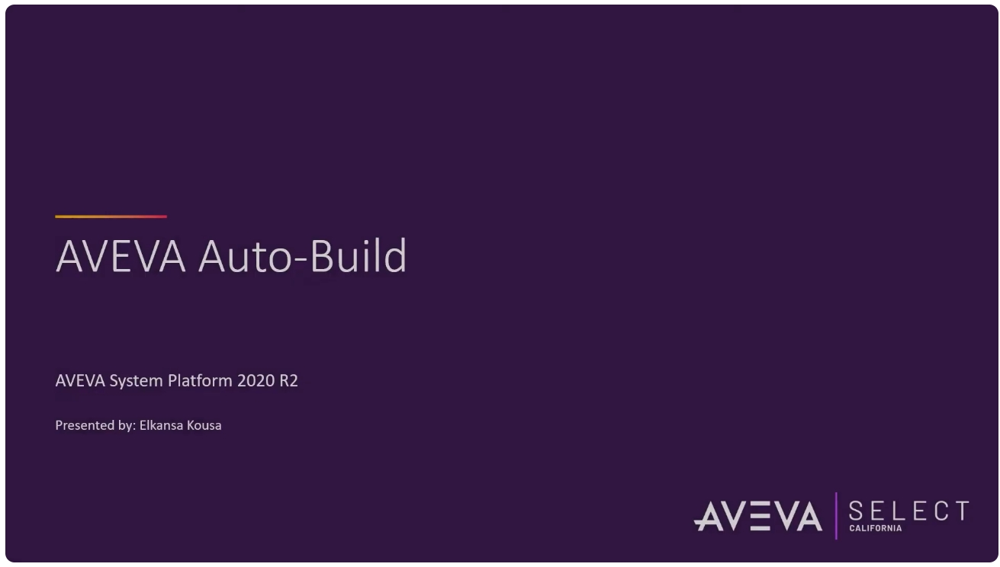

**中文**
匯出完成後，可以在 Controller Tags 畫面中看到目前控制器內的標籤，包含範例中使用到的 VLV001、VLV002 等閥門標籤。

**English**
Once the export is done, the Controller Tags view shows the tags currently defined in the controller, including the valve tags used in this example, VLV001 and VLV002.

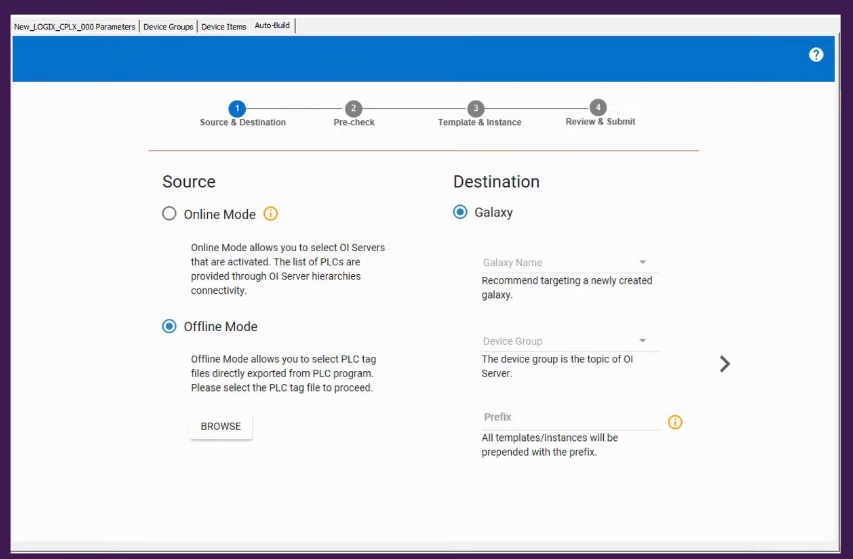

---

## 步驟三：在 System Management Console（SMC）設定 ABCIP 通訊驅動程式
## Step 3: Configure the ABCIP Communication Driver in the System Management Console (SMC)

**中文**
回到 System Platform 端，開啟 System Management Console（SMC），找到用於 Allen-Bradley PLC 的 **ABCIP** 通訊驅動程式節點。

在此節點下設定與 PLC 的連線，主要包含：

- 填入 PLC 在網路上的 IP 位址（Host Name）
- 設定連線逾時（Connection Timeout）
- 建立 Device Group（作為之後 OI Server 的 Topic 名稱）

範例中並未在 Device Items 中額外定義項目，因為此範例僅示範 Auto-Build 流程本身。

**English**
Back on the System Platform side, open the System Management Console (SMC) and locate the **ABCIP** communication driver node, which is used for Allen-Bradley PLCs.

Under this node, configure the connection to the PLC, which mainly involves:

- Entering the PLC's network IP address (Host Name)
- Setting the connection timeout
- Creating a Device Group (this later becomes the OI Server's topic name)

No additional Device Items are defined in this example, since the focus here is purely on demonstrating the Auto-Build process.

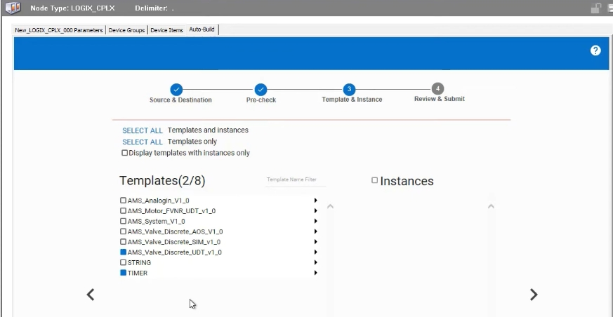

**中文**
在左側樹狀結構中，也可以看到 ABCIP、OPC、OPC UA 等各元件目前安裝的版本資訊，方便日後檢查與除錯。

**English**
The tree view on the left also shows the installed version information for components such as ABCIP, OPC, and OPC UA, which is useful for later inspection and troubleshooting.

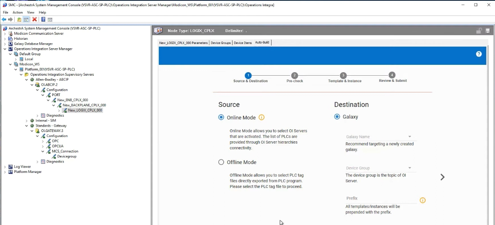

---

## 步驟四：啟動 Auto-Build 精靈 —— Source & Destination
## Step 4: Launch the Auto-Build Wizard — Source & Destination

**中文**
在對應的 PLC 節點（Logix CPLX）下方，可以找到 **Auto-Build** 頁籤，點選後即進入 Auto-Build 精靈的第一步：**Source & Destination（來源與目的地）**。

在「Source（來源）」的部分有兩種模式：

- **Online Mode**：直接透過已啟用的 OI Server 讀取 PLC 清單（需要連線）
- **Offline Mode**：直接選擇從 PLC 程式匯出的標籤檔（.L5X），不需要即時連線

本範例選擇 **Offline Mode**，並點選 Browse 按鈕選取先前匯出的 .L5X 檔案。

**English**
Under the corresponding PLC node (Logix CPLX), you'll find an **Auto-Build** tab. Selecting it opens the first step of the Auto-Build wizard: **Source & Destination**.

The "Source" section offers two modes:

- **Online Mode** – reads the list of PLCs through an already-activated OI Server (requires a live connection)
- **Offline Mode** – lets you select a tag file (.L5X) exported directly from the PLC program, with no live connection required

This example uses **Offline Mode**, clicking Browse to select the previously exported .L5X file.

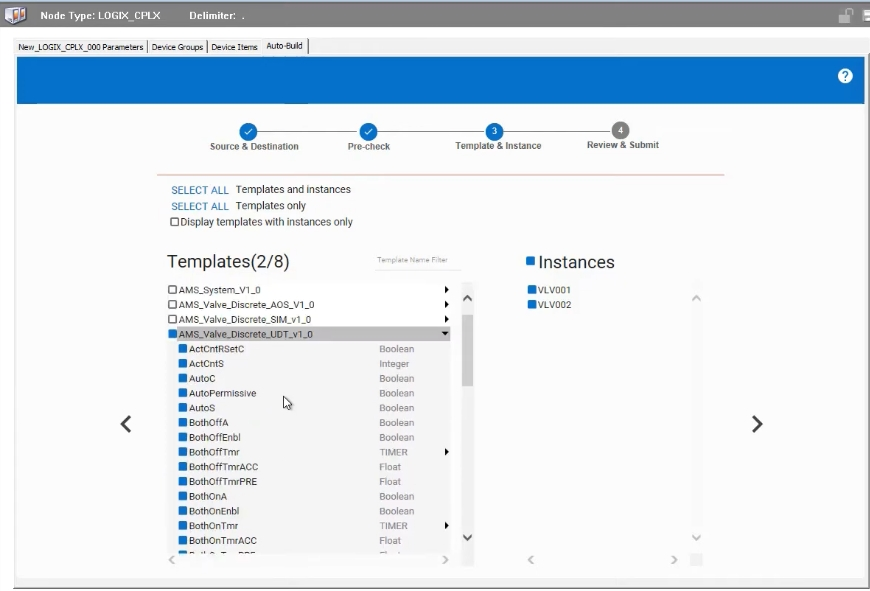

**中文**
點選 Browse 後，於檔案選取視窗中找到並選取先前儲存的 `AVEVA_SELECT.L5X` 檔案。

**English**
After clicking Browse, locate and select the previously saved `AVEVA_SELECT.L5X` file in the file picker dialog.

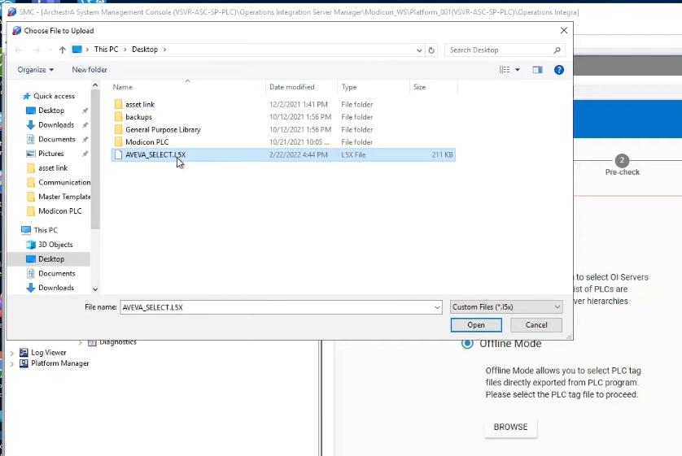

**中文**
在「Destination（目的地）」部分，選擇要匯入的目標 Galaxy（建議指向剛建立的測試用 Galaxy），並指定 Device Group（將對應到 OI Server 的 Topic），也可以視需要為所有匯入的樣板與實例名稱加上統一的字首（Prefix），方便日後區分不同來源的物件。

**English**
In the "Destination" section, choose the target Galaxy to import into (it's recommended to point this at the scratch Galaxy created earlier) and specify the Device Group (which corresponds to the OI Server's topic). You can also optionally add a common prefix to all imported template and instance names, making it easier to distinguish objects from different sources later on.

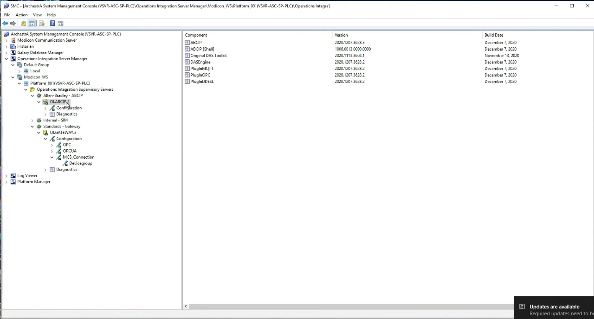

**中文**
完成設定後，精靈會先進行前置檢查（Pre-check）。若某些樣板或實例因故（例如格式不相容）無法被匯入，系統會提示哪些項目將被跳過；本範例中沒有任何項目被跳過，因此可以直接進入下一步。

**English**
Once the settings are complete, the wizard runs a pre-check. If any templates or instances can't be imported for some reason (for example, an incompatible format), the system will flag which items will be skipped. In this example, nothing is skipped, so we can move straight on to the next step.

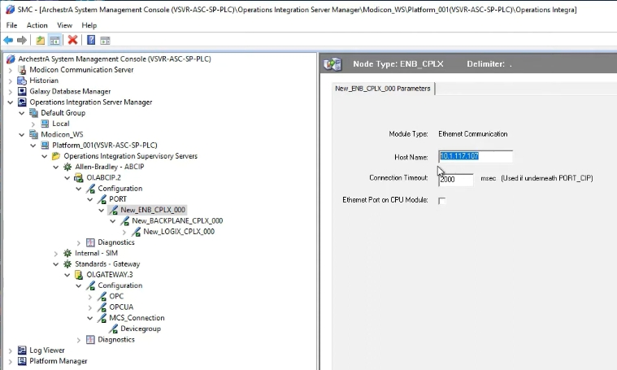

---

## 步驟五：Template & Instance —— 選擇要匯入的樣板與屬性
## Step 5: Template & Instance — Choosing What to Import

**中文**
進入第三步 **Template & Instance** 後，畫面左側會列出 PLC 程式中偵測到的所有資料型別（樣板候選項目），右側則列出對應的實例。

以本範例而言，我們只關心 **Valve UDT（AMS_Valve_Discrete_UDT_v1_0）**，因此僅勾選這一項。

> 小提醒：勾選 Valve UDT 後，系統會自動一併勾選其中使用到的 Timer 型別，因為 Valve UDT 內部參照了 Timer 樣板；若嘗試取消 Timer 的勾選，系統會提示該樣板正被其他勾選中的樣板參照，因此必須保持勾選。

**English**
In the third step, **Template & Instance**, the left side of the screen lists all the data types detected in the PLC program (candidate templates), while the right side lists the corresponding instances.

For this example, we're only interested in the **Valve UDT (AMS_Valve_Discrete_UDT_v1_0)**, so only that item is checked.

> Note: once the Valve UDT is checked, the Timer type it references is automatically checked as well, because the Valve UDT internally references the Timer template. Trying to uncheck Timer will trigger a warning that it's still referenced by another checked template, so it must remain checked.

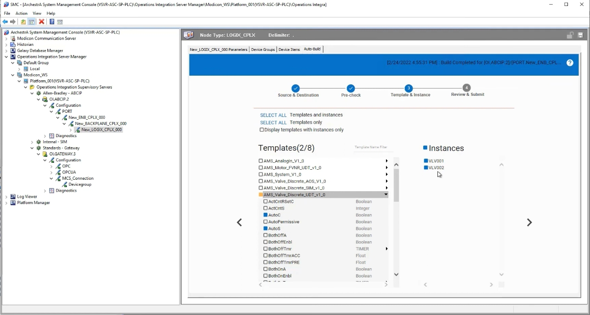

**中文**
點開 Valve UDT 後，可以看到其中包含的所有屬性（Attribute）。使用者不需要匯入全部屬性，可以只挑選需要的項目。本範例僅選擇：

- AutoC（自動命令）
- AutoS（自動狀態）
- CloseC（關閉命令）
- ClosedS（關閉狀態）
- OpenC（開啟命令）
- OpenS（開啟狀態）

另外，本範例刻意先**取消勾選 Instances（實例）**，原因是接下來會先在樣板上做一些調整，等樣板確認無誤後，再回頭匯入實例，這樣可以確保實例會套用到樣板調整後的最終結果，而不需要在每一個實例上重複修改。如果不需要對樣板做任何調整、希望完全比照 PLC 中的結構匯入，也可以一次將樣板與實例全部勾選、一併匯入。

**English**
Expanding the Valve UDT reveals all of its attributes. You don't need to import every attribute — only the ones you actually need. This example selects just:

- AutoC (auto command)
- AutoS (auto status)
- CloseC (close command)
- ClosedS (closed status)
- OpenC (open command)
- OpenS (open status)

The example also deliberately **unchecks Instances** at this stage. The reason is that some adjustments will be made to the template first; once the template is confirmed to be correct, the instances will be imported afterward. This ensures the instances pick up the final, adjusted version of the template, instead of having to edit every single instance individually. If no template adjustments are needed and you simply want to import everything exactly as it is in the PLC, you can check both templates and instances together in a single pass.

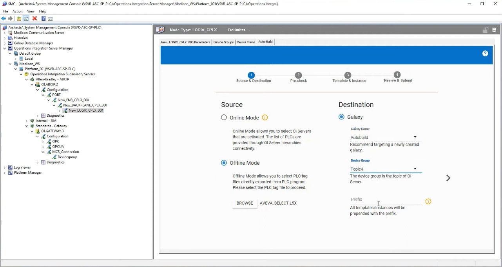

**中文**
完成屬性挑選後，進入第四步 **Review & Submit**，畫面會列出即將建立的項目（本例為 Timer 與 Valve 樣板），確認無誤後點選「Start」開始執行。由於範例程式相當精簡，Auto-Build 只需要幾秒鐘即可完成；若 PLC 程式較大，所需時間會相對增加，過程中都可以在此畫面即時監看進度，確認流程沒有卡住。

**English**
After selecting the attributes, the fourth step, **Review & Submit**, lists the items that are about to be created (in this case, the Timer and Valve templates). Once confirmed, clicking "Start" kicks off the process. Since the sample program is very small, Auto-Build finishes in just a few seconds; for a larger PLC program, it will naturally take longer. This screen lets you monitor progress in real time to make sure nothing is stuck.

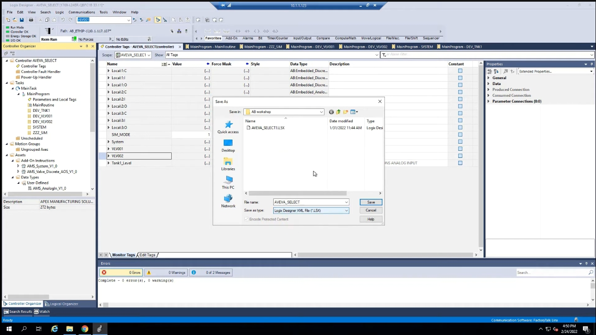

---

## 步驟六：在 System Platform 中檢視並調整樣板
## Step 6: Review and Adjust the Template in System Platform

**中文**
回到 System Platform IDE，切換到 Derivation 檢視畫面，即可看到 Auto-Build 剛剛建立的 Timer 與 Valve 樣板。雙擊 Valve 樣板即可看到僅包含先前勾選的六個屬性（AutoC / AutoS / CloseC / ClosedS / OpenC / OpenS），而不是 PLC 程式中的全部屬性。

**English**
Back in the System Platform IDE, switch to the Derivation view to see the Timer and Valve templates that Auto-Build just created. Double-clicking the Valve template shows only the six attributes selected earlier (AutoC / AutoS / CloseC / ClosedS / OpenC / OpenS) rather than every attribute from the PLC program.

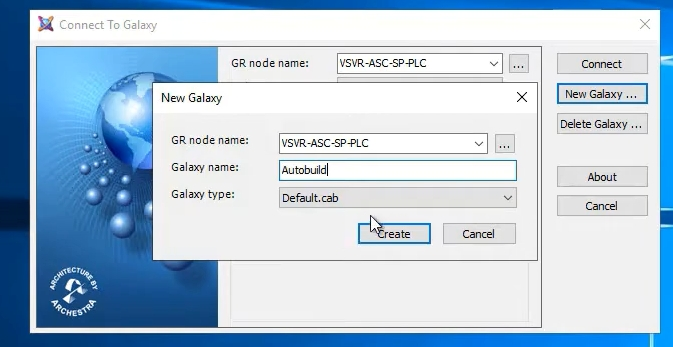

**中文**
接著，示範對樣板進行修改：預設情況下，AutoC 與 AutoS 兩個屬性都啟用了 **I/O** 功能，範例中將這兩個屬性的 I/O 功能取消勾選，然後儲存並關閉樣板。

**English**
Next, a change is made to the template: by default, both the AutoC and AutoS attributes have the **I/O** feature enabled. In this example, the I/O feature is unchecked for both attributes, and the template is then saved and closed.

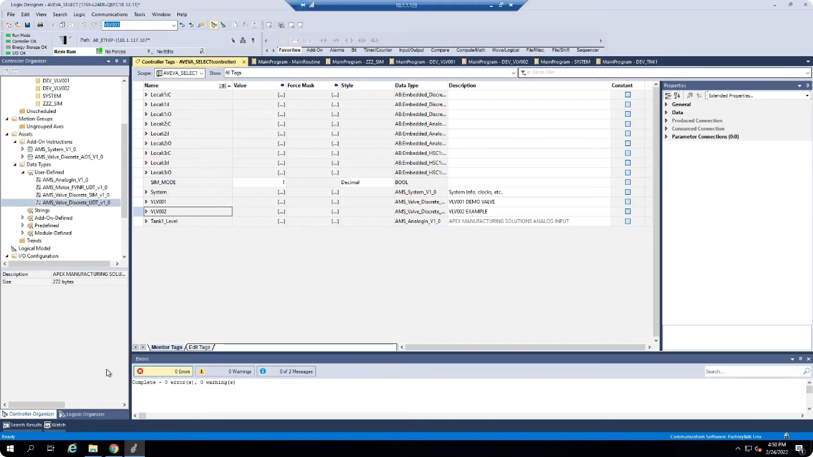

---

## 步驟七：回到 Auto-Build 匯入實例
## Step 7: Return to Auto-Build to Import the Instances

**中文**
樣板調整完成後，再次回到 Auto-Build 精靈，這一次選擇匯入先前保留、尚未建立的兩個實例（VLV001、VLV002）。由於實例的建立會參照目前樣板的最新狀態，因此剛才在樣板上取消的 I/O 功能設定，也會一併反映到新建立的實例上。

完成設定後同樣點選 Next，並按下「Start」開始建立實例。

執行完成後回到 System Platform，可以看到 Valve 樣板下方多了兩個實例（VLV001、VLV002）。雙擊 VLV001 檢查後可確認：

- 實例中只包含先前在樣板上挑選的屬性，而非 PLC 程式中的全部項目；
- 先前在樣板上取消的 AutoC / AutoS 的 I/O 功能，在實例中也同步呈現為未勾選；
- 其餘未在樣板上調整過的屬性（例如 CloseC、ClosedS、OpenC、OpenS 的 I/O 設定）則維持原本狀態。

這正是分兩階段（先建樣板、調整後再建實例）進行 Auto-Build 的用意所在：先在樣板層級一次性完成調整，再讓所有實例自動套用，而不需要逐一修改每個實例。

**English**
With the template adjustments complete, return to the Auto-Build wizard once more, this time choosing to import the two instances that were held back earlier (VLV001 and VLV002). Because instance creation references the current state of the template, the I/O setting that was just unchecked on the template is carried over to the newly created instances automatically.

After configuring, click Next again and then "Start" to build the instances.

Once complete, back in System Platform, the Valve template now has two instances underneath it (VLV001 and VLV002). Double-clicking VLV001 confirms that:

- The instance only contains the attributes selected on the template, not every item from the PLC program;
- The I/O feature previously unchecked for AutoC / AutoS on the template is likewise unchecked on the instance;
- Attributes that weren't changed on the template (such as the I/O settings for CloseC, ClosedS, OpenC, and OpenS) remain in their original state.

This is exactly the point of doing Auto-Build in two stages (build the template first, adjust it, then build the instances): adjustments are made once at the template level and then automatically applied to every instance, instead of having to edit each instance individually.

---

## 步驟八：匯出並匯入正式 Galaxy
## Step 8: Export and Import into the Production Galaxy

**中文**
當確認測試用 Galaxy 中的樣板與實例、各項屬性與功能設定都符合預期後，即可將這些物件（樣板與實例）匯出，再匯入到正式的（Production）Galaxy 中使用，完成整個 SCADA 專案的組態工作。

**English**
Once you've confirmed that the templates, instances, attributes, and feature settings in the scratch Galaxy all meet expectations, these objects (templates and instances) can be exported and then imported into the production Galaxy, completing the SCADA project's configuration work.

---

## 小結 / Summary

**中文**
透過 Auto-Build，可以：

1. 直接讀取 PLC（Allen-Bradley／Siemens）程式結構，自動產生對應的 System Platform 樣板與實例；
2. 依需求挑選要匯入的屬性，避免將不必要的資料點帶入 SCADA 系統；
3. 採用「先建樣板、確認調整後再建實例」的兩階段方式，讓所有實例自動套用一致的組態，大幅減少重複作業；
4. 支援離線模式（直接使用匯出的 .L5X 標籤檔）與線上模式（透過已啟用的 OI Server），彈性因應不同的工作情境。

善用 Auto-Build，能有效提升工程效率、縮短專案開發時間，並讓 System Platform 與現場 PLC 之間的整合更加順暢。

**English**
With Auto-Build, you can:

1. Read the structure of a PLC (Allen-Bradley / Siemens) program directly and automatically generate the corresponding System Platform templates and instances;
2. Choose exactly which attributes to import, keeping unnecessary data points out of the SCADA system;
3. Use a two-stage approach — build the template first, confirm any adjustments, then build the instances — so all instances automatically pick up a consistent configuration, greatly reducing repetitive work;
4. Work in either Offline Mode (using an exported .L5X tag file) or Online Mode (through an activated OI Server), adapting to different working situations.

Used well, Auto-Build can meaningfully improve engineering efficiency, shorten project development time, and make integration between System Platform and field PLCs smoother.
