# AVEVA InTouch — OI Server with Modbus TCP & Access Name 教學
# AVEVA InTouch — OI Server with Modbus TCP & Access Name (Chinese / English)

> 影片來源 / Source video：[9. AVEVA InTouch - OI Server with Modbus TCP & Access Name](https://www.youtube.com/watch?v=GvCx6QsABxw)

---

## 簡介 / Introduction

**中文**
本教學說明如何在已安裝 Modbus TCP（MBTCP）驅動程式的環境中，於 **Operations Control Management Console（SMC）** 設定與 PLC／PC 的通訊連線，並在 **AVEVA InTouch HMI** 中建立對應的 **Access Name** 與標籤（Tagname），最後將標籤綁定到畫面上的圖形物件，即可即時顯示來自 PLC 的資料（本範例以水位／液位資料 `Mixer100_Level_PV` 為例）。

**English**
This tutorial explains how to configure a communication connection with a PLC/PC in the **Operations Control Management Console (SMC)**, where the Modbus TCP (MBTCP) driver is already installed, and then create the corresponding **Access Name** and tag (Tagname) in **AVEVA InTouch HMI**. Finally, the tag is bound to a graphic object on screen so it can display live data from the PLC in real time (this example uses a level value, `Mixer100_Level_PV`).

---

## 相關軟體 / Related Software

**中文**

| 軟體 | 用途 |
|---|---|
| AVEVA System Platform（Operations Control Management Console, SMC） | 管理 OI Server（Operations Integration Server）驅動程式與連線設定 |
| Modbus TCP（MBTCP）通訊驅動程式 | 用於與支援 Modbus TCP 的 PLC／PC 進行通訊，安裝時已內建於此環境中 |
| AVEVA InTouch HMI | 用於建立 Access Name、標籤（Tagname）與人機介面畫面 |

**English**

| Software | Purpose |
|---|---|
| AVEVA System Platform (Operations Control Management Console, SMC) | Manages OI Server (Operations Integration Server) drivers and connection settings |
| Modbus TCP (MBTCP) communication driver | Used to communicate with a Modbus TCP–capable PLC/PC; already installed in this environment |
| AVEVA InTouch HMI | Used to create Access Names, tags (Tagnames), and the HMI screens |

---

## 步驟一：開啟 Operations Control Management Console（SMC）
## Step 1: Open the Operations Control Management Console (SMC)

**中文**
從開始功能表的 **AVEVA** 分類中，找到並開啟 **Operations Control Management Console**（即前面幾篇教學中所稱的 SMC）。

**English**
From the **AVEVA** section in the Start menu, locate and open the **Operations Control Management Console** (referred to as the SMC in earlier tutorials in this series).

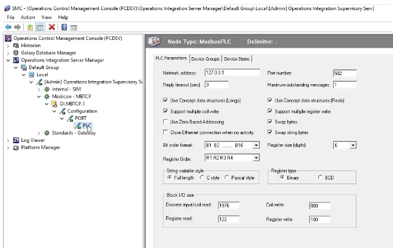

---

## 步驟二：檢視已安裝的通訊驅動程式
## Step 2: Review the Installed Communication Driver

**中文**
展開 **Operations Integration Server Manager → Default Group → Local**，可以看到目前的環境中，除了內建的 **Internal - SIM** 外，只安裝了 **Modicon - MBTCP** 這一個通訊驅動程式（因為安裝當時只選擇了 MBTCP）。若日後有安裝其他協定的驅動程式（例如 ABCIP 等），也會依序顯示在同一層級之下。

**English**
Expand **Operations Integration Server Manager → Default Group → Local**. In this environment, apart from the built-in **Internal - SIM**, only the **Modicon - MBTCP** communication driver is installed (since only MBTCP was selected during installation). If other protocol drivers are installed later (such as ABCIP), they will appear at the same level in the tree.

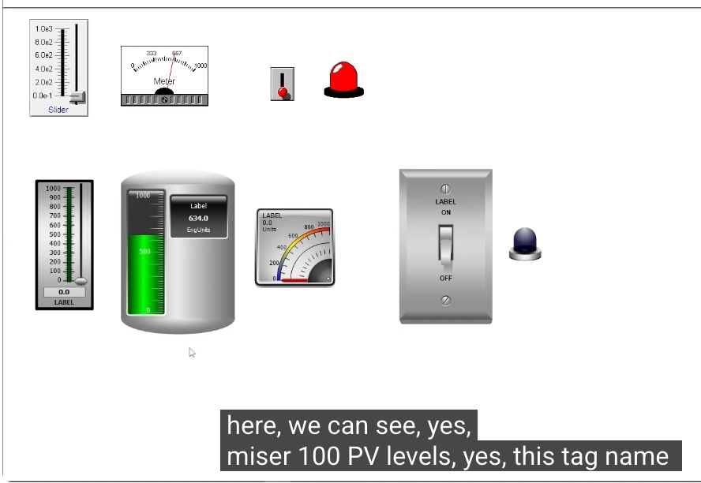

---

## 步驟三：設定 PLC 連線參數（IP 位址）
## Step 3: Configure the PLC Connection Parameters (IP Address)

**中文**
展開該驅動程式的執行個體，進入其 **ModbusPLC** 連線節點，切換到「PLC Parameters」頁籤。這裡是設定與對方（PC／PLC 模擬器）通訊的主要位置，其中最重要的欄位是 **Network address**，需填入對方設備的實際 IP 位址（範例中模擬器 IP 為 `192.168.1.109`；畫面示範時則使用本機測試位址 `127.0.0.1`）。其餘如埠號（Port number，預設 502）、回覆逾時（Reply timeout）等參數，可依實際設備規格調整。

**English**
Expand the driver instance and go into its **ModbusPLC** connection node, then switch to the "PLC Parameters" tab. This is the main place to configure communication with the target device (a PC/PLC simulator in this case). The most important field is **Network address**, which should be set to the target device's actual IP address (the simulator's IP in this example is `192.168.1.109`; the screenshot shown uses a local loopback address, `127.0.0.1`, for demonstration). Other parameters, such as the port number (default 502) and reply timeout, can be adjusted to match the actual device's specifications.

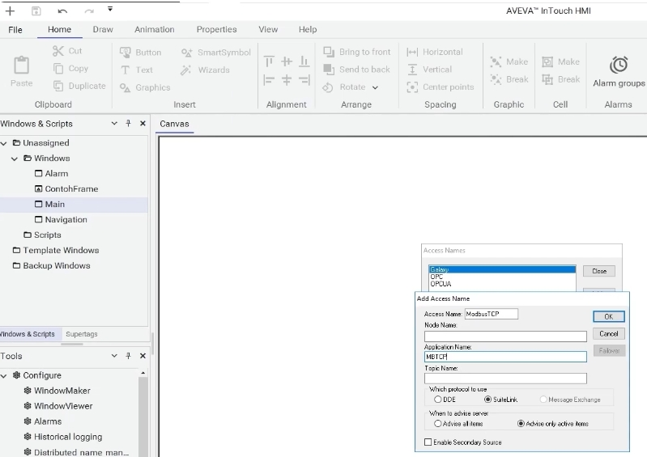

---

## 步驟四：建立 Device Group（主題名稱）
## Step 4: Create a Device Group (Topic Name)

**中文**
切換到「Device Groups」頁籤，可以看到系統已預先建立好幾個群組，例如 **PLC_Fast**（更新間隔 555 ms）、**PLC_Normal**（1000 ms）、**PLC_Slow**（9990 ms）。在此基礎上，於下方新增一個自訂的群組，作為之後 InTouch Access Name 要使用的主題（Topic）名稱，本範例命名為 **topic1**（名稱可依需求自行命名）。設定完成後點選 Save 儲存。

**English**
Switch to the "Device Groups" tab. Several groups are already pre-configured, such as **PLC_Fast** (update interval 555 ms), **PLC_Normal** (1000 ms), and **PLC_Slow** (9990 ms). Add a new custom group below these, which will later be used as the Topic name for the InTouch Access Name — named **topic1** in this example (you can choose any name you like). Click Save once configured.

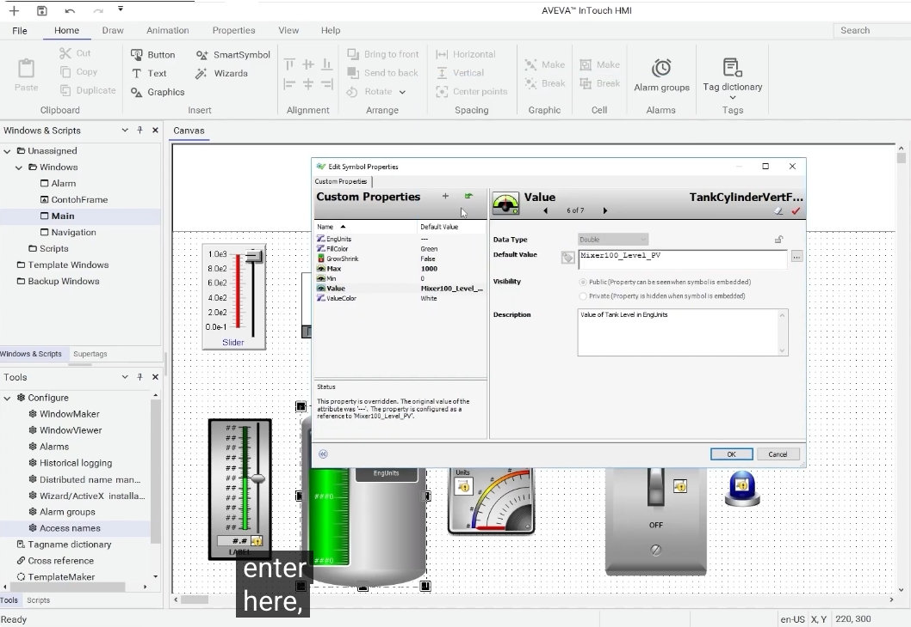

---

## 步驟五：啟動驅動程式執行個體
## Step 5: Activate the Driver Instance

**中文**
完成 IP 位址與 Device Group 的設定後，回到驅動程式節點（OI.MBTCP.1）按右鍵，選擇 **Activate（Auto start after reboot）** 或 **Activate until reboot（Manual start after reboot）** 來啟動此驅動程式執行個體。啟動成功後，節點圖示旁會出現綠色勾勾，表示通訊已經正常運作。

**English**
After configuring the IP address and Device Group, right-click the driver node (OI.MBTCP.1) and choose either **Activate (Auto start after reboot)** or **Activate until reboot (Manual start after reboot)** to start this driver instance. Once activated successfully, a green checkmark appears next to the node icon, indicating that communication is running correctly.

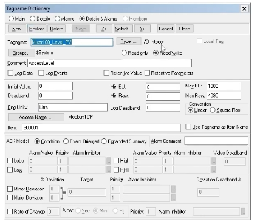

---

## 步驟六：在 InTouch 中建立標籤（Tagname）
## Step 6: Create a Tag (Tagname) in InTouch

**中文**
切換到 AVEVA InTouch HMI，開啟 **Tag dictionary**，點選 **New** 建立一個新標籤。點選「Type...」開啟「Tag Types」選擇視窗，由於這個標籤要對應一個來自 PLC 的整數型類比輸入數值，因此選擇 **I/O Integer**。

**English**
Switch to AVEVA InTouch HMI, open the **Tag dictionary**, and click **New** to create a new tag. Click "Type..." to open the "Tag Types" selection window, and since this tag corresponds to an integer analog input value from the PLC, choose **I/O Integer**.

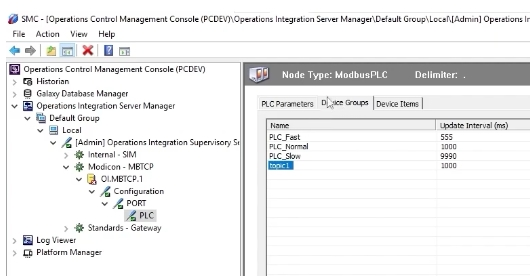

---

## 步驟七：建立 Access Name（第一次嘗試）
## Step 7: Create an Access Name (First Attempt)

**中文**
在標籤設定畫面中點選「Access Name...」，開啟 Access Names 管理視窗，點選 **Add** 新增一個存取名稱。輸入 **Access Name**：`ModbusTCP`，但在 **Application Name** 欄位中，示範時一開始誤填了 `SIDIR`（這是另一種協定 SI Direct 對應的應用程式名稱，並非本範例使用的 Modbus TCP 驅動）。

**English**
On the tag configuration screen, click "Access Name..." to open the Access Names manager, then click **Add** to add a new access name. Enter **Access Name**: `ModbusTCP`, but in the demonstration the **Application Name** field is initially (mistakenly) entered as `SIDIR` — this is actually the application name for a different protocol, SI Direct, not the Modbus TCP driver used in this example.

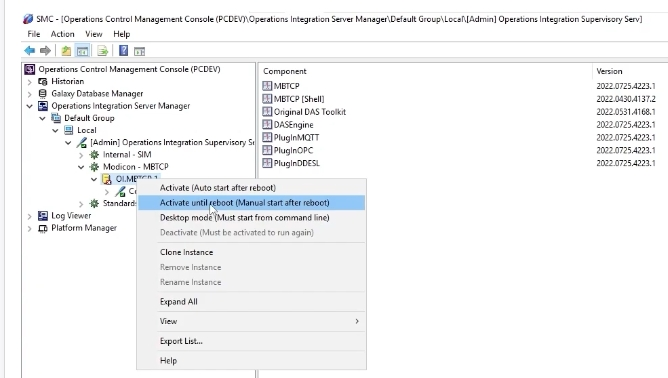

---

## 步驟八：修正 Application Name 為 MBTCP
## Step 8: Correct the Application Name to MBTCP

**中文**
由於本範例使用的是 Modbus TCP 驅動程式，因此需要將 **Application Name** 修正為 `MBTCP`（與 SMC 中該驅動程式的應用程式名稱一致），才能正確對應到步驟一至五所設定的通訊路徑。

**English**
Since this example uses the Modbus TCP driver, the **Application Name** must be corrected to `MBTCP` (matching the driver's application name in the SMC), so it correctly maps to the communication path configured in Steps 1–5.

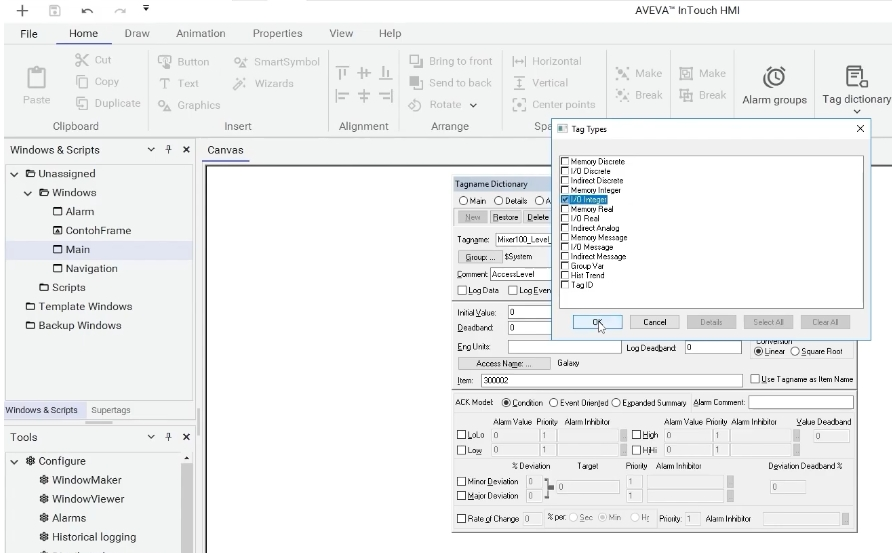

---

## 步驟九：填入 Topic Name（topic1）
## Step 9: Enter the Topic Name (topic1)

**中文**
在同一個 Access Name 設定視窗中，將 **Topic Name** 填入先前在 SMC Device Groups 中建立的 `topic1`，即可完整對應到通訊路徑：**Access Name（ModbusTCP）→ Application Name（MBTCP）→ Topic Name（topic1）**。設定完成後點選「OK」儲存。

**English**
In the same Access Name configuration window, set the **Topic Name** to `topic1`, the Device Group created earlier in the SMC. This completes the full mapping of the communication path: **Access Name (ModbusTCP) → Application Name (MBTCP) → Topic Name (topic1)**. Click "OK" to save once configured.

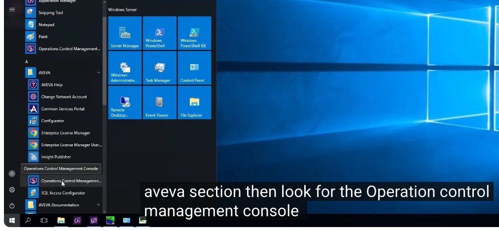

---

## 步驟十：完成標籤設定（位址與工程單位範圍）
## Step 10: Complete the Tag Configuration (Address and Engineering Unit Range)

**中文**
回到 Tagname Dictionary，將標籤命名為 `Mixer100_Level_PV`，型別為 **I/O Integer**，**Access Name** 選擇剛設定好的 `ModbusTCP`，**Item** 欄位填入對應 PLC 端的暫存器位址（本範例畫面中為 `300002`，屬於 Modicon 3xxxx 類比輸入暫存器區段；實際位址需依現場 PLC 位址規劃調整）。

同時設定：

- **Min Raw / Max Raw**：PLC 端原始數值的最小／最大範圍（例如 0～4095）
- **Min EU / Max EU**：換算後要顯示的工程單位範圍（例如 0～1000）
- **Eng Units**：工程單位名稱（本範例填入 `Litre`，公升）

設定完成後點選 Save 儲存標籤。

**English**
Back in the Tagname Dictionary, name the tag `Mixer100_Level_PV`, set its type to **I/O Integer**, choose the **Access Name** just configured (`ModbusTCP`), and set the **Item** field to the corresponding register address on the PLC side (`300002` in this example's screenshot, within the Modicon 3xxxx analog-input register range; the actual address should be adjusted according to the real PLC's address map).

Also configure:

- **Min Raw / Max Raw**: the minimum/maximum range of the raw value from the PLC (e.g., 0 to 4095)
- **Min EU / Max EU**: the engineering-unit range to display after scaling (e.g., 0 to 1000)
- **Eng Units**: the engineering unit name (`Litre` is used in this example)

Click Save once configured to save the tag.

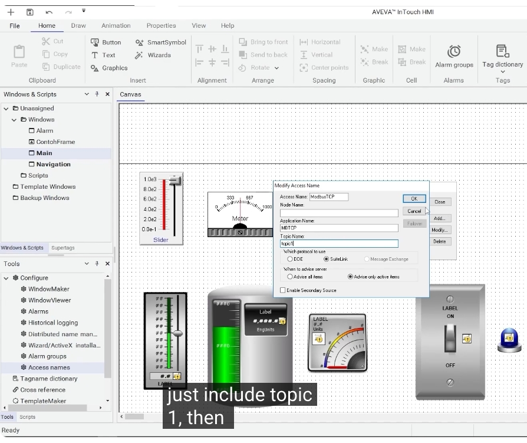

---

## 步驟十一：將標籤綁定至畫面圖形物件
## Step 11: Bind the Tag to a Graphic Object on Screen

**中文**
在畫面上選取要顯示此數值的圖形物件（例如水槽／料槽外形的符號元件），開啟其「Edit Symbol Properties」，在 **Custom Properties** 中找到 **Value** 屬性，將其 **Default Value** 設定為剛剛建立的標籤名稱 `Mixer100_Level_PV`，即可將此標籤與圖形物件的顯示值連結起來。

**English**
On the screen, select the graphic object that should display this value (for example, a tank/vessel-shaped symbol), open its "Edit Symbol Properties", and under **Custom Properties** find the **Value** property. Set its **Default Value** to the tag name just created, `Mixer100_Level_PV`, linking this tag to the object's displayed value.

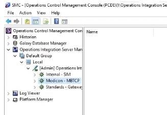

---

## 步驟十二：完成後的結果 —— 即時顯示 PLC 數值
## Step 12: Final Result — Displaying the PLC Value in Real Time

**中文**
完成上述設定後，畫面上的物件（例如料槽符號旁的數值標籤）即會顯示出目前的液位讀值（例如 `634.0`），這個數值是直接來自 PLC／PC 端的即時資料，並非在 InTouch 端手動輸入或模擬產生，證明整個 Access Name 與標籤設定已經正確地將 OI Server（Modbus TCP）與 InTouch 畫面串接起來。

**English**
Once the above configuration is complete, the object on screen (for example, the numeric label next to the tank symbol) will display the current level reading (e.g., `634.0`). This value comes directly from live data on the PLC/PC side, rather than being manually entered or simulated within InTouch — confirming that the Access Name and tag configuration have correctly linked the OI Server (Modbus TCP) to the InTouch screen.

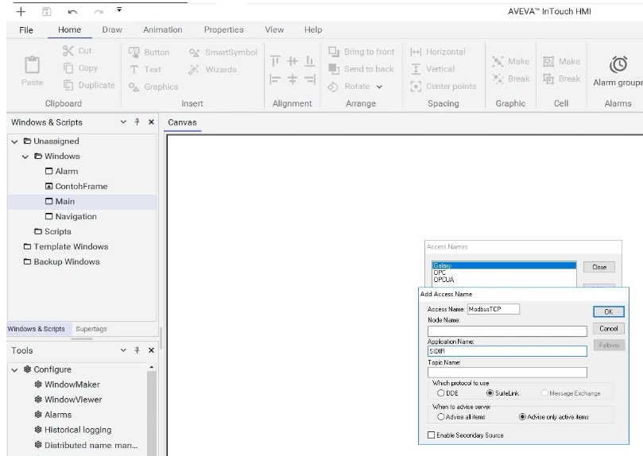

---

## 小結 / Summary

**中文**
本教學的完整流程為：

1. 在 SMC 中檢視／確認已安裝的通訊驅動程式（本例為 Modbus TCP／MBTCP）；
2. 於驅動程式的 ModbusPLC 連線節點設定 PLC/PC 的 IP 位址等通訊參數；
3. 於 Device Groups 中建立自訂的 Topic（本例為 `topic1`）；
4. 啟動驅動程式執行個體，確認通訊已正常運作；
5. 在 InTouch 中建立 I/O Integer 標籤，並建立對應的 Access Name（Access Name → Application Name → Topic Name，逐層對應到 SMC 端的設定）；
6. 設定標籤的位址（Item）與工程單位換算範圍；
7. 將標籤綁定到畫面上的圖形物件，即可即時顯示來自 PLC 的資料。

透過以上步驟，即可完成 AVEVA InTouch 透過 OI Server（Modbus TCP）與 PLC／PC 之間的基本資料串接與畫面顯示設定。

**English**
The complete workflow in this tutorial is:

1. Review/confirm the installed communication driver in the SMC (Modbus TCP/MBTCP in this example);
2. Configure the PLC/PC's IP address and other communication parameters on the driver's ModbusPLC connection node;
3. Create a custom Topic under Device Groups (`topic1` in this example);
4. Activate the driver instance and confirm that communication is working;
5. Create an I/O Integer tag in InTouch and the corresponding Access Name (Access Name → Application Name → Topic Name, mapping layer by layer to the SMC-side configuration);
6. Configure the tag's address (Item) and its engineering-unit scaling range;
7. Bind the tag to a graphic object on screen to display the live data coming from the PLC.

Following these steps completes the basic setup for linking data between AVEVA InTouch, the OI Server (Modbus TCP), and a PLC/PC, and displaying it on the HMI screen.
