# Modbus TCP（MBTCP）連接 AVEVA Wonderware System Platform 2020 教學（上）
# Connecting a Modbus TCP (MBTCP) Device to AVEVA Wonderware System Platform 2020 — Part 1 (Chinese / English)

> 影片來源 / Source video：[Modbus TCP MBTCP Aveva Wonderware SP2020 Basic Guide](https://www.youtube.com/watch?v=gcbKKnG7zP8)
> 說明 / Note：原教學共 28 張畫面截圖，分兩批上傳；本文件為【上集】，涵蓋前 14 張圖片，內容至建立 InTouch 應用程式與畫面為止；下集將接續說明標籤（Tag）建立、動畫連結與執行時期（Runtime）測試等內容。
> This is **Part 1 of 2**, covering the first 14 screenshots — from checking/installing the Modbus TCP driver through to creating the InTouch application and window. Part 2 will continue with tag creation, animation links, and Runtime testing.

---

## 簡介 / Introduction

**中文**
本教學說明如何在 AVEVA Wonderware System Platform 2020（以下簡稱 System Platform 2020）中，設定 Modbus TCP（MBTCP）通訊驅動程式，將 Modbus 從站設備（Slave Device）的資料讀取進來，並顯示於 InTouch HMI 畫面上。內容包含驅動程式安裝確認、在 System Management Console（SMC）中建立連線與裝置項目（Device Item）、使用 ModSim32 模擬 Modbus 從站，以及建立 InTouch 應用程式與畫面等步驟。

**English**
This tutorial explains how to configure the Modbus TCP (MBTCP) communication driver in AVEVA Wonderware System Platform 2020, so that data from a Modbus slave device can be read in and displayed on an InTouch HMI screen. It covers verifying the driver installation, creating a connection and device items in the System Management Console (SMC), simulating a Modbus slave with ModSim32, and creating an InTouch application and window.

---

## 相關軟體 / Related Software

**中文**

| 軟體 | 用途 |
|---|---|
| AVEVA System Platform 2020（Wonderware） | 提供 System Management Console（SMC）、Galaxy 與 InTouch 執行環境 |
| Modbus TCP（MBTCP）通訊驅動程式 | System Platform 用來與 Modbus TCP 設備通訊的 I/O Server／DAS 驅動程式，需另行下載安裝（System Platform 2020 預設未內建） |
| ModSim32 | 常用的 Modbus 從站（Slave）模擬軟體，用來在沒有實體設備時模擬暫存器數值，方便測試 |
| InTouch（Application Manager / WindowMaker） | 用來建立 HMI 應用程式與畫面 |
| 文字編輯器（範例中使用 Sublime Text） | 用來記錄連線參數與位址對照表，方便追蹤設定內容 |
| Microsoft Excel | 用來批次整理標籤名稱與 Modbus 位址對照表，供匯入 SMC 使用 |

**English**

| Software | Purpose |
|---|---|
| AVEVA System Platform 2020 (Wonderware) | Provides the System Management Console (SMC), Galaxy, and InTouch runtime environment |
| Modbus TCP (MBTCP) communication driver | The I/O Server / DAS driver System Platform uses to talk to Modbus TCP devices; it is not installed by default in System Platform 2020 and must be downloaded separately |
| ModSim32 | A commonly used Modbus slave simulator, used to emulate register values when no physical device is available for testing |
| InTouch (Application Manager / WindowMaker) | Used to create the HMI application and screens |
| A text editor (Sublime Text is used in this example) | Used to keep notes on connection parameters and the address mapping, making the configuration easier to track |
| Microsoft Excel | Used to organize tag names and Modbus address mappings in bulk, for importing into the SMC |

---

## 步驟一：確認 Modbus TCP 驅動程式狀態
## Step 1: Check the Status of the Modbus TCP Driver

**中文**
開啟 System Management Console（SMC），展開 **Operations Integration Server Manager → Default Group → Local → Operations Integration Supervisory Servers**。在預設安裝的 System Platform 2020 中，此處通常只會看到內建的 Wonderware Gateway 與 Wonderware SIM，並不包含 Modbus TCP 驅動程式；換言之，Modbus TCP（MBTCP）驅動程式必須另外下載並安裝，才能在此清單中看到對應的節點。

**English**
Open the System Management Console (SMC) and expand **Operations Integration Server Manager → Default Group → Local → Operations Integration Supervisory Servers**. On a default installation of System Platform 2020, you'll typically only see the built-in Wonderware Gateway and Wonderware SIM here — the Modbus TCP driver is not included. In other words, the Modbus TCP (MBTCP) driver must be downloaded and installed separately before its node will appear in this list.

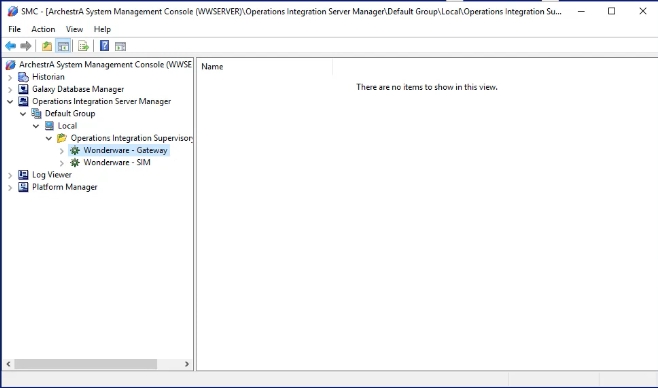

**中文**
安裝驅動程式後，回到 SMC 即可看到新增的 **Modbus - MBTCP** 節點，其下方會有一個驅動程式執行個體（例如 OI.MBTCP.1）。在此節點上按右鍵，可以看到「Activate（啟動，開機自動啟動）」「Activate until reboot（啟動至下次重開機）」「Desktop mode」「Deactivate（停用）」等選項，用來控制此驅動程式執行個體的啟動方式。畫面右側則是此驅動程式的全域參數（Global Parameters），包含裝置群組更新間隔（Device Group Update Interval）、輪詢間隔（Slow Poll Interval）等設定。

**English**
After installing the driver, the SMC will show a new **Modbus - MBTCP** node, with a driver instance underneath it (for example, OI.MBTCP.1). Right-clicking this node reveals options such as "Activate (auto start after reboot)", "Activate until reboot", "Desktop mode", and "Deactivate", which control how this driver instance is started. On the right, the Global Parameters for the driver are shown, including settings such as the Device Group Update Interval and the Slow Poll Interval.

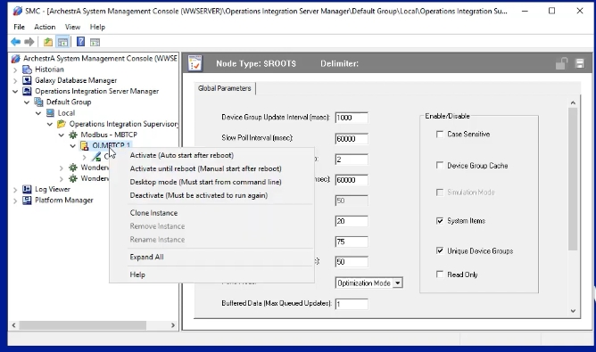

---

## 步驟二：記錄連線參數並設定通訊埠號
## Step 2: Record the Connection Parameters and Set the Communication Port

**中文**
建議先以文字編輯器記下本次要使用的連線資訊，方便後續設定與除錯，例如：

```
modbus --> wonderware [ASP2020]

driver modbus TCP (MBTCP) [installed, SMC]
IP address  : XXX.XXX.XXX.XXX
Port        : XXXX
SlaveID     : 255

>import export multiple register to device item
>Holding Register for testing
```

接著在 SMC 中展開 **Modbus - MBTCP → OI.MBTCP.1 → Configuration → MODBUS**，切換到「MODBUS Parameters」頁籤，可以看到／設定通訊埠號（Port number），Modbus TCP 預設埠號為 **502**。

**English**
It's a good idea to jot down the connection details you'll be using in a text editor first, to make later configuration and troubleshooting easier, for example:

```
modbus --> wonderware [ASP2020]

driver modbus TCP (MBTCP) [installed, SMC]
IP address  : XXX.XXX.XXX.XXX
Port        : XXXX
SlaveID     : 255

>import export multiple register to device item
>Holding Register for testing
```

Then, in the SMC, expand **Modbus - MBTCP → OI.MBTCP.1 → Configuration → MODBUS** and switch to the "MODBUS Parameters" tab, where you can view/set the communication port number. The default Modbus TCP port is **502**.

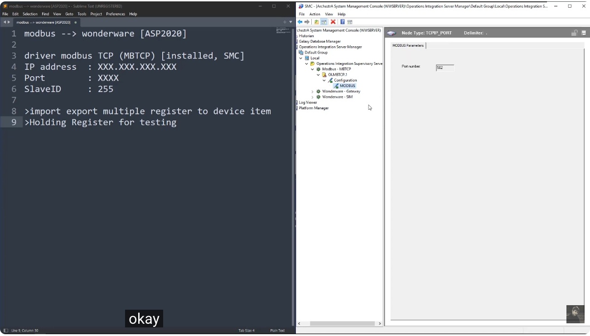

---

## 步驟三：新增 ModbusPLC 連線
## Step 3: Add a ModbusPLC Connection

**中文**
在 **MODBUS** 節點上按右鍵，可以看到多種連線類型可供選擇，例如 Add ModbusBridge Connection、Add TSXQuantum Connection、Add TSXMomentum Connection、Add TSXPremium Connection，以及本範例要使用的 **Add ModbusPLC Connection**。點選「Add ModbusPLC Connection」以新增一個標準的 Modbus PLC／從站連線。

**English**
Right-click the **MODBUS** node to see the available connection types, such as Add ModbusBridge Connection, Add TSXQuantum Connection, Add TSXMomentum Connection, Add TSXPremium Connection, and, for this example, **Add ModbusPLC Connection**. Select "Add ModbusPLC Connection" to add a standard Modbus PLC/slave connection.

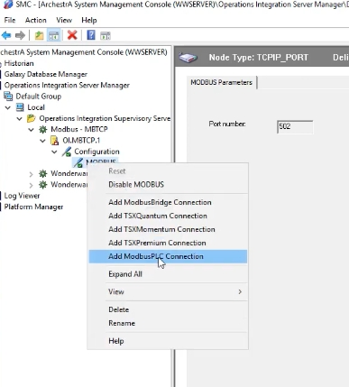

---

## 步驟四：設定 ModbusPLC 連線參數
## Step 4: Configure the ModbusPLC Connection Parameters

**中文**
新增連線後（本範例命名為 `modsim`，對應之後要搭配的 ModSim32 模擬軟體），切換到「modsim Parameters」頁籤，設定以下主要參數：

- **Network address（網路位址／裝置站號）**：例如 1.0.0
- **Port number（埠號）**：502
- **Reply timeout (sec)（回覆逾時時間）**：例如 3 秒
- **Maximum outstanding messages（最大未回覆訊息數）**：1
- 依需求勾選 *Use Concept data structures (Longs/Reals)*、*Support multiple coil write*、*Support multiple register write* 等相容性選項
- **Bit order format**、**Register Order**、**Register size (digits)**、**Register type（Binary／BCD）** 等資料格式相關設定
- **Block I/O size**：可設定一次讀取的離散輸入/線圈（Discrete input/coil read）、暫存器讀取（Register read）等區塊大小上限

這些設定需依實際 Modbus 從站設備的規格來調整，若設備支援的資料格式與預設值不同，務必依照設備手冊修改。

**English**
After adding the connection (named `modsim` in this example, to match the ModSim32 simulator used later), switch to the "modsim Parameters" tab and configure the main settings:

- **Network address**: e.g., 1.0.0
- **Port number**: 502
- **Reply timeout (sec)**: e.g., 3 seconds
- **Maximum outstanding messages**: 1
- Compatibility options as needed, such as *Use Concept data structures (Longs/Reals)*, *Support multiple coil write*, and *Support multiple register write*
- Data-format-related settings such as **Bit order format**, **Register Order**, **Register size (digits)**, and **Register type (Binary/BCD)**
- **Block I/O size**: sets the maximum block size for a single read of discrete inputs/coils, registers, etc.

These settings should be adjusted to match the actual Modbus slave device's specifications — if the device uses a different data format from the defaults, be sure to change them according to the device's manual.

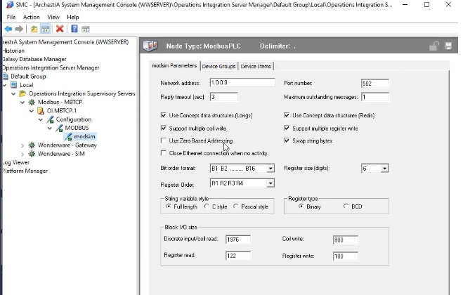

---

## 步驟五：使用 ModSim32 模擬 Modbus 從站
## Step 5: Simulate a Modbus Slave with ModSim32

**中文**
在還沒有實體 Modbus 設備可供測試時，可以使用 **ModSim32** 這套常見的 Modbus 從站模擬軟體。設定其 **Device Id**（本例為 255，需與前面的 SlaveID 一致）、起始位址（Address）、資料長度（Length）與 **MODBUS Point Type**（本例使用 03: Holding Register）。

畫面下方會列出對應的暫存器位址（例如 40001、40002…）與目前數值。可進一步開啟 **Auto Simulation** 功能，設定：

- **Simulation Type**：例如 Random（隨機值）
- **Change Interval (secs)**：例如每 2 秒變化一次
- **Simulation Range**（Low Limit / High Limit）：例如 0～32767

啟用後，這些暫存器的數值就會依設定自動變化，方便後續驗證 System Platform 端是否能正確讀取到即時更新的數據。

**English**
When no physical Modbus device is available for testing, you can use **ModSim32**, a popular Modbus slave simulator. Configure its **Device Id** (255 in this example, matching the SlaveID used earlier), the starting **Address**, the data **Length**, and the **MODBUS Point Type** (03: Holding Register in this example).

The lower part of the window lists the corresponding register addresses (e.g., 40001, 40002, …) and their current values. You can further enable the **Auto Simulation** feature and configure:

- **Simulation Type**: e.g., Random
- **Change Interval (secs)**: e.g., every 2 seconds
- **Simulation Range** (Low Limit / High Limit): e.g., 0 to 32767

Once enabled, these register values will change automatically according to the settings, making it easy to verify afterward that System Platform is correctly reading the live updating data.

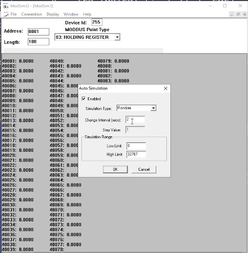

---

## 步驟六：手動新增裝置項目（Device Item）
## Step 6: Manually Add a Device Item

**中文**
回到 SMC 的 ModbusPLC 連線節點，切換到「Device Items」頁籤，即可在此定義要對應到 Modbus 暫存器的標籤（Tag）。例如，若某個浮點數（Floating Point）數值（如壓力量 PT101）需要使用連續兩個暫存器來表示，可以將 **Name** 設為 `PT101`，**Item Reference** 設為 `40001 F`——其中 `40001` 表示起始的 Holding Register 位址，字尾的 `F` 表示這是浮點數格式（會占用 40001 與 40002 兩個暫存器）。

**English**
Back at the ModbusPLC connection node in the SMC, switch to the "Device Items" tab, where tags can be mapped to Modbus registers. For example, if a floating-point value (such as a pressure reading, PT101) spans two consecutive registers, set the **Name** to `PT101` and the **Item Reference** to `40001 F` — where `40001` is the starting Holding Register address, and the trailing `F` indicates a floating-point format (occupying both registers 40001 and 40002).

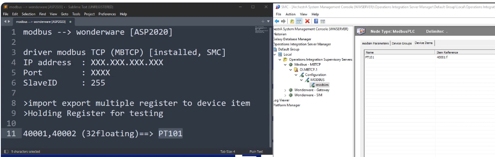

---

## 步驟七：以 Excel 整理多個標籤並批次匯入
## Step 7: Organize Multiple Tags in Excel and Bulk-Import Them

**中文**
若需要新增的標籤數量較多，一個個手動輸入會很沒效率。這時可以先在 SMC 的 Device Items 頁籤按右鍵，選擇 **Export**，將目前的項目匯出成 CSV 檔案，再以 Excel 開啟編輯。

例如在 Excel 中建立以下對照表：

| 標籤名稱 / Tag Name | Item Reference |
|---|---|
| PT101 | 40001 f |
| FT101 | 40003 f |
| TT101 | 40005 f |

其中每個浮點數標籤各佔用兩個連續暫存器（例如 PT101 使用 40001、40002；FT101 使用 40003、40004），因此下一個標籤的起始位址需間隔 2。編輯完成後儲存為 CSV 檔案。

**English**
If many tags need to be added, entering them one by one is inefficient. Instead, right-click the Device Items tab in the SMC and choose **Export** to export the current items as a CSV file, then open and edit it in Excel.

For example, build the following mapping table in Excel:

| Tag Name | Item Reference |
|---|---|
| PT101 | 40001 f |
| FT101 | 40003 f |
| TT101 | 40005 f |

Since each floating-point tag occupies two consecutive registers (e.g., PT101 uses 40001 and 40002; FT101 uses 40003 and 40004), the next tag's starting address must be offset by 2. Save the file as CSV once editing is complete.

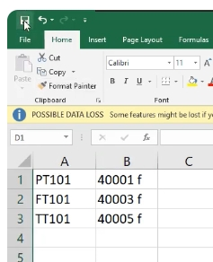

**中文**
回到 SMC 的 Device Items 頁籤，按右鍵選擇 **Import**，選取剛剛編輯好的 CSV 檔案，即可將多個標籤一次性匯入，不需要逐一手動新增。

**English**
Back in the SMC's Device Items tab, right-click and choose **Import**, then select the CSV file you just edited to bulk-import all the tags at once, without having to add them manually one at a time.

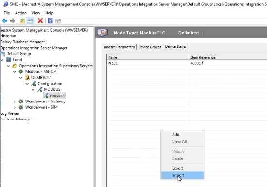

---

## 步驟八：啟動驅動程式執行個體
## Step 8: Activate the Driver Instance

**中文**
完成連線與標籤設定後，回到 SMC 上層的驅動程式節點（例如 OI.MBTCP.1），可以先在右側檢視目前已安裝的元件與版本資訊（例如 MBTCP、MBTCP [Shell]、Original DAS Toolkit、DASEngine 等），確認版本無誤後，於節點上按右鍵選擇 **Activate（啟動，開機自動啟動）**，讓此驅動程式執行個體開始運作，才能實際與 Modbus 從站通訊。

**English**
After completing the connection and tag configuration, go back to the driver node higher up in the SMC (e.g., OI.MBTCP.1). You can first check the installed components and their version information on the right (such as MBTCP, MBTCP [Shell], Original DAS Toolkit, DASEngine, etc.). Once the versions look correct, right-click the node and choose **Activate (auto start after reboot)** to start this driver instance so it can actually communicate with the Modbus slave.

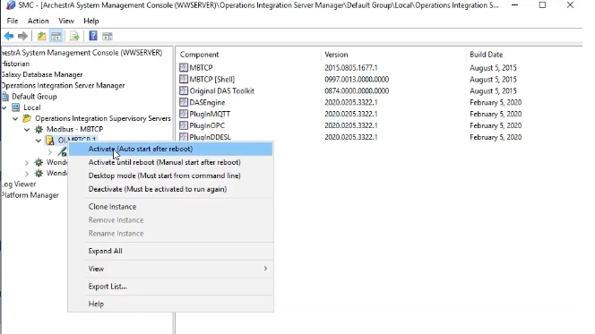

---

## 步驟九：建立 InTouch 應用程式
## Step 9: Create the InTouch Application

**中文**
驅動程式啟動後，開啟 **InTouch Application Manager**，點選建立新應用程式（Create New Application）。在範本選擇畫面中，選擇 **STANDALONE | Empty Native Application**（空白原生應用程式）作為起始範本。

**English**
Once the driver is running, open the **InTouch Application Manager** and choose to create a new application (Create New Application). In the template selection screen, choose **STANDALONE | Empty Native Application** as the starting template.

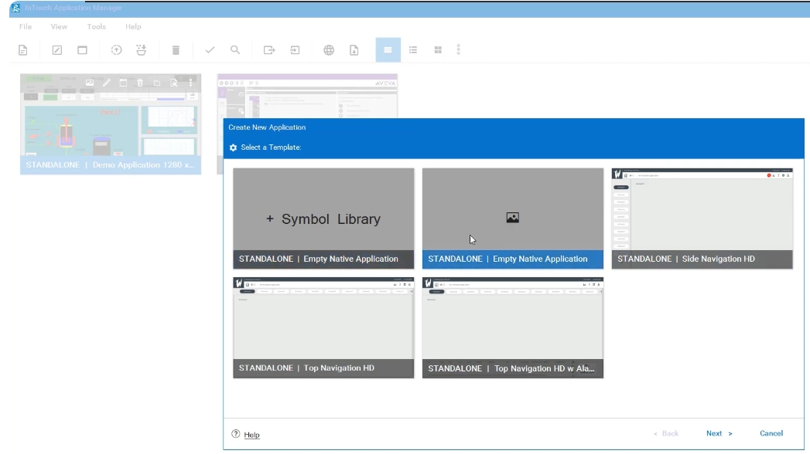

**中文**
接著在「Enter Application Details」畫面中，填入應用程式相關資訊，例如：

- **Application Name**：`TEST_HMI`
- **Directory Name**：`TEST_HMI`
- **Application Path**：預設路徑（例如 `C:\Users\Public\Wonderware\Intouch...`）
- **Resolution**：Screen Resolution，並可指定畫面寬（Width）與高（Height），例如 1920 × 1080
- **Description**：簡短描述此應用程式用途

確認資訊無誤後建立應用程式。

**English**
In the "Enter Application Details" screen, fill in the application information, such as:

- **Application Name**: `TEST_HMI`
- **Directory Name**: `TEST_HMI`
- **Application Path**: the default path (e.g., `C:\Users\Public\Wonderware\Intouch...`)
- **Resolution**: Screen Resolution, specifying width and height, e.g., 1920 × 1080
- **Description**: a brief description of the application's purpose

Once everything looks correct, create the application.

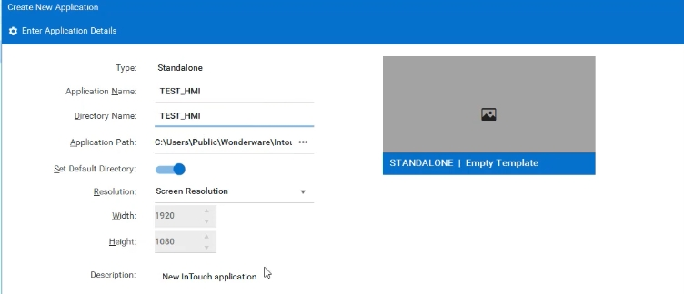

---

## 步驟十：於 WindowMaker 建立新畫面
## Step 10: Create a New Window in WindowMaker

**中文**
應用程式建立完成後，開啟 **InTouch WindowMaker**，在左側「Project View → Windows & Scripts → Windows」上按右鍵，選擇 **New Window...** 以建立一個新畫面。

**English**
Once the application is created, open **InTouch WindowMaker**. In the "Project View → Windows & Scripts → Windows" panel on the left, right-click and choose **New Window...** to create a new window.

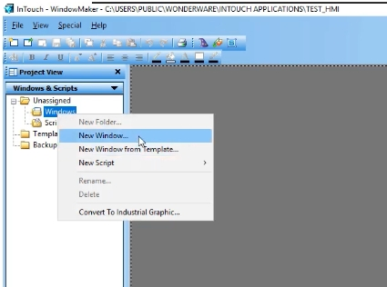

**中文**
在彈出的「Window Properties」對話方塊中，設定畫面名稱（Name），例如 `main_page`，並可設定：

- **Window Type**：Replace / Overlay / Popup（本例使用 Replace）
- **Frame Style**：Single / Double / None
- **X / Y Location**：畫面在螢幕上的位置
- **Window Width / Height**：畫面尺寸（例如 1920 × 1037）
- 是否顯示 Title Bar、Close Button、Size Controls 等選項

設定完成後按下「OK」，即完成第一個 HMI 畫面的建立。後續（第二部分）將接續示範如何在此畫面上建立標籤（如 PT101、FT101）、加入動畫連結（Animation Link），並切換到執行時期（Runtime）觀察數值即時更新的效果。

**English**
In the "Window Properties" dialog that appears, set the window Name, for example `main_page`, and configure options such as:

- **Window Type**: Replace / Overlay / Popup (Replace is used here)
- **Frame Style**: Single / Double / None
- **X / Y Location**: the window's position on screen
- **Window Width / Height**: the window's dimensions (e.g., 1920 × 1037)
- Whether to show the Title Bar, Close Button, Size Controls, and similar options

Click "OK" once configured, completing the creation of the first HMI window. **Part 2** will continue by showing how to create tags (such as PT101 and FT101) on this window, add animation links, and switch to Runtime to observe the values updating live.

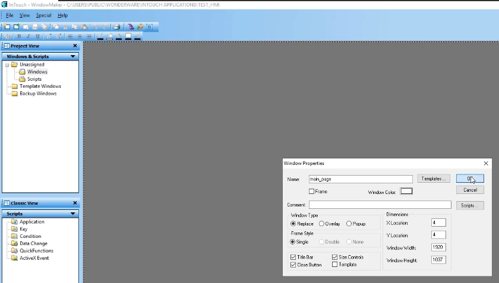

---

## 待續 / To Be Continued

**中文**
本篇（上集）已完成：Modbus TCP 驅動程式確認與安裝、連線與裝置項目設定、以 ModSim32 模擬從站數值、標籤批次匯入，以及 InTouch 應用程式與第一個畫面的建立。請留意接下來的【下集】，將接續說明如何在畫面上放置物件並連結標籤、設定動畫連結，以及進入 Runtime 驗證數值是否正確即時更新。

**English**
This part (Part 1) has covered: verifying and installing the Modbus TCP driver, configuring the connection and device items, simulating slave values with ModSim32, bulk-importing tags, and creating the InTouch application along with its first window. Stay tuned for **Part 2**, which will continue with placing objects on the window and linking them to tags, configuring animation links, and switching to Runtime to verify that values update correctly in real time.
