# Modbus TCP（MBTCP）連接 AVEVA Wonderware System Platform 2020 教學（下）
# Connecting a Modbus TCP (MBTCP) Device to AVEVA Wonderware System Platform 2020 — Part 2 (Chinese / English)

> 影片來源 / Source video：[Modbus TCP MBTCP Aveva Wonderware SP2020 Basic Guide](https://www.youtube.com/watch?v=gcbKKnG7zP8)
> 說明 / Note：本篇為【下集】，銜接【上集】完成的 InTouch 應用程式與第一個畫面（main_page），內容涵蓋建立 Access Name、定義標籤（Tagname）、將畫面物件連結至標籤、進入 Runtime 觀察數值即時更新，以及使用 Substitute Tags 快速複製物件等內容。
> This is **Part 2 of 2**, continuing from the InTouch application and first window (main_page) created in Part 1. It covers creating an Access Name, defining tagnames, linking screen objects to tags, observing live value updates in Runtime, and using Substitute Tags to quickly duplicate objects.

---

## 步驟十一：在 WindowMaker 中建立 Access Name
## Step 11: Create an Access Name in WindowMaker

**中文**
在 InTouch WindowMaker 左側「Tools」清單中點選 **Access Names**，開啟「Access Names」管理視窗，點選新增（Add Access Name），設定：

- **Access Name**：`MODBUS`（此名稱將在標籤設定時被引用）
- **Application Name**：`MBTCP`（對應先前在 SMC 中設定的驅動應用程式名稱）
- **Topic Name**：`Topic_0`（對應先前在 SMC 裝置群組中設定的主題名稱）
- **通訊協定**：選擇 **SuiteLink**
- **When to advise server**：選擇 **Advise only active items**（僅通知目前作用中的項目，可降低不必要的通訊量）

設定完成後按下「OK」，即完成 InTouch 與 System Platform I/O Server 之間的橋接設定。

**English**
In InTouch WindowMaker, click **Access Names** in the "Tools" panel on the left to open the Access Names manager, then click Add Access Name and configure:

- **Access Name**: `MODBUS` (this name will be referenced later when configuring tags)
- **Application Name**: `MBTCP` (matching the driver application name configured earlier in the SMC)
- **Topic Name**: `Topic_0` (matching the topic name configured earlier under the device group in the SMC)
- **Protocol**: choose **SuiteLink**
- **When to advise server**: choose **Advise only active items** (to reduce unnecessary communication by only notifying currently active items)

Click "OK" once configured — this completes the bridge between InTouch and the System Platform I/O Server.

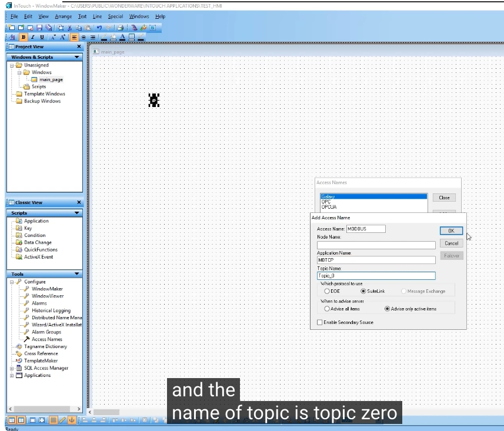

---

## 步驟十二：開啟 Tagname Dictionary 建立標籤
## Step 12: Open the Tagname Dictionary to Create Tags

**中文**
接著在「Tools」清單中點選 **Tagname Dictionary**，開啟標籤字典視窗，點選 **New** 準備建立一個新的標籤。

**English**
Next, click **Tagname Dictionary** in the "Tools" panel to open the tag dictionary, then click **New** to begin creating a new tag.

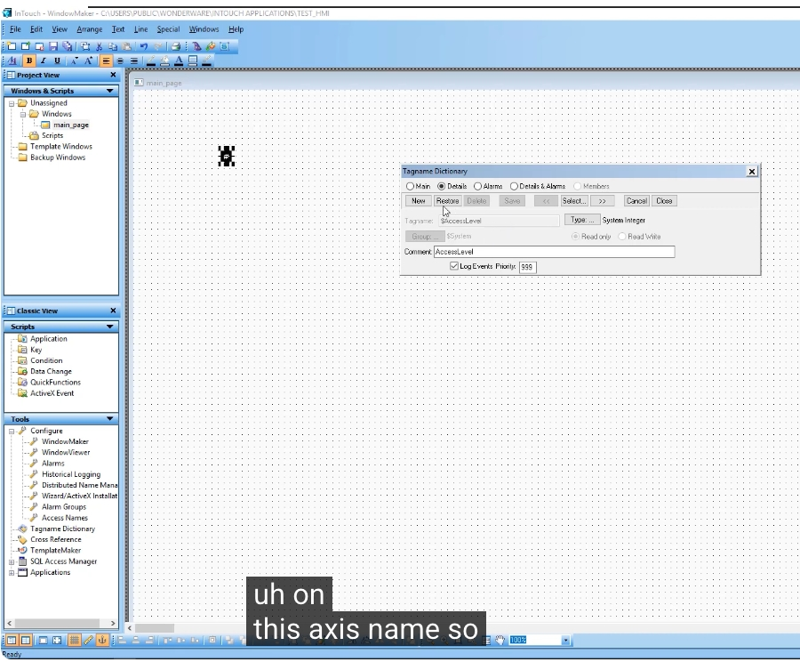

**中文**
點選「Type...」選擇標籤類型（Tag Types），由於此標籤要對應一個類比型的即時輸入數值，因此選擇 **I/O Real**（類比、來自外部裝置、浮點數）。

**English**
Click "Type..." to choose the Tag Type. Since this tag corresponds to a real-time analog input value from an external device, choose **I/O Real** (analog, sourced from an external device, floating point).

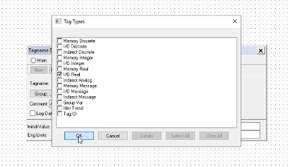

---

## 步驟十三：建立 PT101 標籤並連結 Access Name
## Step 13: Create the PT101 Tag and Link It to the Access Name

**中文**
將 **Tagname** 設為 `PT101`，並在「Access Names」清單中選擇剛剛建立的 **MODBUS**，然後點選「Close」套用此存取名稱。

**English**
Set the **Tagname** to `PT101`, select the **MODBUS** access name created earlier from the "Access Names" list, and click "Close" to apply it.

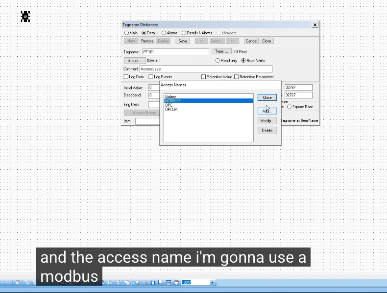

**中文**
設定完成後，畫面會顯示：

- **Access Name**：`MODBUS`
- **Item**：`PT101`
- 勾選 **Use Tagname as Item Name**（直接使用標籤名稱作為 Item 名稱），因為在 SMC 的 Device Items 中，項目名稱本來就已經命名為 `PT101`，因此不需要再另外輸入對應的暫存器位址。

點選「Save」儲存此標籤。

**English**
Once configured, the screen shows:

- **Access Name**: `MODBUS`
- **Item**: `PT101`
- The **Use Tagname as Item Name** option is checked, since the Device Item in the SMC was already named `PT101`, so there's no need to enter the register address again here.

Click "Save" to save this tag.

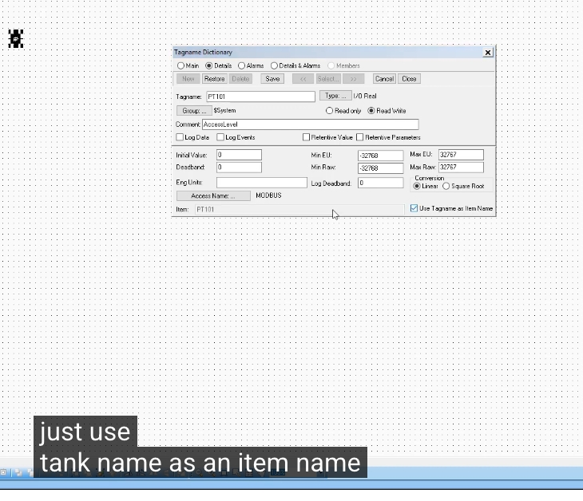

---

## 步驟十四：以相同方式建立 FT101 標籤
## Step 14: Create the FT101 Tag the Same Way

**中文**
重複上述步驟，建立第二個標籤 `FT101`，同樣選擇類型 **I/O Real**、Access Name 設為 `MODBUS`，並勾選 **Use Tagname as Item Name**。由於 `FT101` 在 SMC 的 Device Items 中也已經對應到正確的暫存器位址（`40003 f`），因此這裡同樣不需要再手動輸入位址。

**English**
Repeat the same steps to create a second tag, `FT101`, again choosing the **I/O Real** type, setting the Access Name to `MODBUS`, and checking **Use Tagname as Item Name**. Since `FT101` is already mapped to the correct register address (`40003 f`) in the SMC's Device Items, there's no need to manually enter the address here either.

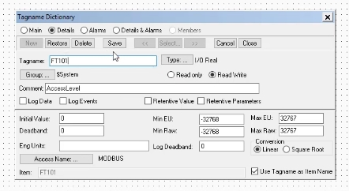

---

## 步驟十五：直接從清單選取已存在的標籤（TT101）
## Step 15: Select an Existing Tag Directly from the List (TT101)

**中文**
由於 `PT101`、`FT101`、`TT101` 三個標籤所對應的暫存器位址，先前已經透過 CSV 批次匯入到 SMC 的 Device Items 中，因此在 InTouch 這一端，也可以直接透過「Select Tag」視窗，從清單中選取已定義好 Access Name 為 `MODBUS` 的 **TT101** 標籤，不需要再重新輸入位址等資訊。

**English**
Since the register addresses for `PT101`, `FT101`, and `TT101` were already bulk-imported into the SMC's Device Items via CSV, on the InTouch side you can also simply use the "Select Tag" dialog to pick the already-defined **TT101** tag (with its Access Name set to `MODBUS`) directly from the list, without re-entering the address information.

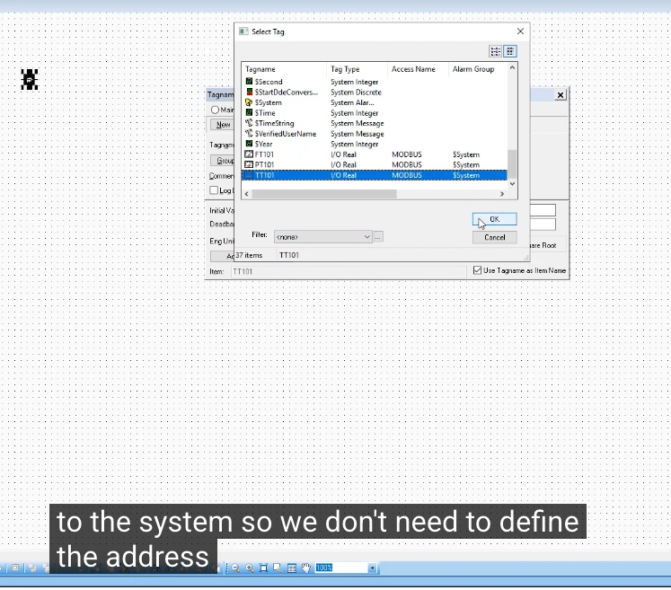

---

## 步驟十六：在畫面上放置物件並設定動畫連結
## Step 16: Place an Object on the Screen and Configure Its Animation Link

**中文**
回到 WindowMaker 的 `main_page` 畫面，放置一個文字物件（Object type: Text），雙擊該物件開啟其動畫連結（Animation Links）設定視窗。在「Value Display」區塊中勾選 **Analog**，表示這個文字物件要用來顯示一個類比數值。

**English**
Back on the `main_page` window in WindowMaker, place a text object (Object type: Text) and double-click it to open its Animation Links configuration window. In the "Value Display" section, check **Analog**, indicating that this text object will display an analog value.

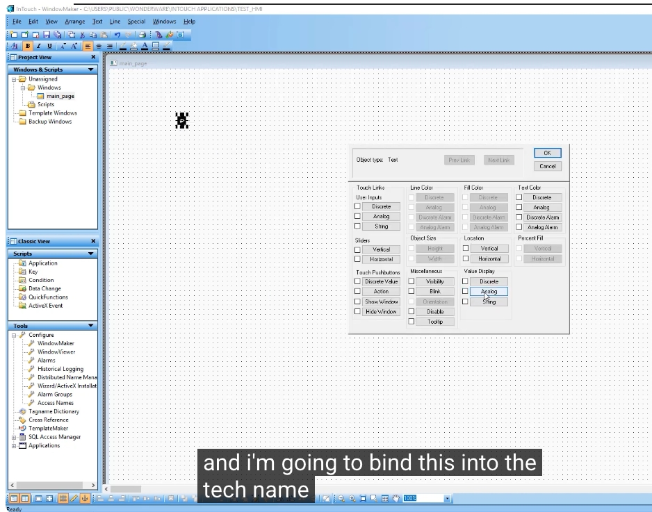

**中文**
接著系統會彈出「Select Tag」視窗，讓使用者選擇要與此物件綁定的標籤變數。這裡選擇先前建立好的 **PT101** 標籤，完成後點選「OK」，這個文字物件就會即時顯示 `PT101` 的數值。

**English**
The system then pops up the "Select Tag" dialog, letting you choose which tag variable to bind to this object. Here, the previously created **PT101** tag is selected; clicking "OK" completes the binding, so this text object will now display the live value of `PT101`.

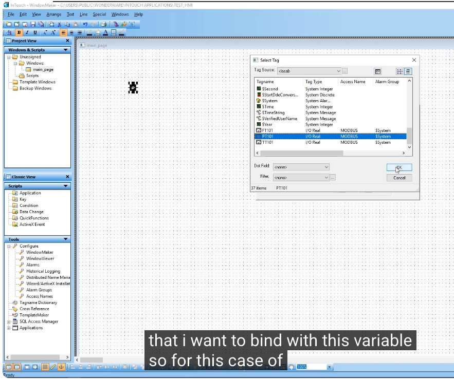

---

## 步驟十七：切換到 Runtime 驗證數值
## Step 17: Switch to Runtime to Verify the Value

**中文**
完成標籤綁定後，儲存畫面並切換到 **Runtime**（執行模式），啟動 **AVEVA InTouch HMI WindowViewer**。

**English**
After binding the tag, save the window and switch to **Runtime**, launching **AVEVA InTouch HMI WindowViewer**.

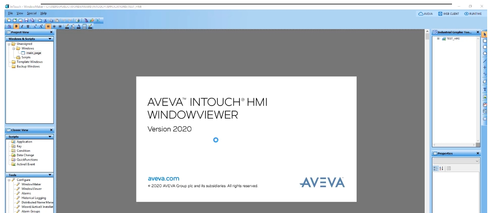

**中文**
進入 Runtime 畫面後，可以看到 `main_page` 上的文字物件已經顯示出即時數值（例如 `3297.0000`），且此數值與同時開啟的 **ModSim32** 模擬軟體中位址 `40001` 的數值相符，證明從 Modbus 從站（模擬器）→ MBTCP 驅動程式 → System Platform → InTouch 畫面的整條資料鏈路已經打通。

**English**
Once in Runtime, the text object on `main_page` shows a live value (e.g., `3297.0000`), matching the value at address `40001` in the **ModSim32** simulator that's open alongside it. This confirms that the entire data path — from the Modbus slave (simulator) → the MBTCP driver → System Platform → the InTouch screen — is working correctly.

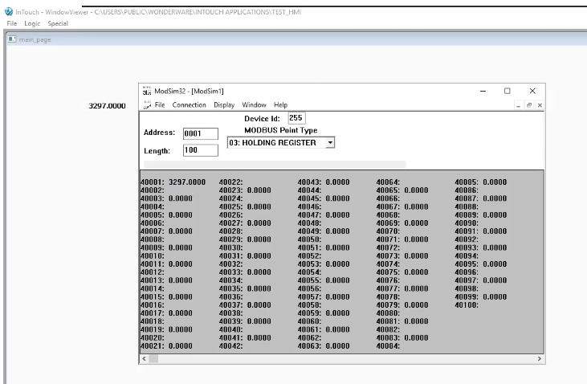

**中文**
為了進一步驗證資料是否會即時更新，可以在 ModSim32 中使用 **Write Floating Pt.** 功能，手動指定位址（例如 `5`，對應 `FT101` 所在的 `40005`）並輸入一個新的數值（例如 `123.467`），按下「Update」寫入後，若對應的畫面上也同步顯示出這個新數值，就代表整個系統的即時資料更新功能運作正常。

**English**
To further confirm that data updates in real time, you can use the **Write Floating Pt.** function in ModSim32 to manually specify an address (e.g., `5`, corresponding to `40005` where `FT101` resides) and enter a new value (e.g., `123.467`). After clicking "Update" to write the value, if the corresponding value on the screen updates to match, it confirms that the system's real-time data update is working correctly.

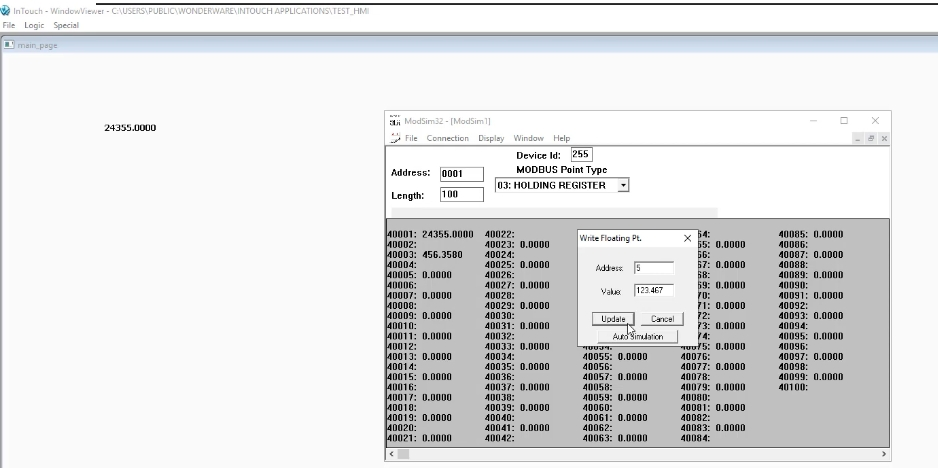

---

## 步驟十八：使用 Substitute Tags 快速建立其餘物件
## Step 18: Use Substitute Tags to Quickly Duplicate the Remaining Objects

**中文**
若畫面上已經有一個設定好動畫連結的物件（例如顯示 `PT101` 的文字物件），要再新增顯示 `FT101`、`TT101` 的物件時，除了重新建立一個物件並手動綁定標籤外，也可以善用 InTouch 提供的 **Substitute Tags** 功能：先複製既有的物件，選取後按右鍵，選擇 **Substitute → Substitute Tags...**，即可將複製出來的物件所綁定的標籤，快速替換成 `FT101` 或 `TT101`，而不需要重新設定一次完整的動畫連結內容。

**English**
If a screen already has an object with an animation link configured (for example, a text object showing `PT101`), and you need to add more objects to display `FT101` and `TT101`, instead of creating a brand-new object and manually binding the tag again, you can take advantage of InTouch's **Substitute Tags** feature: duplicate the existing object, right-click it, and choose **Substitute → Substitute Tags...** This quickly swaps the tag bound to the duplicated object to `FT101` or `TT101`, without having to reconfigure the entire animation link from scratch.

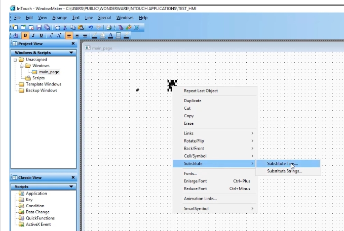

---

## 步驟十九：最終成果 —— 三個標籤同步即時更新
## Step 19: Final Result — All Three Tags Updating Live Together

**中文**
完成 `PT101`、`FT101`、`TT101` 三個物件的標籤綁定後，回到 Runtime 畫面，可以看到畫面上同時顯示三個數值（例如 `14018.0000`、`456.3580`、`123.4670`），並且會隨著 ModSim32 中對應暫存器數值的變化而即時更新，驗證整個 Modbus TCP 資料串接、標籤設定與 HMI 顯示流程均已正確完成。

**English**
Once the tag bindings for `PT101`, `FT101`, and `TT101` are all complete, returning to the Runtime screen shows all three values displayed together (e.g., `14018.0000`, `456.3580`, and `123.4670`), updating live as the corresponding register values change in ModSim32. This confirms that the entire Modbus TCP data chain, tag configuration, and HMI display are all working correctly.

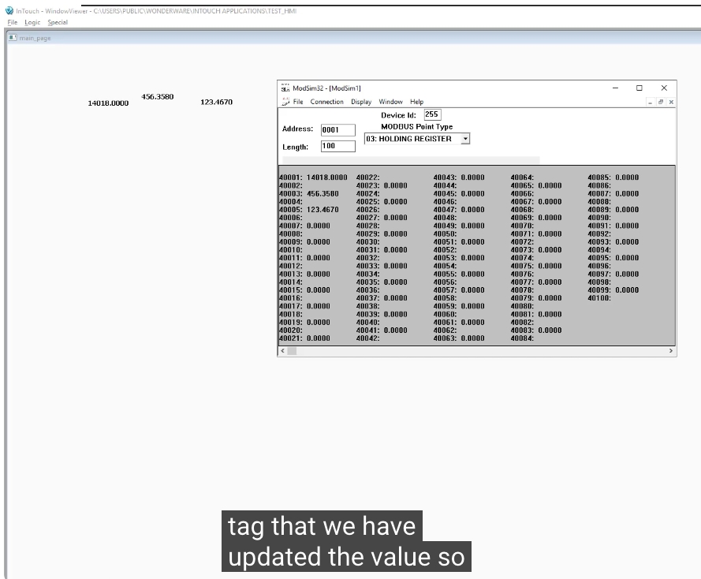

---

## 小結 / Summary

**中文**
綜合上、下兩篇教學，完整流程為：

1. 安裝並確認 Modbus TCP（MBTCP）驅動程式，於 SMC 中建立 ModbusPLC 連線並設定通訊參數；
2. 使用 ModSim32 模擬 Modbus 從站，並以手動新增或 CSV 批次匯入的方式，在 SMC 的 Device Items 中定義標籤與暫存器位址的對應關係；
3. 啟動驅動程式執行個體，建立 InTouch 應用程式與畫面；
4. 在 InTouch 中建立 Access Name，將其連結至 SMC 端的驅動程式應用程式與主題名稱；
5. 於 Tagname Dictionary 中建立對應的 I/O Real 標籤，並沿用相同的 Item 名稱；
6. 在畫面上放置物件、設定動畫連結並綁定標籤，或使用 Substitute Tags 快速複製其他標籤的顯示物件；
7. 切換至 Runtime，並搭配 ModSim32 手動寫值測試，驗證資料能夠即時、正確地從 Modbus 從站傳遞到 HMI 畫面上。

透過以上步驟，即可完成一套完整的 Modbus TCP 裝置整合到 AVEVA Wonderware System Platform 2020 的基本架構。

**English**
Combining both parts, the complete workflow is:

1. Install and verify the Modbus TCP (MBTCP) driver, then create a ModbusPLC connection and configure its communication parameters in the SMC;
2. Use ModSim32 to simulate a Modbus slave, and define the tag-to-register mapping in the SMC's Device Items, either manually or via bulk CSV import;
3. Activate the driver instance and create the InTouch application and window;
4. In InTouch, create an Access Name linking to the driver's application and topic name on the SMC side;
5. Create the corresponding I/O Real tags in the Tagname Dictionary, reusing the same item names;
6. Place objects on the screen, configure animation links and bind tags, or use Substitute Tags to quickly duplicate display objects for other tags;
7. Switch to Runtime and use ModSim32 to manually write test values, confirming that data flows correctly and in real time from the Modbus slave to the HMI screen.

Following these steps completes a basic setup for integrating a Modbus TCP device with AVEVA Wonderware System Platform 2020.
