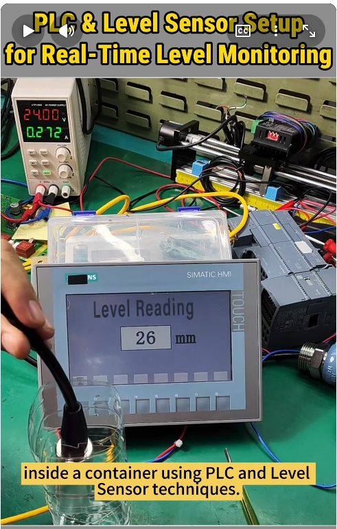
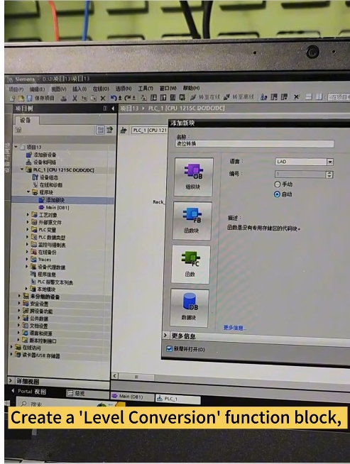
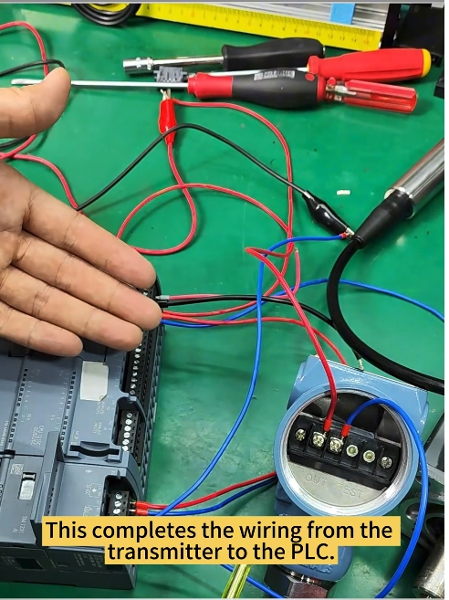
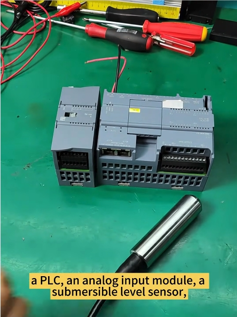
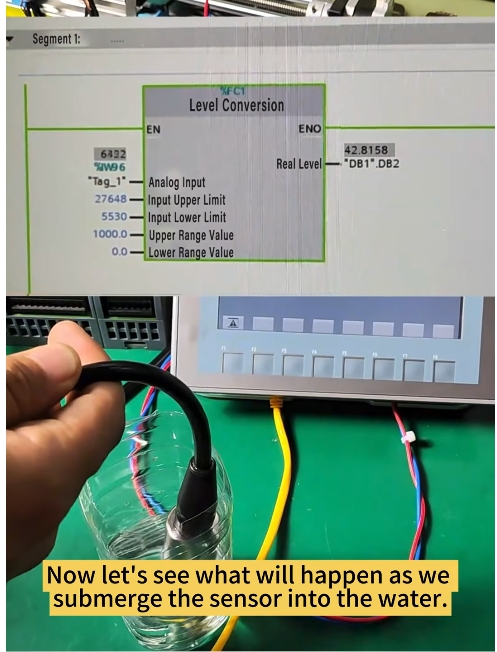
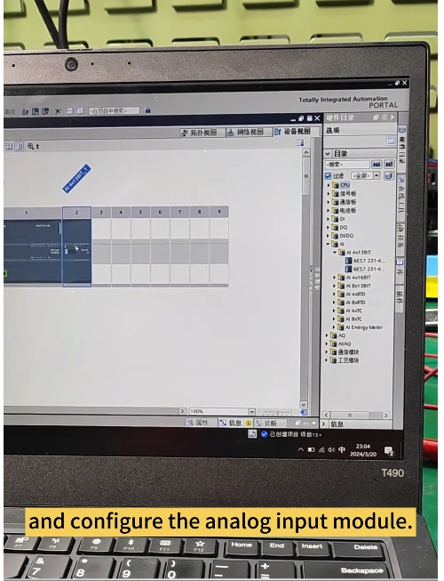
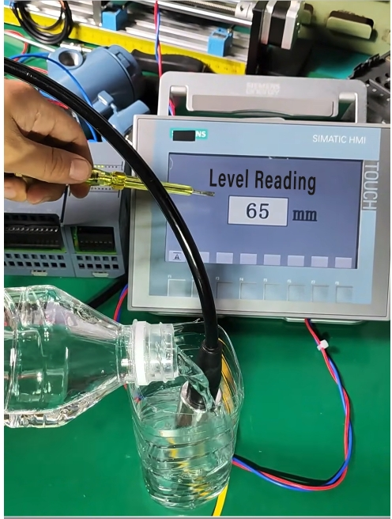
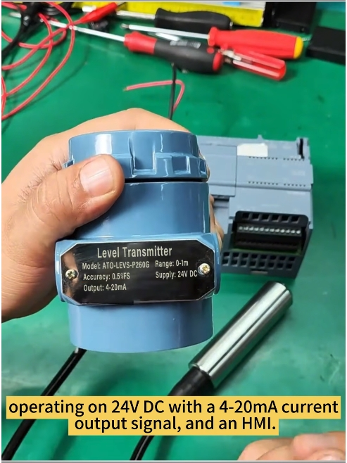

# 感測器水位監測系統教學（PLC + 液位感測器）
# Sensor-Based Water Level Monitoring with PLC (Chinese / English)

> 影片來源 / Source video：[Sensor-Based Water Level Monitoring with PLC](https://www.youtube.com/shorts/Ojk-2N4w4AQ)



---

## 簡介 / Introduction

**中文**
本教學示範如何利用 PLC 搭配液位感測器（液位變送器），即時量測容器內的水位高度。系統會將感測器輸出的類比電流訊號，透過 PLC 的類比輸入模組轉換為實際的液位數值（單位：mm），並顯示於 HMI 觸控面板上，達到即時、精準的液位監控效果。

**English**
This tutorial demonstrates how to use a PLC together with a level sensor (level transmitter) to measure the real-time water level inside a container. The analog current signal from the sensor is converted by the PLC's analog input module into an actual level value (in mm) and displayed on an HMI touch panel, enabling accurate, real-time level monitoring.

**中文**
此方案的主要優點：

- ✅ 精準監測（Precise monitoring）
- ✅ 即早發現水位異常變化（Early detection of level changes）
- ✅ 具備自動化控制能力（Automated control capabilities）

**English**
Key benefits of this setup:

- ✅ Precise monitoring
- ✅ Early detection of water level changes
- ✅ Automated control capabilities

---

## 材料單 / Bill of Materials (BOM)

**中文**
本專案所需的主要元件如下：

| 項次 | 元件名稱 | 規格說明 |
|---|---|---|
| 1 | PLC（含類比輸入模組） | 用於讀取類比訊號並執行控制邏輯 |
| 2 | 潛水式液位感測器（Submersible Level Sensor） | 置入液體中感測液位 |
| 3 | 液位變送器（Level Transmitter） | 量測範圍 0–1 m；供電 24 V DC；輸出訊號 4–20 mA（電流環） |
| 4 | HMI 人機介面 | 顯示即時液位讀值（本範例使用 Siemens SIMATIC HMI） |
| 5 | 24 V DC 直流電源供應器 | 供應變送器與相關迴路電源 |

參考採購連結（原廠商提供，僅供參考）：
- PLC / 類比輸入模組：ato.com（可搜尋 "programmable logic controller"）
- 潛水式液位感測器 / 液位變送器：ato.com（可搜尋 "level sensor"）
- HMI：ato.com（可搜尋 "hmi"）

**English**
Main components required for this project:

| # | Component | Specification |
|---|---|---|
| 1 | PLC (with analog input module) | Reads the analog signal and runs the control logic |
| 2 | Submersible Level Sensor | Placed inside the liquid to sense the level |
| 3 | Level Transmitter | Range 0–1 m; powered by 24 V DC; 4–20 mA current-loop output |
| 4 | HMI panel | Displays the real-time level reading (this example uses a Siemens SIMATIC HMI) |
| 5 | 24 V DC power supply | Powers the transmitter and related circuit |

Reference purchase links (provided by the original vendor, for reference only):
- PLC / analog input module: ato.com (search "programmable logic controller")
- Submersible level sensor / level transmitter: ato.com (search "level sensor")
- HMI: ato.com (search "hmi")





---

## 步驟一：接線 —— 將液位變送器接至 PLC
## Step 1: Wiring — Connect the Level Transmitter to the PLC

**中文**
依照下列方式將液位變送器接線至 PLC 的類比輸入端：

1. 變送器的 **OUT 正端（Out+）** 接至 24 V DC 電源的正極端子。
2. 變送器的 **OUT 負端（Out–）** 接至 PLC 類比輸入模組的 **AI 正端（0+）**。
3. 變送器的 **零負端（0–／訊號迴路負端）** 接至 24 V DC 電源的負極端子。

完成上述接線後，變送器與 PLC 之間的迴路即已接妥。

**English**
Wire the level transmitter to the PLC's analog input as follows:

1. Connect the transmitter's **Out+** terminal to the **positive** terminal of the 24 V DC power supply.
2. Connect the transmitter's **Out–** terminal to the **positive (0+)** terminal of the PLC's analog input channel.
3. Connect the transmitter's **0– (signal loop negative)** terminal to the **negative** terminal of the 24 V DC power supply.

Once these connections are made, the wiring between the transmitter and the PLC is complete.



---

## 步驟二：組態類比輸入模組
## Step 2: Configure the Analog Input Module

**中文**
開啟對應的自動化組態軟體（本範例使用西門子 TIA Portal），在硬體目錄中新增並設定類比輸入模組（AI 模組），確認訊號類型設定為電流輸入（對應 4–20 mA），並依模組實際安裝位置完成硬體組態。

**English**
Open the corresponding automation configuration software (this example uses Siemens TIA Portal), add the analog input (AI) module from the hardware catalog, configure the signal type as current input (matching the 4–20 mA range), and complete the hardware configuration according to the module's actual slot position.



---

## 步驟三：建立液位轉換函數方塊並進行標準化與縮放
## Step 3: Create a Level Conversion Function Block with Standardization and Scaling

**中文**
在程式區塊中新增一個功能方塊（Function Block），命名為「Level Conversion（液位轉換）」。在此方塊內使用標準化（Normalize）與縮放（Scale）指令，將類比輸入的原始數位量（例如 0–27648，對應 4–20 mA）轉換為實際的工程單位數值（例如 0–1000.0，對應 0–1 m 的液位高度，單位 mm）。

**English**
Add a new Function Block named "Level Conversion" in the program blocks. Inside this block, use standardization (Normalize) and scaling (Scale) instructions to convert the raw digital value from the analog input (for example 0–27648, corresponding to 4–20 mA) into the actual engineering value (for example 0–1000.0, corresponding to a 0–1 m level, in mm).



**中文**
下圖顯示已完成的液位轉換方塊，輸入端包含類比輸入值（Analog Input）、輸入上限／下限（Input Upper/Lower Limit）、輸出範圍上限／下限（Upper/Lower Range Value），輸出端則為換算後的實際液位（Real Level）。此時可以將感測器實際浸入水中，觀察數值是否隨液位變化即時更新。

**English**
The figure below shows the completed level conversion block, with inputs for the Analog Input value, Input Upper/Lower Limit, and Upper/Lower Range Value, and an output for the converted Real Level. At this point, the sensor can be submerged in water to check whether the value updates in real time as the level changes.



---

## 步驟四：建立資料區塊、下載程式並監控執行
## Step 4: Create a Data Block, Download the Program, and Monitor Execution

**中文**
建立一個全域資料區塊（Global Data Block），用以儲存換算後的液位數值，供 HMI 畫面讀取顯示。完成組態後，將程式下載至 PLC，並開始監控其執行狀態，確認邏輯運作正常。

**English**
Create a global Data Block to store the converted level value, which the HMI screen will read and display. After configuration, download the program to the PLC and begin monitoring its execution to confirm the logic is running correctly.

---

## 步驟五：實際測試 —— 觀察 HMI 即時讀值
## Step 5: Live Test — Observe the Real-Time Reading on the HMI

**中文**
將感測器放入盛水容器中，並持續加水，即可在 HMI 畫面上即時看到液位讀值隨著水量增加而變化，驗證整體系統運作正常。

**English**
Place the sensor into a water container and keep adding water. The HMI screen will show the level reading changing in real time as the water level rises, confirming that the overall system is working correctly.



---

## 附錄：三菱 PLC（GX Works3 / iQ-R、iQ-F 系列）ST 語言範例程式
## Appendix: Sample Mitsubishi PLC ST Program (GX Works3 / iQ-R, iQ-F series)

**中文**
下方提供一段以結構化文字（Structured Text, ST）撰寫的範例程式，功能與前述「液位轉換」功能方塊相同：將類比輸入模組讀取到的原始數位值（0–27648，對應 4–20 mA）線性換算為實際液位（0.0–1000.0 mm）。此程式為原創範例，可依實際硬體型號與 I/O 位址調整後，於三菱 GX Works3 環境中建立為一個功能方塊（Function Block）使用。

**English**
Below is a sample program written in Structured Text (ST), performing the same function as the "Level Conversion" block described above: linearly converting the raw digital value from the analog input module (0–27648, corresponding to 4–20 mA) into an actual level value (0.0–1000.0 mm). This is an original example program; adjust the hardware model and I/O addresses as needed before using it as a Function Block in the Mitsubishi GX Works3 environment.

```iecst
(* ============================================================
   Function Block: FB_LevelConversion
   說明 / Description:
     將類比輸入模組之原始數位值，線性換算為實際液位（mm）
     Linearly converts the raw analog-input digital value
     into an actual level reading in millimetres.
   適用平台 / Target platform:
     Mitsubishi iQ-R / iQ-F series, programmed in GX Works3 (ST)
   ============================================================ *)

FUNCTION_BLOCK FB_LevelConversion
VAR_INPUT
    AnalogInput      : INT;      (* 類比輸入原始值 / Raw analog input value, 0-27648 *)
    InputUpperLimit  : INT := 27648;  (* 輸入上限 / Raw value at 20 mA *)
    InputLowerLimit  : INT := 5530;   (* 輸入下限 / Raw value at 4 mA *)
    RangeUpperValue  : REAL := 1000.0; (* 輸出上限（mm）/ Engineering value at 20 mA *)
    RangeLowerValue  : REAL := 0.0;    (* 輸出下限（mm）/ Engineering value at 4 mA *)
END_VAR

VAR_OUTPUT
    RealLevel        : REAL;     (* 換算後之實際液位（mm）/ Converted level value in mm *)
    ValidData        : BOOL;     (* 數值是否在合理範圍內 / TRUE if the reading is within range *)
END_VAR

VAR
    NormalizedValue  : REAL;     (* 標準化後之比例值（0.0~1.0）/ Normalized ratio, 0.0 to 1.0 *)
    InputSpan        : REAL;     (* 輸入量程範圍 / Input span *)
END_VAR

(* --------------------------------------------------------------
   1. 計算輸入量程範圍，避免除以零
      Calculate the input span; guard against division by zero
   -------------------------------------------------------------- *)
InputSpan := REAL_TO_REAL(InputUpperLimit - InputLowerLimit);

IF InputSpan <> 0.0 THEN

    (* ----------------------------------------------------------
       2. 標準化（Normalize）：將原始值換算為 0.0 ~ 1.0 之間的比例
          Normalize the raw value into a 0.0 - 1.0 ratio
       ---------------------------------------------------------- *)
    NormalizedValue := (INT_TO_REAL(AnalogInput) - INT_TO_REAL(InputLowerLimit)) / InputSpan;

    (* 限制比例值於 0.0 ~ 1.0 之間，避免超量程造成不合理輸出
       Clamp the normalized ratio to 0.0 - 1.0 to avoid out-of-range output *)
    IF NormalizedValue < 0.0 THEN
        NormalizedValue := 0.0;
    ELSIF NormalizedValue > 1.0 THEN
        NormalizedValue := 1.0;
    END_IF;

    (* ----------------------------------------------------------
       3. 縮放（Scale）：將比例值換算為實際工程單位（mm）
          Scale the ratio into the engineering unit (mm)
       ---------------------------------------------------------- *)
    RealLevel := RangeLowerValue + NormalizedValue * (RangeUpperValue - RangeLowerValue);
    ValidData := TRUE;

ELSE
    (* 輸入量程設定錯誤，輸出預設值並標記為無效
       Invalid input span configuration: output default value and flag as invalid *)
    RealLevel := 0.0;
    ValidData := FALSE;

END_IF;

END_FUNCTION_BLOCK
```

**中文**
使用方式：在主程式（如 MAIN）中呼叫此功能方塊，將類比輸入模組對應的緩衝暫存器（Buffer Memory）數值連接至 `AnalogInput` 輸入，即可在 `RealLevel` 輸出得到換算後的液位數值（mm），可再將此數值寫入資料暫存器或 HMI 對應之元件供畫面顯示。

**English**
Usage: call this function block from the main program (e.g., MAIN), connecting the value from the analog input module's buffer memory to the `AnalogInput` input. The converted level value (in mm) is then available on the `RealLevel` output, which can be written to a data register or HMI element for display.

---

## 小結 / Summary

**中文**
本教學展示了如何以 PLC、類比輸入模組、液位變送器與 HMI 組成一套簡易的即時水位監測系統，並提供了對應的三菱 ST 範例程式，方便讀者依自身使用的 PLC 品牌（西門子 或 三菱）實作類似的液位換算邏輯。歡迎依此架構延伸，加入高低液位警報、自動抽水控制等進階功能。

**English**
This tutorial showed how to build a simple real-time water level monitoring system using a PLC, an analog input module, a level transmitter, and an HMI, and provided a corresponding sample Mitsubishi ST program so readers can implement similar level-conversion logic regardless of whether they use Siemens or Mitsubishi hardware. Feel free to extend this setup with high/low level alarms, automatic pump control, and other advanced features.
