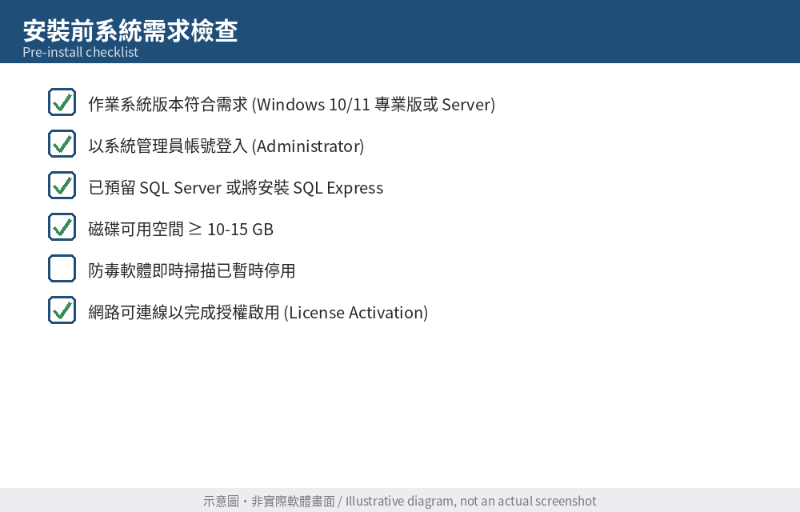
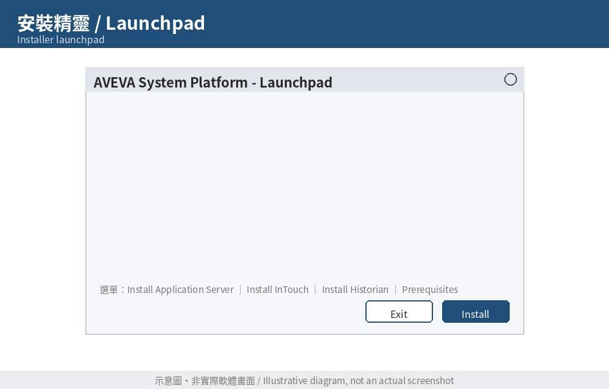
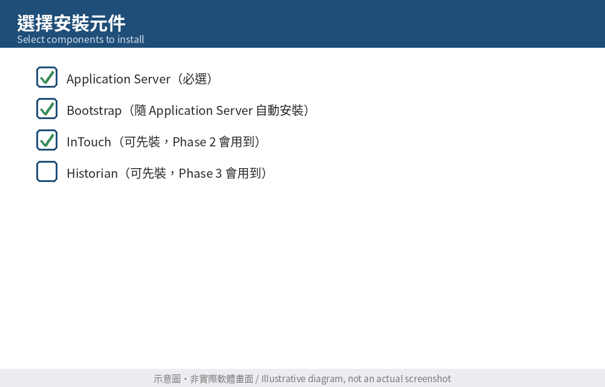
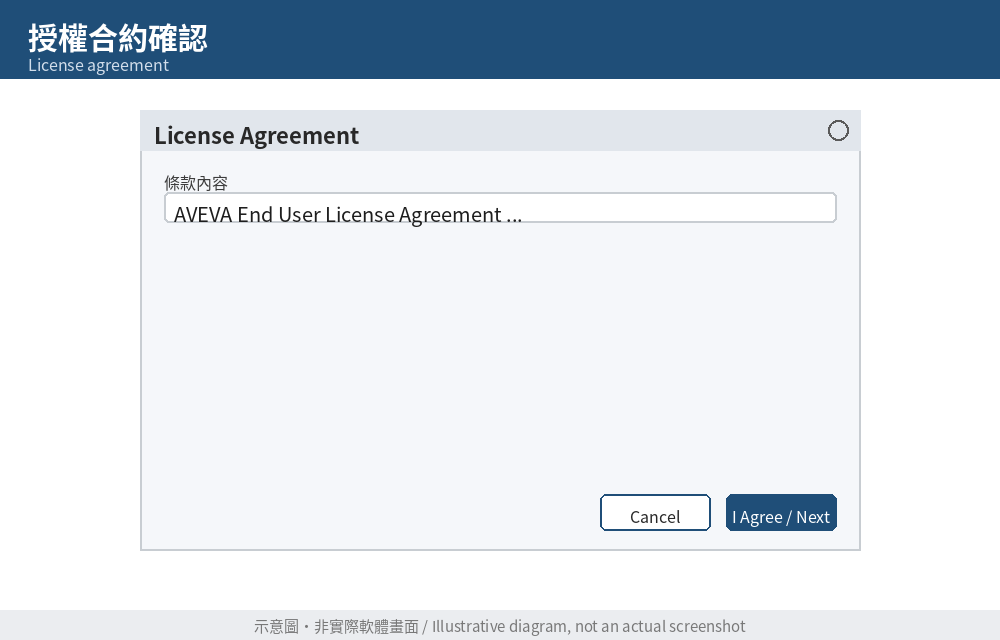
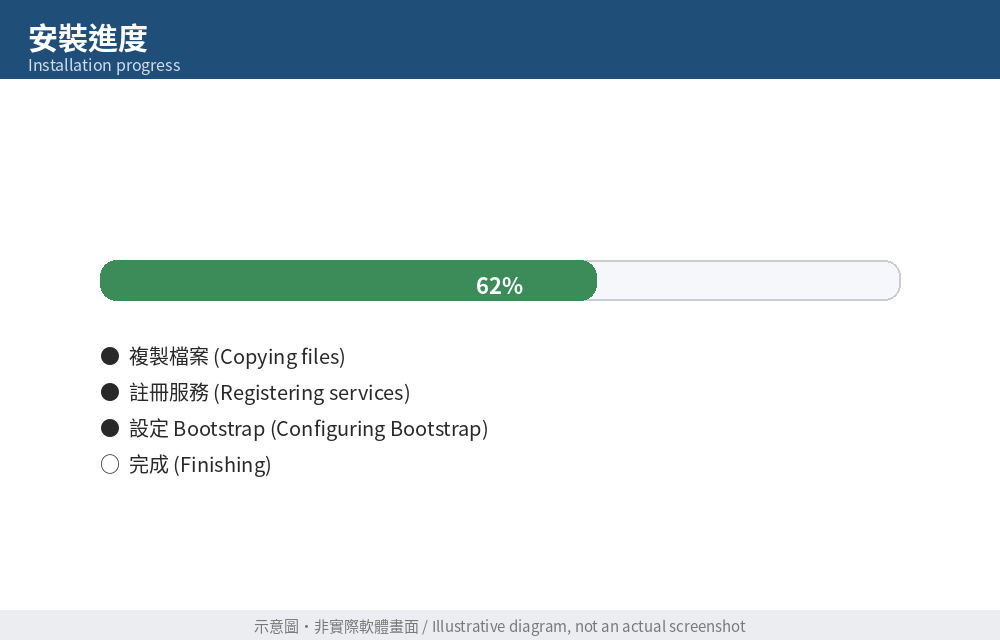
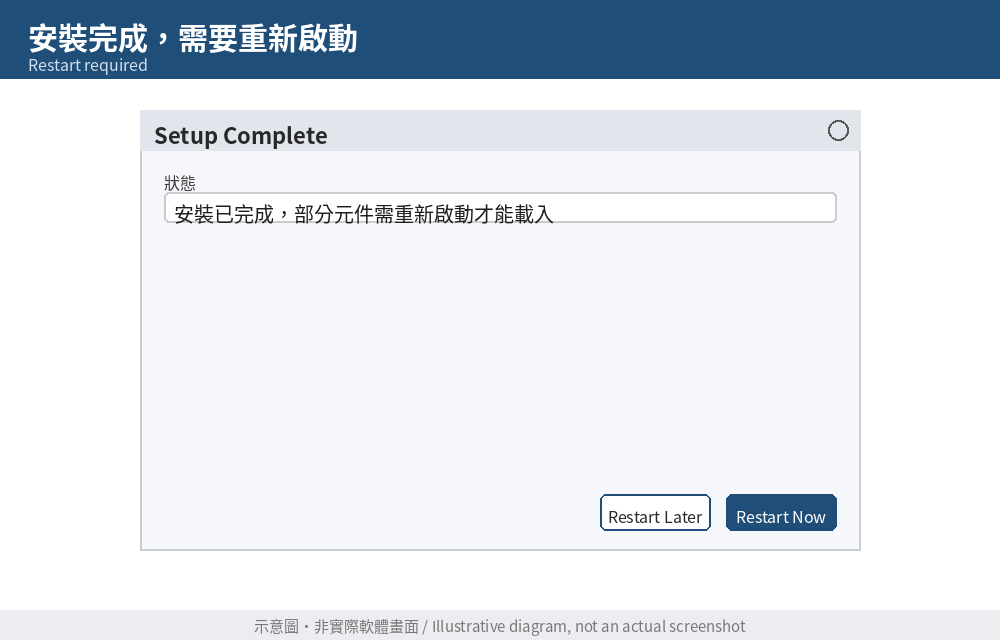
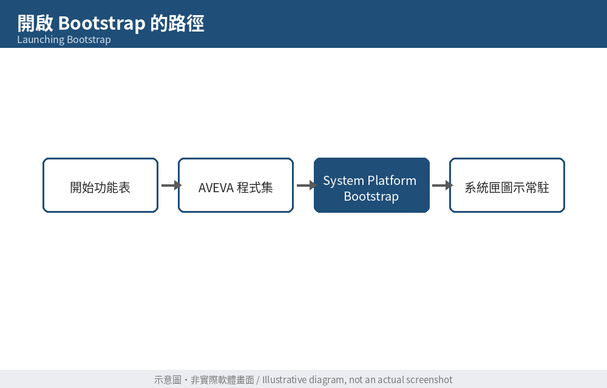
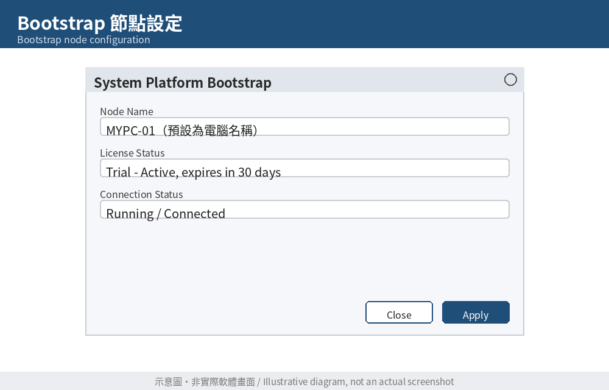

# Day 5：安裝 Application Server + Bootstrap

> 對應學習企劃案 Week 1（Day 5–6）｜前置：已於 Day 4 申請並下載 AVEVA System Platform 試用版

---

## 今日學習目標

- 確認安裝所需的系統需求與前置條件
- 完成 AVEVA System Platform（Application Server 元件）的安裝
- 認識並啟動 **Bootstrap**，理解它在整個平台中的角色
- 完成本機節點的基本設定，讓這台電腦具備成為 Galaxy 節點的能力

今天的產出：一台已安裝好 Application Server、Bootstrap 設定完成的工作站，明天（Day 6）將在此基礎上建立第一個 Galaxy Repository。

---

## 一、安裝前檢查清單

在執行安裝程式之前，先確認以下項目，避免安裝到一半才發現卡關：

| 檢查項目 | 建議 |
|---|---|
| 作業系統 | Windows 10/11 專業版或 Windows Server（依你下載的版本需求為準，安裝包內通常附有 System Requirements 文件） |
| 使用者權限 | 以**本機系統管理員（Administrator）**帳號登入 |
| .NET Framework | 安裝程式通常會自動偵測並提示安裝缺少的版本，建議先確保網路暢通以便自動下載 |
| SQL Server | Application Server 本身不強制要求，但 Galaxy Repository 需要一個 SQL Server（可用安裝包附的 SQL Server Express，或既有的 SQL Server 執行個體） |
| 磁碟空間 | 建議預留至少 10–15 GB 以上可用空間（含後續 InTouch、Historian） |
| 防毒軟體／防火牆 | 安裝過程建議暫時關閉防毒即時掃描，避免安裝檔被誤判攔截 |
| 網路 | 若為試用版授權，需能連上網路完成授權啟用（License Activation） |

> ✅ **今日練習 0**：對照上表逐項檢查你的電腦，並將結果記錄在自己的學習日誌中（哪些項目需要額外處理，例如安裝 SQL Server Express）。

*圖 1：安裝前的系統需求 / 相容性檢查畫面（實際畫面依安裝包版本而異，請於安裝時自行截圖取代此處）*

---

## 二、執行安裝程式

1. 找到 Day 4 下載的 AVEVA System Platform 安裝包，解壓縮（如為 ISO 或壓縮檔）。
2. 以「系統管理員身分執行」啟動 `Setup.exe`（或安裝入口頁面 Launchpad）。
3. 安裝精靈通常會先做一次**環境檢查（Prerequisites Check）**，列出目前系統缺少的元件（如 .NET、Visual C++ 執行庫等）。
4. 依提示安裝缺少的前置元件，這一步可能需要重新啟動電腦一次，重開機後再重新執行安裝程式即可接續。

*圖 2：安裝精靈 / Launchpad 啟動畫面*

### 選擇安裝元件

由於本階段目標是「Application Server + Bootstrap」，安裝時請注意：

- 至少勾選 **Application Server**（有些版本會顯示為 "AVEVA Application Server" 或整合於 "System Platform" 套件中）。
- **Bootstrap** 通常會隨 Application Server 一併安裝，不需要單獨勾選，但可留意安裝清單中是否有獨立列出。
- InTouch、Historian 若安裝包中已包含，可以先勾選一起裝好（後續 Phase 2、Phase 3 會用到），或是選擇之後再單獨安裝——兩種做法都可以，先裝好也不影響今天的練習進度。

*圖 3：選擇要安裝的元件（Application Server / InTouch / Historian 等）*

5. 閱讀並同意授權合約（License Agreement）。
6. 確認安裝路徑（建議使用預設路徑，除非有特殊磁碟配置需求）。
7. 按下「安裝／Install」，等待安裝完成。過程可能需要 20–60 分鐘，視元件數量與電腦效能而定，這段時間可以先閱讀教材第二章複習。

*圖 4：授權合約確認畫面*

*圖 5：安裝進度畫面*

8. 安裝完成後，系統通常會提示需要**重新啟動電腦**才能讓服務正確載入，請依提示重開機。

*圖 6：安裝完成後的重新啟動提示*

---

## 三、認識並啟動 Bootstrap

**Bootstrap** 是每一台要加入 AVEVA System Platform 網路的電腦，開機後最先啟動的核心服務。可以把它想成「這台電腦要不要加入 Galaxy 網路、扮演什麼角色」的**入口與身分設定介面**。

對照你熟悉的架構來理解：

- 在 FUXA/Node-RED 這類系統中，你通常是「單機執行、單一服務」；
- AVEVA System Platform 則是「網路化、多節點協同」的架構，Bootstrap 就是負責讓每個節點知道：
  - 我是誰（Node Name）
  - 我要不要連上某個 Galaxy Repository（GR 節點）
  - 我現在的運行模式是「開發模式（IDE 可編輯）」還是「僅執行模式（Runtime Only）」

重開機後，Bootstrap 通常會自動啟動一個系統匣（System Tray）小圖示，或可從開始功能表的 AVEVA 程式集中找到「**System Platform Bootstrap**」來開啟。

*圖 7：從開始功能表 / 系統匣開啟 Bootstrap*

### Bootstrap 基本設定

開啟 Bootstrap 後，通常需要確認或設定以下項目：

1. **Node Name（節點名稱）**：預設為電腦名稱，單機練習環境可維持預設值。
2. **Galaxy Repository (GR) 位置**：因為我們今天還沒有建立 Galaxy Repository，這裡先確認「本機」為候選節點即可，實際指定會在明天建立 Galaxy 時透過 IDE 完成。
3. **License（授權）**：確認試用授權已被系統偵測到（通常會顯示授權到期日、可用元件清單）。
4. **啟動狀態**：確認 Bootstrap 服務狀態為「執行中／已連線」，而非「錯誤」或「離線」。

*圖 8：Bootstrap 節點設定畫面（節點名稱、授權狀態）*

> 💡 **重點筆記**：今天的 Bootstrap 設定，只是讓這台電腦「準備好」成為 Galaxy 節點；真正的 Galaxy（專案本體）要到明天用 System Platform IDE 建立。兩者的關係類似：Bootstrap 是「電腦的身分證與門禁卡」，Galaxy 才是「實際的專案內容」。

---

## 四、今日練習

完成以下練習，並將結果整理成一段簡短筆記（3–5 行），作為每週學習日誌的素材：

1. **安裝確認**：打開「新增或移除程式」，確認 AVEVA Application Server（及你有勾選安裝的其他元件）已出現在已安裝清單中。
2. **服務確認**：打開 Windows「服務（Services）」管理員，找出與 AVEVA / ArchestrA / Wonderware 相關的服務（例如 Bootstrap 相關服務），確認狀態為「執行中」。
3. **Bootstrap 檢查**：截圖你電腦上 Bootstrap 的節點名稱與授權狀態畫面，存成 `images/day05-08-bootstrap-config.png`（取代本文件中的示意圖）。
4. **概念對照筆記**：用自己的話寫下——如果 FUXA 是「單機跑一個 Node-RED flow」，那 Bootstrap + Galaxy Repository 的架構解決了什麼 FUXA 架構沒有處理的問題？（提示：多節點協同、集中式專案管理、版本控制）

---

## 本日小結

今天完成了 AVEVA System Platform 的核心安裝，並理解 Bootstrap 作為「節點身分與網路入口」的角色。明天（Day 6）將正式使用 System Platform IDE，建立第一個 **Galaxy Repository**，這將是接下來 85 天所有專案的起點。
