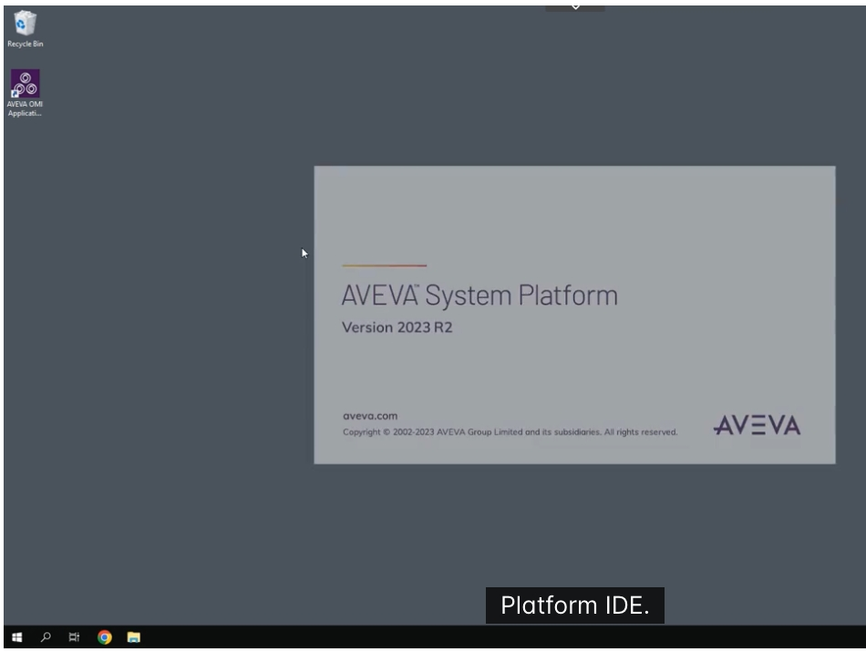
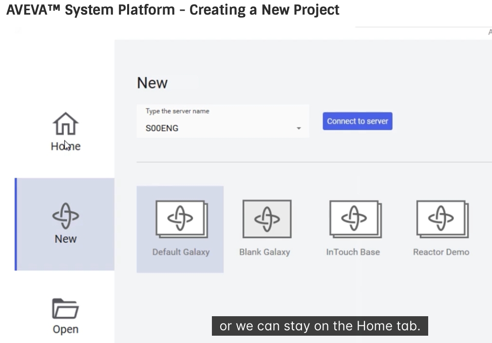
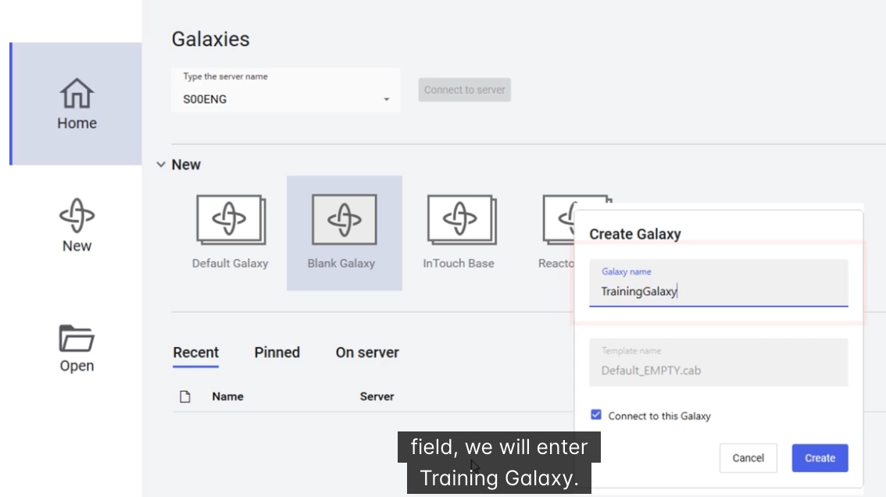
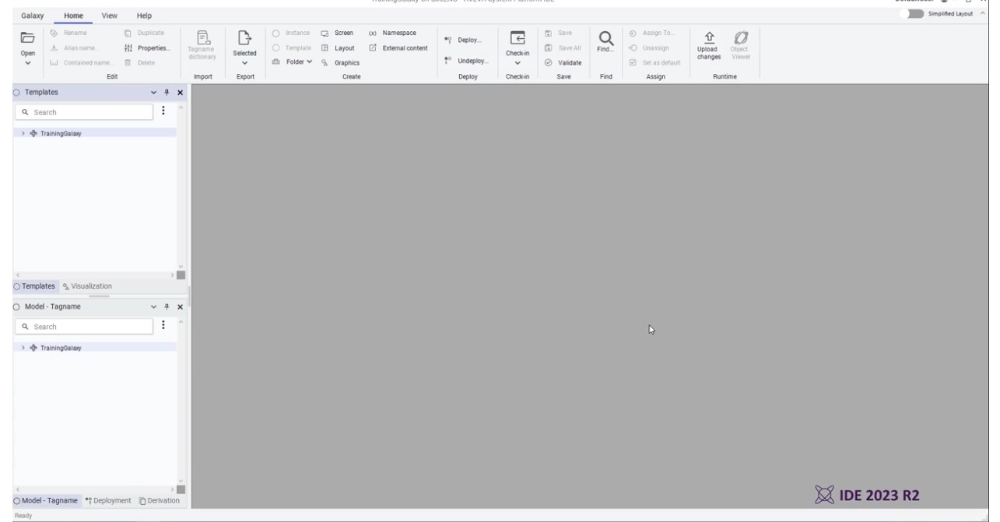

# AVEVA™ System Platform — Creating a New Project
## 建立新專案（新增 Galaxy）教學

雙語教學文件（中文／English）｜ Bilingual Tutorial (Chinese / English)

參考影片 / Reference video: https://learningacademy.aveva.com/learn/video/aveva-system-platform-creating-a-new-project-1?client=customer2024

---

## Overview 概述

This tutorial explains how to create a new Galaxy in AVEVA System Platform, and introduces the Galaxy templates available when launching the System Platform IDE. It walks through the Backstage area — where Galaxies are created and connected to a Galaxy Repository (GR) server — and then creates a new Galaxy named "TrainingGalaxy" from the Blank Galaxy template.

本教學說明如何在 AVEVA System Platform 中建立新的 Galaxy，並介紹啟動 System Platform IDE 時可用的 Galaxy 範本。內容涵蓋 Backstage 區域（用來建立 Galaxy 並連線至 Galaxy Repository／GR 伺服器的地方），並實際示範以 Blank Galaxy 範本建立一個名為「TrainingGalaxy」的新 Galaxy。

---

## Step 1: Launch the System Platform IDE
### 步驟 1：啟動 System Platform IDE

From the Windows Start menu (or a desktop shortcut), launch "System Platform IDE". While the application loads, a splash screen appears showing the installed AVEVA System Platform version — in this example, Version 2023 R2.

從 Windows 開始功能表（或桌面捷徑）啟動「System Platform IDE」。應用程式載入時會顯示啟動畫面，標示所安裝的 AVEVA System Platform 版本，本範例為 Version 2023 R2。

*System Platform IDE splash screen / System Platform IDE 啟動畫面*

---

## Step 2: The Backstage Area — Home and New Tabs
### 步驟 2：Backstage 區域 — Home 與 New 頁籤

Once the IDE finishes loading, the **Backstage area** is displayed. This is where a new Galaxy is created and connected to a specified Galaxy Repository (GR) server, or where existing Galaxies are opened and managed.

IDE 載入完成後，會顯示 **Backstage 區域**。這裡用來在指定的 Galaxy Repository（GR）伺服器上建立新的 Galaxy，也可以開啟或管理既有的 Galaxy。

- The **"New"** tab shows only the configuration options for creating a new Galaxy.
  **「New」**頁籤只顯示建立新 Galaxy 所需的設定選項。
- The **"Home"** tab shows the same creation options, plus a list of recent and pinned Galaxies.
  **「Home」**頁籤會顯示相同的建立選項，並額外列出最近使用與已釘選的 Galaxy。

Either tab works for creating a Galaxy — the same four Galaxy template tiles appear on both.

無論使用哪個頁籤都能建立 Galaxy，兩者都會顯示相同的四個 Galaxy 範本圖示。

Before creating the Galaxy, confirm that the **"Type the server name"** field shows the correct Galaxy Repository server — in this example, "S00ENG". If it shows the wrong server, either type the correct server name directly, or click the dropdown arrow and select it from the list, then click **"Connect to server"**.

建立 Galaxy 之前，請先確認**「Type the server name」**欄位顯示的是正確的 Galaxy Repository 伺服器，本範例為「S00ENG」。若顯示的伺服器不正確，可直接輸入正確的伺服器名稱，或點選下拉箭頭從清單中選取，再按下**「Connect to server」**。

*New tab: server name field and the four Galaxy template tiles / New 頁籤：伺服器名稱欄位與四個 Galaxy 範本圖示*

### Available Galaxy templates 可用的 Galaxy 範本

When creating a Galaxy, a **Galaxy template** determines the default content of the new Galaxy. The following templates are available out of the box:

建立 Galaxy 時，**Galaxy 範本**會決定新 Galaxy 的預設內容。系統內建提供以下範本：

| Template 範本 | Description 說明 |
|---|---|
| **Default Galaxy** | The recommended starting point. Contains default screen profiles, templates, a basic equipment model, and an InTouch OMI view app example that introduces key features. 建議的預設起點。包含預設畫面設定檔（screen profiles）、範本、基本設備模型（equipment model），以及一個用來介紹核心功能的 InTouch OMI 檢視應用範例。 |
| **Blank Galaxy** | Creates a baseline Galaxy that contains only base template objects. 建立僅含基礎範本物件（base template objects）的最簡 Galaxy。 |
| **InTouch Base** | Creates a Galaxy that includes only the objects and graphics needed for tag-based Managed InTouch applications. 建立僅包含「標籤式（tag-based）Managed InTouch 應用程式」所需物件與圖形的 Galaxy。 |
| **Reactor Demo** | Creates a Galaxy with a version of the Reactor Demo, based on a tag-based Managed InTouch application. 建立一套基於標籤式 Managed InTouch 應用程式的反應器示範（Reactor Demo）Galaxy。 |

> Other Galaxy types can also be made available using backups of existing Galaxies — this allows organizations to distribute standards such as preconfigured objects, graphics, and system-level settings.
> 其他 Galaxy 類型也可透過既有 Galaxy 的備份檔（backup）取得，藉此在組織內部散布標準內容，例如預先設定好的物件、圖形與系統層級設定。

---

## Step 3: Create the Galaxy
### 步驟 3：建立 Galaxy

1. Click the **"Blank Galaxy"** tile.
   點選 **「Blank Galaxy」** 圖示。
2. In the **"Create Galaxy"** dialog box that opens, enter a name in the **Galaxy name** field — in this example, "TrainingGalaxy".
   在彈出的 **「Create Galaxy」** 對話框中，於 **Galaxy name** 欄位輸入名稱，本範例為「TrainingGalaxy」。
3. The **Template name** field is automatically populated based on the tile selected — since "Blank Galaxy" was chosen, it shows **"Default_EMPTY.cab"**.
   **Template name** 欄位會依所選擇的範本圖示自動帶入，因為選擇了「Blank Galaxy」，此處會顯示 **「Default_EMPTY.cab」**。
4. Leave the **"Connect to this Galaxy"** checkbox checked so that the IDE opens automatically once the Galaxy has been created.
   保持 **「Connect to this Galaxy」** 核取方塊為勾選狀態，讓 Galaxy 建立完成後自動開啟 IDE。
5. Click **"Create"**.
   按下 **「Create」**。

*Create Galaxy dialog: Galaxy name, template name, and "Connect to this Galaxy" option / Create Galaxy 對話框：Galaxy 名稱、範本名稱與「Connect to this Galaxy」選項*

---

## Step 4: Galaxy Creation and the IDE Opens
### 步驟 4：Galaxy 建立完成，IDE 自動開啟

After clicking Create, a **"Create Galaxy"** progress dialog opens showing the progress of the Galaxy being created. Because the **"Connect to this Galaxy"** checkbox was left checked, the System Platform IDE opens automatically as soon as the Galaxy finishes being created.

按下 Create 後，會開啟 **「Create Galaxy」** 進度對話框，顯示 Galaxy 建立的進度。由於先前保持 **「Connect to this Galaxy」** 核取方塊為勾選狀態，Galaxy 建立完成後會自動開啟 System Platform IDE。

After a few moments, the IDE opens with the new Galaxy ("TrainingGalaxy") loaded — visible in the **Templates** and **Model - Tagname** panels — ready for configuration.

稍待片刻後，IDE 會開啟並載入新建立的 Galaxy（「TrainingGalaxy」）——可在 **Templates** 與 **Model - Tagname** 面板中看到——即可開始進行後續設定。

*System Platform IDE with the new "TrainingGalaxy" loaded in the Templates and Model - Tagname panels / System Platform IDE 開啟畫面，Templates 與 Model - Tagname 面板已載入新建立的「TrainingGalaxy」*

---

## Summary 總結

With the Galaxy created and the IDE open, you now have a working Galaxy Repository entry ("TrainingGalaxy") ready for object modeling, graphics development, and deployment — the same starting point used throughout the rest of this learning path. Choosing "Blank Galaxy" here keeps the project minimal (base templates only), which is ideal for learning the platform from first principles; "Default Galaxy" or "Reactor Demo" are better starting points when you want a working example to explore instead of building everything from scratch.

完成 Galaxy 建立並開啟 IDE 後，你現在擁有一個可用的 Galaxy Repository 項目（「TrainingGalaxy」），可以開始進行物件建模、圖形開發與部署——這也是後續學習路徑的共同起點。這裡選擇「Blank Galaxy」可讓專案內容保持最精簡（僅含基礎範本），適合從基礎開始學習整個平台；若想要一套可直接探索的範例，而非從零開始建置，則「Default Galaxy」或「Reactor Demo」會是更合適的起點。
