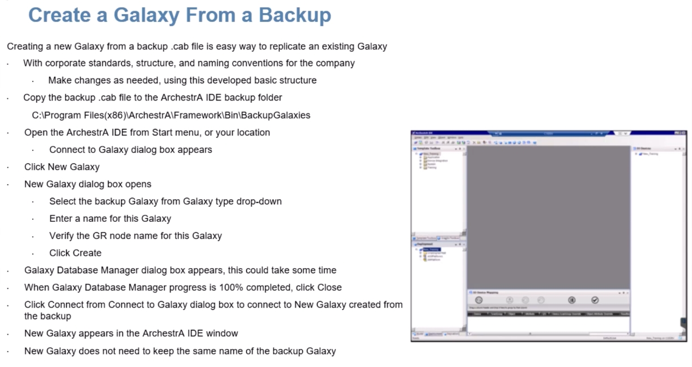
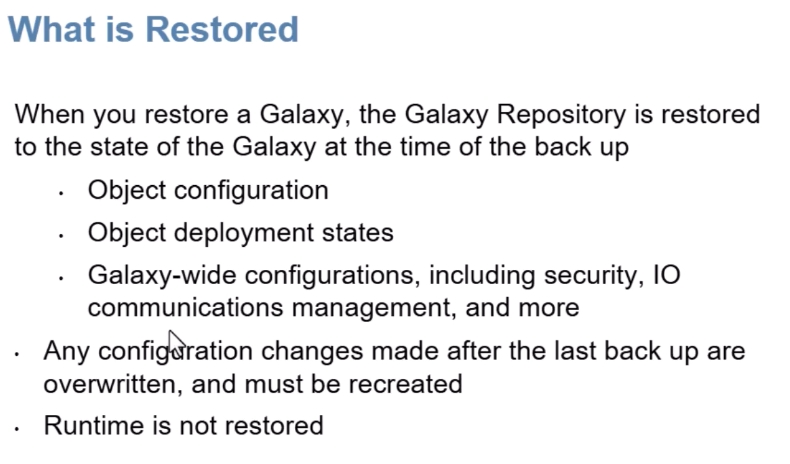
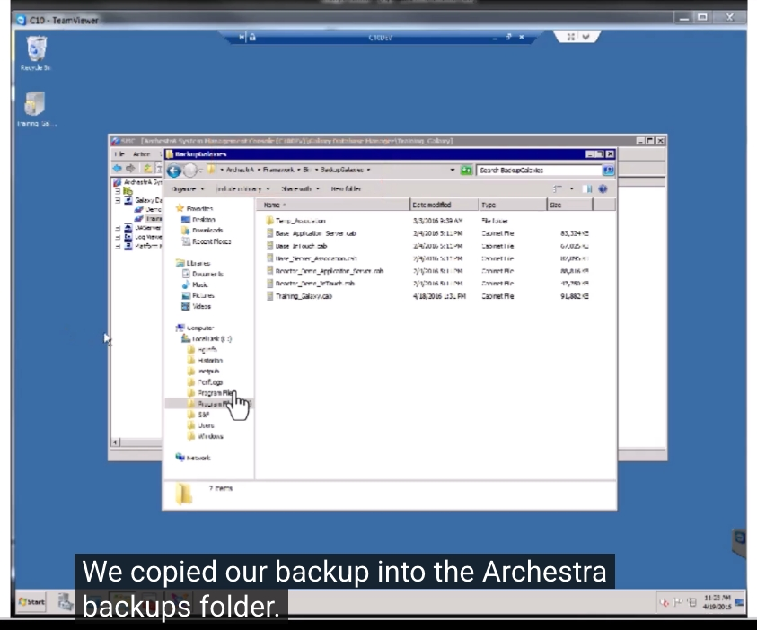
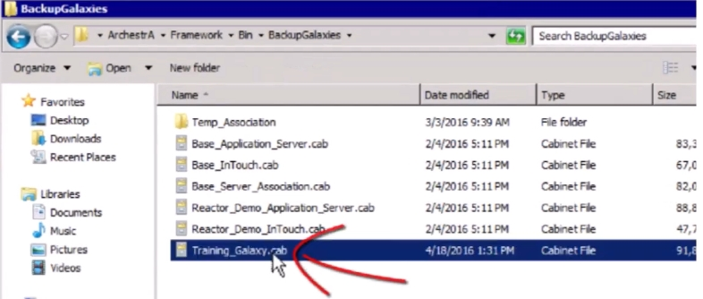
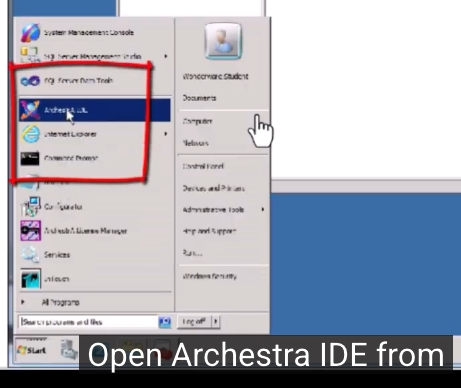
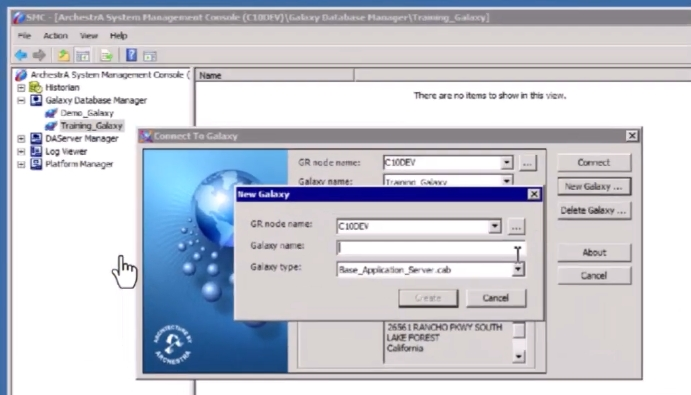
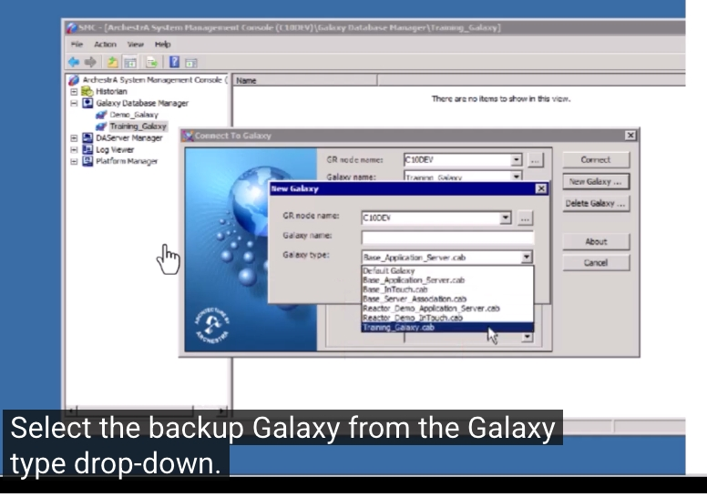
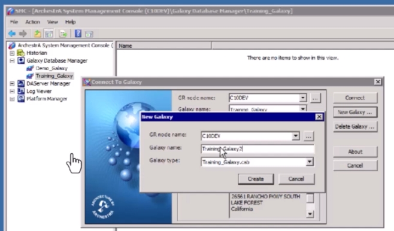
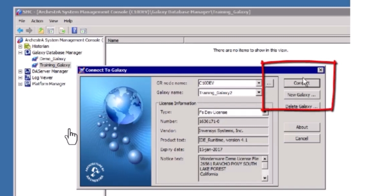

# 從備份檔建立新 Galaxy（.cab 格式）
# How to Create a New Galaxy From a Backup File (.cab)

> 適用平台／Platform：AVEVA System Platform（ArchestrA IDE）
> 參考影片／Reference video：[How to create a New Galaxy from backup file — Aveva IDE System Platform with .cab format](https://www.youtube.com/watch?v=lMw4c_DGKPw)

---

## 一、簡介 ／ Overview

**中文**
從 `.cab` 備份檔建立一個新的 Galaxy，是複製既有 Galaxy 最簡單的方式。這個做法特別適合已經建立好公司標準、命名規則與物件結構的情況——你可以直接以既有的基礎架構為起點，再依需求做調整，不必從零開始建立。

**English**
Creating a new Galaxy from a `.cab` backup file is an easy way to replicate an existing Galaxy. This is especially useful when a Galaxy already reflects your corporate standards, structure, and naming conventions — you can start from that developed baseline and make changes as needed, instead of starting from scratch.


*圖／Fig：images/b6_01.jpg*

---

## 二、還原後會恢復哪些內容 ／ What Is Restored

**中文**
當你從備份還原 Galaxy 時，Galaxy Repository 會被還原到備份當下的狀態，包含：

- 物件設定（Object configuration）
- 物件部署狀態（Object deployment states）
- Galaxy 層級的整體設定，包括安全性（Security）、I/O 通訊管理（IO communications management）等

**請特別注意：**
- 備份之後才做的任何設定變更都會被覆蓋，如果需要，必須重新設定
- **執行期（Runtime）狀態不會被還原**——還原的是設計時期的 Galaxy 內容，不是系統運行中的即時數值

**English**
When you restore a Galaxy, the Galaxy Repository is restored to the state of the Galaxy at the time of the backup, including:

- Object configuration
- Object deployment states
- Galaxy-wide configurations, including security, I/O communications management, and more

**Important:**
- Any configuration changes made *after* the last backup are overwritten, and must be recreated if needed
- **Runtime is not restored** — this restores the design-time Galaxy content, not live/runtime values


*圖／Fig：images/b6_02.jpg*

---

## 三、操作步驟 ／ Step-by-Step Procedure

### 步驟 1：把備份 .cab 檔複製到 BackupGalaxies 資料夾
### Step 1: Copy the Backup .cab File to the BackupGalaxies Folder

**中文**
把你的 `.cab` 備份檔複製到 ArchestrA IDE 的備份資料夾中，預設路徑通常是：

```
C:\Program Files (x86)\ArchestrA\Framework\Bin\BackupGalaxies
```

**English**
Copy your `.cab` backup file into the ArchestrA IDE backup folder. The default path is typically:

```
C:\Program Files (x86)\ArchestrA\Framework\Bin\BackupGalaxies
```


*圖／Fig：images/b6_03.jpg*


*圖／Fig：images/b6_04.jpg*

---

### 步驟 2：開啟 ArchestrA IDE
### Step 2: Open ArchestrA IDE

**中文**
從「開始」選單（或你安裝的位置）開啟 ArchestrA IDE。開啟後會出現「Connect to Galaxy」對話框。

**English**
Open ArchestrA IDE from the Start menu, or from your installed location. The **Connect to Galaxy** dialog box appears.


*圖／Fig：images/b6_05.jpg*

---

### 步驟 3：點選 New Galaxy
### Step 3: Click New Galaxy

**中文**
在「Connect to Galaxy」對話框中點選 **New Galaxy**，會開啟「New Galaxy」對話框。

**English**
In the Connect to Galaxy dialog box, click **New Galaxy**. The New Galaxy dialog box opens.


*圖／Fig：images/b6_06.jpg*

---

### 步驟 4：從 Galaxy type 下拉選單選擇備份的 Galaxy
### Step 4: Select the Backup Galaxy From the Galaxy Type Drop-Down

**中文**
在 **Galaxy type** 下拉選單中，選擇你剛剛複製進 BackupGalaxies 資料夾的那個備份 `.cab` 檔（例如畫面中的 `Training_Galaxy.cab`）。

**English**
From the **Galaxy type** drop-down, select the backup Galaxy `.cab` file you just copied into the BackupGalaxies folder (in this example, `Training_Galaxy.cab`).


*圖／Fig：images/b6_07.jpg*

---

### 步驟 5：輸入新 Galaxy 名稱、確認 GR node 名稱
### Step 5: Enter a Name for the New Galaxy, Verify the GR Node Name

**中文**
- 在 **Galaxy name** 欄位輸入這個新 Galaxy 的名稱
- **這是一個新的 Galaxy，不需要沿用備份檔原本的名稱**
- 確認 **GR node name**（Galaxy Repository 所在節點名稱）是否正確
- 確認無誤後點選 **Create**

**English**
- Enter a name for this Galaxy in the **Galaxy name** field
- **Because this is a new Galaxy, you do not have to keep the backup file's name**
- Verify the **GR node name** (the node hosting the Galaxy Repository) is correct
- Once confirmed, click **Create**


*圖／Fig：images/b6_08.jpg*

---

### 步驟 6：等待建立完成，並連線到新 Galaxy
### Step 6: Wait for Creation to Complete, Then Connect

**中文**
- 點選 Create 後，會出現 **Galaxy Database Manager** 進度視窗，依 Galaxy 大小不同，這個過程可能需要一些時間
- 進度到達 100% 完成後，點選 **Close**
- 回到「Connect to Galaxy」對話框後，點選 **Connect** 連線到剛建立好的新 Galaxy
- ArchestrA IDE 視窗會開啟，顯示這個新的 Galaxy

**English**
- After clicking Create, the **Galaxy Database Manager** progress window appears — depending on the size of the Galaxy, this could take some time
- When progress reaches 100%, click **Close**
- Back in the Connect to Galaxy dialog box, click **Connect** to connect to the newly created Galaxy
- The ArchestrA IDE window appears with the new Galaxy loaded


*圖／Fig：images/b6_09.jpg*

---

## 四、重點整理 ／ Key Takeaways

| 重點 Key Point | 說明 中文 | Description English |
|---|---|---|
| 用途 Purpose | 快速複製既有 Galaxy 的標準與結構 | Quickly replicate an existing Galaxy's standards and structure |
| 命名 Naming | 新 Galaxy 不需沿用備份檔名稱 | The new Galaxy does not need to keep the backup file's name |
| 還原範圍 What's restored | 物件設定、部署狀態、Galaxy 層級設定（安全性、I/O 通訊等） | Object configuration, deployment states, Galaxy-wide settings (security, I/O comms, etc.) |
| 不會還原 What's NOT restored | 備份之後的變更、執行期（Runtime）狀態 | Changes made after the backup, and Runtime state |
| 存放路徑 Backup folder | `...\ArchestrA\Framework\Bin\BackupGalaxies` | `...\ArchestrA\Framework\Bin\BackupGalaxies` |

---

## 五、自我檢核 ／ Self-Check

- [ ] 我能說明「還原 Galaxy」跟「還原 Runtime」的差別／I can explain the difference between restoring a Galaxy and restoring Runtime
- [ ] 我知道為什麼新 Galaxy 不必沿用備份檔名稱／I understand why the new Galaxy doesn't need to keep the backup's name
- [ ] 我能獨立完成一次「從備份建立新 Galaxy」的操作／I can perform the "create Galaxy from backup" procedure independently

---

**圖片檔案 Image files**：本文件引用 9 張圖，存放在與本 `.md` 檔同層的 `images/` 資料夾內：
This document references 9 images, stored in the `images/` folder alongside this `.md` file:

- `images/b6_01.jpg`
- `images/b6_02.jpg`
- `images/b6_03.jpg`
- `images/b6_04.jpg`
- `images/b6_05.jpg`
- `images/b6_06.jpg`
- `images/b6_07.jpg`
- `images/b6_08.jpg`
- `images/b6_09.jpg`

**參考影片 Reference video**：[How to create a New Galaxy from backup file — Aveva IDE System Platform with .cab format](https://www.youtube.com/watch?v=lMw4c_DGKPw)
