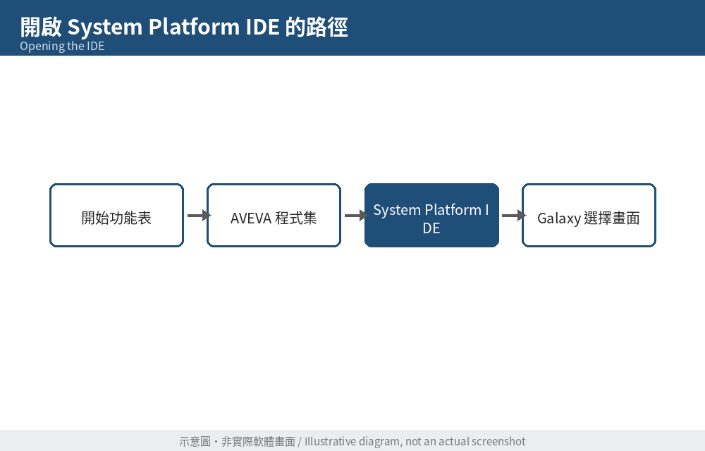
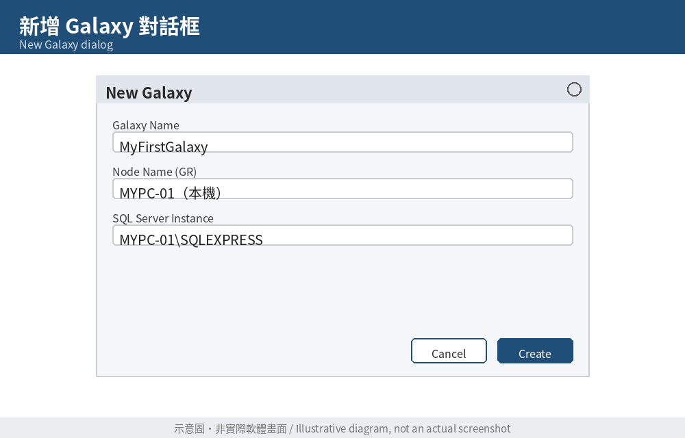
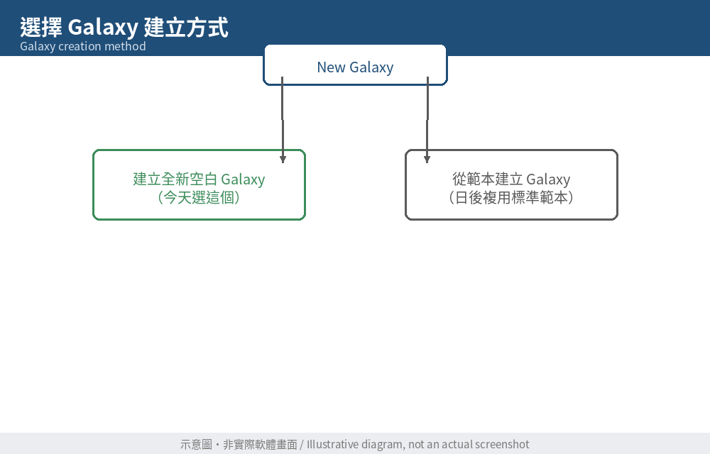
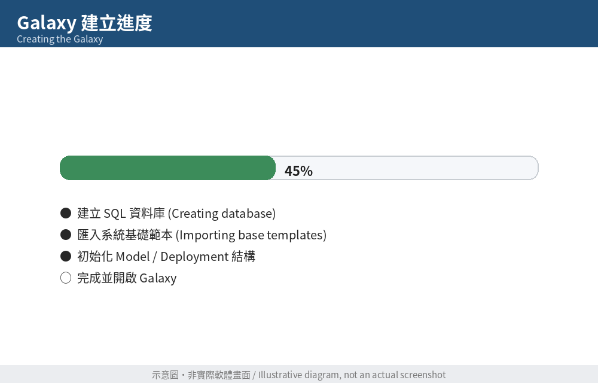
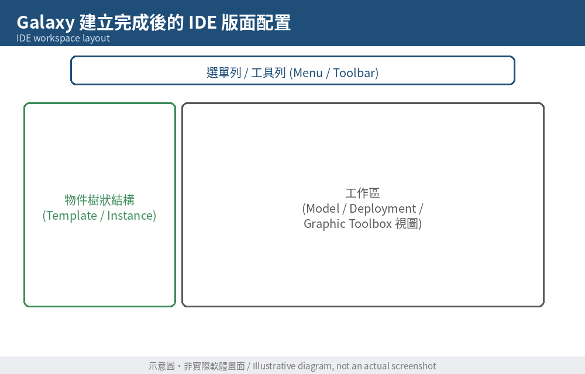
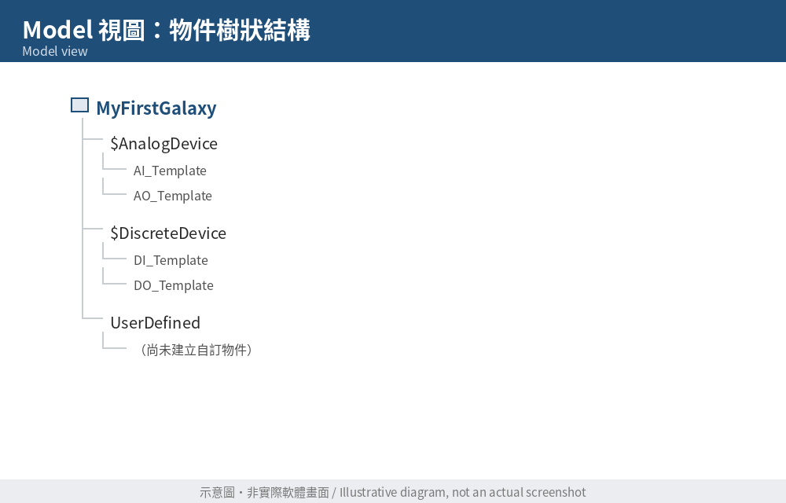
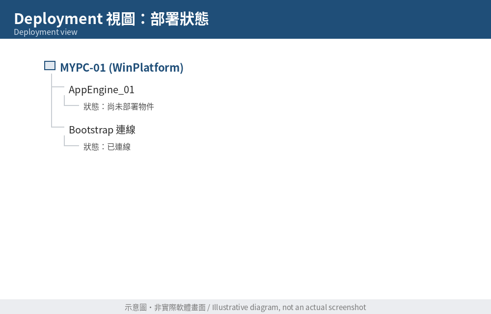
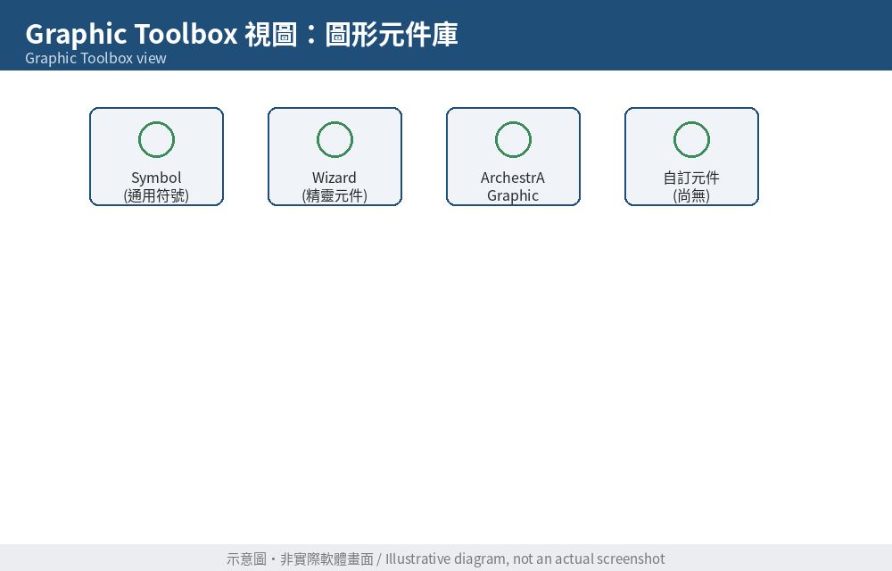

# Day 6：建立第一個 Galaxy Repository

> 對應學習企劃案 Week 1（Day 5–6）｜前置：Day 5 已完成 Application Server 安裝與 Bootstrap 基本設定

---

## 今日學習目標

- 理解 **Galaxy** 與 **Galaxy Repository（GR）** 的關係
- 使用 System Platform IDE 建立第一個 Galaxy Repository
- 認識 IDE 建立 Galaxy 後的基本結構（為 Day 8 的 Model / Deployment / Graphic Toolbox 三視圖預作暖身）
- 完成「Bootstrap → IDE → Galaxy → Galaxy Repository」的完整流程，並能用自己的話講解一次（呼應 Day 7 的整合練習）

---

## 一、先理解概念：Galaxy 是什麼？

在動手之前，先釐清幾個名詞，避免後面越學越混淆：

| 名詞 | 白話解釋 | 你熟悉的對應概念（僅供理解，非完全對等） |
|---|---|---|
| **Galaxy** | 一個完整的自動化專案（物件、圖形、邏輯、部署設定的總和） | 類似一個完整的 Node-RED 專案檔，或一整套 PLC 專案 |
| **Galaxy Repository (GR)** | 儲存 Galaxy 內容的資料庫（底層為 SQL Server），負責版本控制、Check In/Out | 類似專案的「資料庫後端」，不是畫面，是資料儲存層 |
| **GR Node** | 實際跑著 Galaxy Repository 服務的那台電腦 | 你的「伺服器主機」 |
| **System Platform IDE** | 你實際操作、設計 Galaxy 的開發工具（畫面） | 類似 FUXA 的編輯介面、或 PLC 的程式撰寫軟體 |

一句話理解今天要做的事：**我們要在 GR Node（今天就是你自己的電腦）上，透過 IDE，建立一個全新的空白 Galaxy，並讓它被 Galaxy Repository 正式儲存管理。**

---

## 二、開啟 System Platform IDE

1. 確認 Day 5 設定好的 Bootstrap 狀態正常（服務執行中、授權有效）。
2. 從開始功能表的 AVEVA 程式集中，找到「**System Platform IDE**」並開啟。
3. 首次開啟時，IDE 可能會先顯示「Galaxy 選擇」或「新增 Galaxy」的起始畫面，而不是直接進入空白工作區——這是正常現象，因為目前你的電腦上還沒有任何 Galaxy。

*圖 1：System Platform IDE 啟動 / Galaxy 選擇畫面*

---

## 三、建立新的 Galaxy

1. 在 IDE 的起始畫面或選單中，選擇「**New Galaxy（新增 Galaxy）**」。
2. 在彈出的對話框中，通常需要填寫／確認以下項目：
   - **Galaxy Name（Galaxy 名稱）**：建議使用有意義且不含中文與特殊符號的英文名稱，例如 `MyFirstGalaxy` 或 `TrainingGalaxy01`（避免日後與正式專案混淆，也避開部分版本對命名字元的限制）。
   - **Node Name（GR 節點）**：選擇本機電腦作為 Galaxy Repository 所在節點。
   - **SQL Server 執行個體**：選擇 Day 5 已具備的 SQL Server（若安裝時使用預設的 SQL Express，通常會列在下拉選單中）。

*圖 2：New Galaxy 對話框，輸入 Galaxy 名稱與選擇 GR 節點*

3. 部分版本會讓你選擇**建立方式**：
   - **Create a new Galaxy（建立全新空白 Galaxy）** ← 今天選這個
   - **Create a Galaxy from a Template（從範本建立）**：適合日後要複用公司標準範本時使用，今天先不用

*圖 3：選擇「建立全新 Galaxy」或「從範本建立」*

4. 確認設定無誤後，按下「**Create（建立）**」。

---

## 四、等待建立完成

- 建立過程中，IDE 會在背景：
  1. 在指定的 SQL Server 上建立對應的資料庫（Galaxy Repository 資料庫）。
  2. 匯入系統內建的基礎範本（Base Templates，例如 UserDefined、$AnalogDevice 等系統物件）。
  3. 初始化 Galaxy 的預設結構（Model、Deployment 空視圖）。
- 視電腦效能，這個過程可能需要 3–10 分鐘，請耐心等待，不要中途關閉 IDE。

*圖 4：Galaxy 建立進度畫面*

建立完成後，IDE 會自動開啟並登入這個新的 Galaxy，你會看到左側出現物件樹狀結構（此時應該只有系統內建的基礎範本，尚無你自訂的物件）。

*圖 5：Galaxy 建立完成，IDE 進入工作區畫面*

---

## 五、快速認識 IDE 的三個視圖（暖身，Day 8 會深入）

今天不用急著操作，先點開看看、留下印象即可：

| 視圖 | 用途（先有概念就好） |
|---|---|
| **Model（模型視圖）** | 顯示所有物件範本（Template）與實例（Instance）的樹狀結構，是你「設計」物件的地方 |
| **Deployment（部署視圖）** | 顯示哪些物件實際被部署到哪台 Platform / AppEngine 上，是「讓物件真正跑起來」的地方 |
| **Graphic Toolbox（圖形工具箱）** | 存放可重複使用的 ArchestrA Graphic（圖形元件），Day 8 之後開始大量使用 |

*圖 6：Model 視圖（物件樹狀結構）*

*圖 7：Deployment 視圖（部署狀態）*

*圖 8：Graphic Toolbox 視圖（圖形元件庫）*

---

## 六、今日練習

1. **建立確認**：成功建立一個名為 `MyFirstGalaxy`（或你自訂的名稱）的 Galaxy，並能重新開啟 IDE 後在「Open Galaxy」清單中看到它。
2. **截圖記錄**：將你自己畫面中的「New Galaxy 對話框」「建立完成後的 IDE 畫面」分別存成對應檔名，取代本文件中 `images/day06-02-new-galaxy-dialog.png`、`images/day06-05-galaxy-created-view.png` 兩張示意圖。
3. **探索練習**：在 Model 視圖中，展開系統內建的範本樹狀結構（$AnalogDevice、$DiscreteDevice、UserDefined 等），觀察它們的圖示與分類邏輯，寫下你觀察到的 2–3 個命名或分類規則。
4. **口頭複習（呼應 Day 7）**：用一分鐘，對自己（或錄音）講解一次今天的流程——「為什麼要先有 Bootstrap，才能建立 Galaxy？Galaxy 跟 Galaxy Repository 差在哪裡？」

---

## 本日小結

今天完成了「Bootstrap → IDE → Galaxy → Galaxy Repository」的完整串接，你的電腦上現在有了第一個可以開始開發的空白 Galaxy。明天（Day 7）是週末整合日，將把 Day 1–6 的流程整理成一份筆記，並用口頭講解的方式檢驗自己是否真正理解，而不只是跟著步驟操作。
