# AVEVA System Platform Terminology Primer — Episode 1
# AVEVA System Platform 術語入門教程 — 第一集

**Source video / 影片來源：** [Tech Bytes — AVEVA System Platform Terminology Primer, Episode 1](https://www.youtube.com/watch?v=8pKVvkSl8e8)
**Presenter / 講者：** Kyle Lion, System Architect, SolutionsPT

---

## About this episode / 本集介紹

**EN:** In this episode of Tech Bytes, Kyle Lion from the Technical Success Team begins a mini-series explaining common terminology in AVEVA System Platform — ideal for customers and delivery partners who are new to the product, planning to attend the training course, or simply looking for a refresher on key vocabulary. This first episode covers what a Galaxy is, how items are deployed across a project through Platforms, Engines and Objects, how Templates are used to reduce engineering effort and enforce standards, and how client sessions of SCADA screens are deployed using ViewEngines and WebViewEngines.

**中文：** 在這一集的 Tech Bytes 中，來自技術成功團隊（Technical Success Team）的 Kyle Lion 展開了一個系列教學，介紹 AVEVA System Platform 中常見的術語。這系列內容特別適合剛接觸此產品的客戶與經銷夥伴、即將參加原廠訓練課程的人員，或只是想複習關鍵詞彙的使用者。第一集內容涵蓋：什麼是 Galaxy（銀河系專案）、專案內容如何透過 Platform（平台）、Engine（引擎）與 Object（物件）部署到系統各處、如何使用 Template（樣板）降低工程開發工作量並落實標準化，以及如何透過 ViewEngine 與 WebViewEngine 部署 SCADA 畫面的客戶端連線。

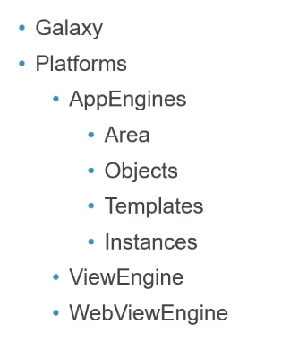

**EN — Terms covered in this episode:**
- Galaxy
- Platforms
  - AppEngines
    - Area
    - Objects
    - Templates
    - Instances
- ViewEngine
- WebViewEngine

**中文 — 本集涵蓋術語：**
- Galaxy（銀河系專案）
- Platform（平台）
  - AppEngine（應用引擎）
    - Area（區域）
    - Object（物件）
    - Template（樣板）
    - Instance（實例）
- ViewEngine（畫面引擎）
- WebViewEngine（網頁畫面引擎）

---

## 1. Galaxy / Galaxy（銀河系專案）

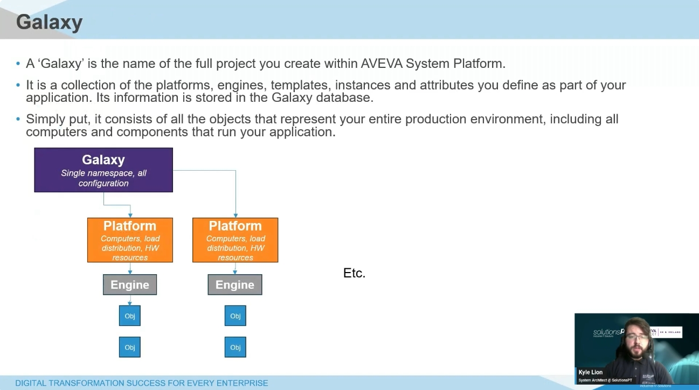

**EN:** A Galaxy is the name given to your entire project in AVEVA System Platform. It acts as a global namespace for all the data generated and running across different computers and systems, allowing every component of the system to access these data points no matter where they physically reside on the network — effectively acting as a single source of truth. A Galaxy is a collection of Platforms, Engines, Templates and Instances, all of which are covered later in this primer. The Galaxy sits at the top layer, encompassing the entire project, with all other components sitting beneath it. Its configuration is stored in the Galaxy database.

**中文：** Galaxy 是 AVEVA System Platform 中對整個專案的統稱。它作為一個全域命名空間（global namespace），涵蓋所有在不同電腦與系統間產生並運行的資料，讓系統中的每個元件都能存取這些資料點，無論它們實際位於網路中的哪個位置——實質上扮演「單一事實來源」（single source of truth）的角色。一個 Galaxy 是由 Platform（平台）、Engine（引擎）、Template（樣板）與 Instance（實例）所組成的集合，這些內容將在本教程後續一一介紹。Galaxy 位於整體架構的最頂層，涵蓋整個專案，其他所有元件都位於其下。其設定資訊儲存於 Galaxy 資料庫（Galaxy database）之中。

---

## 2. Platform / Platform（平台）

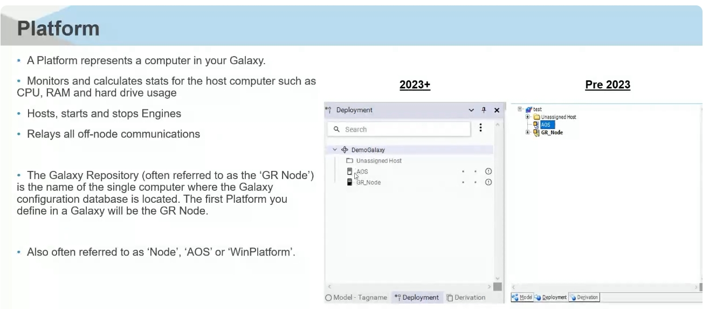

**EN:** A Platform represents a computer in your Galaxy. A Platform must be deployed to a computer in order to host everything discussed hereafter. A Platform monitors and calculates statistics for its host computer, such as CPU, RAM and hard drive usage. It hosts, starts and stops Engines (covered next), and it is responsible for relaying off-node communications between other Platforms.

Deployment, as a term, refers to the process of copying assets from the development environment (the IDE — Integrated Development Environment) to the runtime environment, i.e. the computer where they will actually run. Once deployed, assets become live and functional.

The Galaxy Repository (often called the "GR Node") is the first Platform created in a Galaxy. It is the name of the single computer where the Galaxy configuration database — the central database storing all the main configuration of the Galaxy project — is located. In the 2023+ icon set, the GR Node is shown as a solid colour icon, whereas the AOS (a secondary Platform) is shown as a transparent icon; more specifically, in the 2023 version the GR Node icon is yellow while a non-GR Node Platform (such as an AOS) is grey.

A Platform is also frequently referred to by other names: "Node", "AOS" (Application Object Server, i.e. a Platform that hosts application objects), or "WinPlatform" (the name of the underlying base template). Regardless of the name used, think of it simply as a computer within your Galaxy that performs some function.

**中文：** Platform（平台）代表 Galaxy 中的一台電腦。您必須先在電腦上部署一個 Platform，才能在其上執行後續所提到的各種元件。Platform 會監控並計算主機的各項統計數據，例如 CPU、RAM 與硬碟使用率；它負責啟動與停止 Engine（引擎，後面章節介紹）；同時也負責在不同節點（Platform）之間轉發跨節點的通訊。

「部署」（Deployment）一詞，指的是將資產從開發環境（IDE，即整合開發環境）複製到執行環境的過程，也就是複製到實際會執行這些資產的電腦上。一旦部署完成，這些資產即進入「上線」（live）並可正常運作的狀態。

Galaxy 儲存庫（Galaxy Repository，常簡稱為「GR Node」）是您在 Galaxy 中建立的第一個 Platform。它是儲存 Galaxy 組態資料庫的那台電腦名稱——這個資料庫是儲存整個 Galaxy 專案主要組態設定的中央資料庫。在 2023 年以後的版本圖示中，GR Node 顯示為實心圖示，而 AOS（次要 Platform）則顯示為透明圖示；更精確地說，在 2023 版本中，GR Node 圖示為黃色，而非 GR Node 的其他 Platform（例如 AOS）則為灰色。

Platform 也常被稱為「Node（節點）」、「AOS」（Application Object Server，應用物件伺服器，即用來承載應用物件的 Platform）或「WinPlatform」（其底層基礎樣板的名稱）。不論名稱為何，只需將其理解為 Galaxy 中負責執行某項功能的一台電腦即可。

---

## 3. AppEngine / AppEngine（應用引擎）

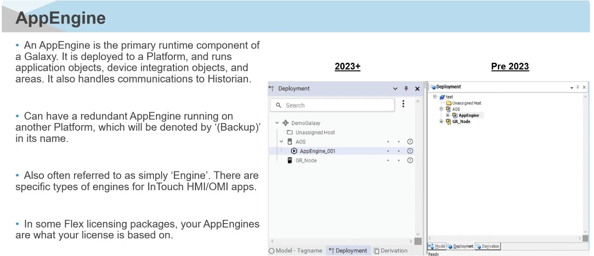

**EN:** An AppEngine is the primary runtime component of a Galaxy. It is deployed to a Platform, and the underlying objects are then deployed to that Engine. In computational terms, the easiest way to think of an AppEngine is as a thread on the CPU of that Platform. A general rule of thumb is around 10,000 I/O per AppEngine as a maximum, although this can vary depending on the workload — treat it only as a general frame of reference.

An AppEngine can have a redundant AppEngine — enabling redundancy in the AppEngine configuration creates a second version of the Engine, clearly marked as "(Backup)". Whichever Platform hosts the primary Engine, the backup can be deployed to a different Platform, so that if the primary node goes down, the secondary node starts up and takes over the workload.

An AppEngine is also often simply called an "Engine". There are specific Engine types for visualization — for InTouch HMI or OMI applications — which are covered separately (see ViewEngine and WebViewEngine below); AppEngines are more geared towards things like application objects, PLC communication objects, and similar tasks. Under some subscription-based licensing models — typically the Flex model — the number of AppEngines is what your license is based on, so you would purchase a number of AppEngines that can then be deployed across as many Platforms as needed (keeping the ~10K I/O per AppEngine guideline in mind). In the 2023+ interface, an Engine is shown with a "play" icon; in pre-2023 versions, it is shown with a gear icon underneath Platforms.

**中文：** AppEngine（應用引擎）是 Galaxy 中主要的執行期（runtime）元件。它會被部署到某個 Platform 上，而底層的物件（Objects）則會再部署到這個 Engine 之上。以運算概念來說，最簡單的理解方式是把 AppEngine 想像成該 Platform CPU 上的一條執行緒（thread）。一般建議每個 AppEngine 最多承載約 10,000 個 I/O 點位，但此數字會依實際工作負載而有所調整，僅供參考。

AppEngine 可以設定備援（redundant AppEngine）：在 AppEngine 設定中啟用備援功能後，系統會建立第二個版本的 Engine，並清楚標示為「(Backup)」。無論主要 Engine 部署在哪個 Platform 上，備援 Engine 都可以部署到另一台 Platform，如此一來，當主要節點故障時，次要節點便會啟動並接手原本的工作負載。

AppEngine 常被簡稱為「Engine（引擎）」。針對視覺化應用（InTouch HMI 或 OMI 應用程式）另有專屬的 Engine 類型（詳見下方 ViewEngine 與 WebViewEngine 章節）；而 AppEngine 則更偏向處理應用物件、PLC 通訊物件等任務。在某些訂閱制授權模式下（通常為 Flex 授權模式），授權數量是以 AppEngine 的數量為計算基準，因此您會購買若干數量的 AppEngine 授權，再依需求部署到任意數量的 Platform 上（同時仍須留意前述每個 AppEngine 約 10K I/O 的建議上限）。在 2023 年以後的版本介面中，Engine 以「播放」（play）圖示顯示；在 2023 年之前的版本中，則顯示於 Platform 底下的齒輪圖示。

---

## 4. Area / Area（區域）

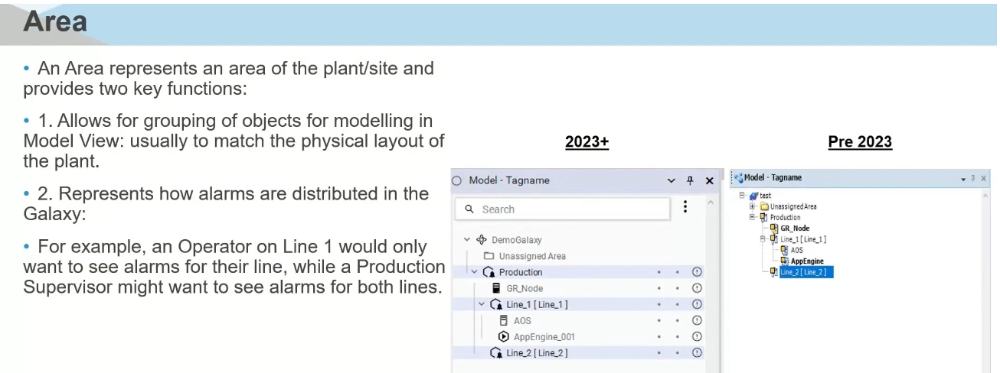

**EN:** An Area represents an area of the plant or site being modelled, and it provides two key functions:

1. **Grouping** — it allows objects to be grouped together to better represent how they are physically laid out. For example, a site might be divided into several departments, and each department might have individual production lines; each of these breakpoints (department, line, etc.) can be represented as an Area.
2. **Alarm distribution** — an Area also determines how alarms are distributed across the Galaxy. For example, an operator working on Line 2 of the Production department would only want to see alarms relevant to that Area, rather than alarms for, say, the Packaging area. This makes it easy to filter which alarms are visible to a given user at runtime.

Note that, unlike the Deployment view (which shows how items are physically deployed to computers), Areas are shown in the Model view, since an Area is a model-based representation reflecting how the site is laid out in physical reality.

**中文：** Area（區域）代表所要建模的廠區或現場中的某個區域，它具有兩個主要功能：

1. **物件分組** — 讓您能將物件依照實際的物理配置方式進行分組。舉例來說，一個廠區可能劃分為數個部門，而每個部門底下可能又有各自獨立的生產線；這些劃分（部門、產線等）都可以以一個 Area 來表示。
2. **警報分配** — Area 同時也決定了警報（alarm）在 Galaxy 中如何分配呈現。舉例來說，若某位操作員負責生產部門的 2 號產線，他應該只會看到與該區域相關的警報，而不會看到例如包裝區的警報。透過這種方式，便能輕鬆篩選在執行期（runtime）中對特定使用者顯示哪些警報。

值得注意的是，不同於顯示物件實際如何部署到電腦上的 Deployment（部署）視圖，Area 是顯示在 Model（模型）視圖中的，因為 Area 屬於模型層面的呈現方式，用以反映現場實際的物理配置。

---

## 5. Engineering Experience — Standardization & Reusability / 工程開發體驗——標準化與可重用性

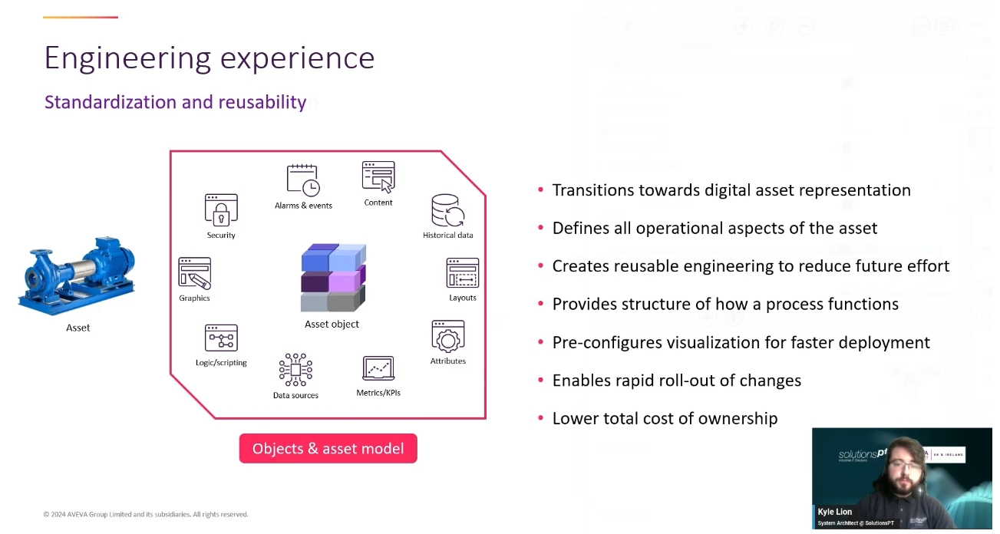

**EN:** Automation Objects encapsulate everything about an asset on site, and this is the core concept behind how System Platform is architected and how projects should be understood and built. An object captures, for a given asset:

- Inputs and outputs, and any associated scripting
- Historical logging configuration (which values to log, at what deadband, at what interval)
- Security requirements (which operator roles can change which values, and at what access level)
- Alarms and events configuration
- Version history, as changes are made to the object over time
- Relevant documentation
- Graphics and symbols associated with the asset

By packaging all of this together into a reusable Asset Object, System Platform transitions engineering towards a digital asset representation: it defines all the operational aspects of the asset, creates reusable engineering to reduce future effort, provides a consistent structure for how a process functions, pre-configures visualization for faster deployment, enables rapid roll-out of changes, and ultimately lowers total cost of ownership.

**中文：** Automation Object（自動化物件）封裝了現場某項資產的所有相關資訊，這正是 System Platform 架構設計的核心概念，也是理解與建置專案的關鍵。針對特定資產，一個物件會涵蓋：

- 輸入輸出點位（Inputs/Outputs），以及相關的腳本邏輯（scripting）
- 歷史資料記錄設定（要記錄哪些數值、以多少死區值 deadband、以多少頻率記錄）
- 安全性需求（哪些操作員角色可以變更哪些數值、需要何種存取權限層級）
- 警報與事件（Alarms and events）設定
- 版本歷程紀錄（隨著物件變更而累積的版本歷史）
- 相關文件說明
- 與該資產相關的圖形與圖示（Graphics and symbols）

透過將以上所有內容整合封裝成一個可重複使用的資產物件（Asset Object），System Platform 讓工程設計逐步走向「數位資產表示」（digital asset representation）：它定義了資產的所有操作面向、建立可重複使用的工程內容以降低未來的開發工作量、為流程運作方式提供一致的架構、預先設定好視覺化畫面以加快部署速度、支援變更的快速推行，最終達到降低整體擁有成本（total cost of ownership）的效果。

---

## 6. Engineering Experience — Templates & Propagation / 工程開發體驗——樣板與變更傳遞

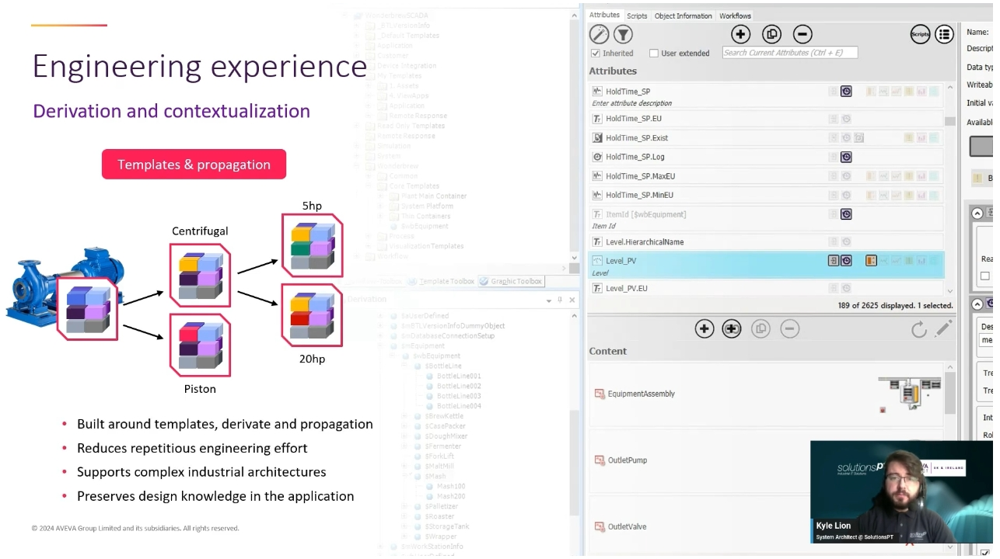

**EN:** Once you have a template of everything a given type of asset should have (for example, a pump), you can reuse that Template across your application. Templates in System Platform are items contained within their own tab, holding common configuration parameters for objects of that type. This means you might have 100 pumps on site, but you only need to configure a single Template with all the shared characteristics of a pump — attributes, pre-made graphics that every pump needs, faceplate design, and so on.

The first level of a Template is referred to as a **Base Template**, since it serves as the foundation for any subsequent derived templates. A **Derived Template** inherits everything from its Base Template but makes specific changes to reflect some uniqueness. For example, from a base Pump template you might create derived templates for centrifugal or piston pumps, each of which still inherits everything from the base but adds something extra — such as a new attribute for impeller RPM that a generic pump template wouldn't need. Capturing this at the derived-template level (rather than duplicating changes across hundreds of individual objects) still saves engineering effort while making it easy to create many instances as needed. You can create further levels of derivation as deep as required.

**Instances** are the actual runtime versions of a Template. From a Template, you create as many Instances as reflect how many of that asset actually exist on site — these Instances are what get deployed to Platforms, run under Engines, and get assigned to Areas.

Put together, Automation Objects are the digital representation of items, equipment and supplementary components in a Galaxy. They are sometimes referred to simply as "Objects" or "UDOs" (User Defined Objects) — a term that comes from one of the base templates included in System Platform, `$UserDefined`, which is essentially a blank object ready to be designed from scratch. Benefits of this templated, derive-and-propagate approach include:

- Built around templates, derivation and propagation
- Reduces repetitious engineering effort
- Supports complex industrial architectures
- Preserves design knowledge in the application

**中文：** 一旦您已經建立好某類資產（例如幫浦 pump）應具備的所有內容樣板，就可以在整個應用程式中重複使用這個 Template（樣板）。System Platform 中的 Template 是獨立分頁下的項目，內含該類物件的共通組態參數。這代表即使現場有 100 台幫浦，您也只需要設定一個 Template，涵蓋幫浦共同的特性——例如屬性（attribute）、每台幫浦都需要的預製圖形、面板（faceplate）設計等。

Template 的第一層稱為**基礎樣板（Base Template）**，因為它是後續衍生樣板的基礎。**衍生樣板（Derived Template）**會繼承基礎樣板的所有內容，但會做出特定調整以反映其獨特性。舉例來說，從幫浦的基礎樣板出發，您可以建立離心式（centrifugal）或活塞式（piston）幫浦的衍生樣板，這些衍生樣板仍會繼承基礎樣板的所有內容，同時再加上額外項目——例如一般幫浦樣板不需要的「葉輪轉速（impeller RPM）」屬性。將這類差異記錄在衍生樣板層級（而非在數百個個別物件上逐一修改），依然能節省工程開發的工作量，同時方便日後依需求建立多個實例。衍生的層級可以視需要一路延伸下去，沒有限制。

**Instance（實例）**則是 Template 的實際執行期版本。從一個 Template 出發，您可以建立與現場實際資產數量相符的多個 Instance——這些 Instance 才是真正會被部署到 Platform、在 Engine 底下執行，並被指派給某個 Area 的物件。

綜合來說，Automation Object（自動化物件）就是 Galaxy 中各種項目、設備與附屬元件的數位化表示方式，有時也簡稱為「Object（物件）」或「UDO」（User Defined Object，使用者自訂物件）——這個名稱源自 System Platform 內建的基礎樣板之一 `$UserDefined`，本質上是一個空白物件，供使用者自由設計。這種「以樣板為核心、透過衍生與傳遞來擴展」的開發方式，具有以下優點：

- 以樣板（Template）、衍生（derivation）與變更傳遞（propagation）為核心架構
- 降低重複性的工程開發工作
- 支援複雜的工業架構
- 將設計知識保留並沉澱於應用程式之中

---

## 7. Automation Objects / Automation Object（自動化物件）

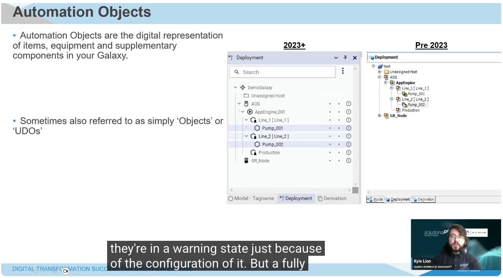

**EN:** Returning to Automation Objects directly: in the 2023+ deployment view, objects are shown with small status symbols, indicating for example that they are in a "warning" state simply due to their current configuration (e.g. not yet assigned to an Area) rather than an actual fault — whereas a fully deployed object with no issues shows differently. In the pre-2023 view, undeployed or unassigned objects (i.e. those without an Area) are shown simply as plain blue orbs, both before and after 2023 in terms of the base "undeployed" representation; the newer icon set adds extra status symbols on top to convey more state information at a glance.

**中文：** 回到 Automation Object 本身：在 2023 年以後的部署（Deployment）視圖中，物件旁會顯示小型狀態符號，用以表示例如該物件目前處於「警告（warning）」狀態，這單純是因為其目前的設定情況（例如尚未指派 Area），而非真正發生了故障——相對地，一個已完整部署且沒有問題的物件則會以不同方式顯示。在 2023 年之前的版本中，尚未部署或尚未指派 Area 的物件，基本上都只會顯示為單純的藍色圓球圖示；新版圖示系統則是在此基礎上，額外加上更多狀態符號，讓使用者能一眼掌握更多物件狀態資訊。

---

## 8. ViewEngine / ViewEngine（畫面引擎）

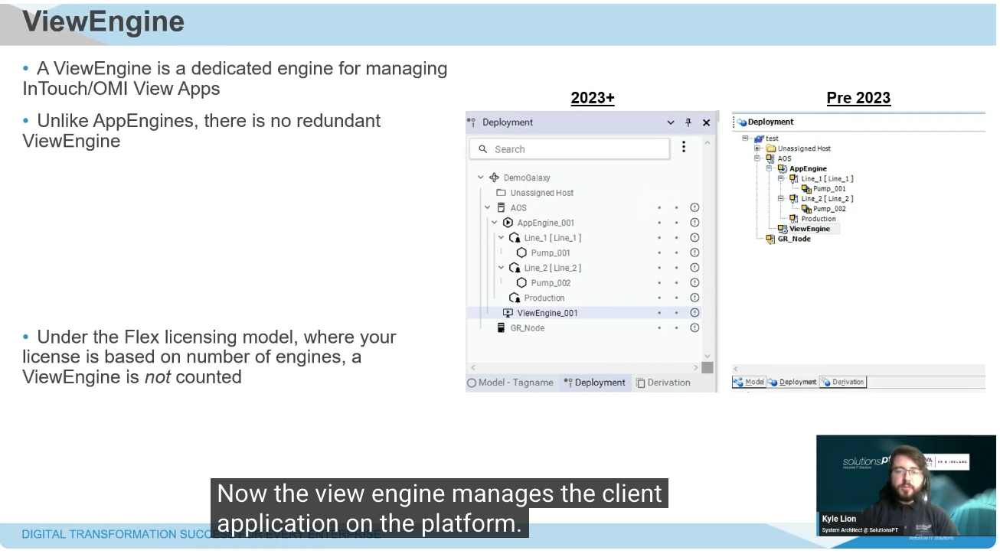

**EN:** Having covered AppEngines and the Automation Objects that run under them, a ViewEngine is a dedicated Engine for managing visualization — that is, InTouch HMI or OMI applications within System Platform. Unlike AppEngines, there is no redundant ViewEngine; if you want an application available on multiple nodes, you simply deploy another ViewEngine to that additional node and assign the relevant application to it.

Also worth noting for the Flex licensing model — since licensing is based on the number of Engines being run — a ViewEngine is **not** counted towards that Engine total. In the 2023+ interface, a ViewEngine is shown as a screen icon with a "play" symbol; in the pre-2023 interface, it is shown as a screen icon with a gear symbol. The ViewEngine manages the client application on the Platform: when the application is deployed to the Platform, files are copied from the development node to the node where it will run, and the ViewEngine manages any changes made when the application is subsequently updated — you simply redeploy to push those changes through.

**中文：** 在介紹完 AppEngine 以及其下執行的 Automation Object 之後，接著要介紹的是 ViewEngine（畫面引擎）——這是專門用來管理視覺化應用的 Engine，也就是 System Platform 中的 InTouch HMI 或 OMI 應用程式。與 AppEngine 不同的是，ViewEngine 並沒有備援（redundant）機制；若您希望某個應用程式能在多個節點上使用，只需在額外的節點上再部署一個 ViewEngine，並將相對應的應用程式指派給它即可。

此外，就 Flex 授權模式而言——由於授權是以執行中的 Engine 數量作為計算基準——ViewEngine **並不會**被計入 Engine 總數之中。在 2023 年以後的介面中，ViewEngine 顯示為帶有「播放」符號的螢幕圖示；在 2023 年之前的介面中，則顯示為帶有齒輪符號的螢幕圖示。ViewEngine 負責管理 Platform 上的客戶端應用程式：當應用程式部署到 Platform 時，系統會將檔案從開發節點複製到實際執行的節點；當應用程式後續有更新時，ViewEngine 也會負責管理這些變更——您只需要重新部署（redeploy），即可將變更套用上去。

---

## 9. WebViewEngine / WebViewEngine（網頁畫面引擎）

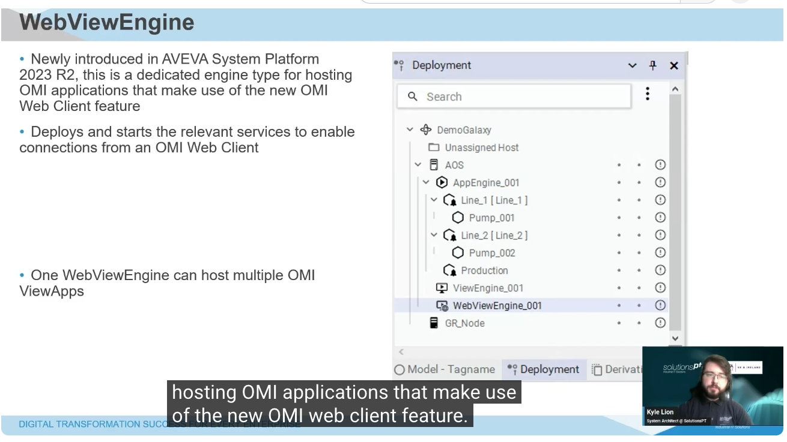

**EN:** Newly introduced in AVEVA System Platform 2023 R2, the WebViewEngine is a dedicated Engine type for hosting OMI applications that make use of the new OMI Web Client feature. Similar to a ViewEngine, it deploys and starts the relevant services needed to enable connections from an OMI Web Client session to the server. Just as one ViewEngine can host multiple InTouch HMI or OMI applications, one WebViewEngine can host multiple OMI Web Apps.

**中文：** WebViewEngine 是 AVEVA System Platform 2023 R2 版本中新推出的功能，是一種專門用來承載 OMI 應用程式的 Engine 類型，適用於使用全新 OMI 網頁用戶端（OMI Web Client）功能的應用程式。與 ViewEngine 類似，WebViewEngine 會部署並啟動相關服務，以便讓 OMI 網頁用戶端連線至伺服器。正如一個 ViewEngine 可以承載多個 InTouch HMI 或 OMI 應用程式一樣，一個 WebViewEngine 也可以同時承載多個 OMI 網頁應用程式（OMI Web Apps）。

---

## Recap / 本集總結

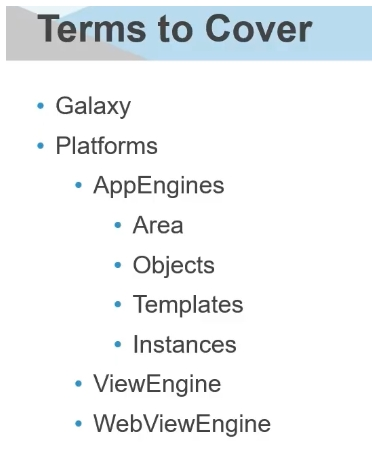

**EN:** That concludes this primer on the main terminology used when discussing System Platform — how it is structured, and the main types of objects you will interact with as you build up a Galaxy. In summary:

- A **Galaxy** is the main project — the central store for everything that follows.
- A **Platform** is a computer within that Galaxy; you may have multiple Platforms deployed.
- To deploy things like application objects and Areas, they need to be deployed into **AppEngines**.
- **Areas**, **Objects**, and **Templates**/**Instances** let you model equipment and the many permutations that can exist across a site.
- **ViewEngines** and **WebViewEngines** cover the basics of deploying and hosting HMI and OMI visualization applications.

Future primers in this series will cover further topics, such as communication objects for PLCs and RT (real-time) tags, as well as more on visualization with OMI and InTouch.

**中文：** 以上便是本集針對 System Platform 常用術語的入門介紹，內容涵蓋其整體架構，以及您在建置 Galaxy 過程中會接觸到的主要物件類型。總結如下：

- **Galaxy** 是整個專案的核心——是後續一切內容的中央儲存中心。
- **Platform** 是 Galaxy 中的一台電腦；您可以部署多個 Platform。
- 若要部署應用物件（application objects）或 Area 等內容，這些項目都需要部署到 **AppEngine** 之中。
- **Area**（區域）、**Object**（物件）與 **Template／Instance**（樣板／實例）讓您能夠針對現場設備及其各種變化組合進行建模。
- **ViewEngine** 與 **WebViewEngine** 則涵蓋了部署與承載 HMI、OMI 視覺化應用程式的基本概念。

本系列後續集數還會介紹更多主題，例如 PLC 通訊物件與 RT（即時）標籤，以及更多關於 OMI 與 InTouch 視覺化的內容，敬請期待。

---

## Image directory / 圖檔目錄

| # | Filename / 檔名 | Topic / 主題 |
|---|---|---|
| 1 | `images/07_01.jpg` | Terms to Cover (intro) / 課程大綱（開場） |
| 2 | `images/07_02.jpg` | Galaxy |
| 3 | `images/07_03.jpg` | Platform |
| 4 | `images/07_04.jpg` | AppEngine |
| 5 | `images/07_05.jpg` | Area |
| 6 | `images/07_06.jpg` | Engineering experience — Standardization & reusability / 工程開發體驗——標準化與可重用性 |
| 7 | `images/07_07.jpg` | Engineering experience — Templates & propagation / 工程開發體驗——樣板與變更傳遞 |
| 8 | `images/07_08.jpg` | Automation Objects |
| 9 | `images/07_09.jpg` | ViewEngine |
| 10 | `images/07_10.jpg` | WebViewEngine |
| 11 | `images/07_11.jpg` | Terms to Cover (recap) / 課程大綱（總結） |
