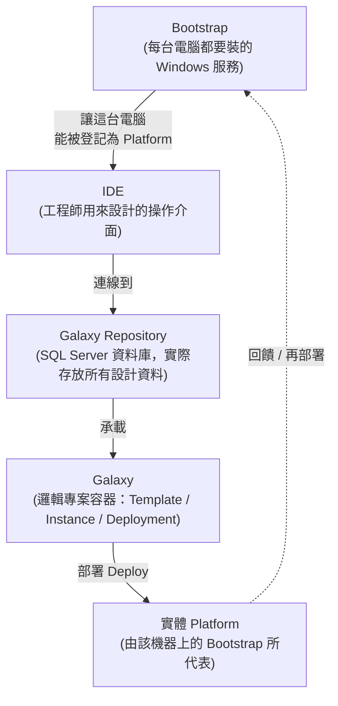

# Day 7｜週末整合：Bootstrap → IDE → Galaxy → Galaxy Repository 流程筆記

> 對應：AVEVA™ System Platform 90 天學習企劃案 — Phase 1 / Week 1 / Day 7
> 本日目標：把 Day 1–6 學到的架構知識與安裝經驗，收斂成一份「自己看得懂、也能講給別人聽」的流程筆記，並完成一段口頭講解錄音，用來檢驗理解程度是否只是表面熟悉。

---

## 1. 今天要做什麼、為什麼要做

Day 1–6 你依序做了：認識三層架構 → 了解三大核心元件分工 → 下載試用版 → 安裝 Application Server + Bootstrap → 建立第一個 Galaxy Repository。這些步驟彼此之間的**先後依賴關係**，是初學者最容易搞混的地方——尤其容易把「Galaxy」和「Galaxy Repository」當成同一件事，或搞不清楚 Bootstrap 到底是一個服務、一個程式，還是一個設定畫面。

今天不學新東西，只做兩件事：

1. **畫圖 + 寫筆記**：把四個名詞之間的關係講清楚
2. **口頭複述**：用自己的話錄一段 3–5 分鐘的講解，測試是否真的理解（如果卡頓、詞不達意，代表某個環節其實還是含糊的）

---

## 2. 核心概念釐清：四個名詞分別是什麼

### 2.1 Bootstrap
- **定位**：安裝在每一台要參與 System Platform 系統的電腦上的一個 **Windows 服務（Service）**，名稱通常是 `ArchestrA Bootstrap`。
- **作用**：它是這台電腦加入 System Platform 世界的「入口與管理者」。負責：
  - 讓這台電腦被登記成為某個 Galaxy 底下的 **Platform**
  - 負責安裝 / 移除 / 更新這台機器上的 AppEngine、平台元件
  - 開機時自動啟動，是所有其他服務的「地基」
- **類比你熟悉的東西**：可以想成類似「Node-RED 的 Node.js runtime + 服務管理器」——它本身不做業務邏輯，但沒有它，上層什麼都跑不起來。
- **注意**：Bootstrap 是**每一台機器都要裝一個**，它是機器層級的東西，不是專案層級的東西。

### 2.2 IDE（System Platform IDE，舊稱 IDE / ArchestrA IDE）
- **定位**：**開發工具**，是你（工程師）用來設計 Galaxy 內容的介面，類似 PLC 的程式設計軟體（如三菱 GX Works3、西門子 TIA Portal）。
- **作用**：
  - 建立/編輯 Template、Instance
  - 設計 Model 視圖（物件關係）、Deployment 視圖（部署到哪台機器）
  - 呼叫 Graphic Toolbox 做畫面
- **類比**：IDE 就是你的「設計工作台」，設計完的東西存放在 Galaxy 裡。
- **注意**：IDE 只是一個「操作視窗」，它本身不儲存資料——資料存在 Galaxy Repository（SQL Server 資料庫）裡。IDE 關掉，資料還在。

### 2.3 Galaxy
- **定位**：一個**邏輯上的專案容器**，代表「一套完整的自動化系統設計」。
- **內容物**：所有的 Template、Instance、Platform 定義、Deployment 關係、Graphic、Script……全部都屬於某一個 Galaxy。
- **類比**：如果 IDE 是 Word 軟體，Galaxy 就是你打開的那份「文件」。一個 IDE 同時只能連上一個 Galaxy。
- **重要觀念**：Galaxy ≠ 單一台電腦。一個 Galaxy 可以部署到多台實體機器（多個 Platform），這就是為什麼後面 Week 13 會學到「跨 WinPlatform 負載平衡」。

### 2.4 Galaxy Repository
- **定位**：Galaxy 真正的**資料儲存底層**，本質是一個 **SQL Server 資料庫**。
- **作用**：當你在 IDE 裡新增一個物件、按下 Check In、按下 Deploy，這些動作最終都是對 Galaxy Repository 這個資料庫做讀寫。
- **類比**：如果 Galaxy 是「文件」的概念層，Galaxy Repository 就是這份文件實際存在硬碟上的檔案／資料庫。你可以對它做備份（Backup）、還原（Restore）——這也是 Week 12 Day 76 會深入學的內容。
- **注意**：一台電腦上可以裝有 Galaxy Repository 服務（通常是安裝在你主開發機/Server 上），但實際連線操作是透過 IDE 連過去。

---

## 3. 四者關係流程圖

### 用一句話串起整個流程

> 先在每台機器上裝好 **Bootstrap**（機器準備好加入系統）→ 打開 **IDE**（工程師的設計工作台）→ IDE 連上 **Galaxy Repository**（真正存放資料的資料庫）→ 在裡面建立/開啟一個 **Galaxy**（你的專案）→ 設計完成後，透過 IDE 把 Galaxy 裡的物件 **Deploy** 到某台由 Bootstrap 管理的機器上，變成實際運行的 Platform。

---

## 4. 常見誤解對照表

| 誤解 | 正確理解 |
|---|---|
| Bootstrap 和 Platform 是同一個東西 | Bootstrap 是服務／管理者，Platform 是「被 Bootstrap 登記、且已部署好 WinPlatform 物件」之後的狀態，兩者是因果關係不是同義詞 |
| Galaxy 就是一個檔案 | Galaxy 的資料實際存放在 Galaxy Repository（SQL Server 資料庫）裡，不是單一檔案 |
| 一台電腦只能有一個 Galaxy | 一台電腦（一個 Repository 服務所在機器）可以存放多個 Galaxy，但 IDE 一次只能連進一個 Galaxy 操作 |
| 關掉 IDE 資料就不見 | 只要有 Check In / Save，資料已寫入 Galaxy Repository，關閉 IDE 不影響資料保存 |
| Deploy 是把「檔案」複製過去 | Deploy 是把 Galaxy 裡定義好的物件設定，透過 Bootstrap 在目標機器上實例化成運行中的 AppEngine / WinPlatform，是一個「發布設定」的動作，而非單純檔案複製 |

---

## 5. 練習

### 練習 1：填空自測（先不要看第 2 節，寫完再對照）
1. ______ 是安裝在每一台要加入系統的電腦上的 Windows 服務。
2. ______ 是工程師用來設計 Template、Instance、畫面的操作介面。
3. ______ 是邏輯上的專案容器，一個 IDE 同時只能連上一個。
4. ______ 是實際儲存所有 Galaxy 資料的 SQL Server 資料庫。

### 練習 2：畫圖默寫
不看第 3 節的流程圖，自己在紙上或白板上，用箭頭畫出 Bootstrap → IDE → Galaxy Repository → Galaxy → Deploy → Platform 的關係，並在每個箭頭旁邊寫一句「為什麼是這個方向」。畫完後與第 3 節的 mermaid 圖比對，找出畫錯或漏掉的箭頭。

### 練習 3：概念映射（銜接你既有背景）
用一句話，把下面每一組做類比：
- Bootstrap ↔ 你熟悉的哪個「背景常駐服務」？（提示：想想 Node-RED 或 FUXA 啟動時，是什麼在背後管理 runtime）
- IDE ↔ 你用過的哪個 PLC 程式設計軟體？
- Galaxy ↔ 那個 PLC 軟體裡的「專案檔（Project）」概念是否類似？哪裡像、哪裡不像？

### 練習 4：口頭講解錄音（今日重點作業）
1. 設定計時器 3–5 分鐘
2. 不看筆記，對著手機錄音，假裝在跟一位「懂 PLC/SCADA 但完全沒碰過 AVEVA」的同事解釋：
   - 什麼是 Bootstrap、IDE、Galaxy、Galaxy Repository
   - 這四者的先後關係與依賴關係
   - 舉一個你自己安裝過程中的實際例子來說明
3. 錄完後回放，記錄下自己卡頓、詞窮、或講錯的地方
4. 針對卡頓處，回頭翻第 2 節重新確認，並在下方「自我檢核」欄位補寫一次正確講法

### 自我檢核（錄音後填寫）
- 卡頓/講錯的地方：__________________________
- 正確的講法應該是：__________________________
- 還需要回頭複習的章節：__________________________

---

## 6. 今日產出檢查清單

- [ ] 完成第 5 節練習 1（填空）
- [ ] 完成第 5 節練習 2（默寫流程圖，並與範例圖比對）
- [ ] 完成第 5 節練習 3（概念映射）
- [ ] 完成 3–5 分鐘口頭講解錄音
- [ ] 回放錄音，填寫「自我檢核」欄位
- [ ] （選做）把這份筆記存入你的個人 troubleshooting / 學習筆記庫，作為 Day 14「IDE 操作速查表」的基礎素材

---

*下一步：Day 8 將正式進入 System Platform IDE，建立第一個 Galaxy 專案，認識 Model / Deployment / Graphic Toolbox 三個視圖。*
