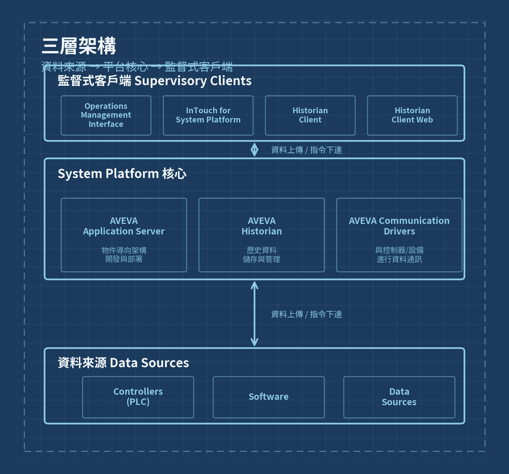
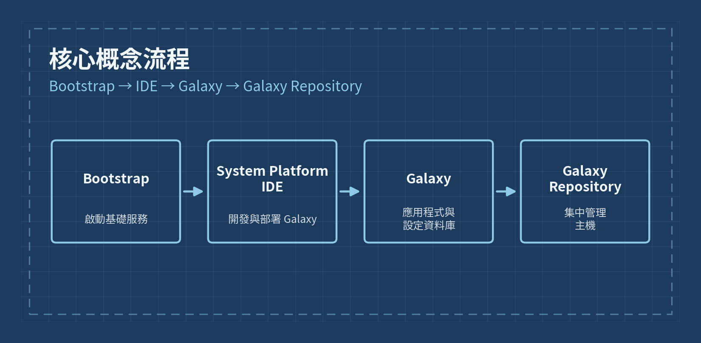

# Day 1 · 三層架構複習與繪圖練習

> Phase 1 · Week 1 · 基礎建置

## 今日目標

複習教材第一、二章的內容，親手繪製一張「資料來源 → 平台核心 → 監督式客戶端」的架構圖，並整理 System Platform 的核心術語，為明天的 FUXA / Node-RED 對照練習打底。

---

## 一、三層架構複習

System Platform 的整體架構分成三層，資料由下往上收集，指令與畫面由上往下傳遞。

### 底層｜資料來源（Data Sources）

實際的工業現場：Controllers（PLC）、Software（既有軟體系統）、其他 Data Sources。這一層對你來說並不陌生——就是你平常在處理的 Mitsubishi FX5U、Delta AS、Siemens S7 等控制器。

### 中層｜System Platform 核心

| 元件 | 說明 |
|---|---|
| AVEVA Application Server | 提供物件導向架構，用於開發與部署應用程式 |
| AVEVA Historian | 負責歷史資料的儲存與管理 |
| AVEVA Communication Drivers | 負責與控制器、設備進行資料通訊 |

### 上層｜監督式客戶端（Supervisory Clients）

| 客戶端 | 用途 |
|---|---|
| Operations Management Interface | 操作管理介面 |
| InTouch for System Platform | 人機介面（HMI）視覺化工具 |
| Historian Client | 歷史資料查詢用戶端 |
| Historian Client Web | 網頁版歷史資料查詢工具 |

---

## 二、架構圖繪製練習

在紙上或繪圖工具中，畫出下面這張圖的骨架——三個色塊、雙向箭頭、每層列出對應元件。畫完後，把你的手繪或截圖存成圖片，取代下方的參考圖。

*圖：images/day1-three-tier-architecture.png*

---

## 三、核心術語表

這五個詞是後續 90 天會一再出現的骨幹概念，今天先建立正確的心智模型，不用急著會操作。

| 術語 | 定義 |
|---|---|
| Application Server | 物件導向框架與工具的統一開發／部署環境 |
| Bootstrap | 提供接收平台所需之基礎軟體的核心服務 |
| System Platform IDE | 設定與部署 Galaxy 的整合開發環境 |
| Galaxy | 應用程式、設定資訊與專案資料庫 |
| Galaxy Repository | 主機並管理 Galaxy 的單一電腦與軟體 |

### 記憶流程

**Bootstrap → IDE → Galaxy → Galaxy Repository**

*圖：images/day1-core-concepts-flow.png*

---

## 四、今日任務清單

1. 重讀教材第一章（System Platform 組成與客戶端架構），畫線標出三層架構的關鍵字
2. 重讀教材第二章（核心概念與術語），把五個術語各用自己的話重寫一遍
3. 手繪或用繪圖軟體畫出三層架構圖，另存成 `day1-three-tier-architecture.png`
4. 畫出 Bootstrap → IDE → Galaxy → Galaxy Repository 流程圖，另存成 `day1-core-concepts-flow.png`
5. 把兩張圖放進 `images/` 資料夾，取代本文的參考圖

## 五、自我檢核

- 能不看教材，口頭說出三層架構每一層各包含哪些元件
- 能解釋 Galaxy 和 Galaxy Repository 的差別（一個是「內容」，一個是「存放內容的地方」）
- 知道 Bootstrap 是「啟動基礎服務」而不是「開發工具」

---

**圖片檔案**：本文件引用了 2 張圖，存放在與本 `.md` 檔同層的 `images/` 資料夾內：
- `images/day1-three-tier-architecture.png`
- `images/day1-core-concepts-flow.png`

---

⟶ 下一天：[Day 2 · 與 FUXA / Node-RED 架構對照](day2.md)
