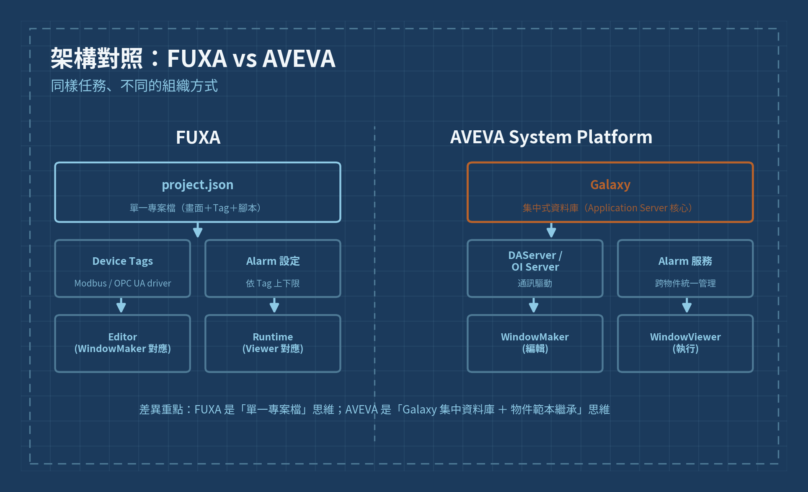
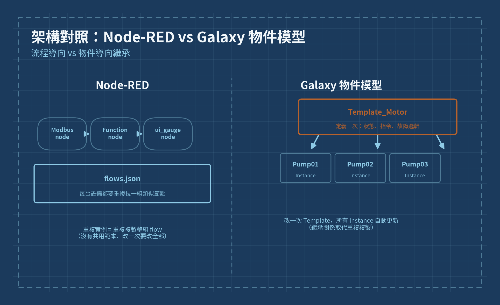

# Day 2 · 與 FUXA / Node-RED 架構對照筆記

> Phase 1 · Week 1 · 基礎建置

## 今日目標

把昨天畫的三層架構圖，拿來跟你已經熟悉的 FUXA 與 Node-RED 架構做對照，找出「概念相同、名稱不同」的地方，建立自己的翻譯對照表——這是讓學習速度加快的關鍵一步。

---

## 一、為什麼要做架構對照

System Platform 的很多設計理念，你其實已經在 FUXA / Node-RED / PLC 的世界裡用過，只是名字不一樣。與其把 AVEVA 當成全新系統從零學起，不如先找出「這個我早就會了，只是換個名字」的部分，把精力集中在真正陌生的觀念上（例如 Galaxy 的集中式資料庫設計、物件繼承）。

---

## 二、架構對照表

| 概念 | FUXA | Node-RED |
|---|---|---|
| AVEVA Application Server（物件導向核心） | FUXA 專案檔（project.json）＋內建 Tag 資料庫 | Node-RED 的 flow 檔（flows.json） |
| Galaxy（應用程式與設定的資料庫） | FUXA 的專案設定整體（畫面＋Tag＋腳本） | 一整組 flow tab 集合 |
| DAServer / OI Server（通訊驅動） | FUXA 內建的 Modbus/OPC UA driver 設定 | node-red-contrib-modbus、node-red-contrib-opcua 節點 |
| I/O Tag | FUXA 的 Tag（Device Tag） | Node-RED 中每個訊息的 payload 欄位 |
| ArchestrA Template（物件範本） | 沒有直接對應，FUXA 畫面元件較偏向單一實例 | 沒有直接對應，最接近的是可重複使用的 subflow |
| InTouch WindowMaker / Viewer | FUXA 的網頁編輯器（Editor）與執行畫面（Runtime） | Node-RED Dashboard（ui_* 節點） |
| Alarm 服務 | FUXA 內建 Alarm 設定（依 Tag 上下限） | 需自行用 function node 判斷並推播 |
| Historian | FUXA 內建歷史記錄（SQLite） | 需外接 InfluxDB/資料庫節點自行儲存 |

---

## 三、關鍵差異（不能直接類比的地方）

> **重點提醒**：FUXA 與 Node-RED 都是「單一專案檔」的思維——所有設定放在一個檔案或一組 flow 裡。System Platform 則是「集中式資料庫（Galaxy）+ 物件導向繼承（Template → Instance）」的思維，同一個範本改一次，所有實例自動更新。這個差異在 Phase 2 設計設備範本時會非常有感，今天先記住這個方向性的不同即可。

---

## 四、繪製對照圖

用兩張圖把今天的對照心得視覺化：一張是 FUXA 與 AVEVA 的架構並排圖，一張是 Node-RED 的流程模型與 Galaxy 物件模型並排圖。畫完存檔後放進 `images/` 資料夾，取代下方的參考圖。

*圖：images/day2-fuxa-comparison-diagram.png*

*圖：images/day2-nodered-comparison-diagram.png*

---

## 五、今日任務清單

1. 回顧昨天完成的三層架構圖（`images/day1-three-tier-architecture.png`）
2. 逐項填寫上方的架構對照表，用自己的專案經驗舉一個實例（例如你目前某個 FUXA 專案裡的 Modbus Tag）
3. 畫出 FUXA vs AVEVA 對照圖，存成 `day2-fuxa-comparison-diagram.png`
4. 畫出 Node-RED vs Galaxy 對照圖，存成 `day2-nodered-comparison-diagram.png`
5. 寫下 3 句話：「AVEVA 裡讓我最不習慣的地方是＿＿＿，因為我在 FUXA/Node-RED 裡習慣的做法是＿＿＿」

## 六、自我檢核

- 能舉出至少 3 組「FUXA/Node-RED 概念 ↔ AVEVA 概念」的對應關係
- 能說明 Galaxy 的集中式資料庫設計，和 FUXA/Node-RED 的單一專案檔思維有何不同
- 能具體指出一個「AVEVA 有、但 FUXA/Node-RED 沒有直接對應」的功能（例如 Template 繼承）

---

**圖片檔案**：本文件引用了 2 張圖，存放在與本 `.md` 檔同層的 `images/` 資料夾內：
- `images/day2-fuxa-comparison-diagram.png`
- `images/day2-nodered-comparison-diagram.png`

---

⟵ 前一天：[Day 1 · 三層架構複習與繪圖練習](day1.md)
