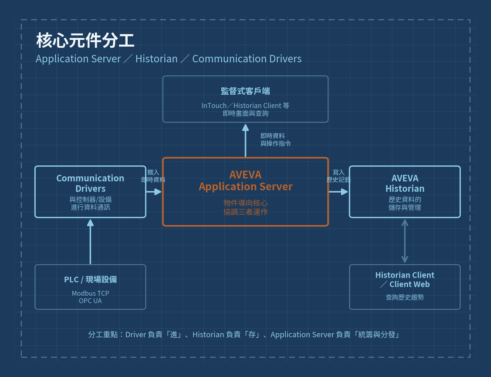
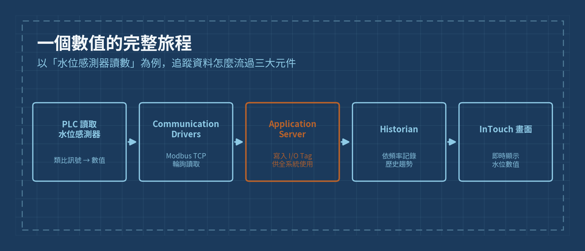

# Day 3 · 核心元件分工：Application Server ／ Historian ／ Communication Drivers

> Phase 1 · Week 1 · 基礎建置

## 今日目標

搞懂 System Platform 核心層的三大元件——**AVEVA Application Server**、**AVEVA Historian**、**AVEVA Communication Drivers**——各自負責什麼，以及一筆資料如何在三者之間流動。今天不動手操作，重點是建立正確的分工心智模型，避免日後把「該由誰做的事」搞混。

---

## 一、三大元件各自的角色

| 元件 | 一句話定位 | 具體職責 |
|---|---|---|
| **AVEVA Communication Drivers** | 負責「進」 | 與 PLC、感測器等現場設備通訊，把現場的原始訊號讀進系統（對應你熟悉的 Modbus TCP / OPC UA 通訊層） |
| **AVEVA Application Server** | 負責「統籌與分發」 | 物件導向核心，管理 Galaxy、I/O Tag、物件邏輯，決定資料要存去哪裡、要顯示給誰看 |
| **AVEVA Historian** | 負責「存」 | 把 Application Server 交過來的資料依時間序列儲存，供日後查詢趨勢、產出報表 |

**一句話記憶：Driver 負責「進」、Historian 負責「存」、Application Server 負責「統籌與分發」。**

*圖：day3-core-components-division.png*

---

## 二、為什麼 Application Server 是「核心中的核心」

Communication Drivers 和 Historian 都不會直接跟監督式客戶端（InTouch、Historian Client）對話，兩者的資料都要先經過 Application Server：

- **往內**：Communication Drivers 把現場數值寫進 Application Server 管理的 I/O Tag
- **往外（存）**：Application Server 依照設定，把需要保留歷史的 Tag 資料轉交給 Historian
- **往外（顯示）**：Application Server 把即時數值提供給 InTouch 等監督式客戶端顯示，也接收操作人員從畫面下達的指令，再轉交給 Communication Drivers 寫回設備

這也是為什麼 Galaxy（Application Server 管理的資料庫）會被稱為「單一資料來源」——所有資料進出都要通過這一層，不會有「Historian 自己偷偷去讀 PLC」這種繞道的情況。

---

## 三、一個數值的完整旅程（實例走一遍）

用「水位感測器讀數」這個具體例子，把抽象的分工再走一次：

1. **PLC 讀取水位感測器**——類比訊號轉換成數值，存在 PLC 的暫存器
2. **Communication Drivers**——透過 Modbus TCP 輪詢，把這個數值讀出來
3. **Application Server**——把數值寫入對應的 I/O Tag，這個 Tag 現在代表全系統對「目前水位」的共同認知
4. **Historian**——依照設定的記錄頻率，把這個 Tag 的數值寫進歷史資料庫
5. **InTouch 畫面**——同時間，操作人員畫面上的水位數字即時更新

*圖：day3-data-flow-example.png*

---

## 四、與你既有背景的對照

| AVEVA 概念 | 你熟悉的對應做法 |
|---|---|
| Communication Drivers | FUXA/Node-RED 裡的 Modbus TCP / OPC UA 節點或 driver 設定 |
| Application Server（Tag 管理） | Node-RED 中訊息在各節點間傳遞的 payload，或 FUXA 的 Device Tag |
| Historian | FUXA 內建的歷史記錄功能（SQLite），或你自行接的 InfluxDB |

差別在於：FUXA/Node-RED 這三件事通常是「鬆散接在一起」的功能模組，AVEVA 則是由 Application Server 強制居中管理，資料流向更加規範、可追蹤。

---

## 五、今日任務清單

1. 重讀教材「二、核心概念與術語」，找出 Application Server、Historian、Communication Drivers 三者的原文定義
2. 用自己的話，各用一句話描述這三個元件的職責（不要照抄教材）
3. 對照上方「一個數值的完整旅程」，換成你自己專案裡的一個實際點位（例如某台馬達的運轉狀態），寫下這個點位如果放進 AVEVA，會怎麼流過這五個步驟
4. 把你自己畫的分工圖（可以手繪）跟本文的參考圖比較，看看有沒有漏掉的箭頭或誤解的方向

## 六、自我檢核

- 能不看教材，說出「Driver 負責進、Historian 負責存、Application Server 負責統籌」這句話並解釋原因
- 能說明為什麼 Historian 不會直接去讀 PLC，而是要經過 Application Server
- 能舉出一個你自己專案裡的點位，完整描述它從設備到畫面顯示的五步旅程

---

**圖片檔案**：本文件引用了 2 張圖，存放在與本 `.md` 檔同層的 `images/` 資料夾內：
- `images/day3-core-components-division.png`
- `images/day3-data-flow-example.png`
